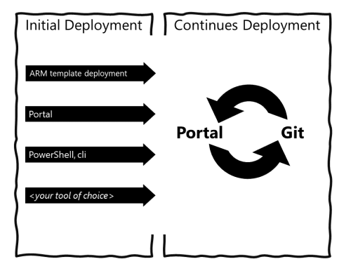

# Azure Landing Zones (Enterprise-Scale) - Reference Implementation

## User documentation

To find out more about the Azure landing zones reference implementation, please refer to the [documentation on our Wiki](https://github.com/Azure/Enterprise-Scale/wiki)

---

## Objective

The Azure Landing Zones (Enterprise-Scale) architecture provides prescriptive guidance coupled with Azure best practices, and it follows design principles across the critical design areas for organizations to define their Azure architecture. It will continue to evolve alongside the Azure platform and is ultimately defined by the various design decisions that organizations must make to define their Azure journey.

The Azure Landing Zones (Enterprise-Scale) architecture is modular by design and allows organizations to start with foundational landing zones that support their application portfolios, and the architecture enables organizations to start as small as needed and scale alongside their business requirements regardless of scale point.

---

_The Azure Landing Zones (Enterprise-Scale) architecture represents the strategic design path and target technical state for your Azure environment._

---

Not all enterprises adopt Azure in the same way, so the Enterprise-Scale architecture may vary between customers. Ultimately, the technical considerations and design recommendations of the Enterprise-Scale architecture may lead to different trade-offs based on the customer's scenario. Some variation is expected, but if core recommendations are followed, the resulting target architecture will put the customer on a path to sustainable scale.

The Azure Landing Zones (Enterprise-Scale) reference implementations in this repository are intended to support Enterprise-Scale Azure adoption and provides prescriptive guidance based on authoritative design for the Azure platform as a whole.

| Key customer landing zone requirement | Enterprise-Scale reference implementations |
|----------------------------------------------------------------------------------|-----------------------------------------------------------------------------------------------------------------------------------------------------------------------------------------------------------------------------------------------------|
| Timelines to reach security and compliance requirements for a workload | Enabling all recommendations during setup, will ensure resources are compliant from a monitoring and security perspective |
| Provides a baseline architecture using multi-subscription design | Yes, for the entire Azure tenant regardless of customer’s scale-point |
| Best-practices from cloud provider | Yes, proven and validated with customers |
| Be aligned with cloud provider’s platform roadmap | Yes |
| UI Experience and simplified setup | Yes, Azure portal |
| All critical services are present and properly configured according to recommend best practices for identity & access management, governance, security, network and logging | Yes, using a multi-subscription design, aligned with Azure platform roadmap |
| Automation capabilities (IaC/DevOps) | Yes: ARM, Policy, Bicep and Terraform Modules |
| Provides long-term self-sufficiency | Yes, enterprise-scale architecture -> 1:N landing zones. Approach & architecture prepare the customer for long-term self-sufficiency, the RIs are there to get you started |
| Enables migration velocity across the organization | Yes, enterprise-scale architecture -> 1:N landing zones, Architecture includes designs for segmentation and separation of duty to empower teams to act within appropriate landing zones |
| Achieves operational excellence | Yes. Enables autonomy for platform and application teams with a policy driven governance and management |

## Conditions for success

To fully leverage this reference implementation in this repository, readers must have a collaborative engagement with key customer stakeholders across critical technical domains, such as identity, security, and networking. Ultimately, the success of cloud adoption hinges on cross-discipline cooperation within the organization, since key requisite Enterprise-Scale design decisions are cross cutting, and to be authoritative must involve domain Subject Matter Expertise (SME) and stakeholders within the customer. It is crucial that the organization has defined their [Azure Landing Zones (Enterprise-Scale) Architecture](./docs/EnterpriseScale-Architecture.md) following the design principles and critical design areas.

It is also assumed that readers have a broad understanding of key Azure constructs and services in order to fully contextualize the prescriptive recommendations contained within Azure Landing Zones (Enterprise-Scale).
<!--

-->

## Deploying Azure Landing Zones (Enterprise-Scale Architecture) in your own environment

The Azure Landing Zones (Enterprise-Scale Architecture) is modular by design and allows customers to start with foundational Landing Zones that support their application portfolios, regardless of whether the applications are being migrated or are newly developed and deployed to Azure. The architecture can scale alongside the customer's business requirements regardless of scale point. In this repository we are providing the following five templates representing different scenarios composed using ARM templates.

You can find all of the implementation options for Azure Landing Zones here: [aka.ms/alz/aac](https://aka.ms/alz/aac#platform)

## Azure Landing Zones Roadmap

The Azure Landing Zones (Enterprise-Scale) architecture is continuously updated to align with advancements in the Azure platform and insights from customer feedback. For detailed information on future updates, please refer to the roadmap at: [Azure Landing Zones Roadmap](https://aka.ms/alz/roadmap)

## Contributing

This project welcomes contributions and suggestions.  Most contributions require you to agree to a
Contributor License Agreement (CLA) declaring that you have the right to, and actually do, grant us
the rights to use your contribution. For details, visit [Contributor License Agreement (CLA)](https://cla.opensource.microsoft.com).

When you submit a pull request, a CLA bot will automatically determine whether you need to provide
a CLA and decorate the PR appropriately (e.g., status check, comment). Simply follow the instructions
provided by the bot. You will only need to do this once across all repos using our CLA.

This project has adopted the [Microsoft Open Source Code of Conduct](https://opensource.microsoft.com/codeofconduct/).
For more information see the [Code of Conduct FAQ](https://opensource.microsoft.com/codeofconduct/faq/) or
contact [opencode@microsoft.com](mailto:opencode@microsoft.com) with any additional questions or comments.
