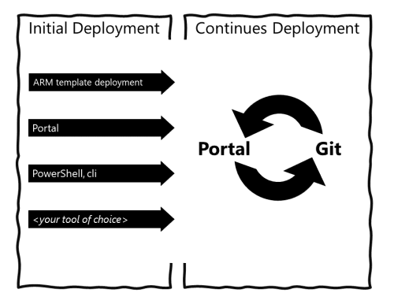

| Enterprise-Scale |
|:--------------|
| |

# Enterprise-Scale - Reference Implementation

## Navigation Menu

* [Enterprise-Scale Architecture](./docs/EnterpriseScale-Architecture.md)
* [Reference implementations](./docs/reference/Readme.md)
  * [Contoso Reference - Scope and Design](./docs/reference/contoso/Readme.md)
  * [AdventureWorks Reference - Scope and Design](./docs/reference/adventureworks/README.md)
  * [WingTip Reference - Scope and Design](./docs/reference/wingtip/README.md)
* [Getting started](./docs/Deploy/getting-started.md)
  * [Setup GitHub and Azure for Enterprise-Scale](./docs/Deploy/setup-github.md)
  * [Deploy Enterprise-Scale reference implementation](./docs/Deploy/configure-own-environment.md)
  * [Initialize Git With Current Azure configuration](./docs/Deploy/discover-environment.md)
  * [Deploy new Policy assignment](./docs/Deploy/deploy-new-policy-assignment.md)
  * [Deploy Landing Zones](./docs/Deploy/deploy-landing-zones.md)
* [Enterprise-Scale "in-a-box" tutorial](./docs/enterprise-scale-iab/README.md)
* [Known Issues](./docs/EnterpriseScale-Known-Issues.md)
* [How Do I Contribute?](./docs/EnterpriseScale-Contribution.md)
* [FAQ](./docs/EnterpriseScale-FAQ.md)
* [Roadmap](./docs/EnterpriseScale-roadmap.md)
---

## Objective

The Enterprise-Scale architecture provides prescriptive guidance coupled with Azure best practices, and it follows design principles across the critical design areas for **organizations to define their their Azure architecture. It will continue to evolve alongside the Azure platform and is ultimately defined by the various design decisions that organizations must make to define their Azure journey.

---
_The Enterprise-Scale architecture represents the strategic design path and target technical state for your Azure environment._
***

Not all enterprises adopt Azure in the same way, so the Enterprise-Scale architecture may vary between customers. Ultimately, the technical considerations and design recommendations of the Enterprise-Scale architecture may lead to different trade-offs based on the customer's scenario. Some variation is expected, but if core recommendations are followed, the resulting target architecture will put the customer on a path to sustainable scale.

The reference implementations in this repository is intended to support Enterprise-Scale Azure adoption by taking learnings from previous engineering engagements and provide architecture design pattern.

## Conditions for success

To fully leverage this reference implementation in this repository, readers must have a collaborative engagement with key customer stakeholders across critical technical domains, such as identity, security, and networking. Ultimately, the success of cloud adoption hinges on cross-discipline cooperation within the organization, since key requisite Enterprise-Scale design decisions are cross cutting, and to be authoritative must involve domain Subject Matter Expertise (SME) and stakeholders within the customer. It is crucial that the organization has defined their [Enterprise-Scale Architecture](./docs/EnterpriseScale-Architecture.md) following the design principles and critical design areas.

It is also assumed that readers have a broad understanding of key Azure constructs and services in order to fully contextualize the prescriptive recommendations contained within this playbook.

## How to get started

Organization can use Azure Portal or Infrastructure-as-Code to setup and configure Azure environment. It is also possible to **transition between portal and Infrastructure-as-Code (recommended)** when your ready to do so. 

<!--

-->

### Deploying Enterprise-Scale Architecture in your own environment

The enterprise-scale architecture is modular by design and allow customers to start with foundational Landing Zones that support their application portfolios, regardless of whether the applications are being migrated or are newly developed and deployed to Azure. The architecture can scale alongside the customer's business requirements regardless of scale point.In this repository we are providing the following three templates representing different scenarios composed using ARM templates.

| Reference implementation | Description | ARM Template | Link |
|:-------------------------|:-------------|:-------------|------|
| Contoso | On-premises connectivity using Azure vWAN | | [Detailed description](./docs/reference/contoso/Readme.md) |
| AdventureWorks | On-premises connectivity with Hub & Spoke  | <!--  --> ETA (7/31) | [Detailed description](./docs/reference/adventureworks/README.md) |
| WingTip | Azure without hybrid connectivity | | [Detailed description](./docs/reference/wingtip/README.md) |

### Getting Started with Infrastructure-as-Code

This repository aims to provide on-ramp path to enable DevOps journey and facilitate the transition when organizations are ready to do so by discovering current configuration and provide continuous deployment using pipeline to push new configuration changes in Azure as well as pull any out-of-band configuration changes. This reference implementation removes the need for custom orchestration to deploy and configure Resources in Azure. Please see [this section](./docs/Deploy/configure-own-environment.md) to get started with Infrastructure-as-Code in your environment.

## Contributing

This project welcomes contributions and suggestions.  Most contributions require you to agree to a
Contributor License Agreement (CLA) declaring that you have the right to, and actually do, grant us
the rights to use your contribution. For details, visit https://cla.opensource.microsoft.com.

When you submit a pull request, a CLA bot will automatically determine whether you need to provide
a CLA and decorate the PR appropriately (e.g., status check, comment). Simply follow the instructions
provided by the bot. You will only need to do this once across all repos using our CLA.

This project has adopted the [Microsoft Open Source Code of Conduct](https://opensource.microsoft.com/codeofconduct/).
For more information see the [Code of Conduct FAQ](https://opensource.microsoft.com/codeofconduct/faq/) or
contact [opencode@microsoft.com](mailto:opencode@microsoft.com) with any additional questions or comments.
