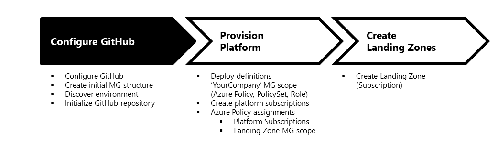
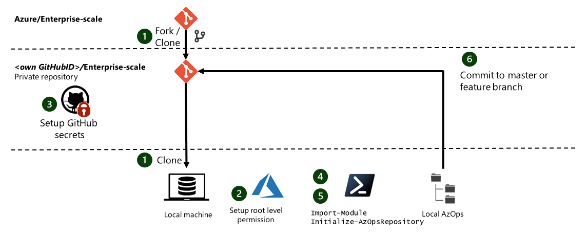

# Contents

This is the first step on who to deploy your own environment. You can learn more about the overall process [here](./Using-Reference-Implementation.md).



This article describes how to:

* Configure GitHub actions to deploy templates
* Create the default management group hierarchy
* Run a discovery of your existing Azure environment

> Important note: Once you have discovered your existing Azure environment you can make changes in the environment by using your preferred client (such as Azure PowerShell, Azure CLI, Azure Portal, ARM API or 3th party clients). The discovered environment represents always the state of your Azure tenant.

# Configure GitHub and run initialization

This section describes how to get started with the full reference implementation by configuring GitHub actions to deploy ARM templates and also, this section describes how to run the initialization process, which will discover the existing Azure environment, and create a representation in the local Git repository.



1. [Fork the repository](https://help.github.com/en/github/getting-started-with-github/fork-a-repo) to your GitHub Organization and [clone the forked GitHub repository](https://help.github.com/en/github/creating-cloning-and-archiving-repositories/cloning-a-repository) to your local machine.  
Follow the instructions [here](./Prerequisites.md/#sync-your-fork-with-upstream-repo) to keep your fork synchronized with the upstream.

2. "User Access Administrator" role is required to manage the deployment of your Enterprise scale architecture. This may requires [elevated account permissions](https://docs.microsoft.com/en-us/azure/role-based-access-control/elevate-access-global-admin) It is strongly recommended to assign the permission at the highest scope possible (i.e. tenant root "/") to ensure you can use the service principal to perform subscriptions management operation. "App registration" needs to be enabled on the Azure AD tenant to self-register an Application (Option 1).
    > Note: Read access on the root level is enough to perform the initialization, but not for deployment. To be able to create management group and subscriptions, platform requires Tenant level PUT permission.

    Option 1 (App registration enabled)

    ```powershell
    #Create Service Principal and assign Owner role to tenant root scope ("/")
    $servicePrincipal = New-AzADServicePrincipal -Role Owner -Scope / -DisplayName AzOps
    ```

    Option 2 (App registration disabled)

    ```powershell
    #Create Service Principal as the Azure AD adminstrator
    $servicePrincipal = New-AzADServicePrincipal -Role Owner -Scope / -DisplayName AzOps -SkipAssignment
    #Assign Owner role to tenant root scope ("/") as a User Access Adminstrator
    New-AzRoleAssignment -ApplicationId $servicePrincipal.ApplicationId -RoleDefinitionName Owner -Scope /
    ```

    Export the SPN information. Perform this step in the same PowerShell instance the SPN was created.

    ```powershell
    #Prettify output to print in the format for AZURE_CREDENTIALS to be able to copy in next step.
    [ordered]@{
        clientId = $servicePrincipal.ApplicationId
        displayName = $servicePrincipal.DisplayName
        name = $servicePrincipal.ServicePrincipalNames[1]
        clientSecret = [System.Net.NetworkCredential]::new("", $servicePrincipal.Secret).Password
        tenantId = (Get-AzContext).Tenant.Id
        subscriptionId = (Get-AzContext).Subscription.Id
    } | ConvertTo-Json
    ```

3. To create the following secrets on GitHub, navigate to the main page of the repository and under your repository name, click **Settings**, click **Secrets**, and then click **New secret**.

* Name: AZURE_CREDENTIALS

    ```json
    {
      "clientId": "<<appId>>",
      "displayName": "<<redacted>>",
      "name": "<<redacted>>",
      "clientSecret": "<<redacted>>",
      "tenantId": "<<redacted>>",
      "subscriptionId": "<<default-subscriptionid>>"
    }
    ```

* Name: AZURE_ENROLLMENT_ACCOUNT_NAME [Optional] 
  
    This parameter is required if you are planning to create new subscription though this workflow. This secret must contain the **ObjectId** for the Azure Enrollment Account. You can obtain the id by running ```Get-AzEnrollmentAccount```

    ```bash
    ObjectId
    ```

* Name: GIT_USER_NAME

    ```bash
    MyAwesomeGitID
    ```

* Name: GIT_USER_EMAIL

    ```bash
    github-email@your-domain.com #Github ID primary email
    ```

4. In an Azure PowerShell terminal, run `Clear-AzContext` and then [`Connect-AzAccount` with your service principal](https://docs.microsoft.com/en-us/powershell/azure/create-azure-service-principal-azureps?view=azps-3.6.1#sign-in-using-a-service-principal) that was created earlier ensure that you have the appropriate permissions during the initialization. You can run the following code by replacing the placeholders with your actual values:

    ```powershell
    Clear-AzContext -Force
    $user = "<service-principal-id>"
    $password = '<service-principal-password>'
    $tenantid = "<azure-tenant-id>"
    $secureStringPwd = $password | ConvertTo-SecureString -AsPlainText -Force
    $cred = New-Object System.Management.Automation.PSCredential -ArgumentList $user, $secureStringPwd
    Connect-AzAccount -TenantId $tenantid  -ServicePrincipal -Credential $cred
    ```

    > Note: TenantID can be found by running `(Get-AzContext).Tenant`

5. Create the following management group structure. If you have already created this structure for example with an ARM template deplyoment yo can skip this step and directly move to step 6. For Enterprise scale implementation, it is recommended to create the following hierarchy as a parallel structure if there is an existing management group structure in place. You can create the management structure with any supported client. __We recommend using the Azure Portal for this step so you can enjoy an enlightening moment after step 6.__

  ```bash
      /
      └───Tenant Root Group
          ├───<YourCompanyName>     # NEW company root management group
          │   ├───Landing Zones
          │   ├───Platform
          │   ├───Sandbox
          │   └───Decommissioned
          ├───.....                 # Existing management group or subscription
  ```

6. To run a initialization operation in Azure, and initialize your repository with your Azure AD tenant locally, run the code below.
   >Note: Depending on the size of the environment, it may take a while initialization to complete.

    ```powershell
    Import-Module .\src\AzOps.psd1 -Force
    Initialize-AzOpsRepository -Verbose
    ```

    >Note: The Initialize-AzOpsRepository process will fail in there are multiple subscriptions with the same name. Before running this process, ensure all subscriptions have unique names.

    When the initialization is complete, the "azops" folder will have a folder structure representing your entire Azure environment from root management group down to resources. You will notice that the management group structure you created in step 5 via the Azure portal is reflected in the "azops" folder. Please note that each .AzState folder will contain a snapshot of the resources/policies in that scope.

    ```bash
    AzOps
    └───Tenant Root Group
        ├───<YourCompanyName>                              # NEW company root management group
        │   ├───.AzState
        │   │   └───Contoso.parameters.json
        │   ├───Landing Zones
        │   │   └───.AzState
        │   │       └───LandingZones.parameters.json
        │   ├───Platform
        │   │   └───.AzState
        │   │       └───Platform.parameters.json
        │   ├───Sandbox
        │   │   └───.AzState
        │   │       └───Sandbox.parameters.json
        │   └───Decommissioned
        │       └───.AzState
        │           └───Decommissioned.parameters.json
        ├───.....                                          # Existing management group or subscription structure
    ```

7. Commit and push changes to your repo. **Ensure your changes are in master branch by either committing to your "master" branch or create feature branch and merge it in master before proceeding to next step.**
