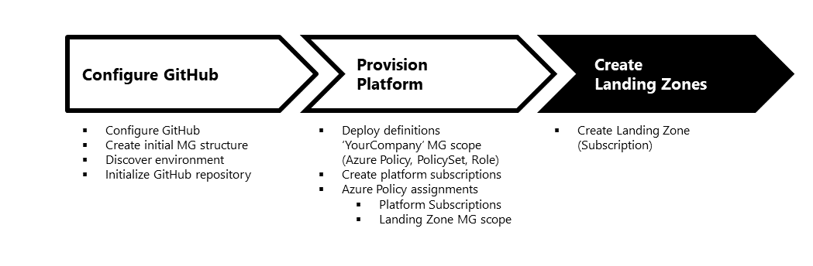

# Contents

This article describes how to deploy Landing Zones under the respective Management Group scope. This is the last of the three steps to setup your environment. Please complete first [Step 1](./Configure-run-initialization.md) and [Step 2](./Deploy-lz.md) before you continue.

# Create Landing Zones

In a Enterprise scale implementation, all platform resources in the __Connectivity__ and __Management__ Subscriptions are deployed via Azure Policy. Enterprise scale includes both, policy definitions and assignments required to deploy the neccesary resources. While it is possible to deploy both, Azure Policy definition and assignments using Enterprise scale deployment process via GitHub Actions as described in this article, Enterprise scale provides flexiblity for how the assignments can be done in the platform subscriptions.

All platform Azure resources in a Landing Zones following the Enterprise scale guidance are fully controlled and provisioned through Azure Policy on the Landing Zone Management Group scope. More information on the [Policy Driven Approach](https://docs.microsoft.com/en-us/azure/cloud-adoption-framework/ready/enterprise-scale/design-principles) can be found in the Enterprise scale design principals section of this document.

Before continuing, please ensure that you have completed all prerequisites in the previous sections. Specially the below steps:

1. Ensure the default management structure exist as described in the the [configure GitHub and run initialization](./Configure-run-initialization.md) section.
2. Ensure you have [initialized AzOps repository](Configure-run-initialization.md) and pushed changes are in your **master** branch.
3. All the platform infrastructure has been deployed following [these instructions](./Deploy-platform-infra.md).

---

## Create a Landing Zone

It is now time to turn the lights ON, there is only one step required!

1. Create or move a Subscription under the Landing Zone Management Group.  
   Once all the required definitions (roles, policies and policySet) and the assignment (roles and policies) are deployed, subscriptions can be created or moved to the Landing Zones managment group or any other scope below.

> Important: Existing Subscription and Azure resource in it, will be moved into a compliant state when moved under the Landing Zone scope.
