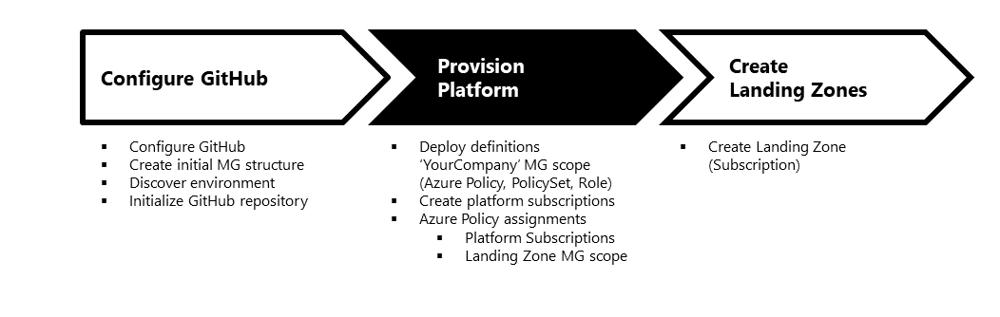
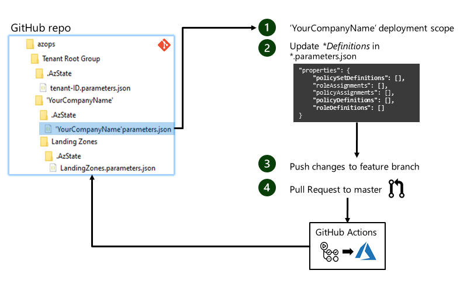
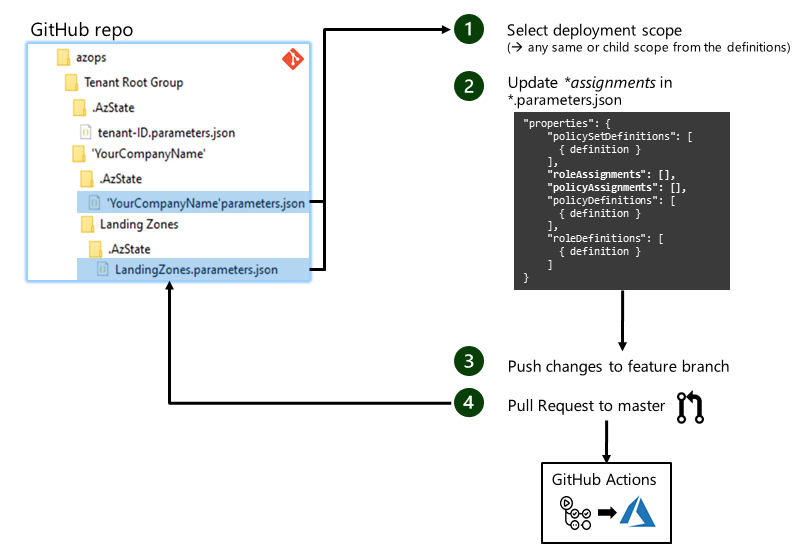
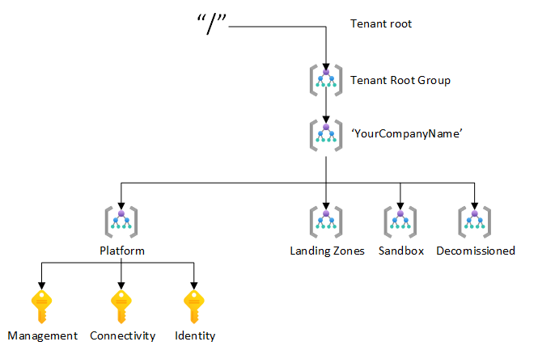

# Provision platform

This article describes how to deploy the platform infrastructure for the Enterprise scale reference implementation into your own environment. If you haven't completed the first step please start [here](./Configure-run-initialization.md).



## Deployment artifact overview

It is important, that you are familiar with the AzOps folder structure that has been created during the environment discovery and repository initialization. To describe the desired state of Platform Subcriptions and Landing Zone we apply changes only in the _managementgroupscope_.parameters.json in the .AzState folder. This is how the folder structure should look like for your environment:

```bash
    AzOps
    └───Tenant Root Group
        ├───<YourCompanyName>                              # NEW company root management group
        │   ├───.AzState
        │   │   └───<YourCompanyName>.parameters.json
        │   ├───Landing Zones
        │   │   └───.AzState
        │   │       └───LandingZones.parameters.json
        │   ├───Platform
        │   │   └───.AzState
        │   │       └───Platform.parameters.json
        │   ├───Sandbox
        │   │   └───.AzState
        │   │       └───Sandbox.parameters.json
        │   └───Decommissioned
        │       └───.AzState
        │           └───Decommissioned.parameters.json
        ├───.....
```

Each _managementgroupscope_.parameters.json file has the following section, and it is the most important part of the parameter files and the section you have to primarily apply changes to using this guide. You can learn more about the *.parameters.json schema [here](./ES-schema.md).

``` bash
    # empty part of a parameter json file after initialization
    "properties": {
        "policySetDefinitions": [],
        "roleAssignments": [],
        "policyAssignments": [],
        "policyDefinitions": [],
        "roleDefinitions": []
    }
```

There are two groups of properties in this section _\*Definitions\*_ and _\*Assignments\*_.  

__Definitions:__ All the definitions (`policy`, `role` and `policySet`) have to be deployed on the 'YourCompanyName' Management Group scope and with this in the 'YourCompanyName'.parameters.json file.
>Note: In the Azure portal `policySetDefinitions` is also known as an initiative. It represents a set of Azure Policy definition.

__Assignments :__ The assignments (`role`, `policy`) can be deployed at any Management Group scope as long as the definition exisits on the same scope or above. To simplify the management, it is highly recommended to reduce the number of scopes where you assign Azure Policy and RBAC roles. In the Enterprise scale reference implementation we recommend to do assignment at the following three scopes only:

* 'YourCompanyName' __Management Group__ scope for all companywide policies
* Platform Subscription scope for Azure Policy deploying Platform resourses
* Landing Zones __Management Group__ scope for all Landing Zone specific Azure Policy

## Deployment flow

In this reference implementation we are using GitHub and GitHub Actions to push and pull changes to and from your Azure environment. All the changes need to be committed to a feature branch and merged to the master using Pull Request (PR). The PR triggers a GitHub Action doing the validation of the changes followed by a deployment to Azure.  

The following diagram illustrates the flow to deploy the definitions:



In a second step the assignment need to be deployed following a similar process:



## Deployment of definitions

1. Select the 'YourCompanyName' Management Group scope for the definitions first and modify the _'YourCompanyName'.parameters.json_ in the _.AzState_ folder.  Definitions need to be added in the respective section of _*.parameters.json_ file:

    ``` bash
    # empty part of a parameter json file after initialization
    "properties": {
        "policySetDefinitions": [],
        "roleAssignments": [],
        "policyAssignments": [],
        "policyDefinitions": [],
        "roleDefinitions": []
    }
    ```

    As a reference for Azure Policy definition you can select the sample definition in the [azopsreference](../../../../tree/master/azopsreference/3fc1081d-6105-4e19-b60c-1ec1252cf560/contoso/.AzState) folder. Filter files with _policyDefinitions_ in the name.

2. Update the `policyDefinitions`, `roleDefinitions` or `policySetDefinitions` in one of two ways:
   1. In the 'YourCompanyName'.parameters.json file. Make sure that you always add it as an array object `[]`.

    ``` bash
    ....
    # here an empty example for the policyDefinitions
    "policyDefinitions": [
        {
            # Copy value object content of a Azure Policy from the azopsreference here.
        },
        {
            # Copy value object content of a Azure Policy from the azopsreference here.
        }
    ],
    ...
    ```

   2. Copying the files from [azopsreference folder](../../../../tree/master/azopsreference/3fc1081d-6105-4e19-b60c-1ec1252cf560/contoso/.AzState) to the ```.AzState``` directory for your management group.

    > It is important that you add __all__ custom Azure Policies in the [azopsreference folder](../../../../tree/master/azopsreference/3fc1081d-6105-4e19-b60c-1ec1252cf560/contoso/.AzState) to your _'YourCompanyName.parameters.json_ file or ```.AzState``` directory.

3. Git stage and commit locally, and then push changes to your remote feature branch. __Do not push changes directly in the *master* branch in this step__

    ``` bash
    git push <remote-name>
    ```

4. Create a Pull Request to the master branch. GitHub Actions runs a PR check and pushes the changes to the target Azure environment. You can monitor the status in the Actions log. Once all the checks are successful you can squash and merge your changes to the master branch.

(Optional step) re-initialize/update repository on your master branch. This will complement all the definition with the resource Id's that are required for the assignments in the next section.

``` powershell
    Initialize-AzOpsRepository -Verbose
```

> Note: This step will be automated once pull GitHub Action is fully operational.

## Create platform subscription

The platform infrastructure is deployed across __three__ Azure Subscriptions on Platform Management Group scope:



* __Management Subscription__ - where all cross-platform management resources are deployed (such as centralized Log Analytics workspace)
* __Connectivity Subscription__ - where all the networking resources are deployed (such as Azure Virtual WAN or Azure Firewall)
* __Identity Subscription__ - for VWAN-based Enterprise scale implementations, this is where domain controllers are deployed.

In a Enterprise scale implementation, all platform resources in the __Connectivity__ and __Management__ Subscriptions are deployed via Azure Policy. Enterprise scale includes both, policy definitions and assignments required to deploy the neccesary resources. While it is possible to deploy both, Azure Policy definition and assignments using Enterprise scale deployment process via GitHub Actions as described in this article, Enterprise scale provides flexiblity for how the assignments can be done in the platform subscriptions.

However, not all resources in the __Identity__ Subscriptions are deployed via Azure Policy, as each organization have different methods to deploy Active Directory domain controllers.

The following sections describe how to deploy the platform infrastructure resources across the three platform Subscriptions. Before continue with the steps below ensure that the __Management__, __Connectivity__ and __Identity__ Subscriptions have been created and assigned at the __Platform__ Management Group scope.

### Management Subscription

In the Enterprise scale reference implementation, Azure resources in the __Management__ Subscription are deployed via Azure Policy. Enterprise scale includes both, policy definitions and assignments required to deploy the neccesary resources in the __Management__ Subscription. We will walk you though the process how to assign the Azure Policy later in the article. We need two Azure Policy assigments which create a Log Analytics workspace and Azure Automation Account that are required in the **Management** Subscription:

Required custom Azure Policy definition:

| Policy name                | Scope                   | Description                                                                     |
|----------------------------|-------------------------|---------------------------------------------------------------------------------|
| Deploy-LogAnalytics        | management Subscription | Deploys a Log Analytics workspace into your subscription                        |
| Deploy-LogAnalytics-Config | management Subscription | Configures the Log Analytics workspace with the required counters and solutions |

Azure Policy assignments required on _management_ Subscription:

| Policy name          | Type | Scope | Parameter description |
|----------------------|------|-------|-----------------------|
| Deploy-LogAnalytics-_\<region\>_  | custom policy | management Subscription | _workspaceName:_ LA workspace name<br>_workspaceRegion:_ Azure DC region for LA<br>_automationAccountName:_ Linked Azure Automation Account, will be created with this Policy<br>_automationRegion:_ Azure DC region for the Azure Automation Account<br>_rgName_: Resource Group in which the resource reside |
| Deploy-LogAnalytics-Config-_\<region\>_ | custom policy | management Subscription | _workspaceName:_ LA workspace name this configration will be applied<br>_workspaceRegion:_ Azure DC region of the LA workspace |

> Note: How-to [assign Azure Policy](#deployment-of-assignments) at the _Management_ Subscription scope describs the process in detail.

### Connectivity Subscription

The resource in the __Connectivity__ Subscription will be deployed via Azure Policy following the Enterprise scale reference implementation. We need four Azure Policy assigments to create the VWAN, VHub, FirewallPolicy and DDoSProtection resources required in the __Connectivity__ Subscription:
The resources in the regional __Connectivity__ Subscription will be deployed using DeployIfNotExist-Policy.

Required custom Azure Policy definition:

| Policy name          | Scope | Description |
| ---------------------|-------|-------------|
| Deploy-VWAN          |'YourCompanyName' MG|Deploys the VWAN service into the Connectivity Subscription
| Deploy-FirewallPolicy|'YourCompanyName' MG|Configures the FW policies and rules for Azure Firewall
| Deploy-VHUB          |'YourCompanyName' MG|Deploys a regional VHUB resource along with required gateways (ER/VPN) and Azure Firewall
| Deploy-DDoSProtection|'YourCompanyName' MG|Deploys a DDoS Standard plan service

Azure Policy assignments required on _connectifity_ Subscription:

| Policy name          | Type | Scope | Parameter description |
|----------------------|------|-------|-----------------------|
| Deploy-VWAN          | Custom Policy | connectivity Subscription|_vwanname:_ VWAN resource name<br>_vwanRegion:_ Azure Region the service will be deployed to<br>_rgName:_ RG name where the resource will be deploy to. Policy will create RG if not exists|_vwanname:_ yourcompanyname-vwan<br>_vwanRegion:_ North Europe<br>_rgName:_ yourcompanyname-global-vwan
| Deploy-Firewall Policy| Custom Policy |connectivity Subscription|_fwpolicy:_ Firewall policy configruation JSON object<br>_fwPolicyRegion:_ Azure Region the service will be deployed to (identical with VHUB)<br>_rgName:_ RG name where the resource will be deploy to. Policy will create RG if not exists
| Deploy-VHUB-_\<region\>_     | Custom Policy |connectivity Subscription|_vwanname:_ VWAN resource name<br>_vhubname:_ VHUB resource name<br>_vhub:_ VHUB configuration JSON object (location, addressPrefix, ...)<br>_vpngw:_ VPN Gateway configuration JSON object (name, BGP, scale unit)<br>_ergw:_ Express Route Gateway configuration JSON object<br>_azfw:_ Azure Firewall configuration JSON object (name, policy Id)<br>_rgName:_ RG name where the resource will be deploy to. Policy will create RG if not exists|
| Deploy-DDoSProtection| Custom Policy |connectivity Subscription|_ddosName:_ Resource name for the DDoS service<br>_ddosRegion:_ Azure Region the service will be deployed to (identical with VHUB)<br>_rgName:_ RG name where the resource will be deploy to. Policy will create RG if not exists|_ddosName:_ yourcompanyname-ddos-std-plan<br>_ddosRegion:_ North Europe<br>_rgName:_ yourcompanyname-global-ddos
| Enable Data Protection Suite | Initiative | connectivity Subscription| n/a
| Enable Monitoring in Azure Security Center | Initiative | connectivity Subscription| using default parameter

> Note: How-to [assign Azure Policy](#deployment-of-assignments) at the _connectivity_ Subscription scope describs the process in detail.

### Identity Subscription

In the Enterprise scale reference implementation, the **Identity** Subscription is only required when deploying a VWAN-based Enterprise scale implementation (as domain controllers cannot be deployed in a managed Virtual Hub). For non-VWAN Enterprise scale reference implementations (traditional hub & spoke network architecture), the **Identity** subscription is not required as Domain Controllers should be deployed in the central Hub VNet.

The following instructions provide guidance for deploying the required resources for the **Identity** subscription for both, VWAN-based and non-VWAN based Enterprise scale implementations:

__VWAN-based Enterprise scale implementation__

// TODO Required custom Azure Policy definition:

| Policy name          | Scope              | Description                                                        |
| ---------------------|--------------------|--------------------------------------------------------------------|
| Deploy-vNET          |'YourCompanyName' MG| Deploys a virtual network and and conect it to the local VWAN VHub.|

Azure Policy assignments required on _identity_ Subscription (per region a policy is required):

| Policy name          | Type | Scope                |
|----------------------|------|----------------------|
| Deploy-vNET | Custom Policy | 'YourCompanyName' MG |

Once the virtual network is created the two Active Directory Domain Controllers can be created in the VNet following your company's procedures.

__Non-VWAN based Enterprise scale implementation__

1. In a regional hub VNet, deploy two Active Directory Domain Controllers following your company's procedures
2. Repeat process for each regional hub VNet

## Deployment of assignments

1. In one of the [previous section](#deployment-of-definitions) all the defintions have been updated with an resource ID. ID's are updated in the _'YourCompanyName'.parameters.json_ files in the _.AzState_ folder on 'YourCompanyName' scope. In addition to the updated _.parameters.json_ each definition is represented in an separate file in the same _.AzState_ folder. The pull or a respository discovery operation keeps all files and the related properties in the _.AzState_ folder in sync.

```bash
    # Simplified folder structure after initialization
    AzOps
    └─── Tenant Root Group
        └─── <YourCompanyName> # Management group
            ├─── .AzState
            │   ├─── <YourCompanyName>.parameters.json # File containing the ID's
            │   ├─── *_policyDefinitions-<policy-name-1>.parameters.json # Policy defintion
            │   .
            │   └─── *_policyDefinitions-<policy-name-n>.parameters.json # Policy defintion
            ├─── Landing Zones # Management group under Contoso
            │   ├─── .AzState
            │   │   ├─── LandingZones.parameters.json # File containing the ID's
            │   │   ├─── *_policyDefinitions-<policy-name-1>.parameters.json # Policy defintion
            │   │   .
            │   │   └─── *_policyDefinitions-<policy-name-2>.parameters.json # Policy defintion
```

To do the assignments for `policyAssignments` and `roleAssignments` the _managementGroupName_.parameters.json need to be updated a second time as done it for the defintions.  
Three scopes for the assignment need to be considered to follow the Enterprise scale reference implementation:

* 'YourCompanyName' Management Group scope
* Landing Zones Management Group scope
* _connectivity_ / _management_ / _identity Subscription scope

As a reference for Azure Policy assignment you can select a reference Azure Policy assignment in the [azopsreference](../../../../tree/master/azopsreference/3fc1081d-6105-4e19-b60c-1ec1252cf560/contoso/.AzState) folder. Filter files with _policyAssignments_ in the name. After you copied the object replace all the values with the value  \<replace-me\>, these needs to be done mainly for the attributes `policyDefinitionId` and `scope`.

* `policyDefinitionId`: Full resource ID (including scope path) of the definition
* `scope`: Assignment scope for the definition

``` bash
    ....
    # here an empty example for the policyAssigments
    "policyAssignments": [
        {
            # Copy value object content of a Azure Policy from the azopsreference here.
        },
        {
            # Copy value object content of a Azure Policy from the azopsreference here.
        }
    ],
    ...
```

1. Git stage and commit locally, and then push changes to your remote feature branch. __Do not push changes directly in the *master* branch in this step__

    ``` bash
    git push <remote-name>
    ```

2. Create a Pull Request to the master branch. GitHub Actions runs a PR check and pushes the changes to the target Azure enviroment. You can monitor the status in the Actions log. Once all the checks are successful you have to squash and merge your changes to the master branch.

>Note: If the Azure Policy assignmetn fails please re-run the checks a second time. There is currently a known problem with the Azure Policy assigment on Azure which the product team is currently fixing.

---

## Finalize platform deployment

You can now follow the progress and see how the resources are getting deployed into the platform Subscriptions. When the resources are deployed the platform can start updating configurations if needed. One thing that you or your NetOps team may start doing is adjusting the Firewall Policies/Rules in the Azure Portal or through the AzOps pipeline.
