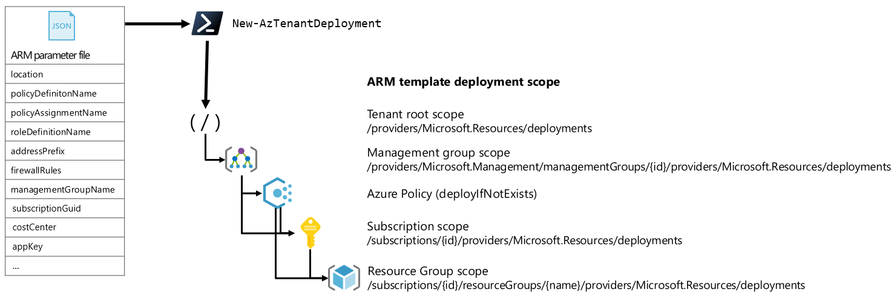

# Azure Resource Manager templates

Azure Resource Manager (ARM) is the unified control-plane (global API front-door), and the gateway for all the CRUD operations for all Resources in Azure.

One of the essential capabilities of ARM, is the template orchestration engine that allows users to declare their Resource compositions, and deploy to one or more *scopes* in Azure.
With the philosophy that everything in Azure is a Resource, that means you can declare the goal-state of your Azure Tenant as a whole and all its Resources using ARM templates.

This article will help you to familiarize with the [Enterprise-Scale ARM template](../../../../tree/main/template/tenant.json), which consist on one and only one ARM template (one template to rule them all). We recommend to also explore the [Examples](../../../../tree/main/examples) to understand how parameter files are used to provide the Resources as objects to the template.

## ARM template objectives for Enterprise-Scale

Some of the key [design principles](https://docs.microsoft.com/en-us/azure/cloud-adoption-framework/ready/enterprise-scale/design-principles) of Enterprise-Scale is to have a single control and management plane, be Azure native and aligned to the platform roadmap, and employ Azure Policy to enable policy driven governance and management. That means we rely on platform capabilities in order to compose and deploy the Enterprise-Scale architecture end-2-end.

The objectives includes:

- Any Resource can be declared and deployed to Azure, using ARM templates
- Resources are configured and deployed in a consistent and deterministic way, using ARM template language expressions
- Deployments will target the appropriate ARM scope, subject to the Resource compositions
- ARM will handle template validation, dependencies (both implicit and explicit), and the end-to-end orchestration
- The ARM template can be deployed using PowerShell, CLI, Portal, and directly from Git using GitHub Actions
- What we PUT, is also what we GET and vice versa
- Detection of drift for the Resources within scope, and be able to reconcile into Git

Further, this excludes:

- A need for an overlay or custom orchestration to deploy and configure Resources in Azure
- Having any infrastructure dependencies, e.g., existing Subscription, Management Group, etc.
- A need to learn a new language and deployment approach to Azure
- Imperative scripting

## Azure Resources within scope of Enterprise-Scale

The following ARM Resource types and deployment scopes are relevant for the Enterprise-Scale ARM template from a **platform** perspective, as it will build and operationalize the architecture itself. Any workload specific Resource types (e.g., Microsoft.Compute/virtualMachines, Microsoft.Web/sites etc.) is **NOT** in scope.

| Resource Type          | Deployment Scope              | Description                                                        |
| ---------------------|--------------------|--------------------------------------------------------------------|
| Microsoft.Management/managementGroups          |Tenant root| Management Groups, which can contain child Management Groups and Subscriptions|
| Microsoft.Subscription/subscriptions          |Tenant root|Subscriptions, which will be the de-facto Resource containers for workloads in Azure.|
| Microsoft.Management/managementGroups/subscriptions          |Tenant root|Placement of a Subscription into a Management Group|
| Microsoft.Authorization/policyDefinitions          |Management Group, Subscription|Policy definitions can be created at Management Groups and Subscriptions and can contain audit, deny, append, auditIfNotExists, deployIfNotExists, and modify policy effects|
| Microsoft.Authorization/policySetDefinitions          |Management Group, Subscription|PolicySetDefinitions can represent multiple policyDefinitions to simplify policyAssignment lifecycle|
| Microsoft.Authorization/policyAssignments         |Management Group, Subscription|PolicyAssignments will manifests the runtime representation of a policyDefinition at the given scope|
| Microsoft.Authorization/roleDefinitions          |Management Group, Subscription|Role-based access control definition, containing actions, notActions, dataActions, dataNotActions|
| Microsoft.Authorization/roleAssignments          |Management Group, Subscription|RoleAssignments will manifests the runtime representation of a roleDefinition at the given scope|

>Note: The Enterprise-Scale architecture that enables a policy driven governance and management will ensure that Resource deployments to Resource Group scope from a platform perspective, such as virtual WAN, Log Analytics, diagnostics settings and more, are deployed using Azure Policy (policyDefinitions) with the **deployIfNotExists** effect. With regards to application teams; they can use any preferred method, tool, and interface when deploying their applications into the Landing Zones (Subscriptions) that are constructed by the Enterprise-Scale platform architecture.

## Deployment sequencing for Enterprise-Scale ARM template

The ARM template for Enterprise-Scale is developed to honor the ARM graph and will start at the Tenant root, so it can navigate across all scopes as needed per the Resource type(s) that has been declared.
This is achieved by using logical operators and Resource conditions so the ARM template can always resolve the correct scope(s) druing deployment runtime.

Examples:

- When a new Management Group is being declared, the ARM template will do a Tenant root level deployment to create the Management Group into the new or existing Management Group hierarchy, and define parent/child relationships
- When a new Subscription is declared into a Management Group, the ARM template will do a Tenant level deployment to update the Subscription placement into its Management Group.
- When a new policyAssignment is being declared, the deployment will start at Tenant root level and do a nested deployment to the targeted scope for the assignment (which can be a Management Group or a subscription). This sequence is also the same for roleDefinitions.
- When a new policyDefinition and a policyAssignment is created, the deployment will first create the policyDefinition at scope, as the policyAssignment will have an implicit dependency using the reference() template function. This sequence is also the same for roleDefinitions and roleAssignments.
- When a new policyAssignment is being declared which references a policyDefinition with the "deployIfNotExist" effect with the deploymentScope set to Subscription, the ARM template will invoke a template deployment from the policyDefinition directly to ensure the Subscription is brought into its compliant goal state
- When multiple Resources are declared at the same scope, the ARM template will deploy those in parallel

The illustration below shows an end-to-end deployment workflow across the Azure scopes (Tenant, Management Group, Subscription, Resource Group), where Enterprise-Scale ARM template deploys directly to Tenant and Management Group scope, and policies using "deployIfNotExist" will carry out the deployments (also ARM template deployments) to the Subscriptions, and the Resource Groups when they are being created.

For additional information on how to use the Enterprise-Scale ARM template via GitHub actions, see the following article:

[Deploy Enterprise-Scale platform infrastructure](./configure-own-environment.md)
