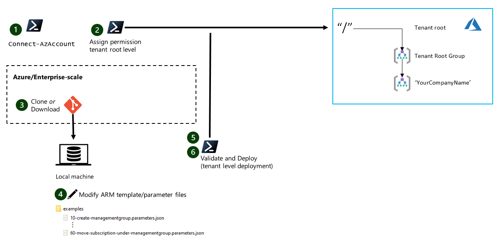

# Getting Started

This article describes how to get started with Enterprise-Scale reference implementation by walking you through all the prerequistes to deploy a platform-native reference implementation of Enterprise-Scale.
> Note:  Before you start, make sure that you have read and understood the overall design objective and scope of the reference implementation.

## Target audience

The target audience for this guide is people with a typical DevOps / SRE background and assumes knowledge in Azure Resource Manager (ARM)/Infrastructure as Code (IaC), Git, and PowerShell.

## Prerequisites

This table lists the technical prerequisites needed to use the NorthStar reference implementation. We have chosen to base the reference implementation on PowerShell, but if desired, it is perfectly possible to use other tools such as e.g. Azure CLI for deployment operations.

|Requirement|Additional info | |
|---------------|--------------------|--------------------|
|Git >= 2.1| Latest version of git can be found [here](https://git-scm.com/). <br/> <br/> Run following command from command prompt to ensure your Git is correctly configured. You may be prompted for login that may require you to sign in with MFA. <br/> <br/>```git clone https://github.com/Azure/Enterprise-scale.git ``` | [Git handbook](https://guides.github.com/introduction/git-handbook/)|
| VSCode |  Latest version of VSCode. <br/><br/> Open the directory ```Enterprise-scale``` cloned from previous step inside VSCode and run ```git pull``` command to ensure Git Credentials are setup correctly in VSCode. <br/> <br/> Exit VSCode and delete ```Enterprise-scale``` directory as it will no longer be required. | [Install](https://code.visualstudio.com/download#)  |
Minimum version of PowerShell: 7.0|  The latest version of PowerShell including install instructions can be found [here](https://github.com/PowerShell/PowerShell). <br> Confirm the version of PowerShell that you are running by typing `$PSVersionTable` in a PowerShell session.| [Instructions](https://github.com/PowerShell/PowerShell)
|Az.Accounts >= 1.8 <br>Az.Resources >= 2.0.1 |  `Install-Module -Name Az.<ModuleName> -MinimumVersion <Version> -Scope AllUsers`<br>Confirm the version of the module you have by running <br>`Get-Module Az.<ModuleName> -ListAvailable`. | [Docs](https://docs.microsoft.com/en-us/powershell/azure/install-az-ps)|
| Pester >= 4.10.1 |  ***Only required if you want to run pester-tests as a developer*** <br>`Install-Module -Name Pester -MinimumVersion 4.10.1 -Scope AllUsers`<br> You can confirm the version of the module you have by running <br>`Get-Module Pester -ListAvailable`. | [Docs](https://github.com/pester/Pester) |

>:iphone: If you have Multi-factor authentication (MFA) enabled on any of your accounts, make sure that you have your token app/phone easily accessible before you start.

## Fork the Enterprise-Scale repo to your GitHub account

Login to GitHub in your web browser using your private account (that was onboarded to `Azure` organization), and [fork](https://help.github.com/en/github/getting-started-with-github/fork-a-repo) `Azure/Enterprise-scale` repository to your account. This will allow you to contribute to this repository with Pull Requests and standard GitHub Flow.

## Clone the repository to your local machine

In your local machine, open the Command prompt, navigate to a directory, where you typically keep your code, and run the following command (replace <yourAccount> with your GitHub account name).

```shell
git clone https://github.com/<yourAccount>/Enterprise-scale.git
```

## Sync your fork with upstream repo

Follow these steps in order to synchronize the latest changes from the upstream repo into your local fork.

1) Run the following git commands only once you change your directory to your local fork to add a reference to the upstream repo

    ```shell
    git remote -v
    git remote add upstream https://github.com/Azure/Enterprise-scale.git
    git remote -v
    ```

2) Execute the following git commands only when you need to synchronize changes from upstream repo into your local fork:

    ```shell
    git fetch upstream
    git merge upstream/master
    ```

## Validate prerequisites

 This section provides guidance for you to experiment with ARM template deployments at the tenant ("/") root scope. This will help you to validate that you have the prerequisites properly configured. Please note that this section is optional.

 

1. From a PowerShell terminal, connect to Azure using `Connect-AzAccount -TenantId <your-tenant-id>` with an account that has at least "User Access Administrator" permissions at the tenant root level.

2. Assign required permissions at tenant root level for the account that you want to use. Owner **or** Contributor + User Access Administrator permissions is required to be able to deploy the example templates. If you don't have permissions to assign permissions at the root level, you may have to [elevate your access](https://docs.microsoft.com/en-us/azure/role-based-access-control/elevate-access-global-admin) as a global administrator before assigning the permissions.

    ```powershell
    New-AzRoleAssignment -SignInName john.doe@contoso.com -RoleDefinitionName "Owner" -Scope "/"  

    RoleAssignmentId   : /providers/Microsoft.Authorization/roleAssignments/3b012473-78b1-4511-8e7f-f6f786bfbb02
    Scope              : /
    DisplayName        : John Doe
    SignInName         : john.doe@contoso.com
    RoleDefinitionName : Owner
    RoleDefinitionId   : 8e3af657-a8ff-443c-a75c-2fe8c4bcb635
    ObjectId           : 24eefd82-dcc3-494f-acdd-f4e258e932e8
    ObjectType         : User
    CanDelegate        : False
    ```

*If you want to use a service principal, follow the instructions to assign permissions under the [**Configure GitHub and run initialization**](./Configure-run-initialization.md)*

3. [Clone](https://help.github.com/en/github/creating-cloning-and-archiving-repositories/cloning-a-repository) your fork of the [Enterprise scale GitHub repository](https://github.com/Azure/Enterprise-scale) or download the necessary templates/template parameter files from the examples folder to your local computer. <br>For a basic deployment test, you'll need access to the following template:

    * [10-create-managementgroup.parameters](../../../../tree/master/examples/10-create-managementgroup.parameters.json)  
      Parameter file to deploy the company root management group (for example, Contoso) as a child of the Tenant Root Group

     > Please refer to [this](../EnterpriseScale-Contribution.md#writing-arm-templates-for-contoso-implementation) article to better understand how the Enterprise scale reference ARM templates are constructed (with only **one** master template and multiple parameter files).

4. In the sample parameter files (for this case, 10-create-managementgroup.parameters.json), change the TenantID and name of the management groups to reflect the tenant where they will be deployed. TenantID can be found by running `(Get-AzContext).Tenant`

    ```json
    {
      "$schema": "http://schema.management.azure.com/schemas/2015-01-01/deploymentParameters.json#",
      "contentVersion": "1.0.0.0",
      "parameters": {
        "input": {
          "value": {
            "Name": "<YourManagementGroupName>",
            "DisplayName": "<YourManagementGroupName>",
            "ParentId": "/providers/Microsoft.Management/managementGroups/<TenantID>"
          }
        }
      }
    }
    ```

5. From the same PowerShell terminal used in step 1, deploy the sample template at the tenant scope with the following commands. Execute the commands from the folder containing the *.parameters.json files or reference the files correctly:

    ```powershell
    #Define base deployment settings 
    $Name = "MGDeployment-{0}" -f (Get-Random) #Add random number to deployment name
    $TemplateUri = "https://raw.githubusercontent.com/Azure/Enterprise-Scale/master/template/tenant.json"
    $Location = "northeurope" #Can be changed to your preferred deployment location


    #Deploy management groups to tenant level
    New-AzTenantDeployment -Name $Name -TemplateUri $TemplateUri -Location $location `
                           -TemplateParameterFile 10-create-managementgroup.parameters.json

    ```

6. Verify that the management group was successfully provisioned with PowerShell.

    ```powershell
    #Get management groups  
    Get-AzManagementGroup -GroupName <YourManagementGroupName> -Recurse -Expand
    ```

    For example, if you named your management group Contoso, you should see an output similar to the one below:

    ```powershell
    Get-AzManagementGroup -GroupName Contoso -Recurse -Expand

    Id                : /providers/Microsoft.Management/managementGroups/Contoso
    Type              : /providers/Microsoft.Management/managementGroups
    Name              : Contoso
    TenantId          : 3fc1081d-6105-4e19-b60c-1ec1252cf560
    DisplayName       : Contoso
    UpdatedTime       : 0001-01-01 00:00:00
    UpdatedBy         :
    ParentId          : /providers/Microsoft.Management/managementGroups/3fc1081d-6105-4e19-b60c-1ec1252cf560
    ParentName        : 3fc1081d-6105-4e19-b60c-1ec1252cf560
    ParentDisplayName : 3fc1081d-6105-4e19-b60c-1ec1252cf560
    ```
