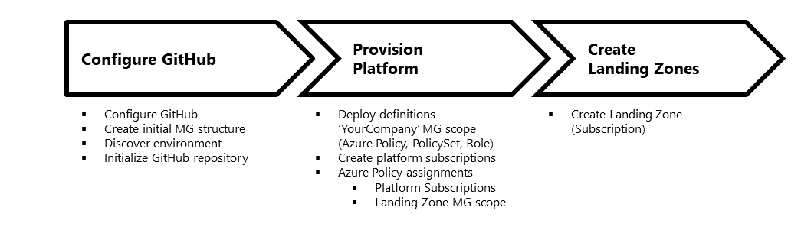

# Configure your own environment

This article is divided in four sections:

* The first part describes how to [configure GitHub and run initialization](./Configure-run-initialization.md), which will explain how to configure GitHub actions to deploy templates and also, it will explain how to run a discovery of your existing Azure environment.
* The second part of this article describes how to [provision the platform](./Deploy-platform-infra.md) for the reference implementation.
* The third part of this article describes how to [provision Landing Zones](./Deploy-lz.md).
* The fourth part of this article describes how to [Trigger deployments locally](./Trigger-local-deployment.md) for example, when you need to debug deployments locally without involving GitHub actions.

It is recommended to follow this process:

