# Enterprise-Scale Landing Zone VNet Deployments

This article describes how to manage Landing Zone VNet deployments in
Enterprise-Scale environments using policy-driven governance.

# Introduction

To fully embrace subscription democratization and autonomous teams in an
enterprise-scale architecture, we need to enable automated processes to
deploy our landing zones. That process, often referred to "File -\> New
-\> Landing Zone" encompasses the recurring activities that are required
to instantiate a new landing zone.

In Corp connected landing zone scenarios, regardless of chosen [Azure network topology](https://learn.microsoft.com/azure/cloud-adoption-framework/ready/enterprise-scale/network-topology-and-connectivity#define-an-azure-network-topology)
(hub-spoke or Virtual WAN), there is an additional set of network
related deployments that needs to happen to ensure that the landing zone
is ready for the application teams to use, such as;

- Deploy a virtual network (VNet) in the landing zone subscription.

- Connect the landing zone VNet to a hub VNet or vWAN virtual hub via VNet peering.

- Deploy a Network Security Group (NSG) with default security rules.

- \[Hub-spoke only\] Deploy a UDR with default route to firewall/NVA

Once these network resources are deployed, the corp-connected landing
zones will have transit connectivity to on-premises (via ExpressRoute or
VPN), across landing zones, as well as internet-outbound traffic via a
central Azure Firewall or NVA as depicted in the pictures below:

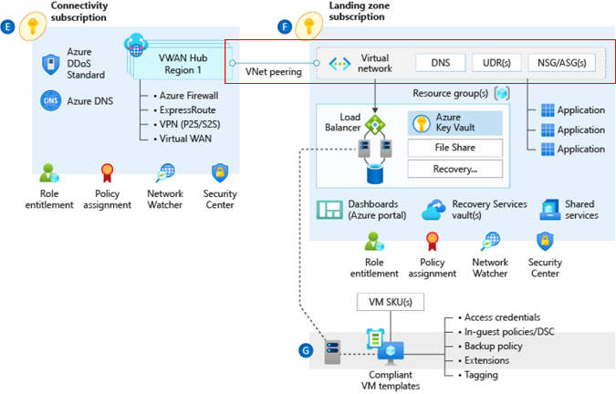

***Figure 1: VWAN-based corp-connected VNet***

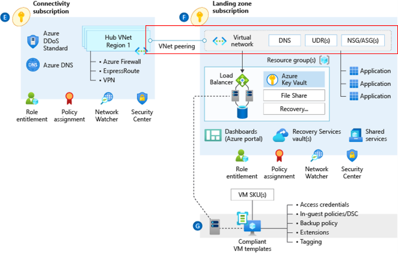

***Figure 2: Hub-spoke based corp-connected VNet***

As part of our Enterprise-Scale reference implementations, we have
shipped examples on how to manage these deployments at-scale using Azure
Policy. This article describes how these policies work and can be used
to operationalize VNet deployments in Landing Zones.

If you simply want to get started to deploy your connectivity
subscription and landing zone vnets without going through the inner
workings of the policies, we recommend you to explore our
[Enterprise-Scale Reference
Implementations](https://github.com/azure/enterprise-scale#deploying-enterprise-scale-architecture-in-your-own-environment)
which will give you a "one-click" end-to-end deployment experience.

## Azure Policy - Landing Zone VNet Deployment

We currently provide a policy to deploy VNets in landing zones and peer them to a traditional VNet hub. This policy definition (Deploy-VNET-HubSpoke) is part of the greater set of policies provided as standard in the template found [here](https://github.com/Azure/Enterprise-Scale/blob/main/eslzArm/managementGroupTemplates/policyDefinitions/policies.json#L878).

### Deploy-VNet-HubSpoke - Assignment at subscription

Depicted below is the high-level workflow to create Landing Zone VNets
connected to connectivity hub with policy. This article will cover the
highlighted steps.

Subscription creation is covered in [the following doc](https://github.com/Azure/Enterprise-Scale/wiki/Create-Landingzones).

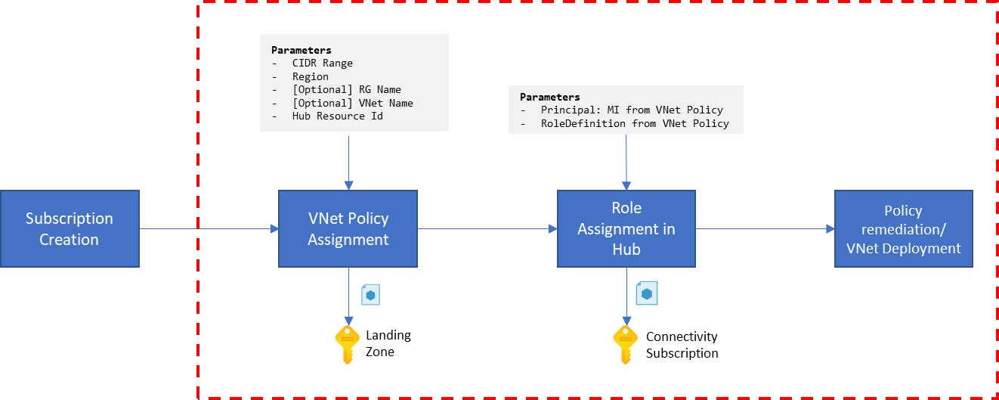

1. Assign policy to landing zone/subscription

    **a)**  Find the following policy and assign it to the newly created
        subscription

    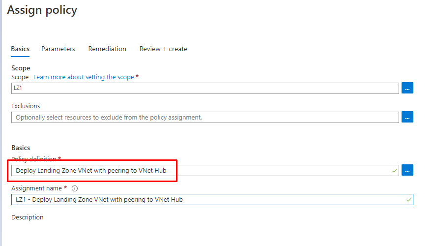

    **b)**  Provide all required parameters and adjust settings for
     [GatewayTransit and UseRemoteGateway](https://learn.microsoft.com/azure/vpn-gateway/vpn-gateway-peering-gateway-transit#:~:text=In%20the%20Azure%20portal%2C%20navigate,Peerings%2C%20then%20select%20%2B%20Add.&text=Verify%20the%20subscription%20is%20correct,the%20Hub%2DRM%20virtual%20network.)
     if you have a VPN or ExpressRoute gateway that you plan to use for
     on-premises connectivity in the hub network.

    > **Important:** Double check that the CIDR range provided is not used
    > anywhere else in your network.

    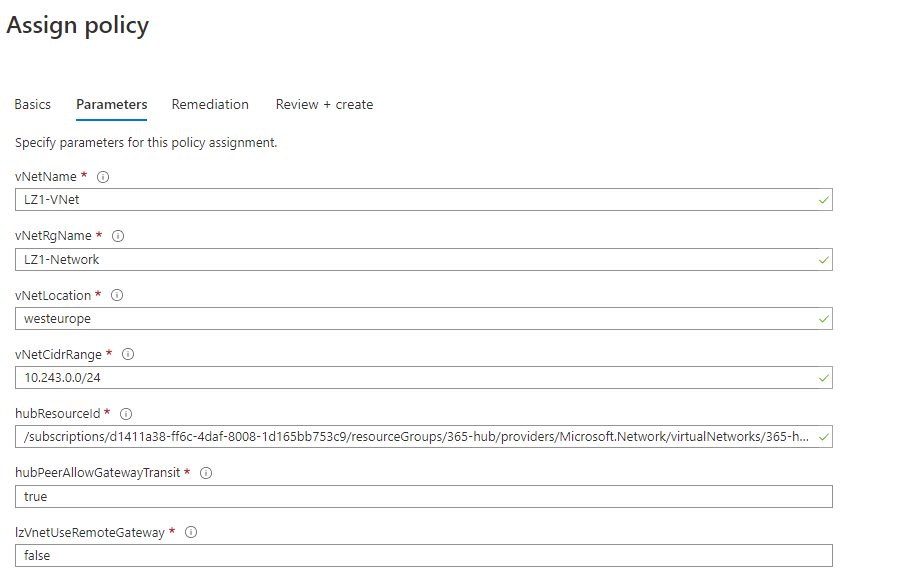

    **c)**  Change the "Managed Identity location" for the MI that will be used
        for subsequent deployments to the desired region and then create the
        assignment.

    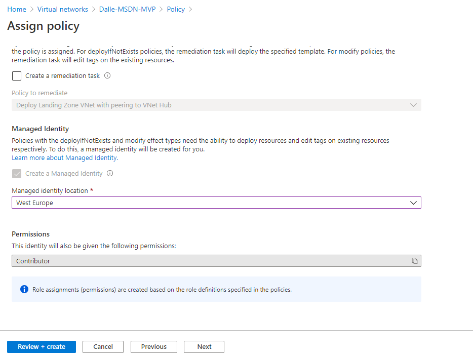

    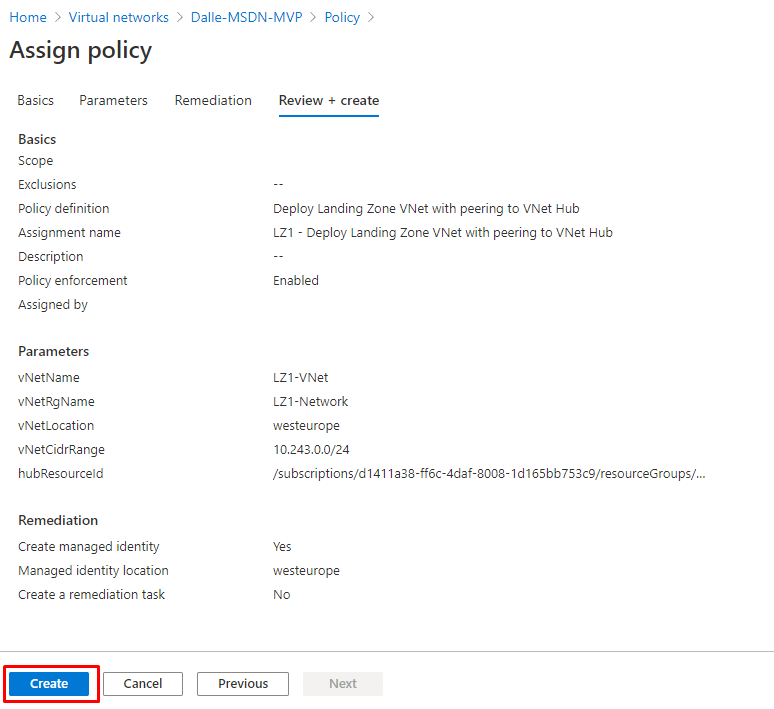

    **PowerShell**

    ```powershell
    #Get Policy Definition to Assign
    $PolicyDefinition = Get-AzPolicyDefinition -Id /providers/Microsoft.Management/managementGroups/Corp/providers/Microsoft.Authorization/policyDefinitions/Deploy-VNET-HubSpoke

    #Get Subscription where policy should be assigned to assign the policy
    $Subscription = Get-AzSubscription -SubscriptionName "LZ2"

    #Create parameter object for the assignment
    $ParametersJson = @"
    {
        "vNetName": {
          "value": "LZ2-VNet"
        },
        "vNetRgName": {
          "value": "LZ2-Network"
        },
        "vNetLocation": {
          "value": "westeurope"
        },
        "vNetCidrRange": {
          "value": "10.243.0.0/24"
        },
        "hubResourceId": {
          "value": "/subscriptions/d1411a38-ff6c-4daf-8008-1d165bb753c9/resourceGroups/365-hub/providers/Microsoft.Network/virtualNetworks/365-hub-weu"
        },
        "hubPeerAllowGatewayTransit": {
          "value": true
        },
        "lzVnetUseRemoteGateway": {
          "value": false
        }
      }
    "@

    #Assign the policy to the subscription
    $Assignment = New-AzPolicyAssignment -Name 'Deploy-VNet-HubSpoke-LZ2' `
                           -DisplayName 'Deploy-VNet-HubSpoke-LZ2' `
                           -Scope "/subscriptions/$($Subscription.SubscriptionId)"`
                           -PolicyDefinition $PolicyDefinition `
                           -PolicyParameter $ParametersJson `
                           -AssignIdentity `
                           -Location westeurope

    #Create required role assignment for policy assignment 
    New-AzRoleAssignment -RoleDefinitionId "$($PolicyDefinition.Properties.PolicyRule.then.details.roleDefinitionIds.split("/")[-1])" `
                         -ObjectId $assignment.Identity.principalId -Scope $Assignment.Properties.Scope 
    ```

2. Create role assignment for managed identity in connectivity
    subscription

    To be able to create the peering from the hub side, the policy
    assignment managed identity needs "Contributor" permissions in the
    connectivity subscription.

    **a)** Edit the previously created policy assignment and copy the name of
    the policy assignment. If the assignment was done with the portal,
    it will have an automatically generated name as highlighted in below
    screenshot.
    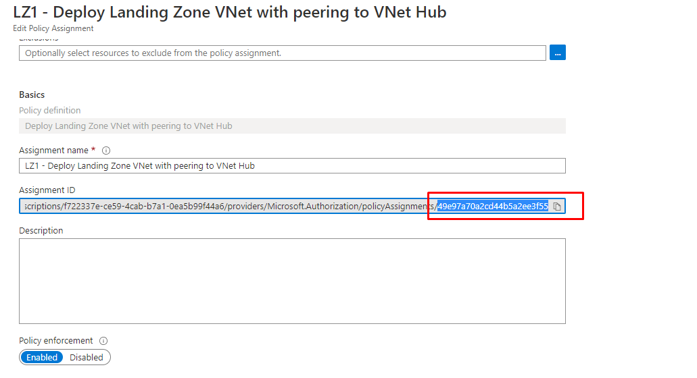

    **b)**  In the Azure portal, navigate to the Connectivity subscription and
    assign the Contributor role to the managed identity.

    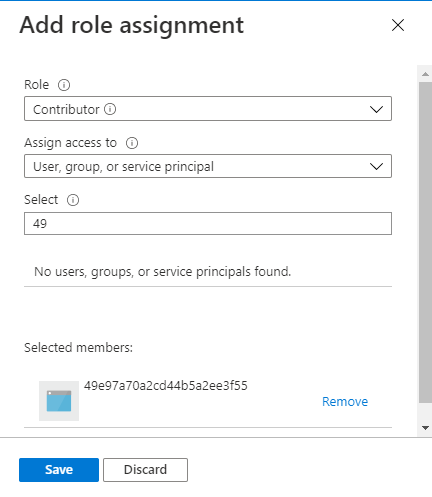

    **PowerShell**

    ```powershell
    #Get HubResourceId from Parameters Json 
    $HubResourceId = ($ParametersJson | ConvertFrom-Json).hubresourceId.value
    #Assign role 
    New-AzRoleAssignment -RoleDefinitionName "Network Contributor" `
                         -ObjectId $assignment.Identity.principalId -Scope $HubResourceId
    ```

3. Remediate policy to kick off deployment

    **a)** Under Policy -\> Remediation in the portal, find and select your
previously created assignment.

    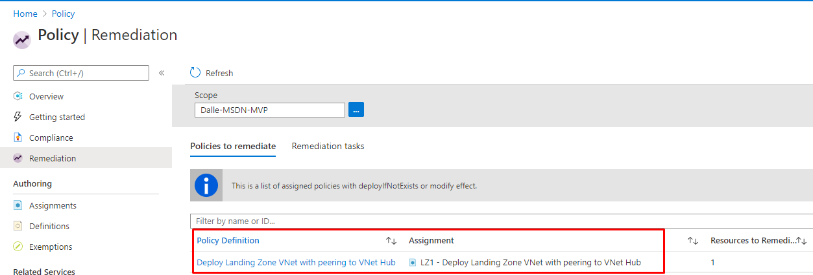

    **b)** Click on remediate to kick off the deployment task of the VNet and
    the Hub Peering. It will usually take 2-3 minutes and you can follow the
    progress under 'remediation tasks'.

    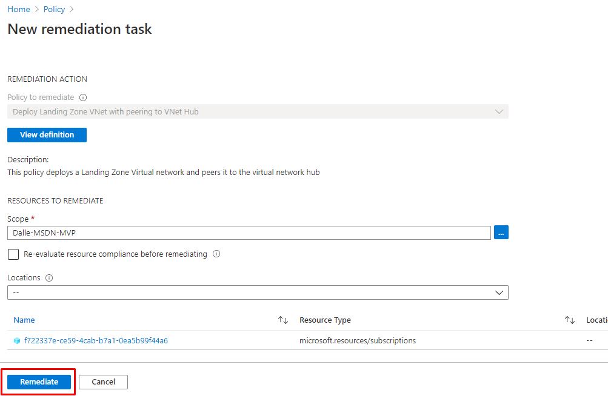
    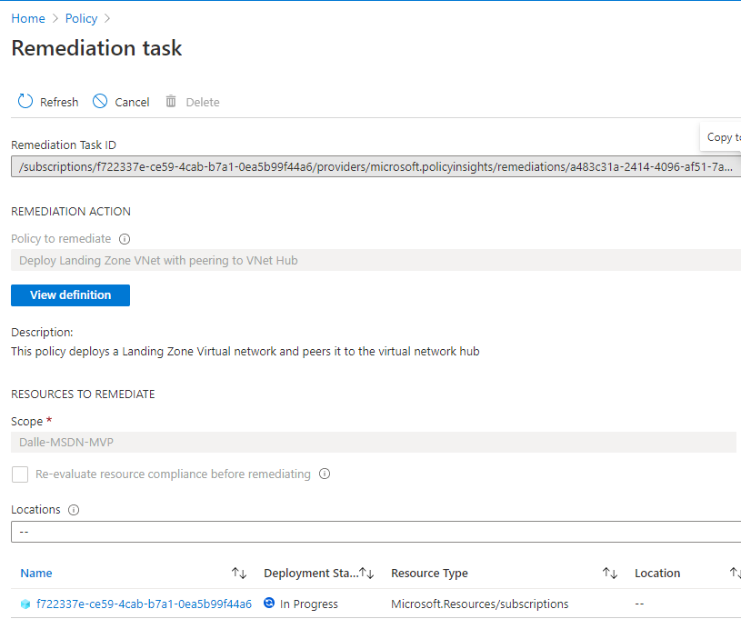

    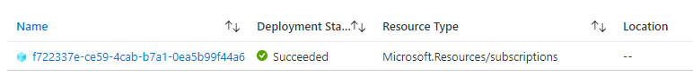

    **PowerShell**

    ```powershell
    #Start policy remediation
    Start-AzPolicyRemediation -PolicyAssignmentId $Assignment.PolicyAssignmentId -Name $Assignment.Name 
    #Get remediation status
    Get-AzPolicyRemediation -Name $Assignment.Name 
    ```
