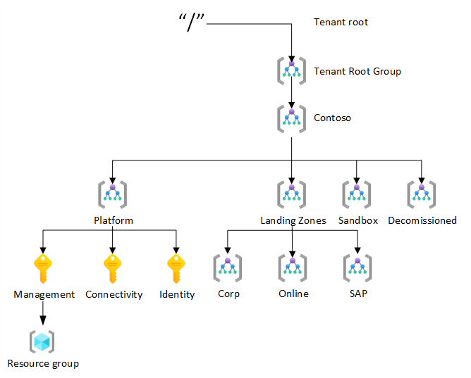
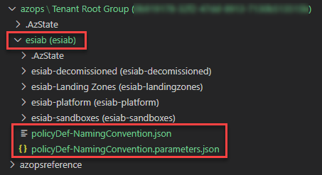

# Deploy your own ARM templates with AzOps GitHub Actions

This article describes how AzOps GitHub Actions can be used to deploy resources in Azure by using ARM template and parameters files. This capability enables to bring “your own” ARM template to deploy resources in Azure at any scope.

## About AzOps GitHub Actions for ARM template deployments

AzOps GitHub Actions is a deployment pipeline that is intended for ARM template deployments in Azure. AzOps is not intended to be used as a single deployment pipeline for the Enterprise-Scale platform as well as all application teams for deploying resources in their landing zones. However, individual application teams can implement their own AzOps or DevOps pipeline to deploy resources in their landing zones as needed.

## Deployment scopes with AzOps

AzOps allows you to deploy your own templates at the following scopes:

- Tenant Root (/)
- Management Groups
- Subscriptions
- Resource groups (requires that resource groups are pulled to the git repository)

Since Enterprise-Scale is focusing on platform capabilities, it is recommend to leverage the AzOps Git Actions to do Tenant Root (/), Management Group and Subscription scope deployments only.

The following picture depicts these deployment scopes:

## How to deploy ARM templates with AzOps

To deploy an ARM template and its corresponding parameters file by using the AzOps GitHub Actions, it is only required to copy the ARM template and parameters file into the desired scope in a feature branch in your local clone of the GitHub repo. Once you have copied your ARM template and parameters file at the desired scope submit a pull request. This will instruct AzOps to deploy the ARM template into the corresponding scope in Azure.

To demonstrate this capability, we will use a custom ARM template to deploy a policy definition at the management group scope but you can use this process to deploy any resource type.

> Before you start, please ensure, that your `azops` folder is in sync with your Azure environment. You can refer to the [Initialize Git With Current Azure configuration](./discover-environment.md) article for instructions on how to ensure your `azops` folder is in sync with your Azure environment.

1. Create a new feature branch. One way to create a feature branch from Visual Studio Code is by launching the command palette (CTRL + SHIFT + P) and select Git: Create Branch.

2. Create a new ARM template file with an optional parameter file if required (for example, policyDef-NamingConvention.json and policyDef-NamingConvention.parameters.json) in the scope folder __azops\Tenant Root Group (GUID)\path-to-your-managementGroup\managementGroup (displayName)__.

    In the [example folder](../../examples) several examples are published how to deploy platform resource.

    The picture below depicts an example configuration, where it is desired to deploy this policy definition at the **esiab** management group:

    

    > Important:  
    > The parameters file must have the same name as your template file, and must be followed by .parameters.json. In our example, if the template file is called policyDef-NamingConvention.json, the parameters file must be called policyDef-NamingConvention.**parameters**.json.
    > Ensure that the provided template files correspond with the deployment scope. (e.g. subscription scope deployment require subscription ARM deployment template)

3. Commit changes to your feature branch and create a pull request.

4. __Wait for deployment to succeed__ and merge pull request to **main** branch. **Feature** branch can be deleted after the successful merge.

After a successful deployment, the resources defined in your template will be deployed at the selected scope. For the example above, the policy definition will be deployed at a management group scope.
