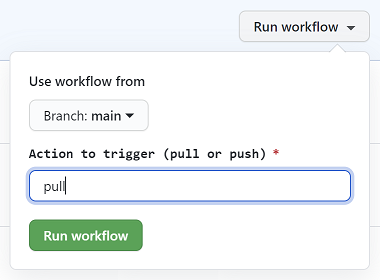

# Initialize Git With Current Azure configuration

This article explains how to perform a discovery of your existing Azure environment. Then, as part of the discovery process, your GitHub will reflect your current Azure environment consisting of Management Group, Subscriptions, Policy Definitions and Policy Assignments.


## Initialize existing environment

Your repo should contain a GitHub Action [.github/workflows/azops.yml](../../.github/workflows/azops.yml) that can pull the current platform configuration state from Azure.

Before invoking this action, [please ensure Actions are enabled for your repo](https://docs.github.com/en/github/administering-a-repository/disabling-or-limiting-github-actions-for-a-repository).

AzOps is maintained at [https://github.com/Azure/azops](https://github.com/Azure/azops).

### How to trigger the Action...

Depending on your preferred approach, there are a number of methods you can use to trigger the AzOps action in GitHub, including:

1. Github Actions web page
1. Github Cli
1. PowerShell
1. Bash

These are documented in the following sections...

#### Github Actions web page (Manual)

1. Browse to the Actions tab of your repository at:<br> `github.com/<github_username>/<repository_name>/actions`
1. From the list of Workflow, select `AzOps`
1. Select `Run workflow`
1. Check the branch and trigger entries<br><br><br>
1. Click the `Run workflow` button

#### Github Cli (Does not Require PAT token)

```bash
gh api -X POST repos/<github_username>/<repository_name>/dispatches --field event_type="GitHub CLI"
```

#### PowerShell

```powershell
$GitHubUserName = "<github_username>"
$GitHubPAT = "<pat_token>"
$GitHubRepoName = "<repository_name>"
$uri = "https://api.github.com/repos/$GitHubUserName/$GitHubRepoName/dispatches"
$params = @{
    Uri = $uri
    Headers = @{
        "Accept" = "application/vnd.github.everest-preview+json"
        "Content-Type" = "application/json"
        "Authorization" = "Basic $([Convert]::ToBase64String([Text.Encoding]::ASCII.GetBytes(("{0}:{1}" -f $GitHubUserName,$GitHubPAT))))"
        }
    Body = @{
        "event_type" = "PowerShell"
        } | ConvertTo-Json
    }
Invoke-RestMethod -Method "POST" @params
```

#### Bash

```bash
curl -u "<github_username>:<pat_token>" -H "Accept: application/vnd.github.everest-preview+json"  -H "Content-Type: application/json" https://api.github.com/repos/<github_username>/<repository_name>/dispatches --data '{"event_type": "Bash"}'
```

### What to do next...
Please check progress in the GitHub repo in the Actions tab and wait for it complete.

The following steps will be executed automatically to ensure that the current Azure environment is represented in your GitHub repository:

* Current Management Group, Subscriptions, Policy Definitions and Policy Assignments are discovered and RESTful representation of the Resources are  saved as ARM Template parameters file.
* If changes are detected which are not represented in your `main` branch, it will create `system` branch representing your current configuration as ARM templates parameter file.
* Create a Pull Request (PR) with the name `Azure Change Notification` (`system`  -> `main`)

## Verify PR and merge with `main` branch

Once the discovery process has completed, select the PR that was automatically created (it will be called Azure Change Notification). You can verify the changes discovered by clicking in the Files tab within the PR. In order to accept these changes into your `main` branch:

1. Merge PR to `main`.
2. Delete `system` branch.

The current Azure environment is now represented in the `azops` folder of the main branch. You can invoke this action at any time, when you want to retrieve current Azure configuration when you suspect configuration drift due to OOB changes in Azure.

## Next steps

Once GitHub will reflect your existing Azure environment, you can [deploy a new Policy Assignment](./deploy-new-policy-assignment.md).