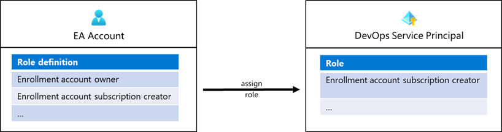

# Enable Service Principal to create landing zones

This article describes how AzOps GitHub Actions can be used to create landing zones (subscriptions) into management groups using ARM templates. In the following steps we'll assign the _Enrollment account subscription creator_ role to a SPN as illustrated in the following article:



## Pre-requisites

Before getting started with this guide ensure that AzOps has been setup and configured for the target environment. Documentation for [GitHub](setup-github.md) and [Azure DevOps](setup-azuredevops.md) provides more details. Later in this guide the Service Principal created for AzOps will be used to create landing zones (subscription).

For the Service Principal permissions to create subscriptions, access to an enrollment account that has a billing id associated is required.

>Note: When using this Service Principal the subscription will be created under specified billing scope of enrollment account. Multiple enrollment account permissions can granted to a Service Principal. The billing scope will be specified in the template further down in this guide.

Creating Azure subscriptions programmatically is allowed on specific types of Azure agreement types (EA, MCA, MPA, etc.). Refer to guidance on [Creating Azure subscriptions programatically](https://docs.microsoft.com/en-us/azure/cost-management-billing/manage/programmatically-create-subscription) to know supported agreement types.

## Create Landing Zones (Subscriptions) with AzOps GitHub Actions

To grant your (AzOps) Service Principal permissions to create subscriptions under the enrolment account following these steps:

### Login and fetch access token

Login with the enrollment account (e.g. with `Login-AzAccount`) and execute the following commands to fetch a valid access token for the account:

```powershell
# Provide the objectId of the service principal to grant access to enrolment account. 
$spnObjectId = ""

# Get context for the signed in enrolment account
$currentContext = Get-AzContext

# Fetching new token
$token = Get-AzAccessToken
```

### List all the billing accounts and enrolment accounts

As a next step we need to list and identify the billing account and enrollment account your identity has access to. These two information are required to reqest the roles available and the assign the permissions to the Service Principal.

The following scripts lists the billing account and enrollment account and assigns it to a variables which will be used later in this guide.

```powershell
# Request billing accounts that the identity has access to
$listOperations = @{
    Uri     = "https://management.azure.com/providers/Microsoft.Billing/billingaccounts?api-version=2020-05-01"
    Headers = @{
        Authorization  = "Bearer $($token.Token)"
        'Content-Type' = 'application/json'
    }
    Method  = 'GET'
}
$listBillingAccount = Invoke-RestMethod @listOperations

# List billing accounts
$listBillingAccount | ConvertTo-Json -Depth 100

# Select first billing account and the corresponding enrollment account
$billingAccount = $listBillingAccount.value[0].id
$enrollmentAccountId = $listBillingAccount.value[0].properties.enrollmentAccounts[0].id
```

### Read existing role definitions for the enrolment account

Multiple role definitions exists on an enrollment account. When this article written the following role definitions exist:

| Role name                               | ID                                   |
| :-------------------------------------- | :----------------------------------- |
| Enrollment account owner                | c15c22c0-9faf-424c-9b7e-bd91c06a240b |
| Enrollment account subscription creator | a0bcee42-bf30-4d1b-926a-48d21664ef71 |

Both role definitions have the `Microsoft.Subscription/subscriptions/write` permission required to create subscriptions. Following the least privileged principle we recommend to use the _Enrollment account subscription creator_ for the Service Principal.

```powershell
# Get billing roleDefinitions available at scope
$listRbacObj = @{
    Uri = "https://management.azure.com/$($enrollmentAccountId)/billingRoleDefinitions?api-version=2019-10-01-preview"
    Headers = @{
        Authorization  = "Bearer $($token.Token)"
        'Content-Type' = 'application/json'
    }
    Method = "GET"
}
$listRbac = Invoke-WebRequest @listRbacObj
$listRbac.Content | ConvertFrom-Json | ConvertTo-Json -Depth 100
```

### Assign permission (role assignment)

As a last step the Service Principal will be granted access to the enrolment account by assigning a role with the `Microsoft.Subscription/subscriptions/write` permission. Build-in role _Enrollment account subscription creator (GUID: a0bcee42-bf30-4d1b-926a-48d21664ef71)_ is used in this guide.

```powershell
# roledefinitonId (billingRoleDefinitions) has be equal to the role id of the "enrollment account subscription creator" role listed in the rbacContent object
$roleAssignmentBody = @"
{
    "properties": {
        "principalId": "$($spnObjectId)",
        "roleDefinitionId": "$($enrollmentAccountId)/billingRoleDefinitions/a0bcee42-bf30-4d1b-926a-48d21664ef71"
      }
}
"@

# Generate new GUID for the role assignment
$rbacGuid = New-Guid

# Assign 'Enrollment account subscription creator' role to the SPN
$assignRbac = @{
    Uri = "https://management.azure.com/$($enrollmentAccountId)/billingRoleAssignments/$($rbacGuid)?api-version=2019-10-01-preview"
    Headers = @{
        Authorization  = "Bearer $($token.Token)"
        'Content-Type' = 'application/json'
    }
    Method = "PUT"
    Body = $roleAssignmentBody
    UseBasicParsing = $true
}
$assignedRbac = Invoke-RestMethod @assignRbac
```

After the role is successfully assigned you can use this Service Principal to create landing zones (subscriptions).

>Note: The Service Principal can be granted access to multiple enrolment accounts. To enable this, execute this sequence multiple times (once per enrollment account).

## Create landing zones (subscriptions)

The platform team will use DevOps process to create a landing zone for the App team. Different examples are published in this repository to automate landing zone creation.

- [Create new empty subscription into a management group](../../examples/landing-zones/empty-subscription/)
- [Create new connected subscription into a management group](../../examples/landing-zones/connected-subscription/)

When the ARM templates are created to deploy a subscription following the recommendation in the [landing zone example folder](../../examples/landing-zones), subscriptions can be created on Azure using AzOps following [this documentation](./deploy-new-arm.md).
