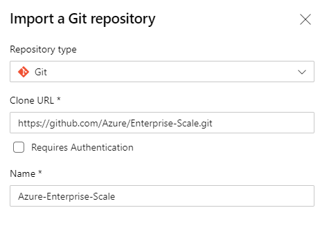
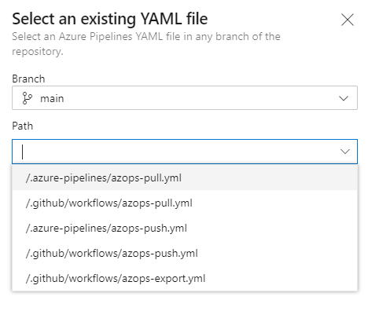
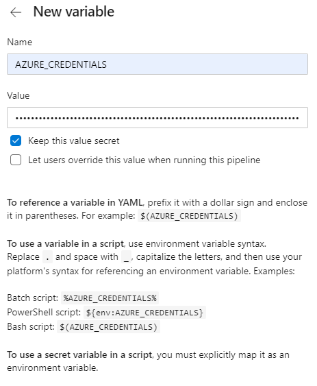
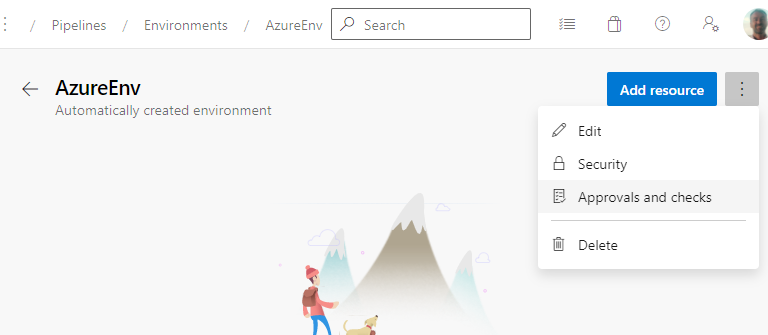
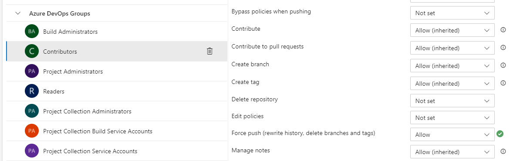
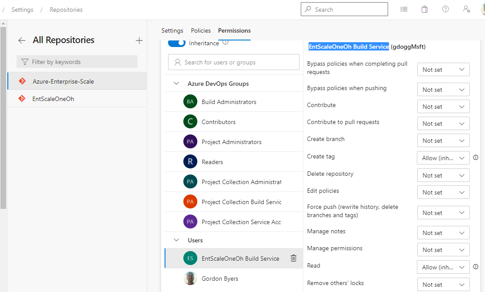
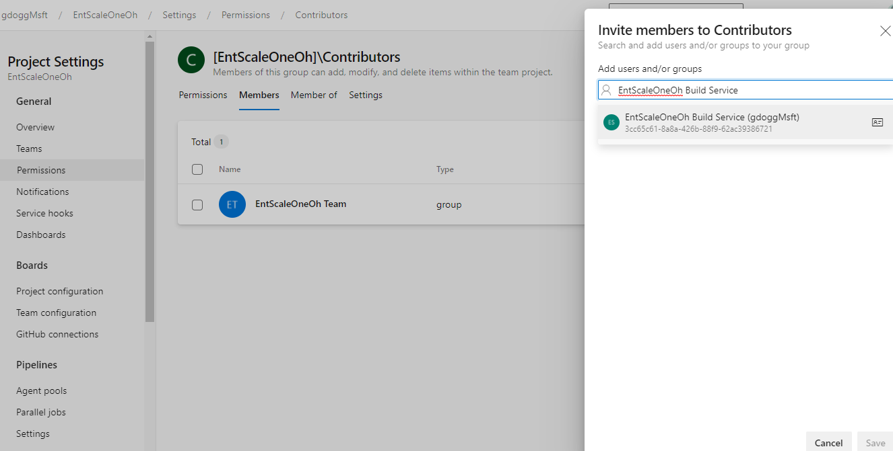
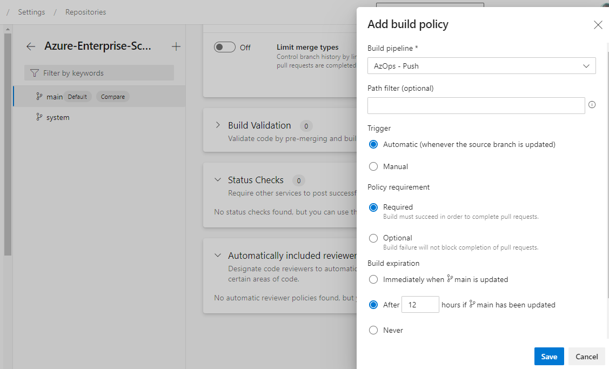
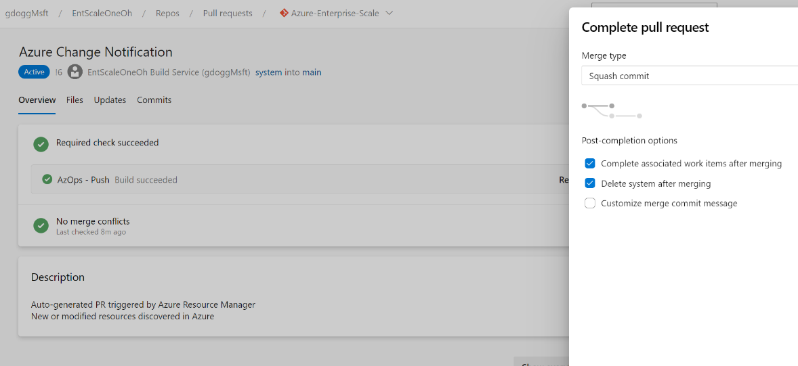

# Azure DevOps - Setup Guide

The [AzOps](https://github.com/Azure/AzOps/) (CI/CD) process was initially designed to run on GitHub. However, we recognise that many customers have invested in Azure DevOps and continue to work with it. As AzOps is packaged in a Container, we can leverage it in an Azure DevOps (ADO) pipeline in the same way that we do with a GitHub action.

## Supported scenarios

We currently support all AzOps scenarios. However, the Pull Request procedure slightly deviates from the review process in GitHub.
In its default configuration, Azure DevOps starts the build validation process when a Pull Request is created. To support the same AzOps push scenario, the manual review process (approval) has to be completed before the `AzOps - Push` pipeline will start.
Azure DevOps `environments` support `Approvals and checks` which we will be leveraged for the Pull Request flow.

## Prerequisites

Please complete the following steps to create a Service Principal with the correct access for use in the Azure deployment pipelines. A PowerShell script is provided below that simplifies this process. The script uses the AzureAD PowerShell module, which you need to install as a Administrator.

You may need to elevate your access to Azure before being able to create a root scoped assignment. For more information on how to do this, please refer to [this document](../EnterpriseScale-Setup-azure.md)

1. Create your AzOps service principal
1. Assign the scoped Azure RBAC Owner permission ([more info](../EnterpriseScale-Setup-azure.md))
1. (optional) Assign the AzureAD Directory Reader permission ([more info](../EnterpriseScale-Setup-aad-permissions.md))

```powershell
#Create Service Principal and assign Owner role to Tenant root scope ("/")
$servicePrincipal = New-AzADServicePrincipal -Role Owner -Scope / -DisplayName AzOps

#Prettify output to print in the format for AZURE_CREDENTIALS to be able to copy in next step.
$servicePrincipalJson = [ordered]@{
    clientId = $servicePrincipal.ApplicationId
    displayName = $servicePrincipal.DisplayName
    name = $servicePrincipal.ServicePrincipalNames[1]
    clientSecret = [System.Net.NetworkCredential]::new("", $servicePrincipal.Secret).Password
    tenantId = (Get-AzContext).Tenant.Id
    subscriptionId = (Get-AzContext).Subscription.Id
} | ConvertTo-Json
#Write-Output $servicePrincipalJson
$escapedServicePrincipalJson = $servicePrincipalJson.Replace('"','\"')
Write-Output $escapedServicePrincipalJson

########################################
# Configure the AzureAD directory role #
########################################

#Install the Module *If Required*
Install-Module -Name AzureAD #Do this in PowerShell as admin

#Connect to Azure Active Directory
$AzureAdCred = Get-Credential
Connect-AzureAD -Credential $AzureAdCred

#Get AzOps Service Principal from Azure AD
$aadServicePrincipal = Get-AzureADServicePrincipal -Filter "DisplayName eq 'AzOps'"

#Get Azure AD Directory Role
$DirectoryRole = Get-AzureADDirectoryRole -Filter "DisplayName eq 'Directory Readers'"
#$DirectoryRole = Get-AzureADDirectoryRole | Where-Object {$_.DisplayName -eq "Directory Readers"} #If the line above doesn't work with the Filter param, then do this.

if ($DirectoryRole -eq $NULL) {
    Write-Output "Directory Reader role not found. This usually occurs when the role has not yet been used in your directory"
    Write-Output "As a workaround, try assigning this role manually to the AzOps App in the Azure portal"
}
else {
    #Add service principal to Directory Role
    Add-AzureADDirectoryRoleMember -ObjectId $DirectoryRole.ObjectId -RefObjectId $aadServicePrincipal.ObjectId
}

```

## 1. Create the Azure DevOps project

If you don't already have an Azure DevOps Project;
Go to [dev.azure.com](https://dev.azure.com), log in to the organisation and create a new private Project

## 2. Create the repository

Within the Azure DevOps project, import the [Enterprise-Scale](https://github.com/Azure/Enterprise-Scale) repository from GitHub. Repository importing documentation can be found [here](https://docs.microsoft.com/azure/devops/repos/git/import-git-repository).



## 3. Configure the pipelines

*Create* two new pipelines, selecting the existing files `.azure-pipelines/azops-pull.yml` & `.azure-pipelines/azops-push.yml`.
It is a good practice to name these pipelines `AzOps - Pull` and `AzOps - Push` respectively (in both the YAML file, *and* the pipeline itself after you create it).



When creating the pipelines, define a new secret variable to each of the pipelines.
This variable is the connection credentials to Azure, that we generated in the Prerequisites script at the beginning.

* AZURE_CREDENTIALS - Set as the value of the *$escapedServicePrincipalJson* variable string from the script at the beginning of this article.



## 4. Configure the Environment Approvers

In Environments, open `AzureEnv` and select `Approvals and checks`, then configure an Approval for a user or group.



## 5. Configure repository permissions

The build service account must have the following permissions on the repository:

* `<Project>\Contributors`

In the *Repository* - *Manage Repository* - *Permissions* screen, ensure that in the Repository permissions that the Contributors group has the `Force Push` permission set to Allow.  



Whilst on the Repository Permissions screen, find the Build User in the list and copy their name for the next step.



Finally, add the user to the Contributor group in *Project Settings* - *Permissions* - *Contributors* - *Members*.



### 6. Configure repository branch policies

In order for the `AzOps Push` pipeline to run, set the repository `main` branch to [require build verification](https://docs.microsoft.com/en-us/azure/devops/repos/git/branch-policies) using most of default settings, but do define a path filter `/azops/*`.



It is also recommend to allow only `squash` merge types from branches into `main`.


### 7. Discover Environment

At this stage we're ready to discover your environment with the `AzOps - Pull` pipeline.  However, if you have a greenfield environment with no Management Groups configured then its advised that you select a Enterprise Scale [Reference Implementation](https://github.com/Azure/Enterprise-Scale/blob/main/docs/EnterpriseScale-Deploy-reference-implentations.md) to deploy to Azure.

Manually trigger the `AzOps - Pull` pipeline. The pipeline will run, and discover the existing Azure environment at the configured scope.

The following steps will be executed automatically to ensure that the current Azure environment is represented in your Azure DevOps repository:

* Current Management Group, Subscriptions, Policy Definitions and Policy Assignments are discovered and RESTful representation of the resources are saved as ARM template parameters file.
* If changes are detected that is not represented in your `main` branch, it will create `system` branch representing your current configuration as ARM templates parameter file.
* Create a Pull Request (PR) with the name `Azure Change Notification` (`system`  -> `main`) and auto-merge into `main`.

### 8. Verify PR and merge

Once the discovery process has completed, select the Pull Request that was automatically created (`Azure Change Notification`). Verify the changes discovered by clicking in the Files tab within the PR. In order to accept these changes into your `main` branch:

1. If you enabled Environment approvals, there will be An `Az-Ops Push` Build queued that needs approval.
1. Complete the pull request with a `Squash commit`, deleting the system branch.



The current Azure environment is now represented in your repository, there will be an `azops` folder of the `main` branch. By default the `AzOps Pull` pipeline will run every 6 hours, however you can invoke this action at any time when you suspect configuration drift due to Out of Band changes in Azure.

## Next steps

Once Azure DevOps reflects your existing Azure environment, you can [deploy a new Policy Assignment](./deploy-new-policy-assignment.md).

## Troubleshooting

### TF401027: You need the Git 'ForcePush' permission to perform this action

As part of Step 4, you need to either allow the Build Service, or the Contributor group `Force Push` on the main branch.

### The Directory Role `Directory Readers` is not returned by Get-AzureADDirectoryRole

The Get-AzureADDirectoryRole only returns roles which have at least one assignment, to use the script to make the role assignment you need to have already been to the Azure Portal and assigned the role previously.

### Conversion from JSON failed with error: Input string is not a valid number - AzOps Pull Run Container

Ensure that you're using the *$escapedServicePrincipalJson* variable string from the script at the beginning of this article. If you use an unescaped JSON string then this error will occur.