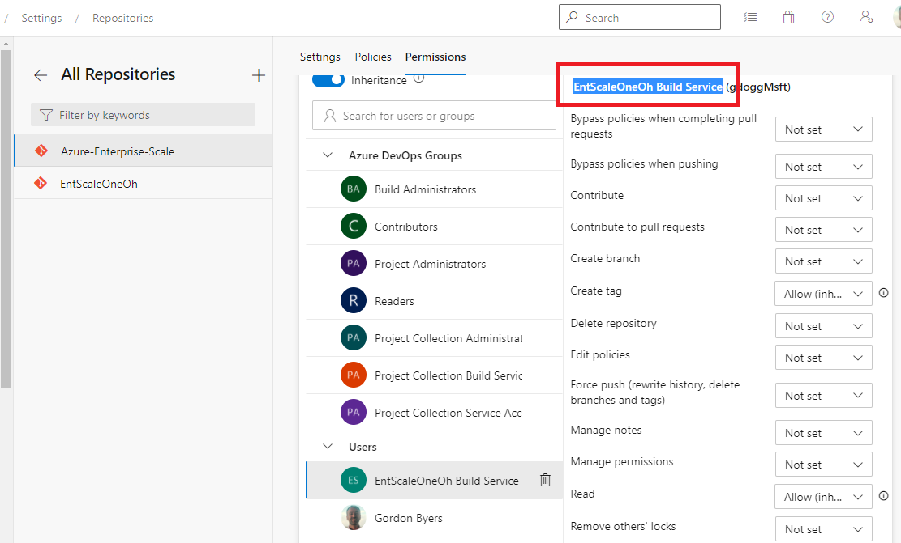
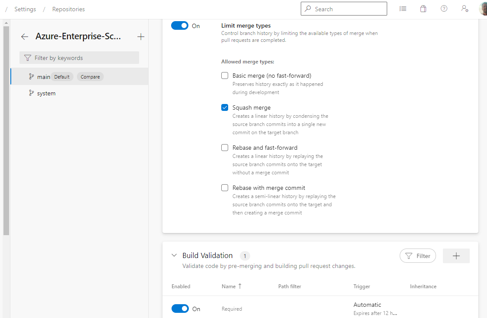

# Azure DevOps - Setup Guide

## Supported scenarios

We currently support all AzOps scenarios. However, the Pull Request procedure slightly deviates from the review process in GitHub.
It it's default configuration, Azure DevOps starts the build validation process when a Pull Request is created. To support the same AzOps push scenario, the manual review process (approval) has to be completed before the `AzOps - Push` pipeline will start. 
Azure DevOps `environments` support `Approvals and checks` which we will be leveraged for the Pull Request flow.

## Prerequisites

Please complete the following steps to create a Service Principal with the correct access for use in the Azure deployment pipelines. A PowerShell script is provided below that simplifies this process.

You may need to elevate your access to Azure, before being able to Create a root scoped assignment https://github.com/Azure/Enterprise-Scale/blob/main/docs/EnterpriseScale-Setup-azure.md

1. Create your AzOps service principal
1. Assign the root scoped Azure RBAC permission
1. Assign the AzureAD Directory Reader permission

```powershell
#Create Service Principal and assign Owner role to Tenant root scope ("/")
$servicePrincipal = New-AzADServicePrincipal -Role Owner -Scope / -DisplayName AzOps

#Prettify output to print in the format for AZURE_CREDENTIALS to be able to copy in next step.
$servicePrincipalJson = [ordered]@{
    clientId = $servicePrincipal.ApplicationId
    displayName = $servicePrincipal.DisplayName
    name = $servicePrincipal.ServicePrincipalNames[1]
    clientSecret = [System.Net.NetworkCredential]::new("", $servicePrincipal.Secret).Password
    tenantId = (Get-AzContext).Tenant.Id
    subscriptionId = (Get-AzContext).Subscription.Id
} | ConvertTo-Json
Write-Output $servicePrincipalJson

########################################
# Configure the AzureAD directory role #
########################################

Install-Module -Name AzureAD #Do this in PowerShell as admin

$AzureAdCred = Get-Credential
Connect-AzureAD -Credential $AzureAdCred

#Get AzOps Service Principal from Azure AD
$aadServicePrincipal = Get-AzureADServicePrincipal -Filter "DisplayName eq 'AzOps'"

#Get Azure AD Directory Role
$DirectoryRole = Get-AzureADDirectoryRole -Filter "DisplayName eq 'Directory Readers'"

if ($DirectoryRole -eq $NULL) {
    Write-Output "Directory Reader role not found. This usually occurs when the role has not yet been used in your directory"
    Write-Output "As a workaround, try assigning this role manually to the AzOps App in the Azure portal"
}
else {
    #Add service principal to Directory Role
    Add-AzureADDirectoryRoleMember -ObjectId $DirectoryRole.ObjectId -RefObjectId $aadServicePrincipal.ObjectId
}

#############################################################
# Display Service Principal Creds for Azure DevOps Variable #
#############################################################

$escapedServicePrincipalJson = $servicePrincipalJson.Replace('"','\"')
Write-Output $escapedServicePrincipalJson
```

## 1. Create the repository

Within the Azure DevOps project, import the [Enterprise-Scale](https://github.com/Azure/Enterprise-Scale) repository from GitHub. Instructions are [here](https://docs.microsoft.com/azure/devops/repos/git/import-git-repository).


## 2. Configure the pipelines

Add two new pipelines, selecting the existing files `.azure-pipelines/azops-pull.yml` & `.azure-pipelines/azops-push.yml`. It is a good practice to name these pipelines `AzOps - Pull` and `AzOps - Push` respectively.


When creating the pipelines, define a new secret variable to each of the pipelines:

* AZURE_CREDENTIALS - Set the value to the *escaped JSON* string from the script at the beginning of this article


## 3. Configure the Environment Approvers

_Optional step to configure approval steps_
The `AzOps - Push` push pipeline creates an ADO environment on this environment select `Approvals and checks` and configure an Approval for a user or group.


## 4. Configure repository permissions

The build service account  must have the following permissions on the repository:

* `<Project>\Contributors`

Verify the name of the build service account in the *Repository* - *Manage Repository* - *Permissions* screen.



Add the user to the Contributor group in *Project Settings* - *Permissions*.


Additionally, ensure that in the Repository permissions that the Contributors group has the `Force Push` permission set to Allow.  

### 5. Configure repository branch policies

In order for the pull pipeline to run, set the `main` branch to [require build verification](https://docs.microsoft.com/en-us/azure/devops/repos/git/branch-policies).
It is also recommend to allow only `squash` merge types from branches into `main`.



### 6. Discover Environment

At this stage we're ready to discover your environment with the Pull pipeline.  However, if you have a greenfield environment with no Management Groups configured then its advised that you select a Enterprise Scale [Reference Implementation](https://github.com/Azure/Enterprise-Scale/blob/main/docs/EnterpriseScale-Deploy-reference-implentations.md) to Deploy to Azure.

Manually trigger the `AzOps - Pull` pipeline. The pipeline will run, and discover the existing Azure environment.

The following steps will be executed automatically to ensure that the current Azure environment is represented in your Azure DevOps repository:

* Current Management Group, Subscriptions, Policy Definitions and Policy Assignments are discovered and RESTful representation of the resources are saved as ARM template parameters file.
* If changes are detected that is not represented in your `main` branch, it will create `system` branch representing your current configuration as ARM templates parameter file.
* Create a Pull Request (PR) with the name `Azure Change Notification` (`system`  -> `main`) and auto-merge into `main`.

Please now continue on the [Discover Environment](discover-environment.md#verify-pr-and-merge-with-main-branch) page, at the *"Verify PR and merge with `main` branch"* heading.

## Troubleshooting

### TF401027: You need the Git 'ForcePush' permission to perform this action

As part of Step 4, you need to either allow the Build Service, or the Contributor group `Force Push` on the main branch.

### The Directory Role `Directory Readers` is not returned by Get-AzureADDirectoryRole 

The Get-AzureADDirectoryRole only returns roles which have at least one assignment, to use the script to make the role assignment you need to have already been to the Azure Portal and assigned the role previously.
