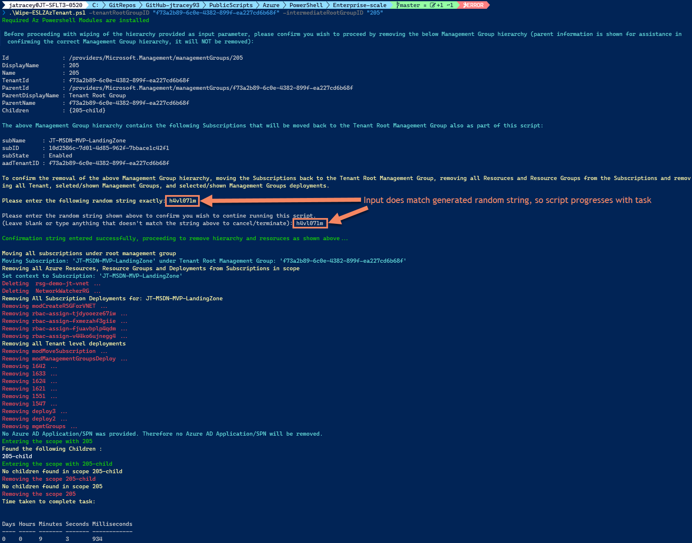

# Cleaning up an Enterprise-scale deployment

> :warning: :no_entry: :warning: **This script will completely remove a Management Group and everything within its hierarchy**
>  
> **USE WITH EXTREME CAUTION AND ONLY IF YOU FULLY UNDERSTAND THE OUTCOME OF RUNNING THIS SCRIPT FROM THE BELOW DOCUMENTATION**

We understand that some of you may be deploying Enterprise-scale multiple times within the same or multiple Azure AD Tenants for lab, demo or testing purposes for yourself or customers, but cleaning up an Enterprise-scale deployment can be a very time consuming and manual task.

With this in mind we have created a PowerShell script called [`Wipe-ESLZAzTenant.ps1`](#wipe-eslzaztenantps1-powershell-script) that will clean-up and remove the following resources from your Azure AD Tenant, based on the parameters you pass in to set its scope:

- Service Principal (optional)
- Management Groups (Only those in the hierarchy based on what you provide as an input for the parameter `intermediateRootGroupID`)
- Move Susbcriptions, in above hierarchy, back to the Tenant Root Management Group
- Remove all Resources and Resource Groups from the Subscriptions in scope
- Remove all [ARM deployments history](https://docs.microsoft.com/azure/azure-resource-manager/templates/deployment-history?tabs=azure-portal) from the following scopes:
  - Tenant
  - Management Groups (Only those in the hierarchy based on what you provide as an input for the parameter `intermediateRootGroupID`)
  - Subscriptions, in above Management Group hierarchy

> :warning: :warning: :warning: **This script is not intended to be used in most Enterprise-scale deployments as it is unlikely you will need to remove the entire deployment once initially deployed.**
>  
> **This script is intended for use by architects, consultants, engineers who are demoing or deploying Enterprise-scale in a lab and need to completely remove a Enterprise-scale deployment from their Azure AD Tenant**

## Failsafe in `Wipe-ESLZAzTenant.ps1` PowerShell Script

This script also has a failsafe implemented to ensure that when running the script the user must enter a random 8 character string exactly to confirm they wish the script to run. This is shown in the below screenshot:


## Pre-requisites for `Wipe-ESLZAzTenant.ps1` PowerShell Script

This PowerShell script will check for each of the below before allowing it to run:

- [PowerShell Core](https://docs.microsoft.com/powershell/scripting/install/installing-powershell?view=powershell-7.1)
- [PowerShell 'Az' Module](https://docs.microsoft.com/powershell/azure/install-az-ps?view=azps-6.4.0) version 6.3.0 or later
  - Or these individual sub-modules of the 'Az' module:
    - 'Az.Accounts' version 2.5.2 or later
    - 'Az.Resources' version 4.3.0 or later
    - 'Az.ResourceGraph' version 0.7.7 or later

## Input Parameters for `Wipe-ESLZAzTenant.ps1` PowerShell Script

| Parameter Name | Description | Required | Example Input |
| :------------: | :---------: | :------: | :-----------: |
| tenantRootGroupID | This is the Azure AD Tenant ID, which is also the Name/ID for the Tenant Root Management Group (this is set by the platform when Management Groups are enabled) | Yes | "f73a2b89-6c0e-4382-899f-ea227cd6b68f" |
| intermediateRootGroupID | This is the Name/ID of the Management Group you want to remove everything beneath, including itself. | Yes | "Contoso" |
| eslzAADSPNName | This is the Name of the Azure AD Service Principal (SPN) that you may use for your Enterprise-scale deployment | No - Optional | "Contoso-ESLZ-SPN" |

## Example usage of `Wipe-ESLZAzTenant.ps1` PowerShell Script

### Without SPN removal:

```powershell
.\Wipe-ESLZAzTenant.ps1 -tenantRootGroupID "f73a2b89-6c0e-4382-899f-ea227cd6b68f" -intermediateRootGroupID "Contoso"
```

### With SPN removal:

```powershell
.\Wipe-ESLZAzTenant.ps1 -tenantRootGroupID "f73a2b89-6c0e-4382-899f-ea227cd6b68f" -intermediateRootGroupID "Contoso" -eslzAADSPNName = "Contoso-ESLZ-SPN"
```

#### Screenshot of example without SPN removal



## `Wipe-ESLZAzTenant.ps1` PowerShell Script

The script is provided below in-line instead of a downloadable file to ensure that it is only used and executed, if required and understood; like another failsafe to ensure it is not used by mistake.

To use this script you will need to create a new `.ps1` file locally on your machine, called `Wipe-ESLZAzTenant.ps1` (although you can use whatever you like, you'll just need to call the script with whatever file name you enter), and copy the content from the script below into it before running the script.

```powershell
######################
# Wipe-ESLZAzTenant #
######################
# Version: 1.2
# Last Modified: 30/09/2021
# Author: Jack Tracey 
# Contributors: Liam F. O'Neill, Paul Grimley, Jeff Mitchell

<#
.SYNOPSIS
Fully resets an AAD tenant after deploying Enterprise Scale (Azure Landing Zone Accelerator) so it can be deployed again. BEWARE: THIS WILL DELETE ALL OF YOUR AZURE RESOURCES. USE WITH EXTREME CAUTION.

.DESCRIPTION
Fully resets an AAD tenant after deploying Enterprise Scale (Azure Landing Zone Accelerator) so it can be deployed again. BEWARE: THIS WILL DELETE ALL OF YOUR AZURE RESOURCES. USE WITH EXTREME CAUTION.

.EXAMPLE
# Without SPN Removal
.\Wipe-ESLZAzTenant.ps1 -tenantRootGroupID "f73a2b89-6c0e-4382-899f-ea227cd6b68f" -intermediateRootGroupID "Contoso"

# With SPN Removal
.\Wipe-ESLZAzTenant.ps1 -tenantRootGroupID "f73a2b89-6c0e-4382-899f-ea227cd6b68f" -intermediateRootGroupID "Contoso" -eslzAADSPNName = "Contoso-ESLZ-SPN"

.NOTES
Learn more about Enterprise-scale here:
https://github.com/Azure/Enterprise-Scale
https://aka.ms/es/guides

# Required PowerShell Modules:
- https://docs.microsoft.com/en-us/powershell/azure/install-az-ps?view=azps-6.4.0
- Install-Module -Name Az 
- Specifically 'Az.Accounts', 'Az.Resources' & 'Az.ResourceGraph' if you need to limit what is installed

# Release notes 14/09/2021 - V1.0: 
- Initial release.
- GroupName has been changes to GroupId as per Az PowerShell module warning message 'upcoming breaking changes in the cmdlet 'Get-AzManagementGroup'as documented https://aka.ms/azps-changewarnings'
    - Warnings have been disabled!
- Uses Azure Resource Graph to get list of subscriptions in the Intermediate Root Management Group's hierarchy tree, therefore it can take a few minutes (5/10) for the Resoruce Graph data to refresh and pull all the Subscriptions in the tree, if recently moved between Management Groups 

# Release notes 29/09/2021 - V1.1:
- Added checks and break, if not installed, for required Azure PowerShell modules: 'Az' or 'Az.Accounts', 'Az.Resources' & 'Az.ResourceGraph'

# Release notes 30/09/2021 - V1.2:
- Added checks to ensure this is running on PowerShell Core edition and not Desktop - https://docs.microsoft.com/en-us/powershell/scripting/install/installing-powershell?view=powershell-7.1
- Added user confirmation prompt with random 8 character code they must enter to confirm before anything is removed/moved by the script
#>

#Requires -PSEdition Core

[CmdletBinding()]
param (
    #Added this back into parameters as error occurs if multiple tenants are found when using Get-AzTenant
    [Parameter(Mandatory = $true, Position = 1, HelpMessage = "Please the Insert Tenant ID (GUID) of your Azure AD tenant e.g.'f73a2b89-6c0e-4382-899f-ea227cd6b68f'")]
    [string]
    $tenantRootGroupID = "<Insert the Tenant ID (GUID) of your Azure AD tenant>",

    [Parameter(Mandatory = $true, Position = 2, HelpMessage = "Insert the name of your intermediate root Management Group e.g. 'Contoso'")]
    [string]
    $intermediateRootGroupID = "<Insert the name of your intermediate root Management Group e.g. Contoso>",

    [Parameter(Mandatory = $false, Position = 3, HelpMessage = "(Optional) Please enter the display name of your Enterprise-scale app registration in Azure AD. If left blank, no app registration is deleted.")]
    [string]
    $eslzAADSPNName = ""
)

#Toggle to stop warnings with regards to DisplayName and DisplayId
Set-Item Env:\SuppressAzurePowerShellBreakingChangeWarnings "true"

# Start timer
$StopWatch = New-Object -TypeName System.Diagnostics.Stopwatch
$StopWatch.Start()

# Check required PowerShell modules are installed
if ((Get-InstalledModule -Name 'Az' -MinimumVersion '6.3.0' -ErrorAction SilentlyContinue) -or ((Get-InstalledModule -Name 'Az.Accounts' -MinimumVersion '2.5.2' -ErrorAction SilentlyContinue) -and (Get-InstalledModule -Name 'Az.Resources' -MinimumVersion '4.3.0' -ErrorAction SilentlyContinue) -and (Get-InstalledModule -Name 'Az.ResourceGraph' -MinimumVersion '0.7.7' -ErrorAction SilentlyContinue))) {
    Write-Host "Required Az Powershell Modules are installed" -ForegroundColor Green
    Write-Host ""
}
else {
    throw "Required Az Powershell Modules are installed. Required modules are: 'Az' OR 'Az.Accounts' (v2.5.2+), 'Az.Resources' (v4.3.0+) & 'Az.ResourceGraph' (v0.7.7+)"
}

# Get all Subscriptions that are in the Intermediate Root Management Group's hierarchy tree
$intermediateRootGroupChildSubscriptions = Search-AzGraph -Query "resourcecontainers | where type =~ 'microsoft.resources/subscriptions' | mv-expand mgmtGroups=properties.managementGroupAncestorsChain | where mgmtGroups.name =~ '$intermediateRootGroupID' | project subName=name, subID=subscriptionId, subState=properties.state, aadTenantID=tenantId, mgID=mgmtGroups.name, mgDisplayName=mgmtGroups.displayName"

$userConfirmationMGsToDelete = Get-AzManagementGroup -GroupID $intermediateRootGroupID -Expand -Recurse | Select-Object Id, DisplayName, Name, TenantId, ParentId, ParentDisplayName, ParentName, Children
$userConfirmationSubsToMove = $intermediateRootGroupChildSubscriptions | Select-Object subName, subID, subState, aadTenantID

## Confirm with user that they want to proceed with script removing the hierarchy and resoruces, also prompt them to enter a response to a challenge to confirm
Write-Host "Before proceeding with wiping of the hierarchy provided as input parameter, please confirm you wish to proceed by removing the below Management Group hierarchy (parent information is shown for assistance in confirming the correct Management Group hierarchy, it will NOT be removed):" -ForegroundColor Cyan
$userConfirmationMGsToDelete

Write-Host "The above Management Group hierarchy contains the following Subscriptions that will be moved back to the Tenant Root Management Group also as part of this script:" -ForegroundColor Cyan
Write-Host ""
if ($null -ne $intermediateRootGroupChildSubscriptions) {
    $userConfirmationSubsToMove
} else {
    Write-Host "No Subscriptions found in selected/entered hierarchy"
}

# Generate 8 character random string (combination of lowercase letters and integers)
$userConfirmationRandomID = -join ((48..57) + (97..122) | Get-Random -Count 8 | ForEach-Object { [char]$_ })

Write-Host "To confirm the removal of the above Management Group hierarchy, moving the Subscriptions back to the Tenant Root Management Group, removing all Resoruces and Resource Groups from the Subscriptions and removing all Tenant, seleted/shown Management Groups, and selected/shown Management Groups deployments." -ForegroundColor Yellow
Write-Host ""
Write-Host "Please enter the following random string exactly: $userConfirmationRandomID" -ForegroundColor Yellow
Write-Host ""

Write-Host "Please enter the random string shown above to confirm you wish to contine running this script."
$userConfirmationInputString = Read-Host -Prompt "(Leave blank or type anything that doesn't match the string above to cancel/terminate)"

if ($userConfirmationInputString -eq $userConfirmationRandomID) {
    Write-Host ""
    Write-Host "Confirmation string entered successfully, proceeding to remove hierarchy and resoruces as shown above..." -ForegroundColor Green
    Write-Host ""
}
else {
    Write-Host "Confirmation string not entered or incorrect, terminating script..." -ForegroundColor Red
    throw "Confirmation string not entered or incorrectly entered, terminating script..."
}

Write-Host "Moving all subscriptions under root management group" -ForegroundColor Yellow

# For each Subscription in Intermediate Root Management Group's hierarchy tree, move it to the Tenant Root Management Group
$intermediateRootGroupChildSubscriptions | ForEach-Object -Parallel {
    # The name 'Tenant Root Group' doesn't work. Instead, use the GUID of your Tenant Root Group
    if ($_.subState -ne "Disabled") {
        Write-Host "Moving Subscription: '$($_.subName)' under Tenant Root Management Group: '$($using:tenantRootGroupID)'" -ForegroundColor Cyan
        New-AzManagementGroupSubscription -GroupId $using:tenantRootGroupID -SubscriptionId $_.subID
    }    
}

# For each Subscription in the Intermediate Root Management Group's hierarchy tree, remove all Resources, Resource Groups and Deployments
Write-Host "Removing all Azure Resources, Resource Groups and Deployments from Subscriptions in scope" -ForegroundColor Yellow

ForEach ($subscription in $intermediateRootGroupChildSubscriptions) {
    Write-Host "Set context to Subscription: '$($subscription.subName)'" -ForegroundColor Cyan
    Set-AzContext -Subscription $subscription.subID | Out-Null

    # Get all Resource Groups in Subscription
    $resources = Get-AzResourceGroup

    $resources | ForEach-Object -Parallel {
        Write-Host "Deleting " $_.ResourceGroupName "..." -ForegroundColor Red
        Remove-AzResourceGroup -Name $_.ResourceGroupName -Force | Out-Null
    }
    
    # Get Deployments for Subscription
    $subDeployments = Get-AzSubscriptionDeployment

    Write-Host "Removing All Subscription Deployments for: $($subscription.subName)" -ForegroundColor Yellow 
    
    # For each Subscription level deployment, remove it
    $subDeployments | ForEach-Object -Parallel {
        Write-Host "Removing $($_.DeploymentName) ..." -ForegroundColor Red
        Remove-AzSubscriptionDeployment -Id $_.Id
    }
}

# Get all AAD Tenant level deployments
$tenantDeployments = Get-AzTenantDeployment

Write-Host "Removing all Tenant level deployments" -ForegroundColor Yellow

# For each AAD Tenant level deployment, remove it
$tenantDeployments | ForEach-Object -Parallel {
    Write-Host "Removing $($_.DeploymentName) ..." -ForegroundColor Red
    Remove-AzTenantDeployment -Id $_.Id
}

# Remove ESLZ SPN, if provided
if ($eslzAADSPNName -ne "") {
    Write-Host "Removing Azure AD Application Registration/SPN:" $eslzAADSPNName -ForegroundColor Red
    Remove-AzADApplication -DisplayName $eslzAADSPNName -Force
}
else {
    Write-Host "No Azure AD Application/SPN was provided. Therefore no Azure AD Application/SPN will be removed." -ForegroundColor Cyan
}

# This function only deletes Management Groups in the Intermediate Root Management Group's hierarchy tree and will NOT delete other Intermediate Root level Management Groups and their children e.g. in the case of "canary"
function Remove-Recursively($name) {
    # Enters the parent Level
    Write-Host "Entering the scope with $name" -ForegroundColor Green
    $parent = Get-AzManagementGroup -GroupId $name -Expand -Recurse

    # Checks if there is any parent level
    if ($null -ne $parent.Children) {
        Write-Host "Found the following Children :" -ForegroundColor Yellow
        Write-host ($parent.Children | Select-Object Name).Name -ForegroundColor White

        foreach ($children in $parent.Children) {
            # Tries to recur to each child item
            Remove-Recursively($children.Name)
        }
    }

    # If no children are found at each scope
    Write-Host "No children found in scope $name" -ForegroundColor Yellow
    Write-Host "Removing the scope $name" -ForegroundColor Red
    
    Remove-AzManagementGroup -InputObject $parent
}

# Remove all the Management Groups in Intermediate Root Management Group's hierarchy tree, including itself
Remove-Recursively($intermediateRootGroupID)

# Stop timer
$StopWatch.Stop()

# Display timer output as table
Write-Host "Time taken to complete task:" -ForegroundColor Yellow
$StopWatch.Elapsed | Format-Table
```
