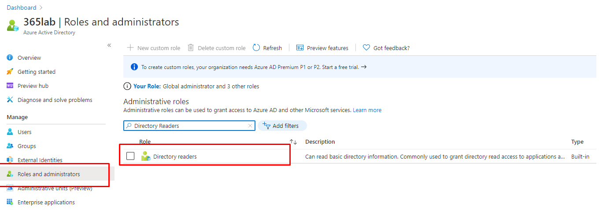
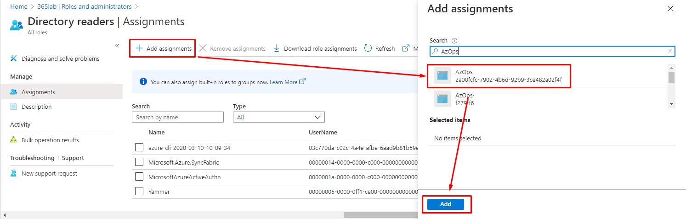

# Configure Azure Active Directory permissions for Service Principal

This article will guide you through the process to add your AzOps service principal to the  Azure Active Directory [Directory Readers](https://docs.microsoft.com/en-us/azure/active-directory/users-groups-roles/directory-assign-admin-roles) role.

> Note: The steps below requires you to use an identity that is local to the Azure AD, and **_not_** Guest user account due to known restrictions.

The service principal used by the Enterprise-Scale reference implementation requires Azure AD directory reader permissions to be able to discover Azure role assignments. These permissions are used to enrich data around the role assignments with additional Azure AD context such as ObjectType and Azure AD Object DisplayName.

## Add service principal to directory role via Azure Portal (Option 1)

1.1 Sign in to the Azure portal or the Azure Active Directory admin center as a Global Administrator. If you are using Azure AD Privileged Identity Management, activate your Global Administrator role assignment.

1.2 Open Azure Active Directory.

1.3 Under _Manage_ > _Roles and administrators_, select _Directory readers_.


1.4 Under _Manage_ > _Assignments_ > _Add assignments_, find for and select your AzOps service principal and finally add it to the directory role.



> Note: In case you are using Azure AD Privileged Identity management, ensure you add the service principal to the role with a permanent assignment.

## Add service principal to directory role with Azure AD PowerShell (Option 2)

Ensure that you have the [AzureAD PowerShell module installed on your machine](https://docs.microsoft.com/en-us/powershell/module/azuread/?view=azureadps-2.0) and that you have connected to Azure AD with the [Connect-AzureAD](https://docs.microsoft.com/en-us/powershell/module/azuread/connect-azuread?view=azureadps-2.0) cmdlet.


````powershell
#Get AzOps Service Principal from Azure AD
$ServicePrincipal = Get-AzureADServicePrincipal -Filter "DisplayName eq '<Replace-Me>'"

#Get Azure AD Directory Role
$DirectoryRole = Get-AzureADDirectoryRole -Filter "DisplayName eq 'Directory Readers'"

#Add service principal to Directory Role
Add-AzureADDirectoryRoleMember -ObjectId $DirectoryRole.ObjectId -RefObjectId $ServicePrincipal.ObjectId
````

Please note, it may take up to 15-30 minutes for permission to propagate in Azure AD.

## Next steps

Please proceed with [deploying reference implementation](./EnterpriseScale-Deploy-reference-implentations.md).
