# Enterprise-Scale "in-a-box" deployment

Enterprise-Scale-in-a-box deployment is a two-step approach.

The **Deploy your tenant** scenario initializes a new Enterprise-Scale (ES) Management Group structure and all custom Azure Policy and PolicySet (aka Policy Initiative) definitions at the ES Management Group scope.

Once you have completed the first step (deploy your tenant), the second step [Setup GitHub Action for CI/CD](./setup-git-cicd.md) and [Using GitHub to deploy changes to your Enterprise-Scale architecture](./use-git-pipeline.md), will walk you through the setup of an DevOps pipeline based on GitHub Actions to do the Azure Policy assignments.

## Deploy your Tenant

This section is used to setup the exact environment you see in the [reference implementation](../reference/contoso/Readme.md) for the Enterprise-Scale approach, including the Management Group schema in [**deploy new policy assignments**](../Deploy/deploy-new-policy-assignment.md#deployment-artifact-overview) and the policy definitions and assignments listed [here](../../azopsreference/3fc1081d-6105-4e19-b60c-1ec1252cf560/contoso/.AzState).

Execute the following steps of the following sections to deploy this environment in your Azure Subscription.

### Create a GitHub repository from Enterprise-Scale repo

To create a GitHub repository from the Enterprise-Scale repo as a template, execute the following steps.

1. Clone current [Enterprise-Scale repository](https://github.com/Azure/Enterprise-Scale) to your organization by clicking on **Use this template** function.

    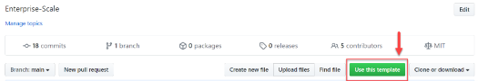

2. On the **Create a new repository from Enterprise-Scale** window, create a new repo under your GitHub-ID. Provide a repository name (for example, `ES-IAB`). The repository can be created as **Public** or **Private** and the **Include all branches** should be unchecked.

    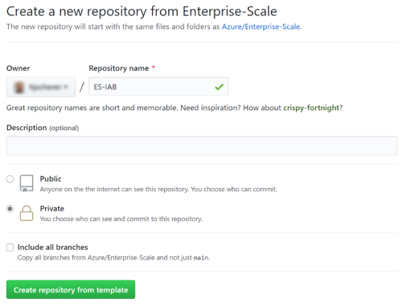

3. Once the new repository has been created under your GitHub-ID, click on **Code**, and copy the URL provided by clicking on the button highlighted.

    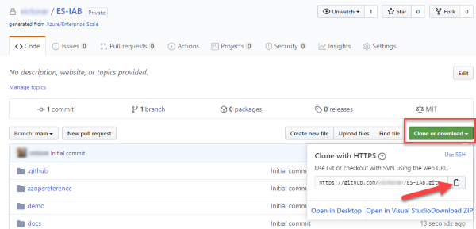

4. On your local computer, launch Visual Studio Code and open the command palette (CTRL + SHIFT + P). In the command palette, type (or select) ```Git: clone```

    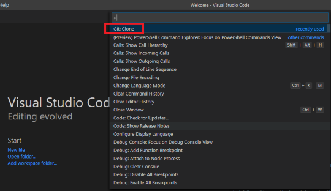

5. After selecting Git: Clone, paste the URL that you copied to the clipboard in your previous step (for example, https://github.com/yourGitHubID/your-RepoName.git), and then hit enter.

    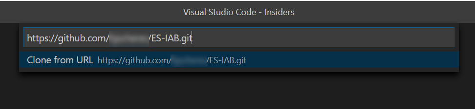

6. In the **Select folder** window, select a folder to save a local copy of the GitHub repo (for example, you can select **This PC > Documents > GitHub**), and then click **Select repository location**.

7. In the **Would you like to open the cloned repository?** pane, click **Open**.

    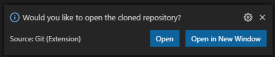

    Visual Studio Code will open the local copy of the repo. You should see a series of folders and files on the left section. Ensure that you have checkout your main branch:

    

### Deploy the Management Group structure and policy/PolicySet definitions

In this section you are deploying the foundational Management Group structure as well as the policy and PolicySet definitions. To deploy this we will use the [Contoso reference implementation](../reference/contoso/Readme.md)
ARM template.

1. In a browser, navigate to the [Contoso reference implementation](../reference/contoso/Readme.md) in the Enterprise-Scale GitHub repository.

    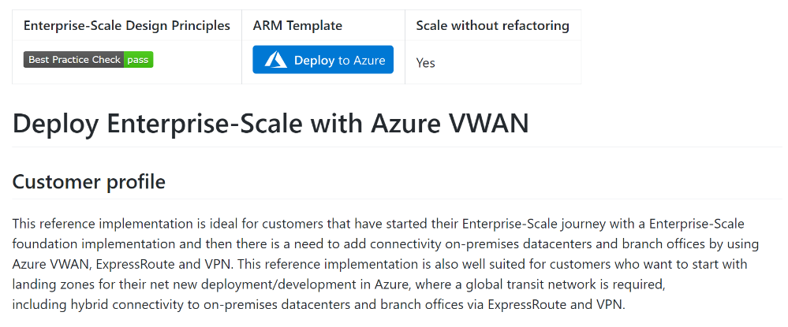

2. Click on the Deploy to Azure button.

    

3. Ensure your user (or the user you select to authenticate to the Azure portal) has been granted **Tenant Root** `/` access in Azure.

4. On the **Custom deployment** blade, in the Basics section, fill in the **Region** and click on **Next: Enterprise Scale Company Prefix.**

    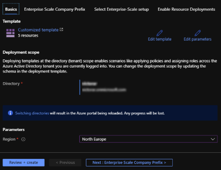

    > **NOTE:**
    > Make sure, that the correct directory is selected

    **Deployment region limitations:** This is the region where the deployment happens. Not the regions the resources will be deployed to. The reference implementation depends on a single region for deployments. You have to configure this region later when we configure the regions for the GitHub Actions and the CI/CD pipeline.

5. On the **Enterprise Scale Company Prefix** section, provide a company prefix (for this document, we will use **ES** as the prefix, but you can choose the prefix of your preference).

    > **NOTE:**
    > Please note that as an optional parameter, you can provide the Subscription ID of an existing and empty Azure subscription if you want it to be dedicated for management.  
    > For this walkthrough, provide a Azure Subscription ID and click on **Next: Select Enterprise-Scale setup**. If you don't provide a Subscription ID on this steps, then you will have to manually move the subscription under the correct Management Group as described on section [Move a subscription to ES-management Management Group](#optional-move-a-subscription-to-es-management-management-group).

    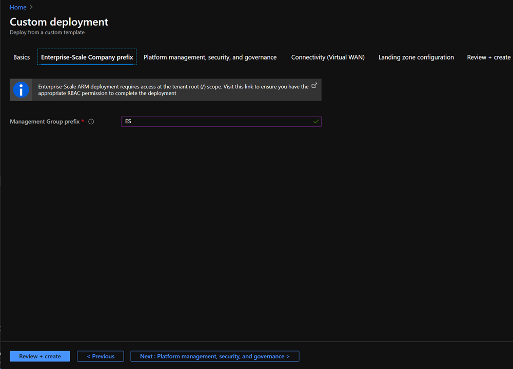

6. On the **Select Enterprise-Scale setup** section, select **VWAN** as a setup model and click on **Next: Enable Resource Deployments**.

    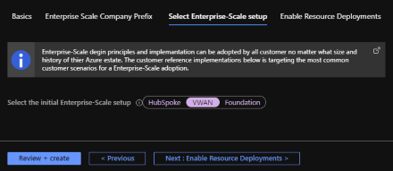

7. On the **Enable Resource Deployments** section, you have two options.

    a. If you select **Yes**, as part of the template deployment ARM will assign two policies to enable auditing in your environment, sending logs to the Log Analytics workspace for platform monitoring. If you select **Yes**, then you can skip the following steps on this guide: [Assign the Log Analytics policy](./use-git-pipeline.md#optional-assign-the-log-analytics-policy) and [Assign the diagnostics policy using GitHub actions](./use-git-pipeline.md#optional-Assign-the-diagnostics-policy-using-github-actions) (as template deployment will perform these actions).
    b. If you select **No**, then the template deployment will not assign the policies to create the Log Analytics workspace and to enable auditing on the environment. Hence, you will need to perform the following steps described on this guide: [Assign the Log Analytics policy](./use-git-pipeline.md#optional-assign-the-log-analytics-policy) and [Assign the diagnostics policy using GitHub actions](./use-git-pipeline.md#optional-Assign-the-diagnostics-policy-using-github-actions).

    When you have made your selection (Yes/No), and click on **Next: Review + create**

    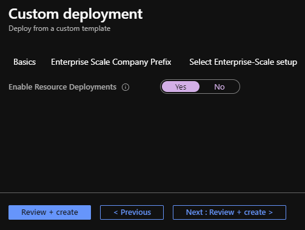

8. After the template has passed the validation click **Create**. This will deploy the initial Management Group structure together with the required Policy/PolicySet definitions. Also, depending on your selections, it will move the subscription under the right Management Group and will also deploy a Log Analytics Workspace and enable platform monitoring. This process will take several minutes to complete.

    > **NOTE:**
    > If you've done previous Enterprise-Scale in-a-box deployments on this AAD tenant, you may get an "Deployment already exists" error. If you get this error, refer to the Deployment region section under Troubleshooting.  
    > There is a known issue, and in very few instances this process may fail when deploying PolicySet definitions. If you experience this problem, simply re-deploy the Template with the exact same parameters as you selected in your original deployment. You must select same region where you create first deployment.

    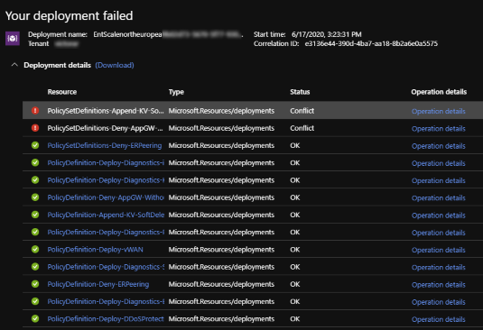

9. Once the deployment completes successfully, in the Azure Portal type **Management Groups** into the search box and open the **Management Groups** blade and click on the **ES** Management Group. You should see the following Management Group in your environment:

    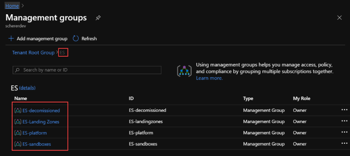

    > **NOTE:**
    > Under **ES-platform** and **ES-Landing Zones** Management Group scope there are additional Management Groups deployed. The **ES-management** Management Group that we will use on this guide is under the ES-platform Management Group.

10. In the **ES** Management Group click on **details** and then **Policies** and select the **Definitions** blade.

11. In the **Policy | Definitions** blade, under **Type**, select **Custom**. If the deployment was successful, you will see a list of Initiative and policy definitions as shown below.

    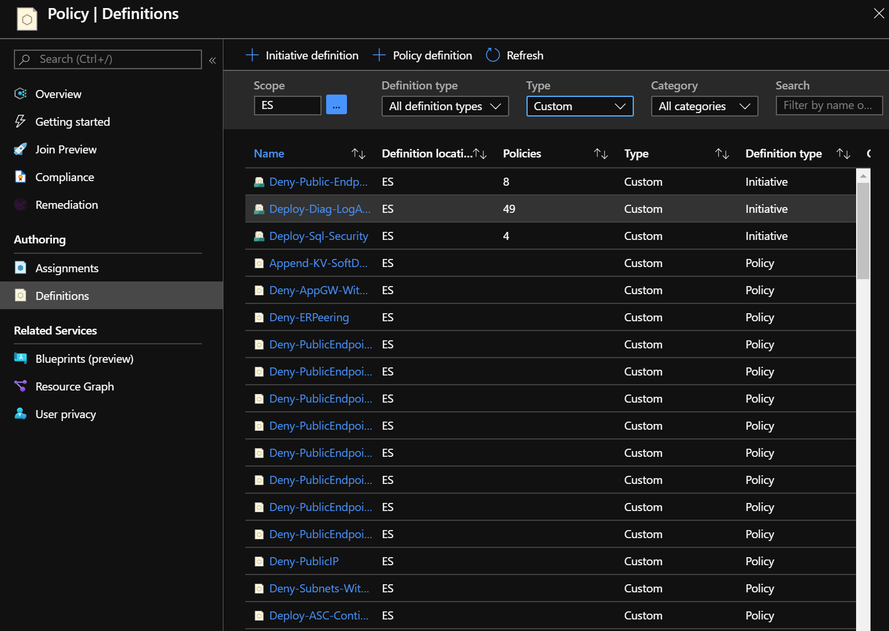

## (Optional) Move a subscription to ES-management Management Group

Only execute this section if you did not provide your Azure subscription ID in section **1.2 Deploy the Management Group structure and policy/PolicySet definitions** section.

In this section, we will move your Azure subscription under the **ES-management** Management Group you created with the template deployment. For simplicity, we will use the portal in this exercise.

1. In the Azure portal, in the **Management Groups** page, click on the **ES-management** (under ES-Platform) Management Group. Click **details**:

    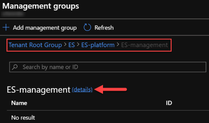

    In the details page, click **+ Add subscription**:

    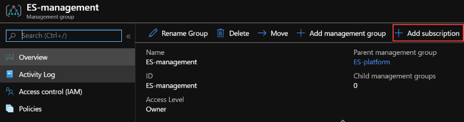

2. In the **Add subscription** page, select your Azure subscription in the Subscription list and click **Save**.

    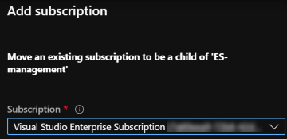

3. The subscription will be displayed under the Management Group once it has been moved, as shown below.

    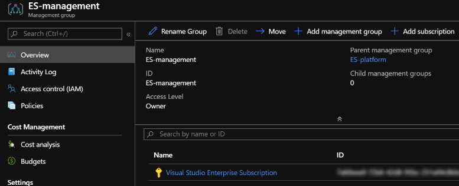

## Next steps

Once the Management Group structure and Policy/policySet definitions have been deployed, and your Azure subscription has been moved under the **ES-management** Management Group, you can proceed to the next step by [setting the GitHub environment](./setup-git-cicd.md).
