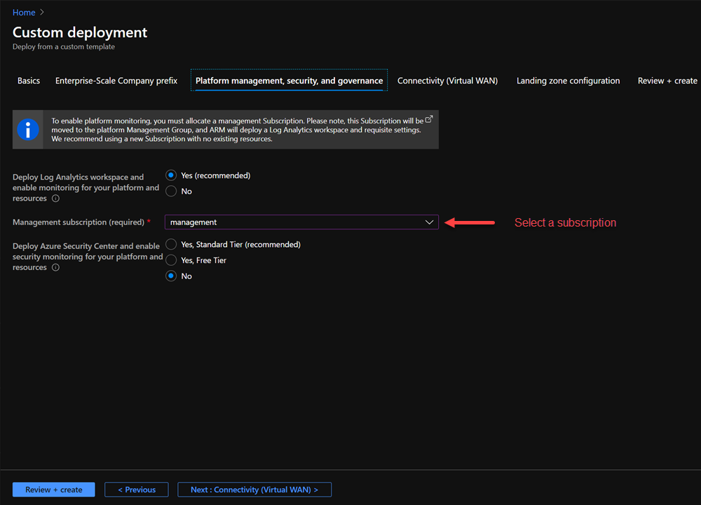
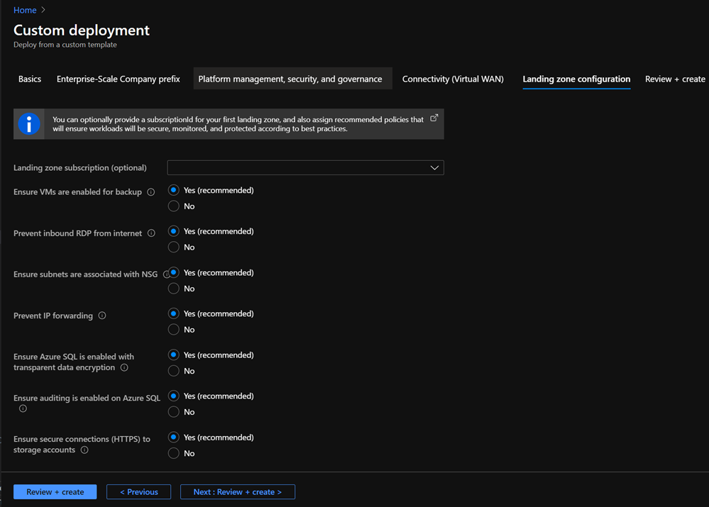
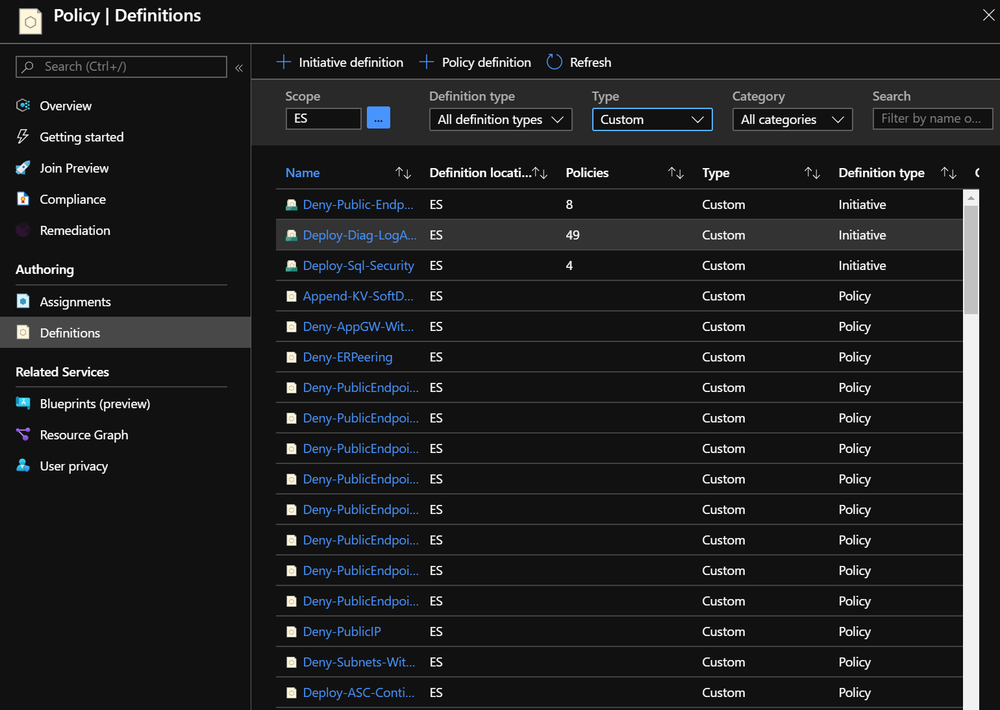

# Enterprise-Scale "in-a-box" deployment

Enterprise-Scale-in-a-box reference implementaion is a three-step hands on exercise.

In the first step you will (**Deploy your tenant**), then [**Setup a GitHub CI/CD Pipeline**](./setup-git-cicd.md), and finally [**Use GitHub to deploy changes to your Enterprise-scale architecture**](./use-git-pipeline.md). We'll walk you through the setup of an DevOps pipeline based on GitHub Actions to accomplish the provisioning of Azure Policy assignments.

The **Deploy your tenant** exercise initializes a new Enterprise-Scale (ES) Management Group structure and all custom Azure Policy and PolicySet (aka Policy Initiative) definitions at the ES Management Group scope.

## Deploy your Tenant

This section is used to setup the exact environment you see in the [reference implementation](../reference/contoso/Readme.md) for the Enterprise-Scale approach, including the Management Group schema in [deploy new policy assignments](../Deploy/deploy-new-policy-assignment.md#deployment-artifact-overview) and the policy definitions and assignments listed [here](../../azopsreference/3fc1081d-6105-4e19-b60c-1ec1252cf560%20(3fc1081d-6105-4e19-b60c-1ec1252cf560)/contoso%20(contoso)/.AzState).

Execute the following steps to deploy this environment in your Azure Tenant/Subscription.

### Deploy the Management Group structure and policy/PolicySet definitions

In this section you are deploying the foundational Management Group structure as well as the policy and PolicySet definitions. To deploy this we will use the [Contoso reference implementation](../reference/contoso/Readme.md)
ARM template.

1. In a browser, navigate to the [Contoso reference implementation](../reference/contoso/Readme.md) in the Enterprise-Scale GitHub repository.

    

2. Click on the Deploy to Azure button.

    

3. Ensure your user (or the user you select to authenticate to the Azure portal) has been granted **Tenant Root** `/` access in Azure by following guidance on [configuring Azure permissions for ARM tenant deployments](../EnterpriseScale-Setup-azure.md).

4. On the **Custom deployment** blade, in the Basics section, fill in the **Region** and click on **Next: Enterprise Scale Company Prefix.**

    

    > **NOTE:**
    > Make sure, that the correct directory is selected

    **Deployment region limitations:** This is the region where the deployment happens. Not the regions the resources will be deployed to. The reference implementation depends on a single region for deployments. You have to configure this region later when we configure the regions for the GitHub Actions and the CI/CD pipeline.

5. On the **Enterprise Scale Company Prefix** section, provide a company prefix (for this document, we will use **ES** as the prefix, but you can choose the prefix of your preference). Please click **Next: Platform management, security and governance** to move to the next section.

    

6. On the **Platform management, security and governance** section management subscription and policies need to be configured. For this tutorial the following options are required:

   - Set **Deploy Log Analytics workspace and enable monitoring** to **Yes (recommended)**
   - Select your **management** subscription
   - Set **Deploy Azure Security Center** to **No**. _This is not recommended outside of this tutorial._

    

    Click now on **Next: Connectivity (Virtual WAN)** to move to the next section.

>Note: If Deploy Log Analytics are not selected (option:   **No**), then the template deployment will not assign the policies to create the Log Analytics workspace and to enable auditing on the environment. Hence, you will need to perform the following steps described on this guide: [Assign the Log Analytics policy](./use-git-pipeline.md#optional-assign-the-log-analytics-policy) and [Assign the diagnostics policy using GitHub actions](./use-git-pipeline.md#optional-Assign-the-diagnostics-policy-using-github-actions).

7. On the **Connectivity (Virtual WAN)** continue with the default setting **Deploy Virtual VWAN** = **No**. The connectivity policies will be assigned later in this tutorial using the AzOps CI/CD pipeline.
Click now on **Next: Next: Landing zone configuration** to move to the next section.

8. As part of this tutorial we don't deploy any landing zone. In the **Landing zone configuration** section, your tenant will be enabled to host workload Landing Zones. Configure the section as illustrated in the following screenshot this will deploy the chosen policy assignment at the Landing Zone scope and leave the Landing zone subscription empty:

    

    Click now on **Next : Review + create** to move to the next section.

9. After the template has passed the validation click **Create**. This will deploy the initial Management Group structure together with the required Policy/PolicySet definitions. It will also move the subscription under the right Management Group and will also deploy a Log Analytics Workspace and enable platform monitoring. This process will take several minutes to complete.

    > Note: If you've done previous Enterprise-Scale in-a-box deployments on this AAD tenant, you may get an "Deployment already exists" error. If you get this error, refer to the Deployment region section under Troubleshooting.  
    > In very few instances this process may fail when deploying PolicySet definitions. If you experience this problem, simply re-deploy the template with the exact same parameters as you selected in your original deployment.

    

10. Once the deployment completes successfully, in the Azure Portal type **Management Groups** into the search box and open the **Management Groups** blade and click on the **ES** Management Group. You should see the following Management Group in your environment:
    

    > **NOTE:**
    > Under **ES-platform** and **ES-Landing Zones** Management Group scope there are additional Management Groups deployed. The **ES-management** Management Group that we will use on this guide is under the ES-platform Management Group.

11. In the **ES** Management Group click on **details** and then **Policies** and select the **Definitions** blade.

12. In the **Policy | Definitions** blade, under **Type**, select **Custom**. If the deployment was successful, you will see a list of Initiative and policy definitions as shown below.
    

## (Optional) Move a subscription to ES-management Management Group

Only execute this section if you did not provide your Azure subscription in **Platform management, security and governance** section in the [**Deploy the Management Group structure and policy/PolicySet definitions**](#deploy-the-management-group-structure-and-policypolicyset-definitions) step.

In this section, we will move your Azure subscription under the **ES-management** Management Group you created with the template deployment. For simplicity, we will use the portal in this exercise.

1. In the Azure portal, in the **Management Groups** page, click on the **ES-management** (under ES-Platform) Management Group. Click **details**:

    

    In the details page, click **+ Add subscription**:

    

2. In the **Add subscription** page, select your Azure subscription in the Subscription list and click **Save**.

    

3. The subscription will be displayed under the Management Group once it has been moved, as shown below.

    

## Next steps

Once the Management Group structure and Policy/policySet definitions have been deployed, and your Azure subscription has been moved under the **ES-management** Management Group, you can proceed to the next step by [setting the GitHub environment](./setup-git-cicd.md).
