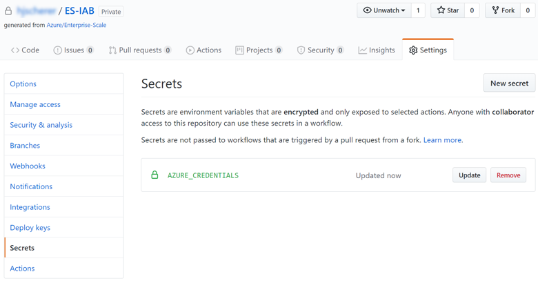
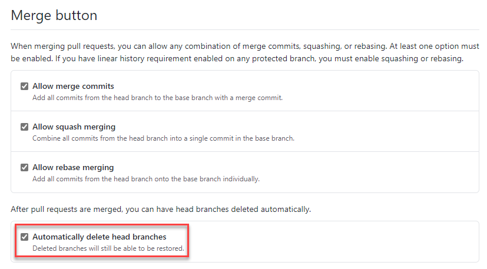
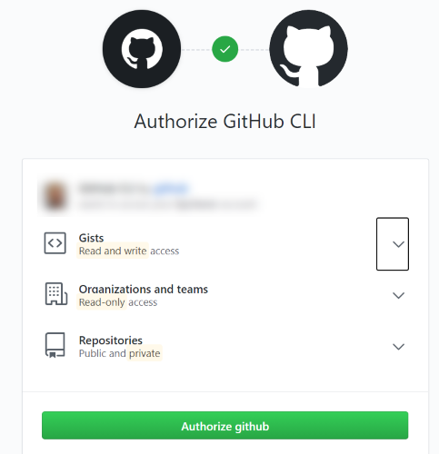
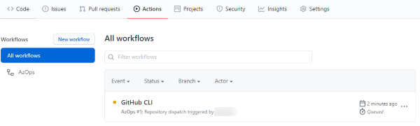
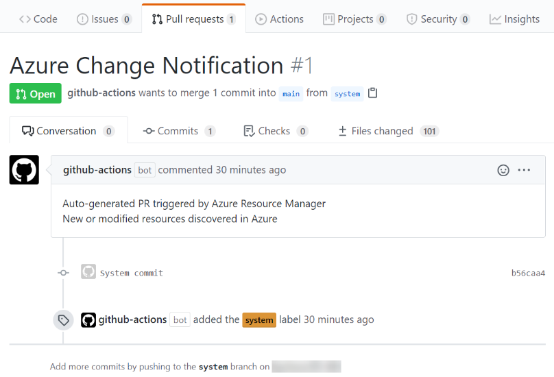
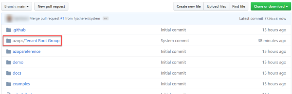
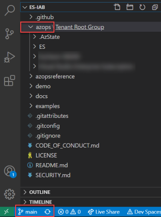
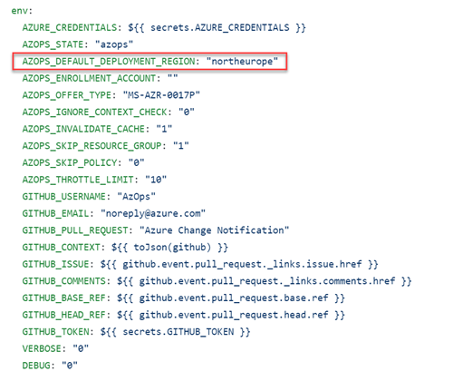

# Setup GitHub Action for CI/CD

One of the **design goals of** the Enterprise-Scale reference implementation is to allow customers to transition between using the Azure Portal and Infrastructure-as-code seamlessly. Although the previous exercise used an ARM template to deploy the necessary Management Group hierarchy and Policy definitions in Azure, it did not really provide a way to manage changes made after initial deployment.

In this exercise you will learn how to fully use the Enterprise-Scale GitHub repository to create a DevOps pipeline using GitHub Actions for deploying resources to Azure, and reconcile changes made through tools outside the DevOps pipeline.

To better understand this process, in this section you will leverage the **ES-management** Management Group that was created in the previous step [Deploy the Management Group structure and policy/PolicySet definitions](./deploy-tenant.md#deploy-the-management-group-structure-and-policypolicyset-definitions) and an Azure subscription which has been moved under it. We will now be leveraging your GitHub repository to discover the contents of your tenant, and save your Azure environment in a GitHub repository, make changes to it and then get them deployed to your Azure environment.

## Configure GitHub

In this section we will configure GitHub and run a discovery process of your Azure environment to initialize your GitHub repository with the current state of your environment. Once the current state is represented in your GitHub repository, we will be able to deploy resources by using infrastructure-as-code directly via GitHub Actions. Discovery is a one-time process to ensure the current baseline is established.

The Discovery/Initialization process will run entirely on GitHub. Follow these steps below to initialize:

1. In **Visual Studio Code**, click **Terminal > New Terminal**.

2. In the **TERMINAL WINDOW (PowerShell 7)** or any other **PowerShell 7** shell, execute the following command to log into your Azure tenant by using your Azure AD tenant admin account. Follow [this instructions here](../Deploy/setup-github.md#setup-github-and-azure-for-enterprise-scale) to enable your Azure AD tenant admin to access resources.

    ```PowerShell
    Connect-AzAccount -TenantId <your-tenant-id>
    ```

3. After you login, run the command below to create a service principal to be used for the GitHub integration. Make sure the **DisplayName** for the service principal is unique within your tenant.

    ```PowerShell
    $servicePrincipal = New-AzADServicePrincipal -Role Owner -Scope "/" -DisplayName es-<yourAlias>
    ```

4. Run the command below to retrieve the necessary information from the service principal that needs to be added to GitHub to integrate the git workflow with your Azure environment.

    ```PowerShell
    [ordered]@{
        clientId = $servicePrincipal.ApplicationId
        displayName = $servicePrincipal.DisplayName
        name = $servicePrincipal.ServicePrincipalNames[1]
        clientSecret = [System.Net.NetworkCredential]::new("",$servicePrincipal.Secret).Password
        tenantId = (Get-AzContext).Tenant.Id
        subscriptionId = (Get-AzContext).Subscription.Id
    } | ConvertTo-Json
    ```

5. Copy the output of the command above, you will need it to setup credentials in GitHub.

6. In your GitHub repo, click **Settings > Secrets**, and then click **New secret**.

    

7. Create a secret as described below.

    Name: **AZURE_CREDENTIALS**

   Paste the information that you got in the clipboard (the outcome from the last PowerShell step you executed). The outcome should look like this:

   ```PowerShell
   [ordered]@{
   "clientId":       $servicePrincipal.ApplicationId,
   "displayName":    $servicePrincipal.DisplayName,
   "name":           $servicePrincipal.ServicePrincipalNames[1],
   "clientSecret":   [System.Net.NetworkCredential]::new("", $servicePrincipal.Secret).Password,
   "tenantId":       (Get-AzContext).Tenant.Id,
   "subscriptionId": (Get-AzContext).Subscription.Id
   } | ConvertTo-Json
   ```

8. Once the secrets is created, you should see the following entries in the **Secrets** window.

    

9. In your GitHub repo, navigate to the main page of the repository. Click on **Settings** and scroll down to the **Merge button** section. Ensure the **Automatically delete head branches** option is selected.

    

10. Now, we will run discovery, based on GitHub Actions, to discover existing Azure environment and initialize your GitHub repo. This uses the GitHub Actions `workflow_dispatch` trigger. This requires the latest `.github/workflows/azops.yml` file containing the `workflow_dispatch` section in the current repo.

    Go to the **Actions** tab in your GitHub repository and select the **AzOps** workflow. Click on **Run workflow**, select _Branch: main_ and _Action to trigger = pull_ and start the process with **Run workflow** button.

    

    > **NOTE:**
    >If you prefer, execute the discovery process via commandline as described on this [article](../Deploy/discover-environment.md).

11. You should now see an GitHub Action running with the name **AzOps**.

    

    > **NOTE:**
    > If the discovery process fails, just re-run discovery by executing the command line from the previous step.

12. The GitHub Action in the previous step will create the following artifacts in your GitHub repository:

    - Current Management Group, Subscriptions, Policy Definitions and Policy Assignments are discovered, and RESTful representation of the resources are saved as ARM Template parameters file.

    - It will create **system** branch representing your current configuration as ARM template parameter file.

    - Create a Pull Request (PR) with the name Azure Change Notification **(system->main)**

13. Select the **Pull Request** tab in your GitHub repository and if everything looks good, go ahead and merge **system** branch to the **main** branch. Once successfully merged, delete the **system** branch.

    

    With this step you have completed the discovery and your **main** branch should contain an **azops** folder with a RESTful representation of the resources as ARM Template parameters file.

    

14. **Pull** the changes in the main branch to your local clone by launching the command palette **(CTRL + SHIFT + P)** in **Visual Studio Code** and type `Git: Pull` then press **Enter**. Alternatively, you can select the main branch at the bottom-left section in Visual Studio Code and then click on the Sync icon as depicted in the picture below.

    

## Configure default deployment regions

The ARM template deployment will be performed via GitHub Actions to a single region where the deployments will happen. This region needs to be the same you used for the initial ARM template deployment in step 4 in section [Deploy the Management Group structure and policy/PolicySet definitions](./deploy-tenant.md#deploy-the-management-group-structure-and-policypolicyset-definitions).

Please perform the following steps to configure the region for the template deployment:

1. Open the file **azops.yml** in the folder **/**.**github/workflows** in your Visual Studio Code.

2. Change the **AZOPS_DEFAULT_DEPLOYMENT_REGION** attribute in the **env** section of the yml file.

    

    For example, for a deployment in the North Europe Azure region, you would provide:

    `AZOPS_DEFAULT_DEPLOYMENT_REGION: "northeurope"`

    Since deployment names have to be unique across regions, you must select the region that you have used in portal to bootstrap Enterprise-Scale environment.

3. Commit changes to the main branch by launching the command palette **(CTRL + SHIFT + P)** in **Visual Studio Code** and type `Git: Commit` then press **Enter** and push it to your GitHub repository (remote) **(CTRL + SHIFT + P)** in **Visual Studio Code** and type `Git: push` then press **Enter**.

## Next steps

For the deployment using the GitHub CI/CD pipeline continue to the [next section](./use-git-pipeline.md).
