# Using GitHub to deploy changes to your Enterprise-Scale architecture

Now that your DevOps environment and Azure tenant is setup using an all-encompassing [ARM Template](https://github.com/Azure/AzOps/blob/main/template/e2e-landing-zone-vwan-orchestration.parameters.json), you can make changes to the environment by using the Azure portal, the Azure CLI, PowerShell, or third-party tools that make use of the Azure Resource Manager API. Reconciling these changes back into your all-encompassing ARM template is not an easy task. One of the design goals on the Enterprise-Scale reference implementation is to provide a mechanism for reconciling changes.

The Enterprise-Scale reference implementation leverages the GET and PUT schema used by Azure resources to export and import the state of an Azure environment. One of the benefits of this implementation approach is that regardless of how changes are made (Portal, CLI, PowerShell, ARM Template), you can consistently retrieve the current state of your Azure environment and version control it in Git as for Infrastructure-as-Code. This mechanism is the foundation of how configuration drift and reconciliation is achieved to provide an Enterprise-Scale approach to the operations of an Azure environment.

By using the Enterprise-Scale reference implementation, environment can be definde based on Enterprise-Scale design principles and Management Group hierarchy and policies based on reference [artifacts](../../azopsreference/3fc1081d-6105-4e19-b60c-1ec1252cf560%20(3fc1081d-6105-4e19-b60c-1ec1252cf560)/contoso%20(contoso)/.AzState).

Reference artifacts are ARM template parameter files that can be used with a [generic ARM template](https://github.com/Azure/AzOps/blob/main/template/tenant.json).

In subsequent exercises, we will continue to construct an Enterprise-Scale reference implementation in your own environment by following these high-level steps:

Use GitHub Actions to deploy policy assignments:

* (Optional) Creates management resources.
  
* (Optional) Collect Azure Activity Logs in to Log Analytics.

* (Optional) Enable Diagnostic Policy to enable monitoring.

* Author policy assignment ARM template to declare goal state of **connectivity** subscription (please note that the resources deployed on this step will cause additional cost on your subscription).

    a. Create vWAN

    b. Create Firewall Policy

    c. Create vHUB

> Note:
> To execute the steps above, you will assign policies to the **ES-management** Management Group. In an environment with multiple subscriptions, some policies are assigned to **Connectivity** and **Landing Zones** Management Group scopes.

## (Optional) Assign the Log Analytics policy

Only execute this section in case you selected **No** for the **Deploy Log Analytics workspace** in **Platform management, security and governance** section of the [**Deploy the Management Group structure and policy/PolicySet definitions**](#Deploy-the-Management-Group-structure-and-policy/PolicySet-definitions) step.

In the previous exercises you deployed policy and initiative (policy set) definitions in your Management Group with the reference implementation ARM template. However, these policies have not been assigned yet, and are not in use. In this exercise you will assign the initiative used for the **management** subscription in an Enterprise-Scale architecture deployment. To assign this initiative, execute the following steps.

1. Create a new feature branch. One way to create a feature branch from Visual Studio Code is by launching the command palette **(CTRL + SHIFT + P)** and select **Git: Create Branch...**

    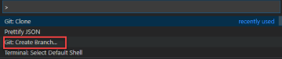

    Provide a name to the branch and hit enter.

2. Copy the file `Microsoft.Authorization_policyAssignments-Deploy-Log-Analytics.parameters.json` from the folder `azopsreference\3fc1081d-6105-4e19-b60c-1ec1252cf560 (3fc1081d-6105-4e19-b60c-1ec1252cf560)\contoso (contoso)\platform (platform)\management (feab2d15-66b4-438b-accf-51f889b30ec3)\.AzState` into the `.AzState` folder of the `ES-management` management group folder. (e.g. `azops\Tenant Root Group (<tenant-id>)\ES (ES)\ES-platform (ES-platform)\ES-management (ES-management)\.AzState`

3. Change the following attributes highlighted in the copied file as  described in the table below:

    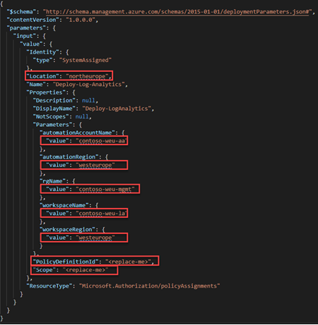

    | Attribute             | Value |
    | :--                   | :--  |
    | Location          | `<AzureRegion>` (where the managed service identity for this policy assignment will be created) |
    | Scope                 | `/providers/Microsoft.Management/managementGroups/ES-management` |
    | PolicyDefinitionId    | `/providers/Microsoft.Management/managementGroups/ES/providers/Microsoft.Authorization/policyDefinitions/Deploy-Log-Analytics` |
    | workspaceName         | `<yourLAWorkspaceName>` |
    | automationAccountName | `<yourAutomationAccountName>` |
    | workspaceRegion       | `<AzureRegion>` |
    | automationRegion      | `<AzureRegion>` |
    | rgName      | `<resourceGroupName` |

4. Commit changes to the **feature** branch `Git: commit` and sync changes to your remote GitHub repository `Git: Push`

5. Create a Pull Request `Git: Pull`, `Git: Publish` **feature** branch to the **main** branch, and wait until the wait for the AzOps push/pull action to complete successfully. Once successfully completed go ahead and merge the changes into **main**. The feature branch can be deleted after the successful merge.

    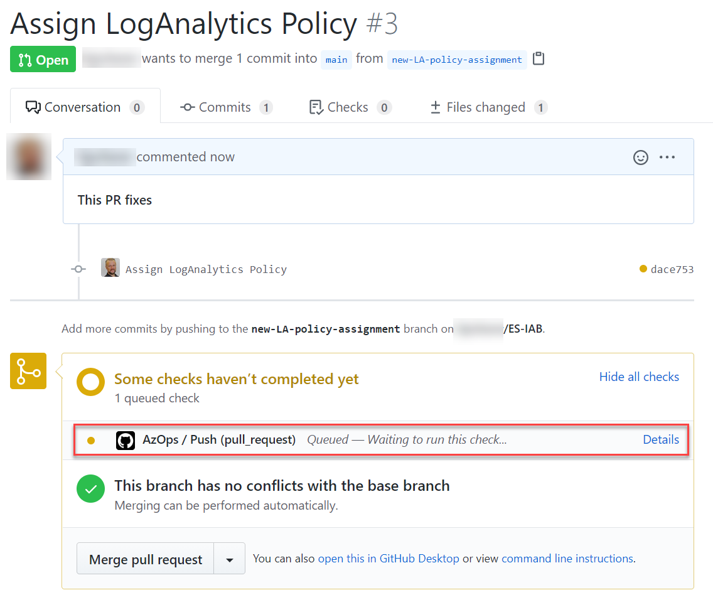

    Once the policy is deployed with this pipeline the AzOps push process will also ensure policy compliance. The platform will evaluate compliance state. This will take some time (from minutes up to multiple hours) once the compliance state is evaluated you can remediate out of compliance resources via portal or follow [this instruction](./troubleshooting.md#Deploy-resource-specified-in-DINE-policies) and kickstart the process.

    Once the policy is remediated, in the Azure Portal select the **ES-management** management and then click on **details** and then click on **Policies**:

    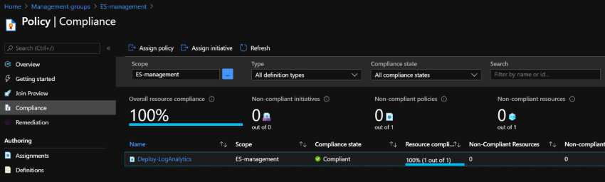

    Now check the resource groups in your subscription and you should find the resource group with the two resources (Log Analytics Workspace, Automation Account) deployed:

    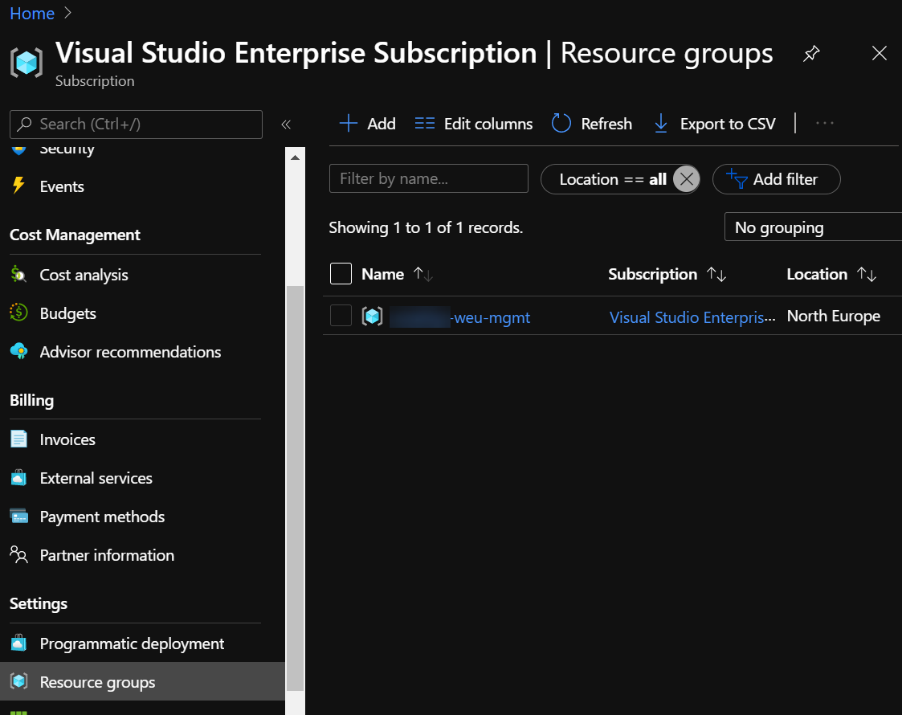

## (Optional) Assign the diagnostics policy using GitHub actions

Only execute this section in case you selected **No** for the **Deploy Log Analytics workspace** in **Platform management, security and governance** section of the [**Deploy the Management Group structure and policy/PolicySet definitions**](#Deploy-the-Management-Group-structure-and-policy/PolicySet-definitions) step.

We will use GitHub Actions to assign the **Collect Azure Activity Logs in to Log Analytics and Enable Diagnostic** policy to enable monitoring.

1. Pull latest master branch locally by running ```git checkout main``` and ```git pull```

2. Create a new feature branch and give it a descriptive name (i.e. **policy-assignment-monitoring**). Checkout this new branch, ```git checkout <new-branch-name>```

3. Copy the file `Microsoft.Authorization_policyAssignments-Deploy-Diag-ActivityLog.parameters.json` from the folder `azopsreference\3fc1081d-6105-4e19-b60c-1ec1252cf560 (3fc1081d-6105-4e19-b60c-1ec1252cf560)\contoso (contoso)\.AzState` into the `.AzState` folder of the `ES` management group folder. (e.g. `azops\Tenant Root Group (<tenant-id>)\ES (ES)\.AzState`

4. Change the following attributes highlighted in the copied file as described in the table below:

    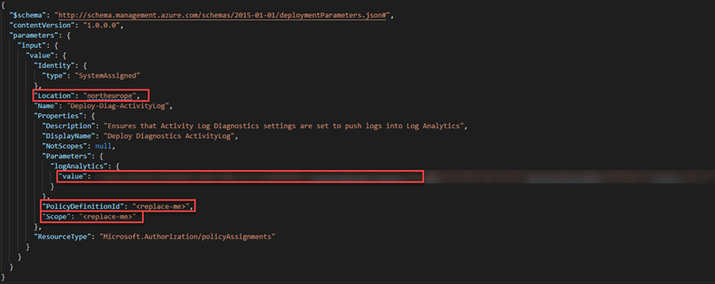

    | Attribute          | Value |
    | :--                | :--  |
    | Location       | `<AzureRegion>` (where the managed service identity for this policy assignment will be created) |
    | Scope              | `/providers/Microsoft.Management/managementGroups/ES` |
    | PolicyDefinitionId | `/providers/Microsoft.Management/managementGroups/ES/providers/Microsoft.Authorization/policyDefinitions/Deploy-Diagnostics-ActivityLog` |
    | logAnalytics/value | `/subscriptions/<subscription-id>/resourcegroups/<resourcegroupname>/providers/microsoft.operationalinsights/workspaces/<loganalyticswsname>` |

5. Commit changes to your feature branch and create a pull request.

6. **Wait for deployment to succeed** and merge pull request to **main** branch. The **feature** branch can be deleted after the successful merge.

    In this section we deployed the DINE policy for Diagnostics ActiveLogs settings for all subscriptions under the `ES` Management Group. The platform will evaluate compliance state. This will take some time (from minutes up to multiple hours) once the compliance state is evaluated you can remediate out of compliance resources via portal or follow [this instruction](./troubleshooting.md#Deploy-resource-specified-in-DINE-policies) to kickstart the process.

    Once the policy is remediated the following Diagnostics settings should be deployed:

    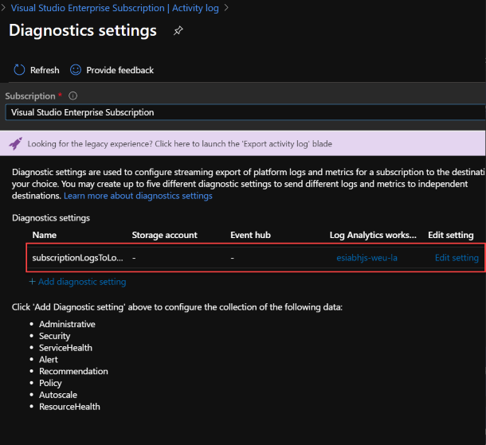

    >Note: It is important to note that if this policy assignment is specified at Management Group scope, all future subscription that move under the scope of this Management Group will automatically monitoring and diagnostics settings be enabled without any custom orchestration. In our case, all subscription existing under the **ES** (company root) Management Group scope will be enabled. That is a design goal of Enterprise-Scale reference implementation.

## Assign the connectivity policies

In this section, we will focus on enabling networking for landing zones. In this tutorial, we only have a single subscription in the **ES-management** Management Group. In environments with multiple subscriptions, you would assign these policies at the **Connectivity** Management Group scope.

Please follow the instructions from the previous sections to use git to assign policies as required in the steps below. You can obtain the sample policy assignments from [this](../../azopsreference/3fc1081d-6105-4e19-b60c-1ec1252cf560%20(3fc1081d-6105-4e19-b60c-1ec1252cf560)/contoso%20(contoso)/platform%20(platform)/connectivity%20(99c2838f-a548-4884-a6e2-38c1f8fb4c0b)/.AzState) link or from your local Git repository under `azopsreference\3fc1081d-6105-4e19-b60c-1ec1252cf560 (3fc1081d-6105-4e19-b60c-1ec1252cf560)\contoso (contoso)\platform (platform)\connectivity (99c2838f-a548-4884-a6e2-38c1f8fb4c0b)\.AzState`.

We will make policy assignments via GitHub Action process on these steps.

1. Assign the **Deploy-vWAN** and **Deploy-FirewallPolicy** policies to the **ES-management** Management Group:

    a. Pull latest master branch locally by running ```git checkout main``` and ```git pull```

    b. Create a new feature branch and give it a descriptive name (i.e. **policy-assignment-vwan**). Checkout this new branch, ```git checkout <new-branch-name>```

    c. Copy the file `Microsoft.Authorization_policyAssignments-Deploy-vWAN.parameters.json` from the folder `azopsreference\3fc1081d-6105-4e19-b60c-1ec1252cf560 (3fc1081d-6105-4e19-b60c-1ec1252cf560)\contoso (contoso)\platform (platform)\connectivity (99c2838f-a548-4884-a6e2-38c1f8fb4c0b)\.AzState` into the `.AzState` folder of the `ES-management` management group folder. (e.g. `azops\Tenant Root Group (<tenant-id>)\ES\ES-platform\ES-management\.AzState`

    d. Change the following attributes highlighted in the copied file as  described in the table below:

    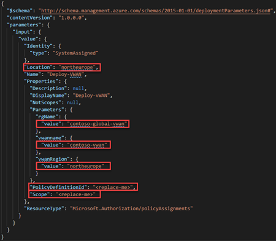

    | Attribute          | Value |
    | :--                | :-- |
    | Location       | `<AzureRegion>` (where the managed service identity for this policy assignment will be created) |
    | Scope              | `/providers/Microsoft.Management/managementGroups/ES-management` |
    | PolicyDefinitionId | `/providers/Microsoft.Management/managementGroups/ES/providers/Microsoft.Authorization/policyDefinitions/Deploy-vWAN` |
    | vwanName           | `<yourVWANname>`|
    | vwanRegion         | `<AzureRegion>` |
    | rgName             | `<yourRGname>` |

    e. Copy the file `Microsoft.Authorization_policyAssignments-Deploy-FirewallPolicy.parameters.json` from the folder `azopsreference\3fc1081d-6105-4e19-b60c-1ec1252cf560 (3fc1081d-6105-4e19-b60c-1ec1252cf560)\contoso (contoso)\platform (platform)\connectivity (99c2838f-a548-4884-a6e2-38c1f8fb4c0b)\.AzState` into the `.AzState` folder of the `ES-management` management group folder. (e.g. `azops\Tenant Root Group (<tenant-id>)\ES\ES-platform\ES-management\.AzState`

    

    | Attribute          | Value |
    | :--                | :-- |
    | Location           | `<AzureRegion>` (where the managed service identity for this policy assignment will be created) |
    | Scope              | `/providers/Microsoft.Management/managementGroups/ES-management` |
    | PolicyDefinitionId | `/providers/Microsoft.Management/managementGroups/ES/providers/Microsoft.Authorization/policyDefinitions/Deploy-FirewallPolicy` |
    | firewallPolicyName | `<yourFirewallPolicyname>` |
    | fwpolicy/location  | `<AzureRegion>` |
    | fwPolicyRegion     | `<AzureRegion>` |
    | rgName             | `<yourRGname>` |


    f. Commit changes to your feature branch and create a pull request.

    g. Wait for deployment to succeed and merge pull request to **main** branch. **Feature** branch can be deleted after the successful merge.

    h. In this section we deployed the DINE policy for a VWAN resource. This policy ensures that the VWAN and firewall policies are deployed in a compliant way. The platform will evaluate compliance state. This will take some time (from minutes up to multiple hours) once the compliance state is evaluated you can remediate out of compliance resources via portal or follow [this instruction](./troubleshooting.md#Deploy-resource-specified-in-DINE-policies) to kickstart the process.

    Once the policy is remediated the following resources should be deployed:

    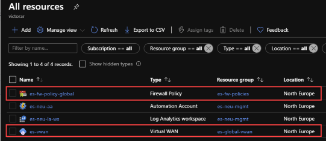

2. Assign the **Deploy-vHUB** policy to the **ES-management** Management Group:

    a. Pull latest master branch locally by running ```git checkout main``` and ```git pull```

    b. Create a new feature branch and give it a descriptive name (i.e.   **policy-assignment-vhub**). Checkout this new branch, ```git checkout <new-branch-name>```

    c. Copy the file `Microsoft.Authorization_policyAssignments-Deploy-vHUB-NEU.parameters.json` from the folder `azopsreference\3fc1081d-6105-4e19-b60c-1ec1252cf560 (3fc1081d-6105-4e19-b60c-1ec1252cf560)\contoso (contoso)\platform (platform)\connectivity (99c2838f-a548-4884-a6e2-38c1f8fb4c0b)\.AzState` into the `.AzState` folder of the `ES` management group folder. (e.g. `azops\Tenant Root Group (<tenant-id>)\ES\ES-platform\ES-management\.AzState`

    d. Change the following attributes highlighted in the copied file as  described in the table below:

    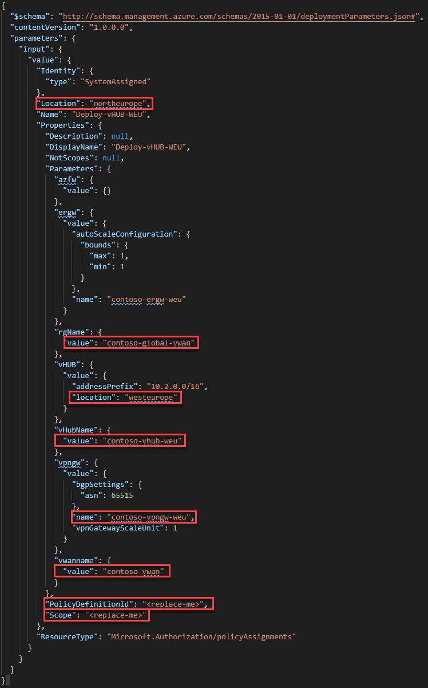

    | Attribute              | Value |
    | :--                    | :--  |
    | Location           | `<AzureRegion>` (where the managed service identity for this policy assignment will be created) |
    | Scope                  | `/providers/Microsoft.Management/managementGroups/ES-management` |
    | PolicyDefinitionId     | `/providers/Microsoft.Management/managementGroups/ES/providers/Microsoft.Authorization/policyDefinitions/Deploy-vHUB` |
    | vwanName               | Provide the VWAN name that you created in the previous step |
    | vhubname               | `<yourVHUBname>` |
    | vhub -> location       | `<AzureRegion>` |
    | vpngw -> name          | `<yourVPNGatewayname>` |
    | rgName                 | Provide the resource group name where you created the VWAN in the previous step |

    e. Commit changes to your feature branch and create a pull request.

    f. **Wait for deployment to succeed** and merge pull request to **main** branch. **Feature** branch can be deleted after the successful merge.

    g. In this section we deployed the DINE policy for a VHUB resource. This policy ensures that the VHUB will be deployed in a compliant way. The platform will evaluate compliance state. This will take some time (from minutes up to multiple hours) once the compliance state is evaluated you can remediate out of compliance resources via portal or follow [this instruction](./troubleshooting.md#Deploy-resource-specified-in-DINE-policies) to kickstart the process.

    Once the policy is remediated the following resources should be deployed:

    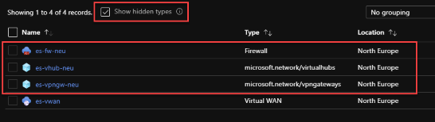

## Summary

At this stage you have completed the Enterprise-Scale "in-a-box" tutorial. As described in this tutorial we have used different deployment methods to showcase the Enterprise-Scale 1st party reference implementation. If you want to learn more about the Enterprise-Scale reference implementation use this [**getting started guide**](../Deploy/getting-started.md).
