# What is Enterprise-Scale? 

Enterprise-Scale architecture provides prescriptive guidance coupled with Azure best practices, ; and it follows 5 design principles across the 8 critical design areas for organizations to define their target state for their Azure architecture. Enterprise-Scale will continue to evolve alongside the Azure platform roadmap and is ultimately defined by the various design decisions that organizations must make to define their Azure journey. 

The Enterprise-Scale architecture is modular by design and allow organizations of any size to start with the foundational landing zones that support their application portfolios, and the architecture enables organizations to start as small as needed and scale alongside their business requirements regardless of scale point. 

## What is Enterprise-Scale reference implementation? 

The Enterprise-Scale reference implementations support Azure adoption at scale and provides guidance and architecture based on the authoritative design for the Azure platform as a whole. 

Enterprise-Scale reference implementations are tying together all the Azure platform primitives and creates a proven, well-defined Azure architecture based on a multi-subscription design, leveraging native platform capabilities to ensure organizations can create and operationalize their landing zones in Azure at scale. 

The following table outlines key customer requirements in terms of landing zones, and how it is they are being addressed with Enterprise-Scale: 

| **Key customer landing zone requirement**                    | **Enterprise-Scale reference implementations**               |
| ------------------------------------------------------------ | ------------------------------------------------------------ |
| Timelines to reach security and compliance requirements for a workload | Enabling all recommendations during setup, will ensure resources are compliant from a monitoring and security perspective |
| Provides a baseline architecture using multi-subscription design | Yes, for the entire Azure tenant regardless of customer’s scale-point |
| Best-practices from cloud provider                           | Yes, proven and validated with customers                     |
| Be aligned with cloud provider’s platform roadmap            | Yes                                                          |
| UI Experience and simplified setup                           | Yes, Azure portal                                            |
| All critical services are present and properly configured according to recommend best practices for identity & access management, governance, security, network and logging | Yes, using a multi-subscription design, aligned with Azure platform roadmap |
| Automation capabilities (IaC/DevOps)                         | Yes: ARM, Azure Policy, GitHub/Azure DevOps CI/CD pipeline options included |
| Provides long-term self-sufficiency                          | Yes, enterprise-scale architecture -> 1:N landing zones. Approach & architecture prepare the customer for long-term self-sufficiency;, the RIs reference implementations are there to get you started |
| Enables migration velocity across the organization           | Yes, enterpriseEnterprise-scale Scale architecture -> 1:N landing zones., Architecture includes designs for segmentation and separation of duty to empower teams to act within appropriate landing zones |
| Achieves operational excellence                              | Yes. Enables autonomy for platform and application teams with a policy driven governance and management |

## Pricing 

There’s no cost associated with Enterprise-Scale, and you only pay for the Azure services that are being enabled, and the services your organization will deploy into the landing zones. For example, you don’t pay for the management groups or the policies that are being assigned, but policy to enable Azure Security Center on the landing zone subscriptions will generate cost on those subscriptions. 

## What if I already have an existing Azure footprint? 

Enterprise-Scale reference implementation will meet you where you are, and the design has catered for existing subscriptions and workloads in Azure. 

See the following [article](https://docs.microsoft.com/en-us/azure/cloud-adoption-framework/ready/enterprise-scale/transition) to learn more how you can transition into Enterprise-Scale. 

# How Enterprise-Scale works 

This section describes at a high level how Enterprise-Scale reference implementation works. Your landing zones are the output of a multi-subscription environment for all your Azure services, where compliance, guardrails, security, networking, and identity is provided at scale by the platform. 

## Enterprise-Scale design principles 

The enterprise-scale architecture prescribed in this guidance is based on the design principles described here. These principles serve as a compass for subsequent design decisions across critical technical domains. Familiarize yourself with these principles to better understand their impact and the trade-offs associated with nonadherence. 

## Subscription Democratization 

Subscriptions should be used as a unit of management and scale aligned with business needs and priorities to support business areas and portfolio owners to accelerate application migrations and new application development. Subscriptions should be provided to business units to support the design, development, and testing and deployment of new workloads and migration of existing workloads. 

## Policy Driven Governance 

Azure Policy should be used to provide guardrails and ensure continued compliance with your organization's platform, along with the applications deployed onto it. Azure Policy also provides application owners with sufficient freedom and a secure unhindered path to the cloud. 

## Single Control and Management Plane 

Enterprise-scale architecture shouldn't consider any abstraction layers, such as customer-developed portals or tooling. It should provide a consistent experience for both AppOps (centrally managed operation teams) and DevOps (dedicated application operation teams). Azure provides a unified and consistent control plane across all Azure resources and provisioning channels subject to role-based access and policy-driven controls. Azure can be used to establish a standardized set of policies and controls for governing the entire enterprise application estate in the cloud. 

## Application Centric and Archetype-neutral 

Enterprise-scale architecture should focus on application-centric migrations and development rather than pure infrastructure lift-and-shift migrations, such as moving virtual machines. It shouldn't differentiate between old and new applications, infrastructure as a service, or platform as a service applications. Ultimately, it should provide a safe and secure foundation for all application types to be deployed onto your Azure platform. 

## Azure native design and aligned with platform roadmap 

The enterpriseEnterprise-scale architecture approach advocates using Azure-native platform services and capabilities whenever possible. This approach should align with Azure platform roadmaps to ensure that new capabilities are available within your environments. Azure platform roadmaps should help to inform the migration strategy and enterpriseEnterprise-scale trajectory. 

## Separating platform and landing zones 

One of the key tenets of Enterprise-Scale is to have a clear separation of the Azure *platform* and the *landing zones*. This allows organizations to scale their Azure architecture alongside with their business requirements, while providing autonomy to their application teams for deploying, migrating and doing net-new development of their workloads into their landing zones. This model fully supports workload autonomy and distinguish between central and federated functions. 

## Platform responsibilities and functions 

Platform resource are managed by a cross-functional platform team. The team consist mainly out of the following functions. These functions working in close collaboration with the SME functions across the organization: 

- PlatformOps: Responsible for management and deployment of control plane resource types such as subscriptions, management groups via IaC and the respective CI/CD pipelines. Management of the platform related identify identity resources on Azure AD and cost management for the platform.
     Operationalization of the Platform for an organization is under the responsibility of the platform function. 

- SecOps: Responsible for definition and management of Azure Policy and RBAC permissions on the platform for landing zones and platform management groups and subscriptions. Security operations including monitoring and the definition and the operation of reporting and auditing dashboard. 
- NetOps: Definition and management of the common networking components in Azure including the hybrid connectivity and firewall resource to control internet facing networking traffic. NetOps team is responsible to handout virtual networks to landing zone owners or team. 

## Landing zone owners responsibilities 

Enterprise-scale landing zones supporting a both centralized and federated application DevOps models. Most common model are dedicated **DevOps** team aligned with a single workload. In case of smaller workloads or COTS or 3rd party application a single **AppDevOps** team is responsible for workload operation. Independent of the model every DevOps team manages several workload staging environments (DEV, UAT, PROD) deployed to individual landing zones/subscriptions. Each landing zone has a set of RBAC permissions managed with Azure AD PIM provided by the Platform SecOps team. 

When the landing zones/subscriptions are handed over to the DevOps team, the team is end-to-end responsible for the workload. They can independently operate within the security guardrails provided by the platform team. If dependency on central teams or functions are discovered, it is highly recommended to review the process and eliminated as soon as possible to unblock DevOps teams. 

## Enterprise-Scale Management Group Structure 

The Management Group structure implemented with Enterprise-Scale is as follows: 

- **Top-level Management Group** (directly under the tenant root group) is created with a prefix provided by the organization, which purposely will avoid the usage of the root group to allow organizations to move existing Azure subscriptions into the hierarchy, and also enables future scenarios. This Management Group is parent to all the other Management Groups created by Enterprise-Scale 
- **Platform****:** This Management Group contains all the *platform* child Management Groups, such as Management, Connectivity, and Identity. Common Azure Policies for the entire platform is assigned at this level 

  - **Management:** This Management Group contains the dedicated subscription for management, monitoring, and security, which will host Azure Log Analytics, Azure Automation, and Azure Sentinel. Specific Azure policies are assigned to harden and manage the resources in the management subscription. 

  - **Connectivity:** This Management Group contains the dedicated subscription for connectivity, which will host the Azure networking resources required for the platform, such as Azure Virtual WAN/Virtual Network for the hub, Azure Firewall, DNS Private Zones, Express Route circuits, ExpressRoute/VPN Gateways etcamong others. Specific Azure policies are assigned to harden and manage the resources in the connectivity subscription. 
  - **Identity:** This Management Group contains the dedicated subscription for identity, which is a placeholder for Windows Server Active Directory Domain Services (AD DS) VMs, or Azure Active Directory Domain Services to enable AuthN/AuthZ for workloads within the landing zones. Specific Azure policies are assigned to harden and manage the resources in the identity subscription. 

- **Landing Zones:** This is the parent Management Group for all the landing zone subscriptions and will have workload agnostic Azure Policies assigned to ensure workloads are secure and compliant. 

  - **Online:** This is the dedicated Management Group for Online landing zones, meaning workloads that may require direct internet inbound/outbound connectivity or also for workloads that may not require a VNet.. 
  - **Corp:** This is the dedicated Management Group for Corp landing zones, meaning workloads that requires connectivity/hybrid connectivity with the corporate network thru the hub in the connectivity subscription. 

- **Sandboxes:** This is the dedicated Management Group for subscriptions that will solely be used for testing and exploration by an organization’s application teams. These subscriptions will be securely disconnected from the Corp and Online landing zones. 
- **Decommissioned:** This is the dedicated Management Group for landing zones that are being cancelled, which then will be moved to this Management Group before deleted by Azure after 30-60 days. 

## What happens when you deploy Enterprise-Scale? 

By default, all recommended settings and resourcesrecommendations are enabled and deployed, and you must explicitly disable them if you don't want it them to be deployed and configured. These resources and configurations include: 

- A scalable Management Group hierarchy aligned to core platform capabilities, allowing you to operationalize at scale using centrally managed Azure RBAC and Azure Policy where platform and workloads have clear separation. 

- Azure Policies that will enable autonomy for the platform and the landing zones. 
- An Azure subscription dedicated for **Management**, which enables core platform capabilities at scale using Azure Policy such as: 

  - A Log Analytics workspace and an Automation account 
  - Azure Security Center monitoring 
  - Azure Security Center (Standard or Free tier) 

  - Azure Sentinel 
  - Diagnostics settings for Activity Logs, VMs, and PaaS resources sent to Log Analytics 

- When deploying **Adventure Works** and **Contoso**: An Azure subscription dedicated for **Connectivity**, which deploys core Azure networking resources such as: 

  - A hub virtual network 
  - Azure Firewall 

  - ExpressRoute Gateway 
  - VPN Gateway 
  - Azure Private DNS Zones for Private Link 

- (Optionally) An Azure subscription dedicated for **Identity** in case your organization requires to have Active Directory Domain Controllers in a dedicated subscription. 
- (Optionally) Integrate your Azure environment with GitHub (Azure DevOps will come later), where you provide the PA Token to create a new repository and automatically discover and merge your deployment into Git. 

- Landing Zone Management Group for **Corp** connected applications that require connectivity to on-premises, to other landing zones or to the internet via shared services provided in the hub virtual network. 
  - This is where you will create your subscriptions that will host your corp-connected workloads. 

- Landing Zone Management Group for **Online** applications that will be internet-facing, where a virtual network is optional and hybrid connectivity is not required. 
  - This is where you will create your Subscriptions that will host your online workloads. 

- Landing zone subscriptions for Azure native, internet-facing **Online** applications and resources. 

- Landing zone subscriptions for **Corp** connected applications and resources, including a virtual network that will be connected to the hub via VNet peering. 
- Azure Policies for online and corp-connected landing zones, which include: 
  - Enforce VM monitoring (Windows & Linux) 
  - Enforce VMSS monitoring (Windows & Linux) 
  - Enforce Azure Arc VM monitoring (Windows & Linux) 

  - Enforce VM backup (Windows & Linux) 
  - Enforce secure access (HTTPS) to storage accounts 
  - Enforce auditing for Azure SQL 
  - Enforce encryption for Azure SQL 
  - Prevent IP forwarding 

  - Prevent inbound RDP from internet 
  - Ensure subnets are associated with NSG 
  - Ensure subnets are associated with UDR

# Deploying Enterprise-Scale

Enterprise-Scale can be deployed both from the Azure portal directly, or from GitHub: https://github.com/Azure/Enterprise-Scale#deploying-enterprise-scale-architecture-in-your-own-environment 

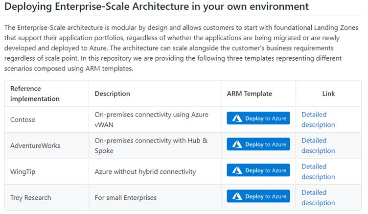

## Pre-requisites

Since Enterprise-Scale can bootstrap an entire Azure tenant without any infrastructure dependencies, the user must first have Owner permission on the tenant *root* before deploying.

This requires the following:

*    A user that is Global Admin in the Azure Active Directory

*   Elevation of privileges of this user which grants him/her the “User Access Administrator” permission at the tenant root scope

*    An explicit roleAssignment (RBAC) made at the tenant root scope via CLI or PowerShell (Note: There’s no portal UX to make this roleAssignment)

### Elevate Access to manage Azure resources in the directory

1.1  Sign into the Azure portal as a user being Global Administrator

1.2  Open Azure Active Directory

1.3  Under *Manage*, select *Properties

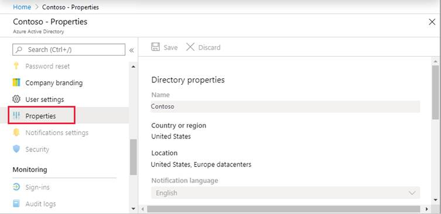

1.4  Under *Access management for Azure resources,* set the toggle to *Yes

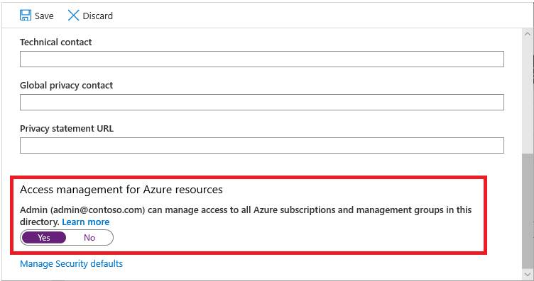

### Grant Access to the User at *tenant root scope “/”* to deploy Enterprise-Scale

You can use either Bash (CLI) or PowerShell to create the roleAssignment for the current user – or a dedicated user – that will do the deployment.

Bash:

``` bash
  #sign  into AZ CLI, this will redirect you to a web browser for authentication, if required  az  login        
  #if  you do not want to use a web browser you can use the following bash  read  -sp "Azure password: " AZ_PASS && echo && az login  -u <username> -p $AZ_PASS     
  #assign Owner role to Tenant root scope  ("/") as a Owner (gets object Id of the current user (az login))  az  role assignment create --scope '/'  --role 'Owner' --assignee-object-id $(az ad signed-in-user show --query  objectId)   
```

Powershell:

``` powershell

  #sign in to Azure  from Powershell, this will redirect you to a web browser for authentication, if required  Connect-AzAccount     
  #get object Id of  the current user (that is used above)  $user =  Get-AzADUser -UserPrincipalName (Get-AzContext).Account     
  #assign Owner  role to Tenant root scope ("/") as a User Access Administrator  New-AzRoleAssignment  -Scope '/' -RoleDefinitionName 'Owner' -ObjectId $user.Id     
```

*Please note: sometimes it can take up to 15 minutes for permission to propagate at tenant root scope. It is highly recommended that you log out and log back in to refresh the token before you proceed with the deployment.*

## Reference Implementation Deployment

In the *Deploying Enterprise-Scale Architecture in your own environment* [article](https://github.com/Azure/Enterprise-Scale#deploying-enterprise-scale-architecture-in-your-own-environment), when you click on *Deploy to Azure* for the selected Enterprise-Scale reference implementation, it will load the deployment experience in the Azure portal into your default Azure tenant. In case you have access to multiple tenants, ensure you are selecting the right one.

Please note that the screenshots below are for the WingTip reference implementation, but a similar experience would be for the Contoso or AdventureWorks reference implementations, except that those two implementations include additional details for deploying and configuring network resources.

### Basics

On the first page, select the *Region*. This region will primarily be used to place the deployment resources in an Azure region, but also used as the initial region for some of the resources that are deployed, such as Azure Log Analytics and Azure automation.

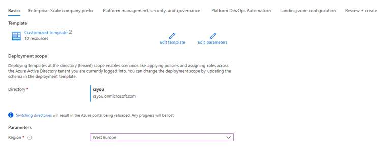

### Enterprise-Scale company prefix

Provide a prefix that will be used to create the management group hierarchy, and platform resources.
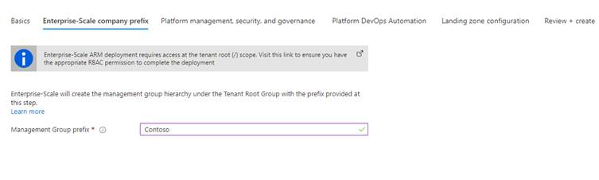

### Platform management, security, and governance

On *Platform management, security, and governance* blade, you will configure the core components to enable platform monitoring and security. The options you enable will also be enforced using Azure Policy to ensure resources, landing zones, and more are continuously compliant as your deployments scales and grows. To enable this, you must provide a dedicated (empty) subscription that will be used to host the requisite infrastructure.
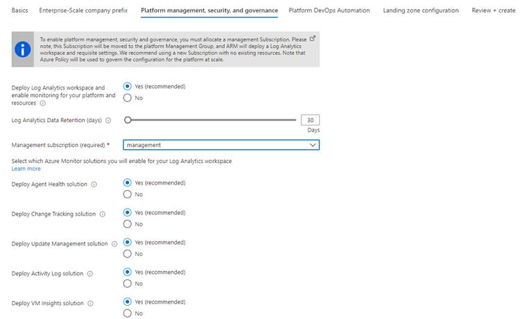

### Platform DevOps and Automation

You can choose to bootstrap your CI/CD pipeline (GitHub with GitHub actions). Provide your GitHub user/org name, the preferred name of the GitHub repository that is to be created, as well as the PA token that the deployment will use to create a new repository and discover the Enterprise-Scale deployment ARM templates and merge them into your main branch. 

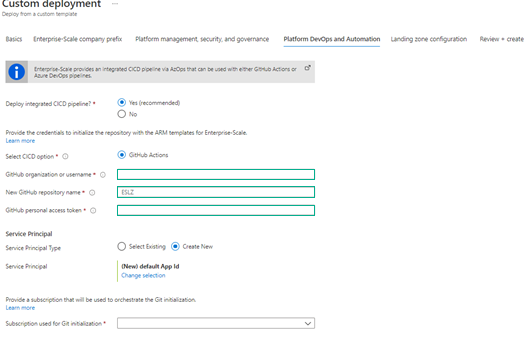

1.1.1    To create a PA token, follow the instructions here: https://docs.github.com/en/github/authenticating-to-github/creating-a-personal-access-token 

1.1.2    Ensure the PA token has the following permissions:

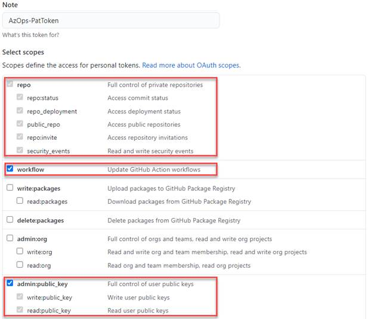 

> [!NOTE] For Microsoft employees who are enrolled into the Azure GitHub organization, you must also authorize the PA token to this Org!

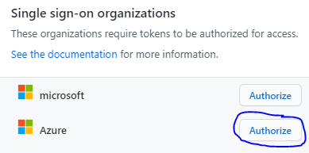

1.2  Lastly, a Service Principal is required for Git to authenticate to – and be authorized to your Azure tenant. You can either use an existing Service Principal or create a new one. The Service Principal will be granted *Owner* permission on the top level Management Group that gets created.

1.2.1    If using an existing Service Principal, ensure you have the *client secret* as this must be provided as the *Password* for the service principal and confirm it has the right level of permission.

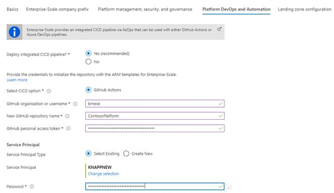

1.2.2    If creating a new Service Principal, press “Change selection” and the portal will open a new blade for app registration

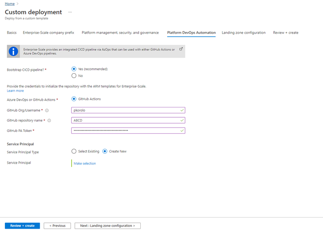

 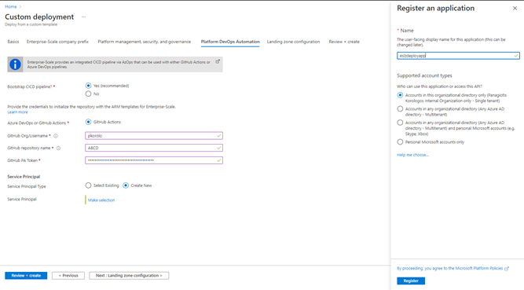

Once the App has been registered, you must explicitly create a new secret.

 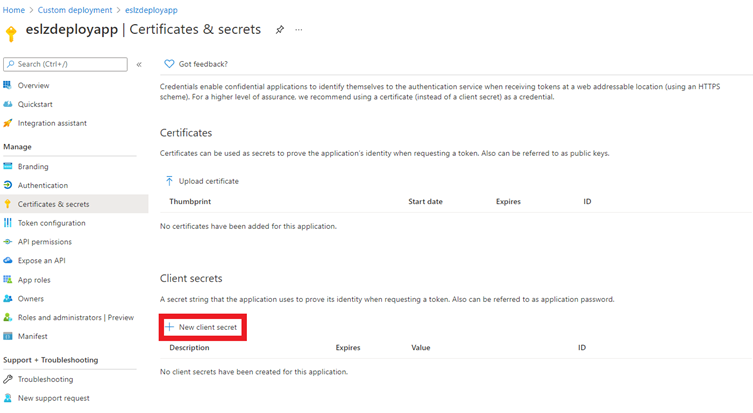

 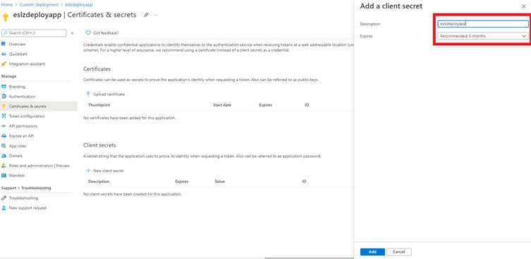

Make sure to note down the “Value” of the new client secret. This can be changed later (see [appendix](#_Appendix)
 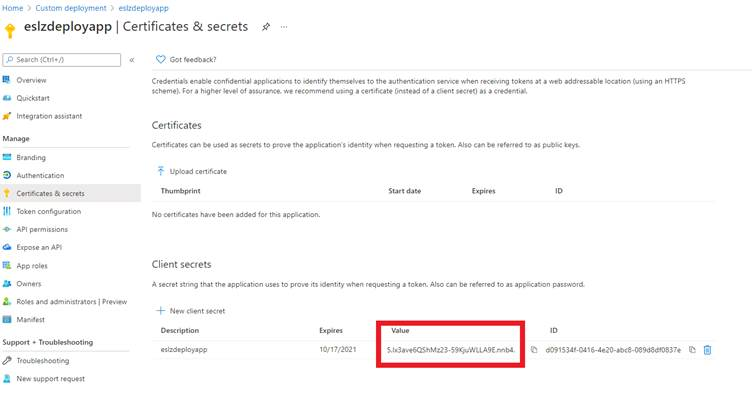

The default API Permissions for this App are “User.Read”, as depicted below:

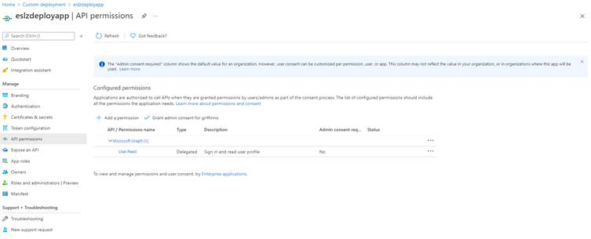

 After copying the secret, go to “Custom Deployment” (in the upper left) to return to the deployment. 

 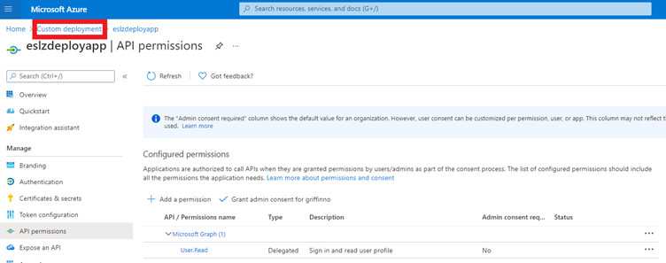

 At this point, paste the client secret value of the newly created client secret from a few step above into the ----- field.

 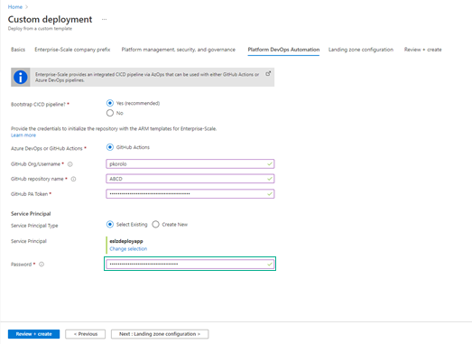


### Landing zone configuration

You can optionally bring in N number of subscriptions that will be bootstrapped as landing zones, governed by Azure Policy. Select which policy you want to assign broadly to all of your landing zones.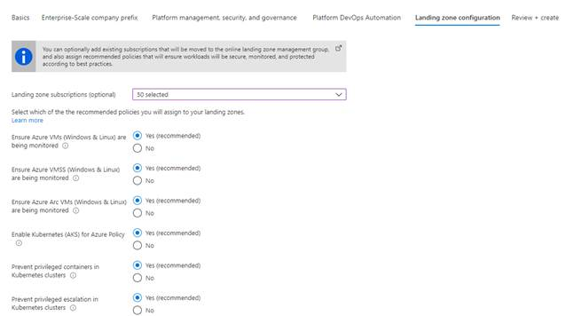

### Review + create.

*Review + Create* page will validate your permission and configuration before you can click deploy. Once it has been validated successfully, you can click *Create. Check [appendix](#_Appendix) for any error handling* *.*

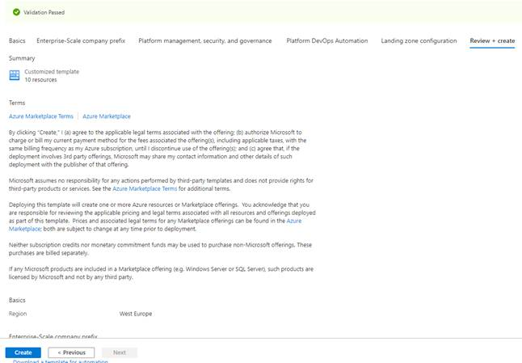

### Validation post deployment (GitHub)

Once Enterprise-Scale has deployed and you enabled the CI/CD bootstrap, you should validate in your GitHub account that:

*    A new repository has been created, with the name provided during setup.

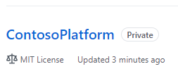

*    4 Secrets are created into this GitHub repository.

ARM_CLIENT_ID = Service Principal

ARM_CLIENT_SECRET = Service Principal Client Secret created in the Tenant
ARM_SUBSCRIPTION_ID = The management subscription ID created in the Tenant
ARM_TENANT_ID = Tenant ID of the Azure Tenant that was used to create ESLZ

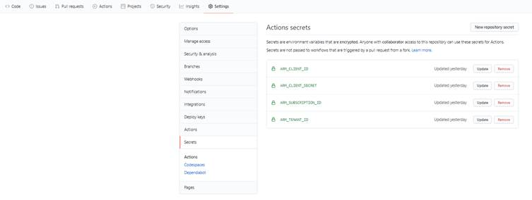

*    A Pull Request is either in progress or has completed and automatically merged into the main branch.

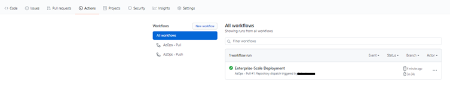

*    The Azure hierarchy that got created using ARM templates as part of the Enterprise-Scale setup, such as management groups, subscription organization as well as policy definitions, policy assignments and role assignments are hydrated and organized into Git:

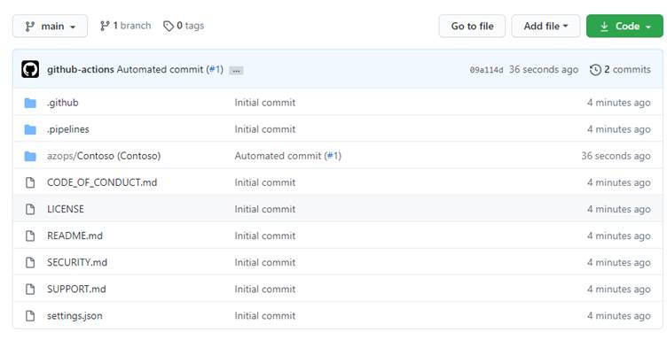


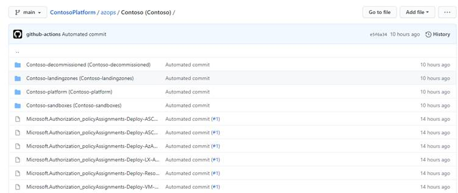

*    In each folder, you will find the ARM templates that were deployed at the scopes during the Enterprise-Scale setup. E.g., on the intermediate root group, you will find all policy definitions, and depending on the selection you made during the deployment, you will find resource templates in the platform subscriptions. Users can – whenever they are ready, start using these templates and bring their own templates to manage the platform using ARM templates and infrastructure as code.

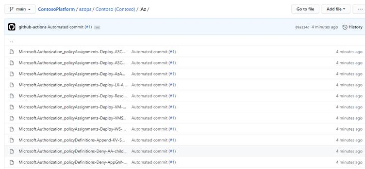

## Post deployment activities

Once Enterprise-Scale has deployed, you can grant your application teams/business units access to their respective landing zones. Whenever there’s a need for a new landing zone, you can place them into their respective management groups (Online or Corp) given the characteristics of assumed workloads and their requirements.

### Create new landing zones

### Application team’s responsibility

## Operating the Azure platform using AzOps (Infrastructure as Code with GitHub Actions)

When you have deployed Enterprise-Scale with GitHub integration, you will have a ready-to-go repository with integrated GitHub Actions containing all the ARM templates that were used during deployment, organized in the following way:

*    Management group tree structure represented as folders in Git

*    Subscriptions represented as folders in their respective management group folder in Git

*    Resource Groups represented as folders in their respective subscription folder in Git

*    Policy Definitions, Policy Set Definitions, Role Definitions, and Role Assignments as composite ARM resource templates partitioned at the folder representing the respective scope in Azure (management group, subscription)

*    Resources (e.g., virtual networks, Log Analytics workspace, Automation account etc.) represented as composite ARM resource templates into their respective resource group (folder)

You can edit/update the existing ARM templates in your repository and GitHub actions will push (deploy) to the respective Azure scope. You can also author and bring your own ARM templates and deploy them to the respective Azure scope.

The following section will demonstrate how one can operationalize the Enterprise-Scale platform using ARM templates, via the GitHub repository that got created using AzOps (GitHub Actions).

### What is AzOps?

AzOps is an opinionated CI/CD pipeline to operationalize the Azure *platform* and *landing zones* that enables organizations to focus on the ARM template development, and not having to deal with multiple deployment scripts targeting different Azure scopes. The organization and folder structure in Git is dynamically representing the Azure graph (management groups (parent, child relationships), and subscription organization), so the platform operators can easily determine at which *scope* they want to invoke the ARM template deployment by simply making a PR with the ARM template(s) and parameter files (optionally), and AzOps will invoke the deployment accordingly.

Also, when there’s a new *scope* (management groups, subscriptions, and resource groups) being created, either explicitly via the pipeline – and also out of band (via Portal, CLI, PS etc.), AzOps will discover these and represent them correctly back into Git.

### Create new Policy Assignment for validation

Enterprise-Scale with its Policy Driven Governance principle relies heavily on Azure Policy to determine the goal state of the overall platform. As an example, this exercise will demonstrate how a developer can make a new policy assignment at the “Online” landing zone management group scope.

1.   In GitHub, navigate to your repository and click on the ‘azops’ folder. From here, navigate to your <prefix>-online folder which represents the management group for all your online landing zones.


2.   Click on ‘Add file’, and ‘Create new file’.

3.   Name the file ‘locationAssignment.json’

4.   Copy and paste the following ARM template json

``` json
  {    "$schema": "https://schema.management.azure.com/schemas/2019-08-01/managementGroupDeploymentTemplate.json#",    "contentVersion": "1.0.0.0",    "parameters": {      "policyAssignmentEnforcementMode": {        "type": "string",        "allowedValues": [          "Default",          "DoNotEnforce"        ],        "defaultValue": "DoNotEnforce",        "metadata": {          "description": "Input will determine if the policyAssignment should be enforced or not."        }      },      "policyDefinitionId": {        "type": "string",        "defaultValue": "/providers/Microsoft.Authorization/policyDefinitions/e56962a6-4747-49cd-b67b-bf8b01975c4c",        "metadata": {          "description": "Provide the policyDefinition resourceId"        }      },      "policyAssignmentName": {        "type": "string",        "defaultValue": "AllowedLocations"      },      "policyDescription": {        "type": "string",        "defaultValue": "Policy to ringfence Azure regions."      },      "listOfAllowedLocations": {        "type": "array",        "defaultValue": [          "westeurope",          "northeurope"        ]      }    },    "variables": {    },    "resources": [      {        "type": "Microsoft.Authorization/policyAssignments",        "apiVersion": "2019-09-01",        "name": "[parameters('policyAssignmentName')]",        "identity": {          "type": "SystemAssigned"        },        "location": "[deployment().location]",        "properties": {          "description": "[parameters('policyDescription')]",          "displayName": "[parameters('policyDescription')]",          "policyDefinitionId": "[parameters('policyDefinitionId')]",          "enforcementMode": "[parameters('policyAssignmentEnforcementMode')]",          "parameters": {            "listOfAllowedLocations": {              "value": "[parameters('listOfAllowedLocations')]"            }          }        }      }    ]  }  
```

5.   Examine the file and note that we are using default values for the parameters. You could modify these, or you could also provide a locationAssignment.parameters.json file to provide the parameters.

6.   On the ‘Commit new file’ option, select ‘Create a new branch for this commit and start a pull request’, and give it a name.

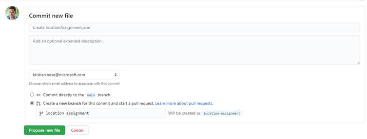

7.   Click ‘Propose new file’ and a new PR is being created which will trigger the Push workflow. Go to Actions to monitor the process.

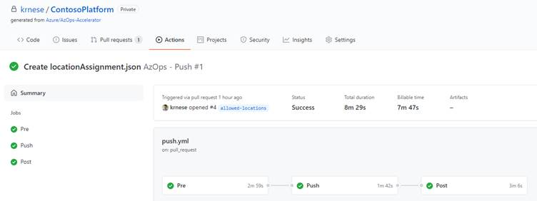

8.   Once completed, you can merge the pull request.

9.   In Azure portal, you can navigate to the <prefix>-online management group and verify that the deployment resource got created and deployed successfully. Each deployment invoked via AzOps will have an ‘AzOps’ prefix.

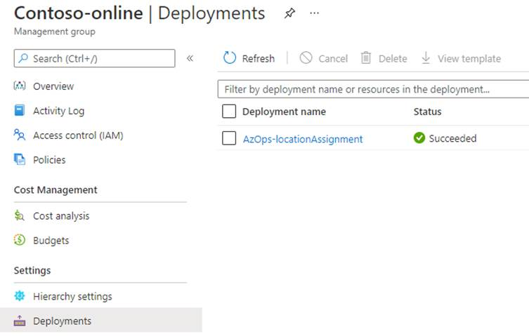

10.  Navigate to ‘Policies’ on the <prefix>-online management group and verify that there’s a new assignment called ‘Policy to ring-fence Azure regions’.

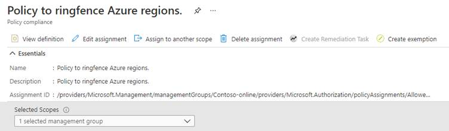

11.  Click on ‘Edit assignment’ to verify that the Policy is not being enforced but will only scan for compliance and validate resources per the policy rule defined in the policy definition.

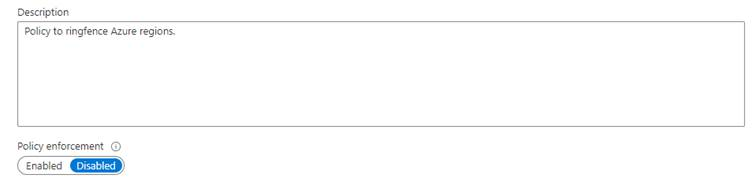

Once the policy compliance scan has completed, you will get a compliance result for the policy you assigned to validate the effect is working as intended, before going to the next step to update the enforcement mode. I.e., this policy will prevent resources being created outside of the allowed locations specified.

You can now merge the pull request and delete the branch.

### Update a Policy Assignment to enforce

In this exercise, we will modify the existing policy assignment to ensure the policy effect will be enforced.

1.   Navigate the locationAssignment.json file you placed into the <prefix>-online folder, representing the online landing zone.

2.   Click on ‘Edit this file’ 

3.   Change the parameter “policyAssignmentEnforcementMode” default value to be ‘Default’.

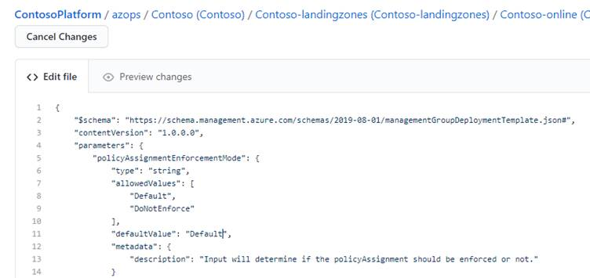

4.   On the ‘Commit changes’ dialogue box, select ‘Create a new branch for this commit and start a pull request’, and provide a branch name. Click ‘Propose changes’ and create the pull request

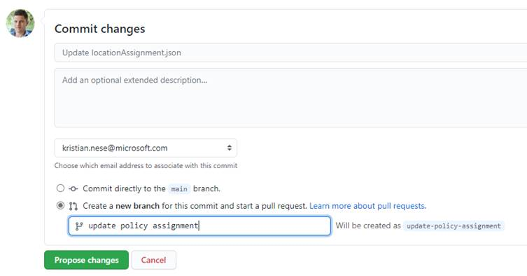

This will now start the AzOps push workflow and deploy the template with the updated property so that the policy effect will be enforced (in this case, deny resource creation outside of the ringfenced Azure regions).

Once the job has completed, you can revisit the policy in Azure portal and see that the policy enforcement is set to ‘Enabled’.

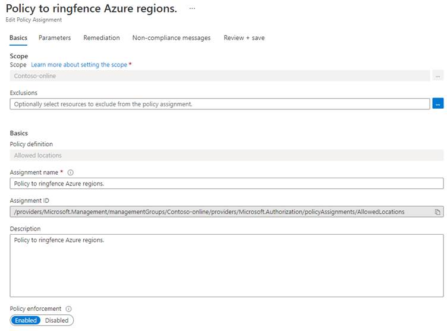

You can now merge the pull request and delete the branch.

### Create new landing zones

### Create new Role Assignment on a landing zone

To grant a user, a group, or a service principal access to a landing zone (subscription), you can use the following ARM template where you provide the principalId (object id of the user, group, or service principal) as input to the parameter, and place the template into the subscription folder into your landing zone management group(s).

<add detailed step-by-step instructions>

``` json
  {    "$schema": "https://schema.management.azure.com/schemas/2018-05-01/subscriptionDeploymentTemplate.json#",    "contentVersion": "1.0.0.0",    "parameters": {      "principalId": {        "type": "string",        "metadata": {          "description": "Provide the objectId of the principal (user, group, SPN, managed identity etc.) that will be granted RBAC at scope."        }      },      "roleDefinitionId": {        "type": "string",        "defaultValue": "b24988ac-6180-42a0-ab88-20f7382dd24c",        "metadata": {          "description": "Provide the id of the built-in roleDefinition. Default is 'Contributor'."        }      }    },    "resources": [      {        "type": "Microsoft.Authorization/roleAssignments",        "apiVersion": "2017-09-01",        "name": "[guid(parameters('principalId'))]",        "properties": {          "principalId": "[parameters('principalId')]",          "roleDefinitionId": "[concat('/providers/Microsoft.Authorization/roleDefinitions/', parameters('roleDefinitionId'))]"        }      }    ]  }  
```
