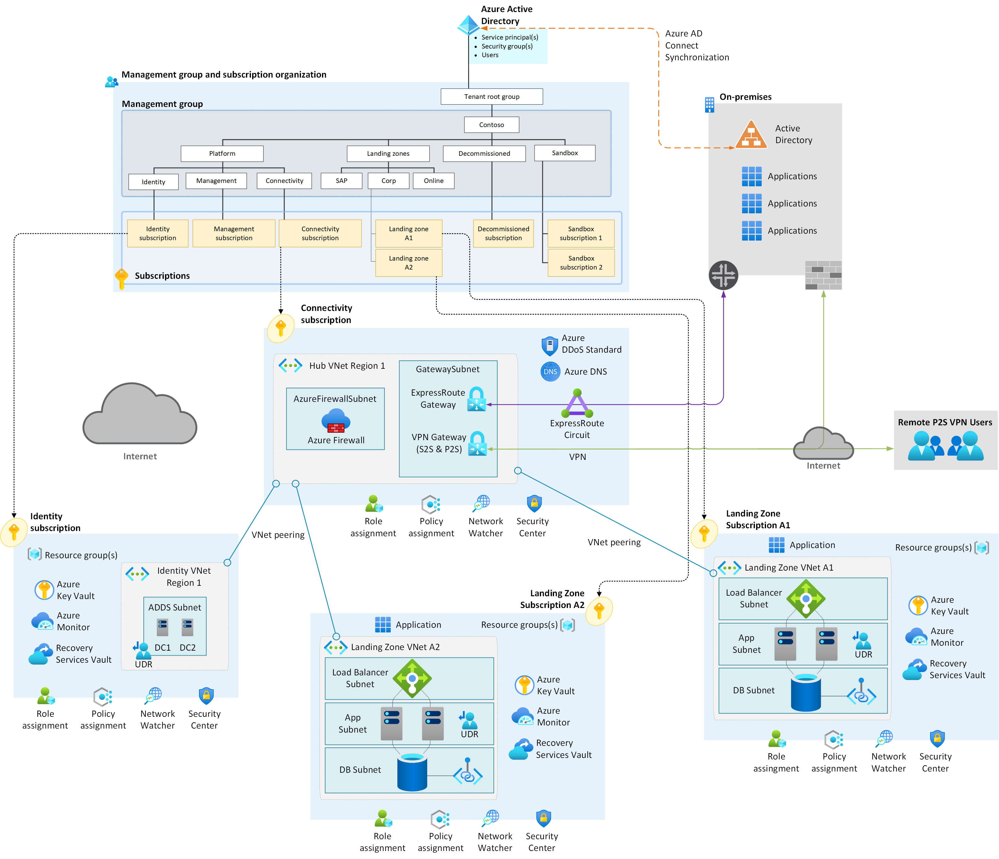
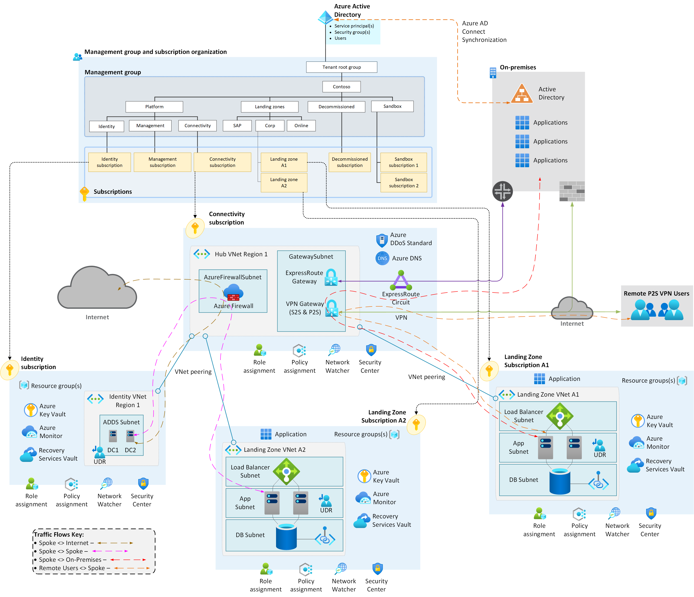

| Enterprise-Scale Design Principles | ARM Template | Scale without refactoring |
|:-------------|:--------------|:--------------|
||   | Yes |

# Deploy Enterprise-Scale with hub and spoke architecture

The Enterprise-Scale architecture is modular by design and allow organizations to start with foundational landing zones that support their application portfolios and add hybrid connectivity with ExpressRoute or VPN when required. Alternatively, organizations can start with an Enterprise-Scale architecture based on the traditional hub and spoke network topology if customers require hybrid connectivity to on-premises locations from the beginning.

This reference implementation also allows the deployment of platform services across Availability Zones (such as VPN or ExpressRoute gateways) to increase availability uptime of such services. 

## Customer profile

This reference implementation is ideal for customers that have started their Enterprise-Scale journey with an Enterprise-Scale foundation implementation and then there is a need to add connectivity on-premises datacenters and branch offices by using a traditional hub and spoke network architecture. This reference implementation is also well suited for customers who want to start with Landing Zones for their net new
deployment/development in Azure by implementing a network architecture based on the traditional hub and spoke network topology.

Please refer to the [Enterprise-Scale Landing Zones User Guide](https://github.com/Azure/Enterprise-Scale/wiki/Deploying-Enterprise-Scale) for detailed information on prerequisites and deployment steps.

## How to evolve from Enterprise-Scale foundation

If customer started with a Enterprise-Scale foundation deployment, and if the business requirements changes over time, such as migration of on-premise applications to Azure that requires hybrid connectivity, you will simply create the **Connectivity** Subscription, place it into the **Platform > Connectivity** Management Group and assign Azure Policy for the hub and spoke network topology.

## Pre-requisites

To deploy this ARM template, your user/service principal must have Owner permission at the Tenant root.
See the following [instructions](../../EnterpriseScale-Setup-azure.md) on how to grant access.

### Optional prerequisites

The deployment experience in Azure portal allows you to bring in existing (preferably empty) subscriptions dedicated for platform management, connectivity and identity. It also allows you to bring existing subscriptions that can be used as the initial landing zones for your applications.

To learn how to create new subscriptions programmatically, please visit this [link](https://docs.microsoft.com/azure/cost-management-billing/manage/programmatically-create-subscription).

To learn how to create new subscriptions using Azure portal, please visit this [link](https://azure.microsoft.com/blog/create-enterprise-subscription-experience-in-azure-portal-public-preview/).

## What will be deployed?

By default, all recommendations are enabled and you must explicitly disable them if you don't want it to be deployed and configured.

- A scalable Management Group hierarchy aligned to core platform capabilities, allowing you to operationalize at scale using centrally managed Azure RBAC and Azure Policy where platform and workloads have clear separation.
- Azure Policies that will enable autonomy for the platform and the landing zones.
- An Azure subscription dedicated for **management**, which enables core platform capabilities at scale using Azure Policy such as:
  - A Log Analytics workspace and an Automation account
  - Azure Security Center monitoring
  - Azure Security Center (Standard or Free tier)
  - Azure Sentinel
  - Diagnostics settings for Activity Logs, VMs, and PaaS resources sent to Log Analytics
- (Optionally) Integrate your Azure environment with GitHub (Azure DevOps will come later), where you provide the PA Token to create a new repository and automatically discover and merge your deployment into Git.
- An Azure subscription dedicated for **connectivity**, which deploys core Azure networking resources such as:
  - A hub virtual network
  - Azure Firewall (optional - deployment across Availability Zones)
  - ExpressRoute Gateway (optional - deployment across Availability Zones)
  - VPN Gateway (optional - deployment across Availability Zones)
  - Azure Private DNS Zones for Private Link
- (Optionally) An Azure subscription dedicated for **identity** in case your organization requires to have Active Directory Domain Controllers in a dedicated subscription.
- Landing Zone Management Group for **corp** connected applications that require connectivity to on-premises, to other landing zones or to the internet via shared services provided in the hub virtual network.
  - This is where you will create your subscriptions that will host your corp-connected workloads.
- Landing Zone Management Group for **online** applications that will be internet-facing, where a virtual network is optional and hybrid connectivity is not required.
  - This is where you will create your Subscriptions that will host your online workloads.
- Landing zone subscriptions for Azure native, internet-facing **online** applications and resources.
- Landing zone subscriptions for **corp** connected applications and resources, including a virtual network that will be connected to the hub via VNet peering.
- Azure Policies for online and corp-connected landing zones, which include:
  - Enforce VM monitoring (Windows & Linux)
  - Enforce VMSS monitoring (Windows & Linux)
  - Enforce Azure Arc VM monitoring (Windows & Linux)
  - Enforce VM backup (Windows & Linux)
  - Enforce secure access (HTTPS) to storage accounts
  - Enforce auditing for Azure SQL
  - Enforce encryption for Azure SQL
  - Prevent IP forwarding
  - Prevent inbound RDP from internet
  - Ensure subnets are associated with NSG

## Hub & Spoke Networking

As mentioned above the Adventure Works reference implementation deploys a traditional [hub & spoke VNet architecture](https://docs.microsoft.com/en-us/azure/architecture/reference-architectures/hybrid-networking/hub-spoke). With the Hub VNet being deployed into the **connectivity** subscription that will host the Azure Firewalls, ExpressRoute Circuits & Gateways & VPN Gateways. 

The **identity** (optional) and **corp** connected landing zone subscriptions, that contain their own VNets (known as spokes in this architecture), are then connected back to the hub VNet via VNET Peering with the following [options](https://docs.microsoft.com/en-us/azure/virtual-network/virtual-network-manage-peering#create-a-peering) enabled:

- Allow forwarded traffic (hub & spoke VNets)
- Allow gateway transit (hub VNet only)
- Use remote gateways (spoke VNets only)

### Traffic Flows Explained

In the following section we will deep dive into each of the following traffic flows within the architecture shown above and below:

- [Spoke <-> Internet - (brown)](#spoke---internet---brown)
- [Spoke <-> Spoke - (pink)](#spoke---spoke---pink)
- [Spoke <-> On-Premises - (red)](#spoke---on-premises---red)
- [Remote Users <-> Spoke - (orange)](#remote-users---spoke---orange)

> Please note the **Traffic Flow Key** in the bottom right hand corner of the diagram. As this will be used to refer to the various traffic flows.

#### Spoke <-> Internet - (brown)

In this hub & spoke VNet architecture traffic from spoke VNets to the internet are sent via the Azure Firewall, if deployed, in the hub VNet.

This is achieved by creating and associating a [User Defined Route (UDR)](https://docs.microsoft.com/en-us/azure/virtual-network/virtual-networks-udr-overview#user-defined) to each of the subnets in the Spoke VNets. The UDR itself will require a route for `0.0.0.0/0` via the private IP address of the Azure Firewall in the Hub VNet. With this UDR associated to the Spoke VNet subnets, traffic destined to the internet will be routed, because of the UDR associated to the subnets, across the VNet peering to the Hub VNet and then to the Azure Firewall, where it's rule base is evaluated to see if the traffic flow is permitted and then if so, it is NATed and sent on to it's destination on the internet.

The `allow forwarded traffic` option must be enabled on the VNet Peering (both hub & spokes sides).

If an Azure Firewall hasn't been deployed then the UDR is not required and internet bound traffic will be routed directly to the internet, as per the [default route table](https://docs.microsoft.com/en-us/azure/virtual-network/virtual-networks-udr-overview#default) for all VNets.

> The Azure Firewall could be replaced by any other Network Virtual Appliance (NVA) in the hub VNet to perform the same tasks - e.g. Palo Alto, FortiGate, Checkpoint, Cisco, Juniper etc.

#### Spoke <-> Spoke - (pink)

In this hub & spoke VNet architecture traffic from spoke VNets to other spoke VNets are sent via the Azure Firewall, if deployed, in the hub VNet.

This is achieved by creating and associating a [User Defined Route (UDR)](https://docs.microsoft.com/en-us/azure/virtual-network/virtual-networks-udr-overview#user-defined) to each of the subnets in the Spoke VNets. The UDR itself will require a route for each of the other spoke VNets CIDR address spaces via the private IP address of the Azure Firewall in the Hub VNet. With this UDR associated to the Spoke VNet subnets, traffic destined to the other spoke VNets will be routed, because of the UDR associated to the subnets, across the VNet peering to the Hub VNet and then to the Azure Firewall, where it's rule base is evaluated to see if the traffic flow is permitted and then if so, it is sent on to it's destination in the other spoke VNets.

The `allow forwarded traffic` option must be enabled on the VNet Peering (both hub & spokes sides).

> It is recommended to use specific routes in your UDRs rather than summary routes.

If an Azure Firewall hasn't been deployed then this traffic flow **will not be possible**, as VNet Peering is non-transitive. Azure Firewall is required in the hub VNet to provide the transit capability between spokes.

> The Azure Firewall could be replaced by any other Network Virtual Appliance (NVA) in the hub VNet to perform the same tasks - e.g. Palo Alto, FortiGate, Checkpoint, Cisco, Juniper etc.
#### Spoke <-> On-Premises - (red)

In this hub & spoke VNet architecture traffic from spoke VNets to on-premises resource are sent via the ExpressRoute or VPN Gateways, if deployed, in the hub VNet.

This is achieved by ensuring the `allow gateway transit` option is enabled on the hub VNet side of the VNet Peering & the `allow gateway transit` option is enabled on the spoke VNet side of the VNet Peering. The `allow forwarded traffic` option must also be enabled on the VNet Peering (both hub & spokes sides).

UDRs are not required in this architecture to direct traffic towards either the ExpressRoute or VPN Gateways as the routes they learn via BGP (required for ExpressRoute) or statically (VPN only, if BGP not configured which is recommended) for on-premises networks are programmed into the default VNet routing tables automatically by the platform.

> However, if a UDR is associated to the spoke VNet subnets for either spoke <-> spoke, or spoke <-> internet traffic flows, ensure the option `Virtual network gateway route propagation` is not set to disabled as this will prevent the on-premises routes that have been learned from being added to the spoke VNet default route tables. 
>  
> More information can be found here: [https://docs.microsoft.com/en-us/azure/virtual-network/virtual-networks-udr-overview#border-gateway-protocol](https://docs.microsoft.com/en-us/azure/virtual-network/virtual-networks-udr-overview#border-gateway-protocol)

Finally, you can also route all traffic for on-premises network via the Azure Firewall in the hub VNet, if desired, by following this [article.](https://docs.microsoft.com/en-us/azure/firewall/tutorial-hybrid-portal-policy)

#### Remote Users <-> Spoke - (orange)

In this hub & spoke VNet architecture traffic from remote users (connected via P2S VPN) to spoke VNets are sent via the VPN Gateway, if deployed, in the hub VNet.

This is achieved by ensuring the `allow gateway transit` option is enabled on the hub VNet side of the VNet Peering & the `allow gateway transit` option is enabled on the spoke VNet side of the VNet Peering. The `allow forwarded traffic` option must also be enabled on the VNet Peering (both hub & spokes sides).

UDRs are not required in this architecture to direct traffic towards either the VPN Gateway as the routes they learn via BGP or statically for on-premises networks are programmed into the default VNet routing tables automatically by the platform.

More information on this traffic flow can be found here: [https://docs.microsoft.com/en-us/azure/vpn-gateway/vpn-gateway-about-point-to-site-routing#multipeered](https://docs.microsoft.com/en-us/azure/vpn-gateway/vpn-gateway-about-point-to-site-routing#multipeered)

## Next steps

### From an application perspective

Once you have deployed the reference implementation, you can create new subscriptions, or move an existing subscriptions to the **Landing Zones** > **Online** or **Corp**  management group, and finally assign RBAC to the groups/users who should use the landing zones (subscriptions) so they can start deploying their workloads.

Refer to the [Create Landing Zone(s)](../../EnterpriseScale-Deploy-landing-zones.md) article for guidance to create Landing Zones.
