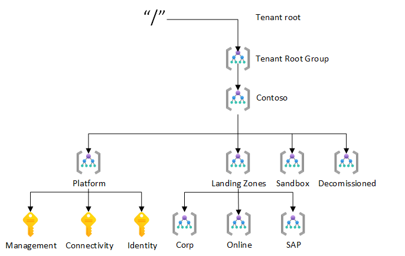
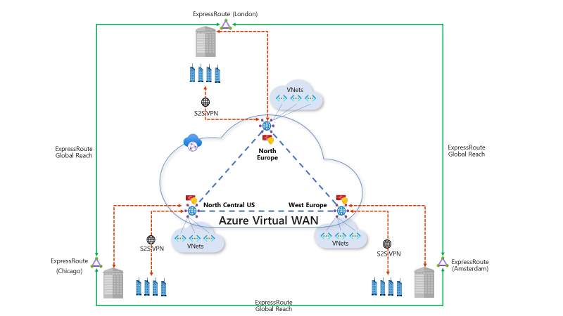
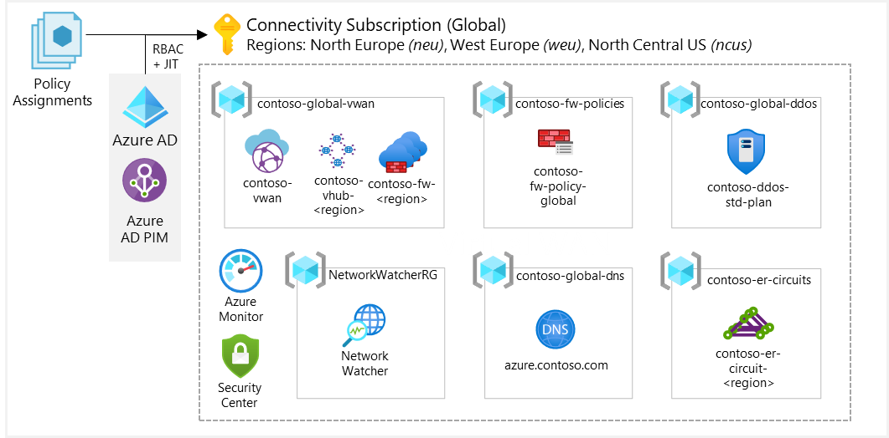

| Enterprise-Scale Design Principles | ARM Template | Scale without refactoring |
|:-------------|:--------------|:--------------|
|| | Yes |

# Deploy Enterprise-Scale with Azure VWAN

## Customer profile

This reference implementation is ideal for customers that have started their Enterprise-Scale journey with a Enterprise-Scale foundation implementation and then there is a need to add connectivity on-premises datacenters and branch offices by using Azure VWAN, ExpressRoute and VPN. This reference implementation is also well suited for customers who want to start with Landing Zones for their net new
deployment/development in Azure, where a global transit network is required, including hybrid connectivity to on-premises datacenters and branch offices via ExpressRoute and VPN.

## How to evolve from Enterprise-Scale foundation
If customer started with a Enterprise-Scale foundation deployment, and if the business requirements changes over time, such as migration of on-prem applications to Azure that requires hybrid connectivity, you will simply create the **Connectivity** Subscription and place it into the **Platform** Management Group and assign Azure Policy for the VWAN network topology.

## Pre-requisites
To deploy this ARM template, your user/service principal must have Owner permission at the Tenant root.
See the following [instructions](https://docs.microsoft.com/en-us/azure/role-based-access-control/elevate-access-global-admin) on how to grant access.

## What will be deployed?
- A scalable Management Group hiearchy aligned to core platform capabilities, allowing you to operationalize at scale using RBAC and Policy
- Azure Policies that will enable autonomy for the platform and the Landing Zones
- An Azure Subscription dedicated for Management, which enables core platform capabilities at scale such as security, auditing, and logging
- An Azure Subscription dedicated for Connectivity, which deploys core networking Resources such as Azure VWAN, Azure Firewall, Firewall Policies, among others.
- An Azure Subscription dedicated for Identity, where customers can deploy the Active Directory domain controllers required for their environment
- Landing Zone Management Group for corp-connected applications that require hybrid connectivity. This is where you will create your Subscriptions that will host your corp-connected workloads.
- Landing Zone Management Group for online applications that will be internet-facing, which doesn't require hybrid connectivity. This is where you will create your Subscriptions that will host your online workloads

---

## Customer design journey and scope

Contoso, Ltd. is a multi-national business with headquarters in London, UK. Contoso Senior leadership has mandated a "Cloud-First" approach, with an overarching strategy to reduce and gradually divest the on-premises datacenter footprint. Contoso has chosen Azure as their preferred public cloud provider. They have a large overall IT estate and are concerned about the velocity of workload transformation/migration, and how they can establish Landing Zones for application teams to migrate their applications.

Contoso has come across the Enterprise-Scale architecture which provides a forward looking Azure-native design approach. The Contoso IT leadership team has committed to this as they believe it will allow applications (legacy or modern) to seamlessly move at their own pace while also providing secure and streamlined operations, management, and governance across the entire Contoso platform on Azure.

## Contoso Architecture

### Enterprise Enrollment and Azure AD Tenants

Contoso has opted for simpler EA design with a single department and multiple EA Accounts. Each EA account will have an associated service principal account by configuring IAM permission as part of the (automated) Subscription provisioning process.

Contoso has three separate Azure AD Tenants for Dev, Test, and Prod and Azure AD Connect is already in place for the Production Azure AD Tenant. The dev and test Tenants are used for Office 365 validation, and there is no requirement to separate Identities at the Azure AD Tenant level across Dev, Test and Production environments in Azure, so Contoso will only leverage the Production Azure AD Tenant for Azure access.

Additional controls will be in place for networking (isolation) and identity (segregation of duties) to guarantee separation between Dev, Test and Production workloads. From a networking and identity perspective, all Subscriptions are considered as production including all sandbox Subscriptions.

### Identity and Access Management

Contoso wants to ensure zero standing access for production environments across all Azure control plane access and will use Azure AD Privileged Identity Management (PIM) to ensure just-in-time control plane access to Azure Resources. Contoso will create custom Role Definitions (Platform Owner, NetOps, SecOps, Landing Zone Owner, AppOps/DevOps) in accordance with Enterprise-Scale roles which will be supported by the operating model for the Azure platform.

The identity team will create an Azure AD only group for each of the roles above and make Landing Zone Owner/Requester an owner of the group before creating entitlements for those groups in Azure AD PIM. Those who require access to Azure Resources will be able to search for the Azure AD group by name and leverage the Azure AD Self-service group management capability to join a group. Group Owners can determine whether to approve or deny a user request based on eligibility criteria.

| Azure AD Group Name                    | Scope                    | PIM Role           |
|-----------------------------------|--------------------------|--------------------|
| \<\<Subscription-Name\>\>-Owner   | Subscription             | Landing Zone Owner |
| \<\<Subscription -Name\>\>-DevOps | Subscription             | DevOps             |
| \<\<Subscription -Name\>\>-AppOps | Subscription             | AppOps             |
| SecOps                            | Contoso Management Group | SecOps             |
| \<\<Subscription -Name\>\>-NetOps | Contoso Management Group | NetOps             |
| Platform Owner                    | Tenant Root ("/")        | Owner (Built-in)   |

Azure AD will be the primary IDP where applications support modern federation protocols such as OIDC, SAML, or WS-Fed. Regional domain controllers will be deployed in the Identity Subscription to support scenarios where legacy authentication (LDAP/Kerberos) is required.

### Management Group and Subscription Organization

Contoso is designing their Management Group hierarchy and Subscription organization to optimize for scale, enabling autonomy for the platform and application teams to evolve alongside business requirements. The Subscription naming convention will be "TLA-of-the-business-Unit" followed by "Workload-Type", "Region", "Workload-Name" and "Unique-Number", for example FIN-Prod-NEU-Payroll-01, FIN-Prod-WEU-Payroll-01.

Contoso has decided to use Geo-affinitized Subscriptions which will greatly simplify networking and connectivity. Workloads that do require multiple regions, will have at least one Subscription for each region including for business continuity and disaster recovery purposes.

Contoso has decided to use Azure Resource Tags for billing and charge back purposes instead of blending a cost management structure within the Management Group and Subscription hierarchy. This will provide horizontal capabilities to query cost across multiple Subscriptions. Tags required for billing (Department and Cost Center) will be enforced by policy at Landing Zone Management Group scope.

#### Management Groups

**Tenant Root Group**

The default root Management Group will not be used directly, allowing for greater flexibility in the future to incorporate an equivalent test environment for their end-to-end Azure architecture.

**Contoso**

This is the top-level Management Group implemented within Contoso's Azure Tenant and will serve as the container for all custom Role Definitions, custom policy definitions, and Contoso global policy assignments, but will have minimal direct Role Assignments. For policy assignments at this scope, the target state is to ensure security and autonomy for the platform as additional sub scopes are created, such as child Management Groups and Subscriptions.

**Landing Zones**

All business units will create their Subscriptions within child Management Groups of the Landing Zones Management Groups. This allows for a generic yet more granular approach to policy assignments to more easily separate active Landing Zones from sandbox Subscriptions and decommissioned Subscriptions.

**Corp, Online, SAP**

Contoso has identified 3 common archetypes they will migrate/deploy to Azure and have developed the requisite policies to ensure appropriate guard-rails are in place for each Landing Zone that is created as these Management Groups.

Azure policy will require tags for each Subscription that will be created, to identify ownership, billing and chargeback.

* Corp Landing Zones will include all Virtual Networks that do not expose public endpoints and that require connectivity to on-premises, as well as connectivity to other Landing Zones. 
* Online Landing Zones include all Virtual Networks that have internet-facing applications via an Azure Application Gateway (v2). 
* SAP represents a workload that merits separation given the implied specialization.

**Sandbox**

Application teams and individual users within Contoso wanting to test and explore Azure services will have Subscriptions created within the Sandbox Management Group. In this group, policies are in place to ensure there is no control plane or data plane path to production environments.

**Decommission**

All cancelled Subscriptions will be moved under this Management Group by Azure Policy and will be deleted after 60 days.

#### Platform Subscriptions

**Connectivity**

A dedicated Subscription will be utilized for the centrally managed networking infrastructure which will control end-to-end connectivity for all Landing Zones within Contoso's Azure platform. Azure Resources that will be deployed into this Subscription include Azure Virtual WAN and its sub-Resources (VHubs, Gateways), Azure Firewalls, Firewall Policies and Azure Private DNS Zones.

The "Connectivity" Subscription has the tag "BusinessUnit" with the value "Platform".

**Identity**

The "Identity" Subscription will be used to host VMs running Windows Server Active Directory. There will be at least two domain controllers deployed per Azure region for redundancy purposes, and to ensure regions are independent in the case of a regional outage. AD replication will ensure all domain controllers are kept in sync.

**Management**

A dedicated Subscription will be utilized for centrally managed platform infrastructure to ensure a holistic at-scale management capability across all Landing Zones in Contoso's Azure platform.

The "Management" Subscription has the tag "BusinessUnit" with a value "Platform".

The following policies related to Management Group hierarchy and Subscription organization will be assigned within the Contoso production Tenant:

| Policy                                            | Intent                                                        | Assignment scope              | Result                                                                                          |
|---------------------------------------------------|---------------------------------------------------------------|-------------------------------|-------------------------------------------------------------------------------------------------|
| Enforce Subscription naming convention            | Ensure all Subscriptions conforms to the naming convention    | Contoso Management Group      | All Subscriptions have valid naming convention                                                  |
| Enforce Subscription budget                       | Ensure all Subscriptions have a budget associated             | Contoso Management Group      | No Subscription will allow unlimited spending                                                   |
| Enforce Subscription tags                         | Ensure all Subscriptions have the required tags               | Contoso Management Group      | All Subscriptions are tagged properly to identify business unit owner, intent, and cost centre. |
| Move cancelled Subscriptions                      | Ensure cancelled Subscriptions are moved from Landing Zone    | Landing Zone Management Group | Any Subscription that get cancelled, will be moved to the Decommission Management Group         |
| Allowed regions for [Resource Groups](../../../../main/azopsreference/3fc1081d-6105-4e19-b60c-1ec1252cf560/contoso/.AzState/Microsoft.Authorization_policyAssignments-Allowed-RGLocation.parameters.json) and [Resources](../../../../main/azopsreference/3fc1081d-6105-4e19-b60c-1ec1252cf560/contoso/.AzState/Microsoft.Authorization_policyAssignments-Allowed-ResourceLocation.parameters.json) | Ensure all Resources are created in the designated regions    | Contoso Management Group      | All Resources are compliant per their location                                                  |

| Assign region policy per Subscription             | Ensure Subscriptions get policy with correct regions assigned | Contoso Management Group      | Subscriptions will support regions per their naming convention                                  |

## Network Topology and Connectivity

Contoso has a presence across Europe and North America. Contoso's headquarters are located in London, UK. Contoso also has regional HQ offices in Amsterdam and Chicago. Contoso has a large number of branch offices (around 500) across the US and Europe. Each branch office contains a CPE that is connected to the local regional HQ via S2S VPN.

Contoso has decided to adopt Enterprise-Scale recommendations for building their network architecture in Azure. Key decisions they have adopted include:

1. The deployment of a Microsoft-managed network in Azure using Azure Virtual WAN to interconnect all Azure and on-premises locations around the world.

2. Use of ExpressRoute Global Reach to interconnect corporate HQs with regional hubs.

3. Move away from their traditional DMZ-model and adopt a Zero-Trust network model.

4. Allow full Subscription democratization by giving Landing Zone Owners' rights to create Subnets within their Landing Zones to suit their application needs while ensuring the platform maintains compliance and security as defined by the SecOps team.

Contoso's network design based on Enterprise-Scale design principles is depicted in the picture shown below:

With this network design, Contoso enables the following scenarios:

* Regional HQ offices connectivity to Azure via ExpressRoute.
* Branch offices connectivity to Azure via VPN (S2S IPSec tunnels).
* Landing Zone Virtual Networks are connected to the regional Azure Virtual WAN VHub.
* Regional HQs to Regional HQs connectivity via ExpressRoute with Global Reach.
* Regional HQs to branch offices connectivity via Azure Virtual WAN.
* Regional HQs and branch offices connectivity to Azure Virtual Networks via Azure Virtual WAN.
* Internet-outbound connectivity from Azure Virtual Networks is secured using Azure Firewall within the Virtual WAN VHub.

Contoso decided to deploy a Azure Virtual WAN (Microsoft managed) based network topology in order to enable global inter-connectivity between on-premises and Azure as well as support a large number of branches that need to be connected to Azure. The following diagram depicts the required Azure Resources which must be deployed inside the "Connectivity" Subscription to support Contoso's global Azure network:

In order to simplify the routing configuration across the entire Azure networking platform, Contoso has assigned the following IP address spaces for Azure Virtual WAN VHubs and Virtual Networks:

* North Europe: 10.1.0.0/16
* West Europe: 10.2.0.0/16
* North Central US: 10.3.0.0/16

Since Contoso must support those three Azure regions (North Europe, West Europe and North Central US), Contoso has documented the required Resources and parameters so that the platform can be deployed via Azure Policy in alignment with Enterprise-Scale guidance. More specifically, all these Resources will be deployed within the "Connectivity" Subscription and enforced by Deploy-If-Not-Exist Policies.

North Europe:

<table>
<thead>
<tr class="header">
<th>Resource</th>
<th>Resource Group</th>
<th>Parameters</th>
</tr>
</thead>
<tbody>
<tr class="odd">
<td><a href="../../../../main/azopsreference/3fc1081d-6105-4e19-b60c-1ec1252cf560/contoso/.AzState/Microsoft.Authorization_policyDefinitions-Deploy-vWAN.parameters.json">Virtual WAN</a></td>
<td>contoso-global-wan</td>
<td>
VWAN name: contoso-vwan

Location: North Europe
</td>
</tr>
<tr class="even">
<td><a href="../../../../main/azopsreference/3fc1081d-6105-4e19-b60c-1ec1252cf560/contoso/.AzState/Microsoft.Authorization_policyDefinitions-Deploy-vHUB.parameters.json">Virtual HUB</a></td>
<td>contoso-global-wan</td>
<td>
Virtual WAN: contoso-vwan

Location: North Europe

VHub name: contoso-vhub-neu

VHub address space: 10.1.0.0/24

ExpressRoute Gateway: Yes (1 scale unit)

VPN Gateway: Yes (2 scale units)
</td>
</tr>
<tr class="odd">
<td><a href="../../../../main/azopsreference/3fc1081d-6105-4e19-b60c-1ec1252cf560/contoso/.AzState/Microsoft.Authorization_policyDefinitions-Deploy-FirewallPolicy.parameters.json">Azure Firewall Policy</a></td>
<td>contoso-fw-policies</td>
<td>
Firewall Policy name: contoso-fw-policy-global

Outbound rules: (as required, for example, allow outbound traffic to *.microsoft.com)
</td>
</tr>
<tr class="even">
<td><a href="../../../../main/azopsreference/3fc1081d-6105-4e19-b60c-1ec1252cf560/contoso/.AzState/Microsoft.Authorization_policyDefinitions-Deploy-vHUB.parameters.json#L290">Azure Firewall</a></td>
<td>contoso-global-wan</td>
<td>VHub name: contoso-vhub-neu</td>
</tr>
<tr class="odd">
<td>Azure Private DNS</td>
<td>contoso-global-dns</td>
<td>Private DNS Zone name: azure.Contoso.com</td>
</tr>
<tr class="even">
<td><a href="../../../../main/azopsreference/3fc1081d-6105-4e19-b60c-1ec1252cf560/contoso/.AzState/Microsoft.Authorization_policyDefinitions-Deploy-DDoSProtection.parameters.json">Azure DDoS Standard</a></td>
<td>contoso-global-ddos</td>
<td>
Name: contoso-ddos-std-plan

Region: North Europe
</td>
</tr>
<tr class="odd">
<td>ExpressRoute circuit</td>
<td>contoso-er-circuits</td>
<td>
ExpressRoute Resource ID:

/subscriptions/&lt;subscription-id&gt;/resourceGroups/&lt;resourcegroup-name&gt;/providers/Microsoft.Network/expressRouteCircuits/&lt;er-circuit-name&gt;

ExpressRoute authorization key:XXXXXXXXXXXX
</td>
</tr>
<tr class="even">
<td>Network Watcher</td>
<td>NetworkWatcherRG</td>
<td>Location: North Europe</td>
</tr>
</tbody>
</table>

West Europe:

<table>
<thead>
<tr class="header">
<th>Resource</th>
<th>Resource Group</th>
<th>Parameters</th>
</tr>
</thead>
<tbody>
<tr class="odd">
<td><a href="../../../../main/azopsreference/3fc1081d-6105-4e19-b60c-1ec1252cf560/contoso/.AzState/Microsoft.Authorization_policyDefinitions-Deploy-vHUB.parameters.json">Virtual HUB</a></td>
<td>contoso-global-wan</td>
<td>
Virtual WAN: contoso-vwan

Location: West Europe

VHub name: contoso-vhub-weu

VHub address space: 10.2.0.0/24

ExpressRoute Gateway: Yes (1 scale unit)

VPN Gateway: Yes (2 scale units)
</td>
</tr>
<tr class="even">
<td><a href="../../../../main/azopsreference/3fc1081d-6105-4e19-b60c-1ec1252cf560/contoso/.AzState/Microsoft.Authorization_policyDefinitions-Deploy-FirewallPolicy.parameters.json">Azure Firewall Policy</a></td>
<td>contoso-fw-policies</td>
<td>
Firewall Policy name: contoso-fw-policy-weu

Outbound rules: (as required, for example, allow outbound traffic to *.microsoft.com)
</td>
</tr>
<tr class="odd">
<td><a href="../../../../main/azopsreference/3fc1081d-6105-4e19-b60c-1ec1252cf560/contoso/.AzState/Microsoft.Authorization_policyDefinitions-Deploy-vHUB.parameters.json#L290">Azure Firewall</a></td>
<td>contoso-global-wan</td>
<td>VHub name: contoso-vhub-weu</td>
</tr>
<tr class="even">
<td>ExpressRoute circuit</td>
<td>contoso-er-circuits</td>
<td>
ExpressRoute Resource ID:

/subscriptions/&lt;subscription-id&gt;/resourceGroups/&lt;resourcegroup-name&gt;/providers/Microsoft.Network/expressRouteCircuits/&lt;er-circuit-name&gt;

ExpressRoute authorization key:XXXXXXXXXXXX
</td>
</tr>
<tr class="odd">
<td>Network Watcher</td>
<td>NetworkWatcherRG</td>
<td>Location: West Europe</td>
</tr>
</tbody>
</table>

North Central US:

<table>
<thead>
<tr class="header">
<th>Resource</th>
<th>Resource Group</th>
<th>Parameters</th>
</tr>
</thead>
<tbody>
<tr class="odd">
<td><a href="../../../../main/azopsreference/3fc1081d-6105-4e19-b60c-1ec1252cf560/contoso/.AzState/Microsoft.Authorization_policyDefinitions-Deploy-vHUB.parameters.json">Virtual HUB</a></td>
<td>contoso-global-wan</td>
<td>
Virtual WAN: contoso-vwan

Location: North Central US

VHub name: contoso-vhub-ncus

VHub address space: 10.3.0.0/24

ExpressRoute Gateway: Yes (1 scale unit)

VPN Gateway: Yes (2 scale units)
</td>
</tr>
<tr class="even">
<td><a href="../../../../main/azopsreference/3fc1081d-6105-4e19-b60c-1ec1252cf560/contoso/.AzState/Microsoft.Authorization_policyDefinitions-Deploy-FirewallPolicy.parameters.json">Azure Firewall Policy</a></td>
<td>contoso-fw-policies</td>
<td>
Firewall Policy name: contoso--fw-policy-ncus

Outbound rules: (as required, for example, allow outbound traffic to *.microsoft.com)
</td>
</tr>
<tr class="odd">
<td><a href="../../../../main/azopsreference/3fc1081d-6105-4e19-b60c-1ec1252cf560/contoso/.AzState/Microsoft.Authorization_policyDefinitions-Deploy-vHUB.parameters.json#L290">Azure Firewall</a></td>
<td>contoso-global-wan</td>
<td>VHub name: contoso-vhub-ncus</td>
</tr>
<tr class="even">
<td>ExpressRoute circuit</td>
<td>contoso-er-circuits</td>
<td>
ExpressRoute Resource ID:

/subscriptions/&lt;subscription-id&gt;/resourceGroups/&lt;resourcegroup-name&gt;/providers/Microsoft.Network/expressRouteCircuits/&lt;er-circuit-name&gt;

ExpressRoute authorization key:XXXXXXXXXXXX
</td>
</tr>
<tr class="odd">
<td>Network Watcher</td>
<td>NetworkWatcherRG</td>
<td>Location: North Central US</td>
</tr>
</tbody>
</table>

The following network-related policies will be assigned in the Contoso production Tenant:

<table>
<thead>
<tr class="header">
<th>Policy</th>
<th>Intent</th>
<th>Assignment scope</th>
<th>Result</th>
</tr>
</thead>
<tbody>
<tr class="odd">
<td><a href="../../../../main/azopsreference/3fc1081d-6105-4e19-b60c-1ec1252cf560/contoso/.AzState/Microsoft.Authorization_policyDefinitions-Deploy-vNet.parameters.json">Enforce Virtual Network</a></td>
<td>Ensure all Landing Zones have a Virtual Network</td>
<td>Landing Zone Management Group</td>
<td>All Landing Zones have a Virtual Network</td>
</tr>
<tr class="even">
<td><a href="../../../../main/azopsreference/3fc1081d-6105-4e19-b60c-1ec1252cf560/contoso/.AzState/Microsoft.Authorization_policyDefinitions-Deploy-vNet.parameters.json">Enforce Virtual Network connectivity</a></td>
<td>Ensure all Landing Zones are connected to the connectivity Subscription</td>
<td>Contoso Management Group</td>
<td>All virtual networks are configured and connected per the desired state</td>
</tr>
<tr class="odd">
<td><a href="../../../../main/azopsreference/3fc1081d-6105-4e19-b60c-1ec1252cf560/contoso/.AzState/Microsoft.Authorization_policyAssignments-Deny-IP-Forwarding.parameters.json">Deny IP forwarding on NIC</a></td>
<td>Ensure IP forwarding cannot be enabled</td>
<td>Landing Zone Management Group</td>
<td>No IP forwarding enabled in Landing Zones</td>
</tr>
<tr class="even">
<td><a href="../../../../main/azopsreference/3fc1081d-6105-4e19-b60c-1ec1252cf560/contoso/.AzState/Microsoft.Authorization_policyAssignments-Deny-RDP-From-Internet.parameters.json">Deny inbound RDP/SSH on NSGs</a></td>
<td>Ensure NSGs can't open RDP/SSH from internet</td>
<td>Landing Zone Management Group</td>
<td>No inbound traffic from internet on management ports</td>
</tr>
<tr class="odd">
<td><a href="../../../../main/azopsreference/3fc1081d-6105-4e19-b60c-1ec1252cf560/contoso/.AzState/Microsoft.Authorization_policyDefinitions-Deny-Subnet-Without-Nsg.parameters.json">Enforce NSG on every Subnet</a></td>
<td>Enforce default NSG is always associated to Subnet</td>
<td>Landing Zone Management Group</td>
<td>No Subnets without NSGs.</td>
</tr>
<tr class="even">
<td><a href="../../../../main/azopsreference/3fc1081d-6105-4e19-b60c-1ec1252cf560/contoso/.AzState/Microsoft.Authorization_policyDefinitions-Deploy-Nsg-FlowLogs.parameters.json">Enable NSG flow logs</a></td>
<td>Ensure NSG flow logs are being captured</td>
<td>Landing Zone Management Group</td>
<td>No NSG without NSG flow logs</td>
</tr>
<tr class="odd">
<td>Enforce UDR on Virtual Network injected services Subnet</td>
<td>Enforce UDR for direct communication with Virtual Network injected PaaS services management plane IPs</td>
<td>Landing Zone Management Group</td>
<td>Control plane traffic for Virtual Network injected PaaS services works properly bypassing the default route</td>
</tr>
<tr class="even">
<td>Add Virtual Network to Azure DDoS Protection Standard plan</td>
<td>Ensure Virtual Networks that will have public IP addresses are added to an Azure DDoS Protection Standard plan</td>
<td>Online Management Group</td>
<td>All Virtual Networks with public IP addresses are protected against DDoS attacks</td>
</tr>
<tr class="odd">
<td><a href="../../../../main/azopsreference/3fc1081d-6105-4e19-b60c-1ec1252cf560/contoso/.AzState/Microsoft.Authorization_policyAssignments-Deny-AppGW-Without-WAF.parameters.json">Ensure WAF policies are enabled on AppGW</a></td>
<td>Ensure all AppGWs have WAF policies enabled</td>
<td>Online Management Group</td>
<td>All AppGWs deployed are protected with WAF</td>
</tr>
</tbody>
</table>

## Management and Monitoring

Contoso will employ a monitoring strategy where the central team will be responsible for the all-up platform logging, security and networking and will use Azure native services such as Log Analytics, Monitor, Security Center, Sentinel, and Network Watcher. All core management infrastructure will exist inside the dedicated Management Subscription and will be deployed and governed by Azure Policy; the requisite configuration for workloads and Subscriptions will be driven through Azure policy as new Subscriptions and Resources are being created. The following diagram depicts the required Azure Resources that must be deployed within the "Management" Subscription to support Contoso's platform management and monitoring:

Since Contoso has selected West Europe as their primary Azure region, they will use a single Log Analytics workspace within West Europe for centralized platform management which will also act as the hub for all security and networking data across their Azure platform. With this design and implementation, they will achieve:

* A single, central, and horizontal view of the platform across security, auditing, and networking, all enforced by Azure Policy and "deployIfNotExists".
  * Consume security data centrally from all Subscriptions.
  * Consume networking data centrally from all regions and Subscriptions where networks are deployed.
* Granular data retention per data table in Log Analytics.
* Resource centric and granular RBAC for application teams to access their monitoring data.
* At scale emergency VM patching as well as granular VM patching for application teams per RBAC.
* Centralized alerting from a platform perspective.
* Centralized, interactive Azure dashboards through the lenses of networking, security, and overall platform health.

Contoso has documented the Resources and parameters that it requires so that the platform can be managed and monitored via Policy as per Enterprise-Scale guidance. All these Resources will be deployed in the "Management" Subscription.

<table>
<thead>
<tr class="header">
<th>Resource</th>
<th>Resource Group</th>
<th>Parameters</th>
</tr>
</thead>
<tbody>
<tr class="odd">
<td><a href="../../../../main/azopsreference/3fc1081d-6105-4e19-b60c-1ec1252cf560/contoso/.AzState/Microsoft.Authorization_policyDefinitions-Deploy-Log-Analytics.parameters.json">Log Analytics workspace</a></td>
<td>weu-mgmt</td>
<td>
Workspace name: weu-la

Location: West Europe
</td>
</tr>
<tr class="even">
<td>Scheduled Log Analytics Query</td>
<td>weu-mgmt</td>
<td>
Name: weu-la-activityquery

Location: West Europe
</td>
</tr>
<tr class="odd">
<td>ActionGroup</td>
<td>weu-mgmt</td>
<td>Receiver: {function https url}</td>
</tr>
<tr class="even">
<td>Azure Function</td>
<td>weu-mgmt</td>
<td>Name: weu-mgmt-azf 
Location: West Europe</td>
</tr>
<tr class="odd">
<td>Storage Account</td>
<td>weu-mgmt</td>
<td>
Name: contweumgmtsa01

Location: West Europe
</td>
</tr>
<tr class="even">
<td>Key Vault</td>
<td>weu-mgmt</td>
<td>
Name: contweumgmtkv01

Location: West Europe 
Secrets: GitWebhookURI, GitPATToken
</td>
</tr>
<tr class="odd">
<td>Automation account</td>
<td>weu-mgmt</td>
<td>
Automation account name: weu-aa

Location: West Europe
</td>
</tr>
</tbody>
</table>

The following policies related to management and monitoring will be assigned in the Contoso production Tenant:

<table>
<thead>
<tr class="header">
<th>Policy</th>
<th>Intent</th>
<th>Assignment scope</th>
<th>Result</th>
</tr>
</thead>
<tbody>
<tr class="odd">
<td><a href="../../../../main/azopsreference/3fc1081d-6105-4e19-b60c-1ec1252cf560/contoso/.AzState/Microsoft.Authorization_policySetDefinitions-Deploy-Diag-LogAnalytics.parameters.json">Enforce Log Analytics for platform logging</a></td>
<td>Ensure infrastructure for logging and security is in place for the Azure platform</td>
<td>Management Subscription</td>
<td>Deploys and configures Log Analytics for Contoso's Azure platform</td>
</tr>
<tr class="even">
<td>Deploy LogDispatcher</td>
<td>Ensure infrastructure is in place to forward ActivityLog events to Git</td>
<td>Management Subscription</td>
<td>Resources deployed to weu-mgmt Resource Group to enable drift detection and reconciliation in Git</td>
</tr>
<tr class="odd">
<td><a href="../../../../main/azopsreference/3fc1081d-6105-4e19-b60c-1ec1252cf560/contoso/.AzState/Microsoft.Authorization_policyDefinitions-Deploy-Diagnostics-ActivityLog.parameters.json">Enforce Activity Logs</a></td>
<td>Enable and configure activity logs on every Subscription</td>
<td>Contoso Management Group</td>
<td>Ensures Activity Log from all Subscriptions are collected centrally</td>
</tr>
<tr class="even">
<td><a href="../../../../main/azopsreference/3fc1081d-6105-4e19-b60c-1ec1252cf560/contoso/.AzState/Microsoft.Authorization_policyDefinitions-Deploy-Diagnostics-VM.parameters.json">Enforce VM logging</a></td>
<td>Ensure all virtual machines are connected to Log Analytics</td>
<td>Landing Zone Management Group</td>
<td>Every virtual machine deployed into a Landing Zone will have the Log Analytics VM extension installed and be connected to a Log Analytics workspace</td>
</tr>
<tr class="odd">
<td>Enforce Network Watcher</td>
<td>Deploy Network Watcher on all Subscriptions with virtual network</td>
<td>Contoso Management Group</td>
<td>Every Subscription with virtual networks will have associated network watchers deployed per region</td>
</tr>
<tr class="even">
<td><a href="../../../../main/azopsreference/3fc1081d-6105-4e19-b60c-1ec1252cf560/contoso/.AzState/Microsoft.Authorization_policyDefinitions-Deploy-Windows-DomainJoin.parameters.json">Enforce AD Domain Join</a></td>
<td>Deploys AD domain join VM extension</td>
<td>Corp Management Group</td>
<td>All VMs within Corp will be connected to Active Directory domain</td>
</tr>
<tr class="odd">
<td>Deny Automation account child Resources</td>
<td>Ensure automation account can only be used for central &amp; app centric VM patching</td>
<td>Management Subscription</td>
<td>No one can use the automation account for any other purpose than VM patching</td>
</tr>
<tr class="even">
<td>
Enforce diagnostics/metrics to platform workspace

<ul>
<li>
<a href="../../../../main/azopsreference/3fc1081d-6105-4e19-b60c-1ec1252cf560/contoso/.AzState/Microsoft.Authorization_policyDefinitions-Deploy-Diagnostics-NetworkSecurityGroups.parameters.json">NSG</a>
</li>
<li>
<a href="../../../../main/azopsreference/3fc1081d-6105-4e19-b60c-1ec1252cf560/contoso/.AzState/Microsoft.Authorization_policyDefinitions-Deploy-Diagnostics-PublicIP.parameters.json">Public IP</a>
</li>
<li>
<a href="../../../../main/azopsreference/3fc1081d-6105-4e19-b60c-1ec1252cf560/contoso/.AzState/Microsoft.Authorization_policyDefinitions-Deploy-Diagnostics-NIC.parameters.json">NIC</a>
</li>
<li>
<a href="../../../../main/azopsreference/3fc1081d-6105-4e19-b60c-1ec1252cf560/contoso/.AzState/Microsoft.Authorization_policyDefinitions-Deploy-Diagnostics-RecoveryVault.parameters.json">Recovery Vaults</a>
</li>
<li>
<a href="../../../../main/azopsreference/3fc1081d-6105-4e19-b60c-1ec1252cf560/contoso/.AzState/Microsoft.Authorization_policyDefinitions-Deploy-Diagnostics-KeyVault.parameters.json">KeyVault</a>
</li>
<li>
<a href="../../../../main/azopsreference/3fc1081d-6105-4e19-b60c-1ec1252cf560/contoso/.AzState/Microsoft.Authorization_policyDefinitions-Deploy-Diagnostics-TrafficManager.parameters.json">Traffic Manager</a>
</li>
<li>
Express Route
</li>
<li>
DNS
</li>
<li>
<a href="../../../../main/azopsreference/3fc1081d-6105-4e19-b60c-1ec1252cf560/contoso/.AzState/Microsoft.Authorization_policyDefinitions-Deploy-Diagnostics-ApplicationGateway.parameters.json">App Gateway</a>
</li>
</ul></td>
<td>Ensure supported Resources will ingest telemetry to Log Analytics</td>
<td>Landing Zone Management Group</td>
<td>All platform related telemetry is routed to central Log Analytics workspace</td>
</tr>
</tbody>
</table>

## Business Continuity and Disaster Recovery

Core Contoso Enterprise-Scale platform components across all regions consider an active-active design i.e. Identity, Management and Networking are considered as highly available in all regions and can function independent of each other.

Contoso has defined the following BCDR guidelines when applications are moved to Azure to allow application owners to ensure their applications (either cloud native apps or traditional IaaS workloads) are architected and deployed to meet HA and DR requirements:

### High availability

* Application architectures should be built using a combination of Availability Zones across the North Europe and West Europe paired Azure regions. More specifically, applications and their data should be synchronously replicated across Availability Zones within an Azure region (North Europe) for high-availability purposes, and asynchronously replicated across Azure regions (West Europe) for disaster recovery protection.
* Azure services that provide native replication across Availability Zones should be used as a preference, such as Zone-Redundant Storage and Azure SQL DB.
* Stateless virtual machine workloads should be deployed across multiple instances in Availability Zones behind a Load Balancer standard or Application Gateway (v2).
* Stateful virtual machine workloads should leverage application-level replication across Availability Zones, such as SQL AlwaysOn.
* Stateful virtual machine workloads that do not support application level replication should use Azure Site Recovery Zonal-Replication (preview).

### Disaster Recovery

* Application architectures should use native application replication technologies such as SQL AlwaysOn, for stateful virtual machines in order to replicate data from one Azure region (North Europe) region to the paired Azure region (West Europe).
* Applications should use Azure Site Recovery to replicate stateful virtual machines that do not support application-level replication.
* Stateless virtual machine workloads can be quickly re-created (or pre-provisioned) in the paired Azure region (West Europe). Alternatively, Azure Site Recovery could also be used.
* For externally facing applications that must always be available, an active/active or active/passive deployment pattern across the North Europe and West Europe regions should be used, utilizing either Azure Front Door or Azure Traffic Manager to ensure applications are accessible at all times even if one of the Azure regions is not available.
* Applications should be transformed and modernized where possible to use Azure PaaS services that provide native replication techniques across regions, such as Cosmos DB, Azure SQL DB, and Azure Key Vault.

### Backup

Azure Backup is the native backup solution built into the platform and is recommended to use for all supported services. In cases where it is not supported, other options need to be considered by the application team in charge of the respective Landing Zone to ensure data consistency and business continuity.  

The platform team will provide a HA/DR baseline for VM backup policies across Azure, which will be deployed to each Landing Zone through policy. This will ensure that each Resource Group within a Landing Zone containing virtual machines has a Backup Vault and that the backup setting is enabled. Additionally, the platform team will collect backup diagnostic data in the central Log Analytics instance, providing a horizontal view over the entire backup estate.

| Policy                                                                   | Intent                                                          | Assignment scope                 | Result                                                                                                          |
| ------------------------------------------------------------------------ | --------------------------------------------------------------- | -------------------------------- | --------------------------------------------------------------------------------------------------------------- |
| [Deploy Backup Vault and enforce backup setting for Windows and Linux VMs](../../../../main/azopsreference/3fc1081d-6105-4e19-b60c-1ec1252cf560/contoso/.AzState/Microsoft.Authorization_policyDefinitions-Deploy-VM-Backup.parameters.json) | Deploy backup vault and enable backup                           | 'Landing Zones' Management Group | Every Resource Group with VMs in a Landing Zone Subscription has a backup vault to which all VMs are backed up. |
| [Add diagnostic setting to backup vault](../../../../main/azopsreference/3fc1081d-6105-4e19-b60c-1ec1252cf560/contoso/.AzState/Microsoft.Authorization_policyDefinitions-Deploy-Diagnostics-RecoveryVault.parameters.json)                                   | Link Backup Vault diagnostics to central Log Analytics instance | 'Landing Zones' Management Group | Platform team has horizontal view over all VM backup                                                            |

Contoso also recognizes the need to add backup capabilities to other Resource types other than Virtual Machines. However, given the highly specific nature of these backups and the different approaches an application team can take to backup, Contoso does not enforce these settings centrally.

## Security, Governance and Compliance

For Contoso to understand what controls must be implemented, and where these controls must be layered in their Azure architecture, they have developed and established a control framework to map their requirements to Azure platform capabilities. The framework principles are data protection, network protection, key management, vulnerability, and least privilege to ensure any allowed Azure service can conform to Contoso's enterprise security requirements, which are implemented using Azure Policy, Azure AD PIM, Azure RBAC, Azure Security Center, Azure Sentinel, and Azure Monitor.

Through policy-driven management, Contoso's policy implementation will ensure new Subscriptions and Resources will immediately be brought to their target compliant state. The primary policy effects used by Contoso to achieve this are "deployIfNotExists", "deny", "append", and "modify".

* For "deployIfNotExist" policies, Contoso ensures IaaS and PaaS Resources, as well as new Subscriptions, are compliant during creation regardless of *how* it is being created.

* For "deny" policies, Contoso ensures the appropriate guardrails are in place to avoid misconfigurations, such as accidentally deploying a workload that is not allowed and/or deploying to a region that is not explicitly allowed.

* For "append" policies, Contoso can add the necessary tags to Resources without requiring user interaction or input upfront, helping to ensure appropriate cost centers etc. are applied.

* For "modify" policies, Contoso can easily make horizontal changes to the tag metadata on Resources in case of organizational changes, expansions, or other factors that may impact the organization of Resources.

Contoso's existing Azure Subscriptions will initially start with "audit" and "auditIfNotExists" policies to understand the current Resource distribution from a compliance perspective as well as what changes are necessary to bring the existing Subscriptions with their Resources into the target Landing Zones.  

From a platform architecture perspective, the principles of Contoso policy implementation will ensure that:

* Platform is autonomous  
When a new Subscription is created, Azure Policy will automate and ensure requisite plumbing is in place, such as security, networking, logging and workload specific policies mapped to Contoso's controls.

* Security is non-negotiable  
Any workload that is deployed into Contoso's Azure environment is monitored from a security perspective, and enforcement is in place to ensure data protection, network protection, encryption at-rest, encryption in-transit, and key management. This will reduce any vulnerability scenarios regardless of whether Resources are subject to testing in a sandbox Subscription, connected to the corporate network or the internet, or any other Landing Zone.
Contoso will use Compliance view in Azure Policy together with Azure Sentinel workbooks to review and monitor overall compliance and security posture for the Tenant.

* Application teams are autonomous  
Contoso's Azure platform does not dictate how application teams should use Azure, leaving them free to use any client to interact with, deploy, and manage their applications in their Subscriptions. However, Azure Policy will guarantee that their applications are deployed in a compliant way, by enforcing security, logging, backup, connectivity, and appropriate access.

All of Contoso's policyDefinitions and policyAssignments are treated as source code, and will be developed, reviewed, and deployed from their Git repository.

The following policies related to security and governance will be assigned in the Contoso production Tenant:

<table>
<thead>
<tr class="header">
<th>Policy</th>
<th>Intent</th>
<th>Assignment scope</th>
<th>Result</th>
</tr>
</thead>
<tbody>
<tr class="even">
<td>Enforce Azure Sentinel</td>
<td>Ensure Azure Sentinel is deployed and configured</td>
<td>Management Subscription</td>
<td>Azure Sentinel is configured and deployed to the platform Log Analytics workspace</td>
</tr>
<tr class="odd">
<td><a href="../../../../main/azopsreference/3fc1081d-6105-4e19-b60c-1ec1252cf560/contoso/.AzState/Microsoft.Authorization_policyAssignments-Deploy-ASC-Standard.parameters.json">Enforce Azure Security Center</a></td>
<td>Deploy ASC on every Azure Subscription</td>
<td>Contoso Management Group</td>
<td>All Subscriptions will have ASC enabled when they are created</td>
</tr>
<tr class="even">
<td><a href="../../../../main/azopsreference/3fc1081d-6105-4e19-b60c-1ec1252cf560/contoso/.AzState/Microsoft.Authorization_policyAssignments-Deploy-ASC-Monitoring.parameters.json">Enforce Azure Security Monitoring</a></td>
<td>Enable ASC monitoring on every Subscription</td>
<td>Contoso Management Group</td>
<td>All Subscriptions will have all the security monitors enabled</td>
</tr>
<tr class="odd">
<td>Enforce Azure Security Center alerts</td>
<td>Enforce consumption of ASC alerts</td>
<td>Contoso Management Group</td>
<td>All Subscriptions will have ASC alerts exported to platform Log Analytics workspace</td>
</tr>
<tr class="even">
<td>Enforce audit of KeyVault</td>
<td>Ensure logging is enabled for Key Vault</td>
<td>Contoso Management Group</td>
<td>All Key Vaults will have logging enabled, and stored centrally to Log Analytics workspace</td>
</tr>
<tr class="even">
<td>Enforce Anti-Malware</td>
<td>Ensure all virtual machines have anti-malware enabled</td>
<td>Landing Zone Management Group</td>
<td>Every virtual machine will have the anti-malware VM extension installed</td>
</tr>
<tr class="even">
<td>Allowed Resources</td>
<td>Ensure no Resources can be created</td>
<td>Decommission Management Group</td>
<td>No Resources can be deployed to a decommissioned Subscription</td>
</tr>
<tr class="odd">
<td>Allowed Resources</td>
<td>Ensure no non-relevant Resources can be created</td>
<td>
Management Subscription,

Connectivity Subscription
</td>
<td>Only allowed Resources can be created in the Management and Connectivity Subscription</td>
</tr>
<tr class="even">
<td>Deny Resources</td>
<td>Explicitly deny Resources from being created</td>
<td>Landing Zone Management Group</td>
<td>Azure services that are not allowed can not be deployed into a Landing Zone</td>
</tr>
<tr class="odd">
<td>Enforce Key Vault recovery</td>
<td>Ensure Key Vault objects can be recoverable</td>
<td>Contoso Management Group</td>
<td>All Key Vault objects are recoverable in Contoso Tenant</td>
</tr>
<tr class="even">
<td>
Enforce Private Link for <a href="https://docs.microsoft.com/en-us/azure/private-link/private-link-overview#availability"> Azure Services </a> 

<ul>
<li>
Storage
</li>
<li>
ADLS Gen2
</li>
<li>
SQL DB
</li>
<li>
Synapse
</li>
<li>
Cosmos DB
</li>
<li>
PostgreSQL
</li>
<li>
MySQL
</li>
<li>
MariaDB
</li>
<li>
Key Vault
</li>
</ul>

AKS (API)
</td>
<td>Ensure Private Link is used for all supported Azure services</td>
<td>Landing Zone Management Group</td>
<td> <a href='https://docs.microsoft.com/en-us/azure/private-link/private-link-overview#availability'> Supported Azure services </a> always use Private Link to communicate to PaaS service over the Virtual Network</td>
</tr>
</tbody>
</table>

From an identity and access perspective, Contoso will develop their own custom RBAC roles to ensure the appropriate permissions (actions/notActions) for control plane and data plane access are available for the right persona at the right scope in the Azure hierarchy. This will of course be subject to just-in-time access with multi-factor authentication to all high-privileged roles. Contoso will use Azure AD reporting capabilities to generate access control audit reports.

## Platform Automation and DevOps

### Contoso - Roles & Responsibilities

Contoso has acknowledged that their existing on-premises operating model requires change to ensure they maximise the benefits of the cloud. Contoso has decided to create a Platform Operations team who will oversee execution of the Enterprise-Scale architecture and will be accountable for the Contoso Azure Platform. This Platform team will have representations from the following IT functions:

<table>
<thead>
<tr class="header">
<th>Role Name</th>
<th>Description</th>
</tr>
</thead>

<tbody>

<tr class="even">
<td>Systems Ops</td>
<td>
Make AppOps and DevOps teams effective through a federated delegation model that is centrally governed e.g. monitoring, patching and backups and take corrective action centrally when necessary

Manage platform wide monitoring and alerts, alignment with Azure scheduled maintenance events

Author and assign Azure Policy to setup and manage VM/OS standards
</td>
</tr>

<tr class="odd">
<td>Security Ops</td>
<td>
Define an Azure Platform baseline to ensure compliance of security requirements and controls are met

Create Policy Compliance and Security Dashboards for organizational and Resource centric views

Define break glass/emergency process to grant and revoke access

Management of platform keys and secrets

Security Policy remediation and compliance initiatives
</td>
</tr>
<tr class="even">
<td>Automation</td>
<td>
Develop and maintain DevOps pipeline and standards

Develop and maintain business processes and integration points (such as CMDB etc.)

Support the team's use of the DevOps pipeline and standards

Support the team to develop SME specific artefacts
</td>
</tr>
<tr class="odd">
<td>Network Ops</td>
<td>
Network design, deployment, configuration and management

Manage inbound, outbound, and east-west networking flows

Manage routing and network segregation within Azure virtual networks and hybrid connectivity

Network troubleshooting

Azure network monitoring and auditing

Performance metrics and counters

Network forensics
</td>
</tr>
<tr class="even">
<td>
Identity and

Access

Management
</td>
<td>
Establish organizational relationship between Azure AD and Azure Subscriptions in the Enterprise Portal

Mange IAM entitlements and Role Definitions for Management Groups and Subscriptions

Manage Azure AD Applications, Service Principles, and Azure AD Application Proxies; registration of Service Principles and Applications with configured delegation

Windows Server Active Directory administration

Define and manage JML for AD and Azure AD users and groups for Azure IAM

Manage MFA sign-in for the Azure control plane and data plane access
</td>
</tr>
<tr class="odd">
<td>Management</td>
<td>
Manage Management Groups and Subscription lifecycles

Resource provider registration

Manage Azure Policy Definitions and Assignments at Management Group level and Subscription levels

Create Dashboard and Management views for Application centric and Platform Centric management, monitoring, and policy compliance

Enable auxiliary functions on the Azure platform, such as Cost Management and Azure Advisor
</td>
</tr>
<tr class="even">
<td>Enablement</td>
<td>
Support the onboarding of application teams to the platform

Develop reusable artefacts to accelerate application team onboarding such as templates

Collect, compile, and manage feedback to improve the platform
</td>
</tr>
</tbody>
</table>

### Contoso Platform DevOps

Contoso will use the Enterprise-Scale Git repo for Infrastructure-as-Code and instantiate their Management Group and Subscription hierarchy using the Tenant level Azure Resource Manager template deployment examples provided within the Enterprise-Scale repo. This repository is used for bootstrapping and managing their entire platform and hence will require access permissions for service principle at a Tenant root scope. To simplify RBAC and management of client secrets for service principles, Contoso will use a single service principle scoped at the Tenant root scope which will have access to all Resources inside a Tenant. This account is the highest privilege account and no user will have direct access to the secrets of this service account.

**Initialization**

Before starting the Enterprise-Scale journey, Contoso will discover existing configurations in Azure that can serve as a platform baseline. The consequence of not discovering the existing environment will be no reference point to rollback or roll-forward after a deployment. Initialization is also important since it can provide a crucial on-ramp path to Infrastructure-as-Code and allow transitioning without starting all-over. For the purpose of initialization, the following Resources are considered within the scope of the overall Azure platform.
This will initialize an empty Git repo with the current configuration establish a baseline configuration encompassing the following:

* Management Group hierarchy and Subscription organization
  * ResourceTypes:
    * Microsoft.Management/managementGroups
    * Microsoft.Management/managementGroups/subscriptions
    * Microsoft.Subscription/subscriptions
* Policy Definition and Policy Assignment for Governance
  * ResourceTypes:
    * Microsoft.Authorization/policyDefinitions
    * Microsoft.Authorization/policyAssignments
* Role Definition and Role Assignment
  * ResourceTypes:
    * Microsoft.Authorization/roleDefinitions
    * Microsoft.Authorization/roleAssignments

Contoso will default to a platform schema that represents these configurations in Git, which involves calling Azure APIs using PowerShell.

**Deployment**

Contoso's Infrastructure-as-Code Git repo will have 100s if not 1000s of configuration artifacts tracked and version controlled. Platform developers will be modifying a very small subset of these artifacts on an on-going basis via Pull Requests. Since Git represents the source of truth and change history, Contoso will leverage Git to determine differential changes in each pull request and trigger subsequent Azure deployment actions for only those artifacts which have been changed instead of triggering a full deployment of all artifacts.

**Operationalize**

In production environment, operational changes are bound to happen. Ideally, Contoso will ensure changes are made in a structured way using the principles of Infrastructure-as-Code: A change would be made by adding or updating templates within the Git repository, relying on an automated test and release process to deploy required operational changes.

However, manual changes (made, for example, using the Azure portal) may be unavoidable due to urgent operational demands. This leads to 'Configuration Drift', where the environment as described in source control no longer reflects the actual state of the Azure Resources. To deal with this situation, Enterprise-Scale envisions not only a control mechanism to push changes within the IaC source to the Azure environment, but also to pull changes made outside IaC back into source control.  

By establishing a feedback loop we can ensure that:

- The environment described in source control always reflects the actual state of Azure Subscriptions.
- Changes made manually are not inadvertently rolled back by the next automated deployment of a Resource.

Through Azure Policy, changes to the Azure Resources within the Contoso Management Group scope are captured within the Log Analytics instance in the management Subscription. A Log Search Alert will notify
Git by activating a webhook if a Resource configuration is updated or modified so that Resource state will be exported and made available as a pull\_request (PR) for review. This will allow repo owners to control whether to roll-forward the change by merging the PR or rollback by making new configuration changes that will override the out of band configuration change.

## Next steps

Once you have an environment with your desired Management Group hierarchy, you can proceed to the next step, [Initialize Git With Current Azure configuration](../../Deploy/discover-environment.md).