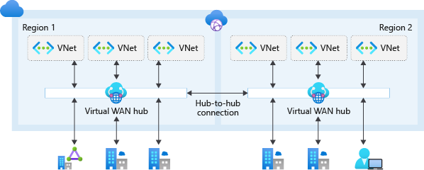
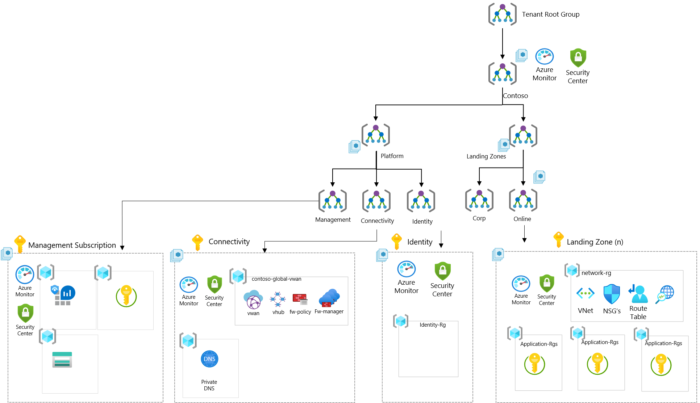

| ARM Template | Scale without refactoring |
|:--------------|:--------------|
| | Yes |

# Deploy Enterprise-Scale with Azure VWAN

The Enterprise-Scale architecture is modular by design and allows organizations to start with foundational landing zones that support their application portfolios and add hybrid connectivity with ExpressRoute or VPN when required. Alternatively, organizations can start with an Enterprise-Scale architecture based on an Azure Virtual WAN network topology if customers require hybrid connectivity to on-premises locations and global transit connectivity from the beginning.

Azure Virtual WAN is a Microsoft-managed solution that provides end-to-end, global, and dynamic transit connectivity by default. Virtual WAN hubs eliminate the need to manually configure network connectivity. For example, you don't need to manage user-defined routes (UDR) or network virtual appliances (NVAs) to enable global transit connectivity. Virtual WAN simplifies end-to-end network connectivity in Azure, and to Azure from on-premises, by creating a hub-and-spoke network architecture. The architecture can easily scale to support multiple Azure regions and on-premises locations (any-to-any connectivity) as shown in the following figure:

## Customer profile

This reference implementation is ideal for customers that have started their Enterprise-Scale journey with an Enterprise-Scale foundation implementation and then there is a need to add connectivity on-premises datacenters and branch offices by using Azure VWAN, ExpressRoute and VPN. This reference implementation is also well suited for customers who want to start with Landing Zones for their net new deployment/development in Azure, where a global transit network is required, including hybrid connectivity to on-premises datacenters and branch offices via ExpressRoute and VPN.

Please refer to [Enterprise-Scale Landing Zones User Guide](https://github.com/Azure/Enterprise-Scale/wiki/Deploying-Enterprise-Scale) for detailed information on prerequisites and deployment steps.

## How to evolve from Enterprise-Scale foundation

If customer started with a Enterprise-Scale foundation deployment, and if the business requirements changes over time, such as migration of on-prem applications to Azure that requires hybrid connectivity, you will simply create the **Connectivity** Subscription and place it into the **Platform > Connectivity** Management Group and assign Azure Policy for the VWAN network topology.

## Prerequisites

To deploy this ARM template, there are a number of prerequisites that must be met.
See [here](../../wiki/Deploying-ALZ-Pre-requisites.md) for more details.

### Optional prerequisites

The deployment experience in Azure portal allows you to bring in existing (preferably empty) subscriptions dedicated for platform management, connectivity and identity. It also allows you to bring existing subscriptions that can be used as the initial landing zones for your applications.

To learn how to create new subscriptions programmatically, please visit this [link](https://learn.microsoft.com/azure/cost-management-billing/manage/programmatically-create-subscription).

To learn how to create new subscriptions using Azure portal, please visit this [link](https://azure.microsoft.com/blog/create-enterprise-subscription-experience-in-azure-portal-public-preview/).

## How to deploy this reference implementation

Enterprise-Scale landing zones offers a single experience to deploy the different reference implementations. To deploy  Enterprise-Scale with Azure VWAN, click on the Deploy to Azure button at the top of this page and ensure you select the following options:

- In the **Enterprise-Scale core setup** blade, select the option for **Dedicated (recommended)** subscriptions for platform resources.
- In the **Network topology and connectivity** blade, select the **Virtual WAN (Microsoft managed)** network topology option.

The rest of the options across the different blades will depend on your environment and desired deployment settings. For detailed instructions for each of the deployment steps, refer to the [Enterprise-Scale Landing Zones user guide](https://github.com/Azure/Enterprise-Scale/wiki).

## What will be deployed?

- A scalable Management Group hierarchy aligned to core platform capabilities, allowing you to operationalize at scale using centrally managed Azure RBAC and Azure Policy where platform and workloads have clear separation.
- Azure Policies that will enable autonomy for the platform and the landing zones.
- An Azure subscription dedicated for **management**, which enables core platform capabilities at scale using Azure Policy such as:
  - A Log Analytics workspace and an Automation account
  - Azure Security Center monitoring
  - Azure Security Center (Standard or Free tier)
  - Azure Sentinel
  - Diagnostics settings for Activity Logs, VMs, and PaaS resources sent to Log Analytics
- An Azure Subscription dedicated for **connectivity**, which deploys core Azure networking resources such as:
  -  Azure VWAN
  - VWAN Hub
  - ExpressRoute Gateway (optional)
  - VPN Gateway (optional)
  - Azure Firewall (optional)
  - Firewall Policies (optional)  
  - Azure DDoS Network Protection (optional)
- An Azure Subscription dedicated for **identity**, where customers can deploy the Active Directory domain controllers required for their environment.
  - A virtual network will be deployed and will be connected to the hub VNet via VNet peering.
- Landing Zone Management Group for **corp** connected applications that require connectivity to on-premises, to other landing zones or to the internet via shared services provided in the VWAN hub.
  - This is where you will create your subscriptions that will host your corp-connected workloads.
- Landing Zone Management Group for **online** applications that will be internet-facing, where a virtual network is optional and hybrid connectivity is not required.
  - This is where you will create your Subscriptions that will host your online workloads.
- Landing zone subscriptions for Azure native, internet-facing **online** applications and resources.
- Landing zone subscriptions for **corp** connected applications and resources, including a virtual network.
- Azure Policies for online and corp-connected landing zones, which include:
  - Enforce VM monitoring (Windows & Linux)
  - Enforce VMSS monitoring (Windows & Linux)
  - Enforce Azure Arc VM monitoring (Windows & Linux)
  - Enforce VM backup (Windows & Linux)
  - Enforce secure access (HTTPS) to storage accounts
  - Enforce auditing for Azure SQL
  - Enforce encryption for Azure SQL
  - Prevent IP forwarding
  - Prevent inbound RDP from internet
  - Ensure subnets are associated with NSG

## Next steps

### From an application perspective

Once you have deployed the reference implementation, you can create new subscriptions, or move an existing subscriptions to the **Landing Zones** > **Online** or **Corp**  management group, and finally assign RBAC to the groups/users who should use the landing zones (subscriptions) so they can start deploying their workloads.

Refer to the [Create Landing Zone(s)](../../EnterpriseScale-Deploy-landing-zones.md) article for guidance to create Landing Zones.

