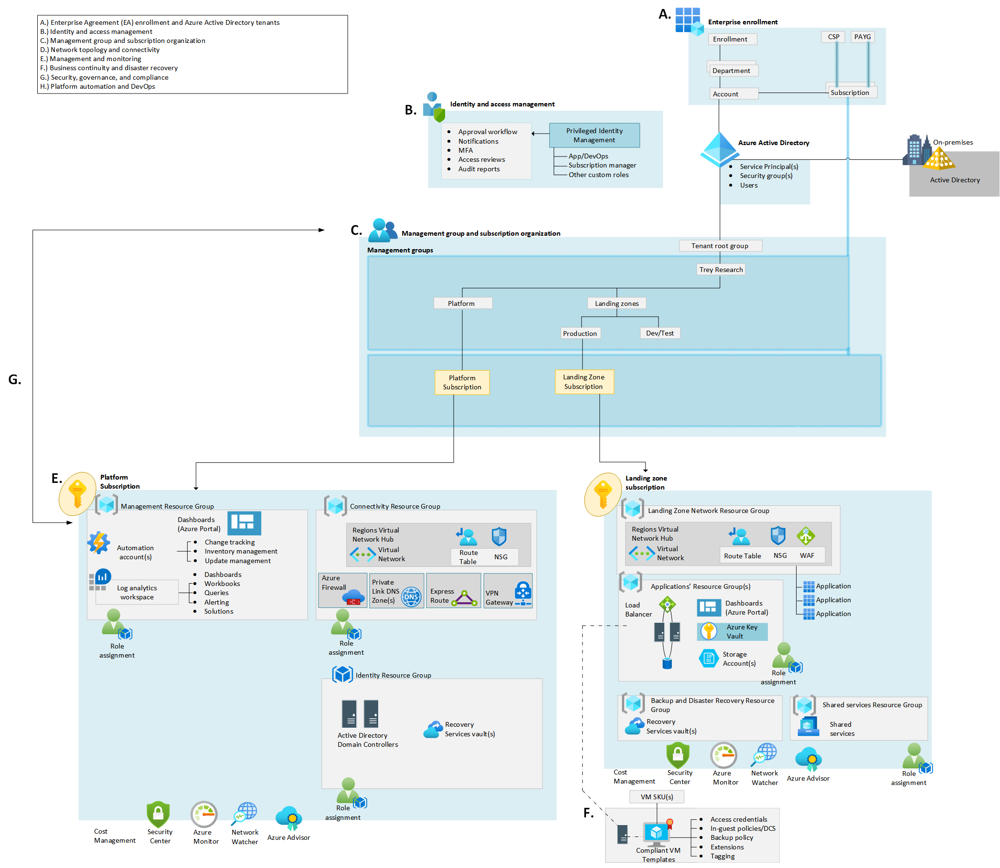

| Enterprise-Scale Design Principles | ARM Template | Scale without refactoring |
|:-------------|:--------------|:--------------|
||   | Yes |

# Deploy Enterprise-scale for small enterprises
The Enterprise-scale architecture is modular by design. It allows organizations to start with foundational landing zones that support their application portfolios, regardless of whether the applications are being migrated or are newly developed. The architecture enables organizations to start as small as needed and scale alongside their business requirements irrespective of scale point.

## Customer profile
This reference implementation provides a design path and initial technical state for Small and Medium Enterprises' Azure environment based on Azure Landing Zones Design Recommendations.

Enterprise-Scale Reference Implementation for Small Enterprises is meant for customers who are not expecting to deploy or migrate many Workloads to Azure and do not have a large IT organization. Therefore, this design focuses on simplicity and provides a Minimum Viable Product landing zone where production workloads can be deployed with confidence and managed by a small team.

The architecture enables organizations to start as small as needed and scale alongside their business requirements regardless of scale point

## Pre-requisites

To deploy this ARM template, your user/service principal must have Owner permission at the Tenant root.
See the following [instructions](https://docs.microsoft.com/en-us/azure/role-based-access-control/elevate-access-global-admin) on how to grant access.

### Optional prerequisites

The deployment experience in Azure portal allows you to bring in existing (preferably empty) subscriptions dedicated for platform management, connectivity and identity. It also allows you to bring existing subscriptions that can be used as the initial landing zones for your applications.

To learn how to create new subscriptions programatically, please visit this [link](https://docs.microsoft.com/en-us/azure/azure-resource-manager/management/programmatically-create-subscription?tabs=rest).

To learn how to create new subscriptions using Azure portal, please visit this [link](https://azure.microsoft.com/en-us/blog/create-enterprise-subscription-experience-in-azure-portal-public-preview/).

## What will be deployed?

*coming soon*

## Next steps

### Manage your Landing Zones

Once you have deployed the reference implementation, you can create new subscriptions, or move an existing subscriptions to the **Landing Zones** > **Online** or **Corp**  management group, and finally assign RBAC to the groups/users who should use the landing zones (subscriptions) so they can start deploying their workloads.

Refer to the [Create Landing Zone(s)](../../EnterpriseScale-Deploy-landing-zones.md) article for guidance to create Landing Zones.

#### Provision additional Landing Zones 

You can provision additional Landing Zones by moving new or existing subscriptions to an existing landing zone management group (for instance Online).

1. In Azure portal, navigate to Subscriptions.
2. Click 'Add', and complete the required steps in order to create a new subscription.
3. Go to Management Groups and move the subscription into the corresponding Landing Zone management group (for instance Online).
4. Create a Virtual Network in the new subscription.
5. Connect the new landing zone's Virtual Network to the virtual hub if hybrid connectivity is needed.
6. Assign RBAC permissions for the application team/user(s) who will be deploying resources to the newly created subscription.

Optionally, once you had completed steps 1 and 2 above, you can automate the provisioning of additional Landing Zones using the following ARM template:

 

#### Create an additional Landing Zone for a new type of workload

You can create landing zones with a different configuration by using the following ARM template:

 

#### Deploy a Web Application Firewall to an existing Landing Zone

*Coming soon...*

#### Deploy a Virtual Network to an existing Landing Zone

*Coming soon...*

#### Create an additional Landing Zone template / schema / archetype / type leveraging advanced Governance and Security Controls

*Coming soon...*

#### Import a Landing Zone template from the ES catalog

*Coming soon...*

### Extend your Platform

#### Enable Hybrid Connectivity using [Azure ExpressRoute](https://docs.microsoft.com/en-us/azure/expressroute/expressroute-introduction)

*Coming soon...*

#### Deploy a Perimeter Firewall in Azure

*Coming soon...*

#### Enable Hybrid Connectivity to an Azure Region 

If you skipped the deployment of the hybrid connectivity component when you bootstrapped your environment, or if you need to add support for additional regions, you can do it now by deploying a virtual hub, being VWAN (Microsoft managed) or hub & spoke (customer managed) as per your desired target networking topology, to the Platform subscription.

Optionally, you can enable the above using the following ARM templates:

| Connectivity setup | Description | ARM Template |
|:-------------------------|:-------------|:-------------|
| Virtual WAN | Deploys requisite infrastructure for on-premises connectivity with Virtual WAN  |    |
| Hub & Spoke | Deploys requisite infrastructure for on-premises connectivity with Hub & Spoke  |   |

Once the virtual hub had been deployed, you will need to connect the virtual hub with any of the existing Landing Zones (if any) that required hybrid connectivity by creating Virtual Network Peerings. See [Connect virtual networks with virtual network peering using the Azure portal](https://docs.microsoft.com/en-us/azure/virtual-network/tutorial-connect-virtual-networks-portal) for further details. 

