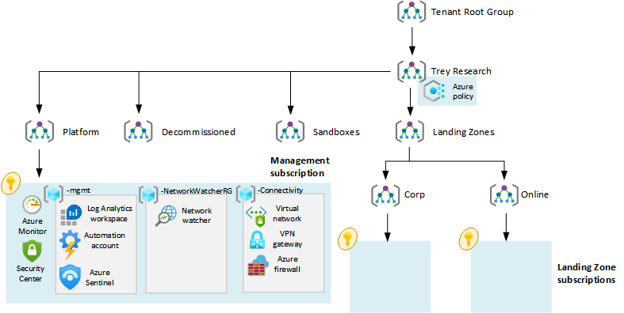

| Enterprise-Scale Design Principles | ARM Template | Scale without refactoring |
|:-------------|:--------------|:--------------|
||   | Yes |

# Deploy Enterprise-scale for small enterprises
The Enterprise-Scale architecture is modular by design. It allows organizations to start with foundational landing zones, regardless of whether the applications are being migrated or are newly developed and deployed to Azure. The architecture enables organizations to start as small as needed and scale alongside their business requirements regardless of scale point. 

## Customer profile
This reference implementation provides a design path and initial technical state for Small and Medium Enterprises Azure environment based on Azure Landing Zones Design Recommendations.

This architecture focuses on simplicity and provides a landing zone where a small team can confidently deploy and manage workloads.

## How to evolve later
If the business requirements change over time, the architecture allows for creating additional subscriptions and placing them into the suitable management group and assigning Azure policies. For more details, see the next steps section at the end of this document.

## Pre-requisites
To deploy this ARM template, your user/service principal must have Owner permission at the Azure Active Directory Tenant root. See the following [instructions](https://docs.microsoft.com/en-us/azure/role-based-access-control/elevate-access-global-admin) on how to grant access before you proceed.

## Optional pre-requisites
The Azure portal's deployment experience allows you to bring in existing (preferably empty) subscriptions dedicated to platform management and your applications' initial landing zone.

To learn how to create new subscriptions programmatically, please visit [Microsoft Docs](https://docs.microsoft.com/en-us/azure/azure-resource-manager/management/programmatically-create-subscription?tabs=rest). 

To learn how to create new subscriptions using the Azure portal, please visit [Microsoft Docs](https://azure.microsoft.com/en-us/blog/create-enterprise-subscription-experience-in-azure-portal-public-preview/). 

Most organizations may have an existing Azure footprint, one or more subscriptions, and potentially an existing management group structure. The [following article](https://docs.microsoft.com/en-us/azure/cloud-adoption-framework/ready/enterprise-scale/transition) helps organizations navigate the right path based on a current Azure environment transitioning into enterprise-scale. 
 
## What will be deployed?
By default, all recommendations are enabled. You must explicitly disable them if you don't want them to be deployed and configured.

- A scalable Management Group hierarchy allows you to operationalize at scale using centrally managed Azure RBAC and Azure Policy.  
- An Azure subscription dedicated to platform, connectivity, and identity. The subscription host core platform capabilities at scale, such as:  
  -	A Log Analytics workspace and an Automation account  
  -	Azure Security monitoring.  
  -	Azure Security Center (Standard or Free tier)  
  -	Diagnostics settings for Activity Logs, VMs, and PaaS resources sent to Log Analytics  
  -	A virtual hub network  
  -	Azure Firewall  
  -	VPN Gateway  
-	An Azure subscription dedicated to landing zones. The subscription host Azure workloads.   

## Next Step

### From a management perspective

#### Cost Management
Track resource usage and manage costs across all your clouds with a single, unified view, and access rich operational and financial insights to make informed decisions. See more about Cost Management at [Microsoft Docs](https://docs.microsoft.com/en-us/rest/api/cost-management/).

#### Backup and protect your workloads
The Azure Backup service provides simple, secure, and cost-effective solutions to back up your data and recover it from the Microsoft Azure cloud. See more about backup and data protection at [Microsoft Docs](https://docs.microsoft.com/en-us/azure/backup/backup-overview).

#### Configure security roles for your Azure resources 
Azure role-based access control (Azure RBAC) is a system that provides fine-grained access management of Azure resources. Using Azure RBAC, you can segregate your team's duties and grant only the amount of access to users that they need to perform their jobs. See more about security roles at [Microsoft Docs](https://docs.microsoft.com/en-us/azure/role-based-access-control/).

#### Manage your Landing Zones
Create an additional Landing Zone for a new type of workload. You can create landing zones with a different configuration by using the following [ARM template](
https://raw.githubusercontent.com/Azure/azure-quickstart-templates/master/1-CONTRIBUTION-GUIDE/images/deploytoazure.svg?sanitize=true) 

