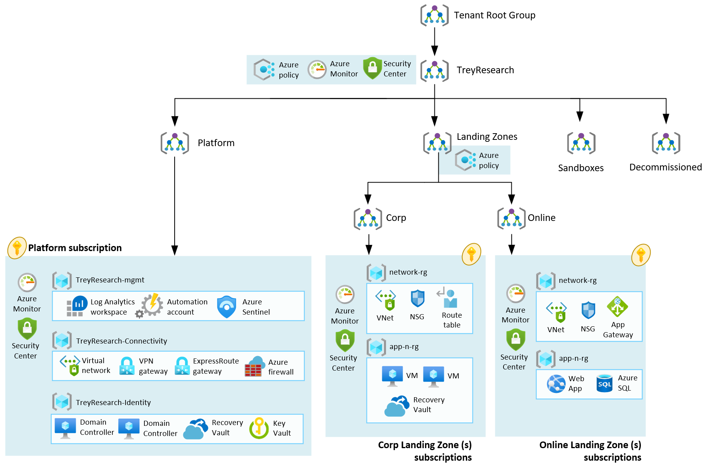

| ARM Template | Scale without refactoring |
|:--------------|:--------------|
|   | Yes |

# Deploy Enterprise-scale for small enterprises

The Enterprise-Scale architecture is modular by design. It allows organizations to start with foundational landing zones, regardless of whether the applications are being migrated or are newly developed and deployed to Azure. The architecture enables organizations to start as small as needed and scale alongside their business requirements regardless of scale point.

## Customer profile

This reference implementation provides a design path and initial technical state for Small and Medium Enterprises to start with foundational landing zones that support their application portfolios. This reference implementation is meant for organizations that do not have a large IT team and do not require fine grained administration delegation models. Hence, Management, Connectivity and Identity resources are consolidated in a single Platform Subscription.

This reference implementation is also well suited for customers who want to start with Landing Zones for their net new deployment/development in Azure by implementing a network architecture based on the traditional hub and spoke network topology.

Note: Alternatively, if you need to implement an operating model which facilitates segregating Platform administration duties among different teams, then we suggest considering leveraging [Adventure Works](https://github.com/Azure/Enterprise-Scale/blob/main/docs/reference/adventureworks/README.md) or [WingTip](https://github.com/Azure/Enterprise-Scale/blob/main/docs/reference/wingtip/README.md) reference implementations.

Please refer to [Enterprise-Scale Landing Zones User Guide](https://github.com/Azure/Enterprise-Scale/wiki/Deploying-Enterprise-Scale) for detailed information on prerequisites and deployment steps.

## How to evolve later

If the business requirements change over time, the architecture allows for creating additional subscriptions and placing them into the suitable management group and assigning Azure policies. For more details, see the next steps section at the end of this document.

## Prerequisites

To deploy this ARM template, there are a number of prerequisites that must be met.
See [here](../../wiki/Deploying-ALZ-Pre-requisites.md) for more details.

## Optional pre-requisites

The deployment experience in Azure portal allows you to bring in an existing (preferably empty) subscription dedicated to host your Platform (Management, Connectivity and Identity) resources. It also allows you to bring existing subscriptions that can be used as the initial landing zones for your applications.

To learn how to create new subscriptions programmatically, please visit [Microsoft Docs](https://learn.microsoft.com/azure/cost-management-billing/manage/programmatically-create-subscription).

To learn how to create new subscriptions using the Azure portal, please visit [Microsoft Docs](https://azure.microsoft.com/blog/create-enterprise-subscription-experience-in-azure-portal-public-preview/).

## How to deploy this reference implementation

Enterprise-Scale landing zones offers a single experience to deploy the different reference implementations. To deploy Enterprise-Scale for Small Enterprises, click on the Deploy to Azure button at the top of this page and ensure you select the following options:

- In the **Enterprise-Scale core setup** blade, select the option for **Single** subscription to host your Platform resources.
- In the **Network topology and connectivity** blade, select either **Hub and spoke with Azure Firewall**.

The rest of the options across the different blades will depend on your environment and desired deployment settings. For detailed instructions for each of the deployment steps, refer to the [Enterprise-Scale Landing Zones Deployment Guide](https://github.com/Azure/Enterprise-Scale/wiki/Deploying-Enterprise-Scale-BasicSetup).

### What will be deployed?

By default, all recommendations are enabled. You must explicitly disable them if you do not want them to be deployed and configured.

- A scalable Management Group hierarchy aligned to core platform capabilities, allowing you to operationalize at scale using centrally managed Azure RBAC and Azure Policy where platform and workloads have clear separation.
- An Azure subscription dedicated for management, connectivity, and identity. This subscription hosts core platform capabilities such as:  
  - A Log Analytics workspace and an Automation account.
  - Azure Sentinel.
  - A hub virtual network  
  - VPN Gateway (optional - deployment across Availability Zones)
  - ExpressRoute Gateway (optional - deployment across Availability Zones)
  - Azure Firewall (optional - deployment across Availability Zones)
- Landing Zone Management Group for **corp** connected applications that require connectivity to on-premises, to other landing zones or to the internet via shared services provided in the hub virtual network.
  - This is where you will create your subscriptions that will host your corp-connected workloads.
- Landing Zone Management Group for **online** applications that will be internet-facing, where a virtual network is optional and hybrid connectivity is not required.
  - This is where you will create your Subscriptions that will host your online workloads.
- Azure Policies that will enable autonomy for the platform and the landing zones:
  - The following Azure Policies are applied at the root of the Enterprise Scale Management Group hierarchy enabling core platform capabilities at scale:
    - Azure Security monitoring
    - Azure Security Center (Azure Defender OFF (free) and Azure Defender ON)
    - Diagnostics settings for Activity Logs, VMs, and PaaS resources sent to Log Analytics
  - On the other hand, Azure Policies that will apply to all your landing zones. That includes Online, Corp and additional Landing Zone's types you may add in the future:
    - Enforce VM in-guest monitoring (Windows & Linux)
    - Enforce Backup for all virtual machines (Windows & Linux) by deploying a recovery services vault in the same location and resource group as the virtual machine
    - Ensure encryption in transit is enabled for PaaS services
    - Prevent inbound RDP from Internet
    - Ensure subnets are associated with NSG
    - Prevent IP forwarding
    - Enforce encryption for Azure SQL
    - Enforce auditing for Azure SQL
    - Enforce secure access (HTTPS) to storage accounts

  **Note:** You may notice the creation of different *managed identities* after deploying the policies described above. This is because a policy with effect *deployIfNotExists (DINE) or modify* will be enforced when enabling a recommendation. These kind of policy effects use managed identities in order to remediate resources that are not compliant. To learn more about what policies are included in ALZ reference implementations, refer to [ALZ Policies](https://github.com/Azure/Enterprise-Scale/wiki/ALZ-Policies).   
  

## Next steps

### From an application perspective

#### Configure security roles for your Azure resources

Assign Azure RBAC permissions to the groups/users who should use the landing zones (subscriptions) so they can start deploying their workloads.

Azure role-based access control (Azure RBAC) is a system that provides fine-grained access management of Azure resources. Using Azure RBAC, you can segregate your team's duties and grant only the amount of access to users that they need to perform their jobs. See more about security roles at [Microsoft Docs](https://learn.microsoft.com/azure/role-based-access-control/).

#### Manage your Landing Zones

Once you have deployed the reference implementation, you can create new subscriptions, or move an existing subscriptions to the **Landing Zones** > **Online** or **Corp**  management group, and finally assign RBAC to the groups/users who should use the landing zones (subscriptions) so they can start deploying their workloads.

Refer to the [Create Landing Zone(s)](../../EnterpriseScale-Deploy-landing-zones.md) article for guidance to create Landing Zones.
