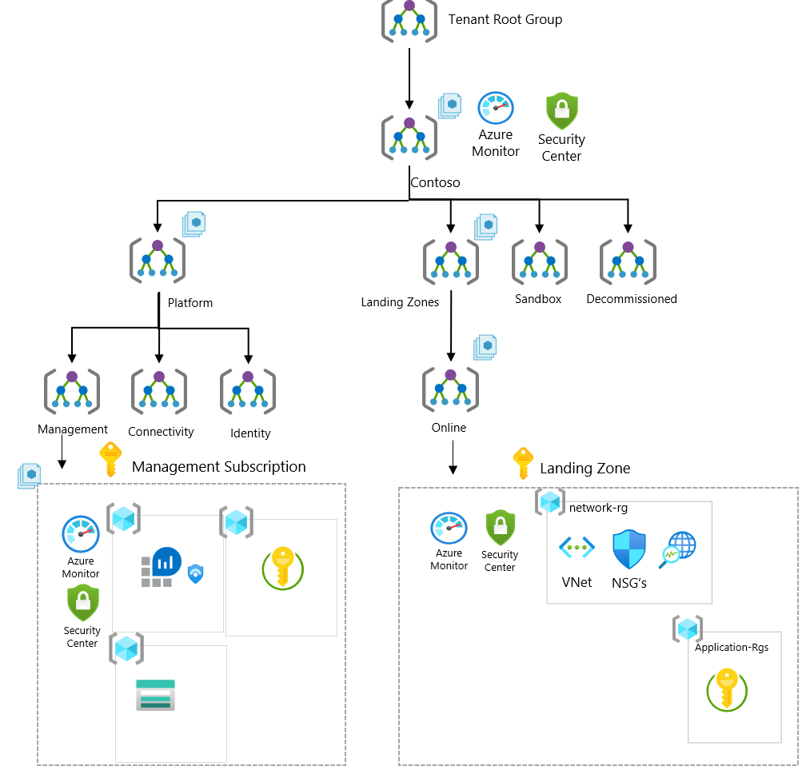

| ARM Template | Scale without refactoring |
|:--------------|:--------------|
| | Yes |

# Deploy Enterprise-Scale foundation

The Enterprise-Scale architecture is modular by design and allow organizations to start with foundational landing zones that support their application portfolios, regardless of whether the applications are being migrated or are newly developed and deployed to Azure. The architecture enables organizations to start as small as needed and scale alongside their business requirements regardless of scale point.

## Customer profile

This reference implementation is ideal for customers who want to start with Landing Zones for their workloads in Azure, where hybrid connectivity to their on-premises datacenter is not required from the start.

Please refer to [Enterprise-Scale Landing Zones User Guide](https://github.com/Azure/Enterprise-Scale/wiki/Deploying-Enterprise-Scale) for detailed information on prerequisites and deployment steps.

## How to evolve and add support for hybrid connectivity later

If the business requirements changes over time, such as migration of on-prem applications to Azure that requires hybrid connectivity, the architecture allows you to expand and implement networking without refactoring Azure Design with no disruption to what is already in Azure. The Enterprise-Scale architecture allows to create the Connectivity Subscription and place it into the platform Management Group and assign Azure Policies or/and deploy the target networking topology using either Virtual WAN or Hub and Spoke networking topology.
For more details, see the *next steps* section at the end of this document.

## Prerequisites

To deploy this ARM template, there are a number of prerequisites that must be met.
See [here](../../wiki/Deploying-ALZ-Pre-requisites.md) for more details.

### Optional pre-requisites

The deployment experience in Azure portal allows you to bring in an existing (preferably empty) subscription dedicated for platform management, and an existing subscription that can be used as the initial landing zone for your applications.

To learn how to create new subscriptions programmatically, please visit this [link](https://learn.microsoft.com/azure/cost-management-billing/manage/programmatically-create-subscription).

To learn how to create new subscriptions using Azure portal, please visit this [link](https://azure.microsoft.com/blog/create-enterprise-subscription-experience-in-azure-portal-public-preview/).

<!-- ## Enterprise-Scale Management Group Structure

The Management Group structure implemented with Enterprise-Scale is as follows:
* Top-level Management Group (directly under the tenant root group) is created with a prefix provided by the organization, which purposely will avoid the usage of the root group to allow organizations to move existing Azure subscriptions into the hierarchy, and also enables future scenarios. This Management Group is parent to all the other Management Groups created by Enterprise-Scale
* Platform: This Management Group contains all the platform child Management Groups, such as Management, Connectivity, and Identity. Common Azure Policies for the entire platform is assigned at this level
* Management: This Management Group contains the dedicated subscription for management, monitoring, and security, which will host Azure Log Analytics, Azure Automation, and Azure Sentinel. Specific Azure policies are assigned to harden and manage the resources in the management subscription.
* Landing Zones: This is the parent Management Group for all the landing zone subscriptions and will have workload agnostic Azure Policies assigned to ensure workloads are secure and compliant.
* Online: This is the dedicated Management Group for Online landing zones, meaning workloads that may require direct inbound/outbound connectivity.
* Sandboxes: This is the dedicated Management Group for subscriptions that will solely be used for testing and exploration by an organization’s application teams. These subscriptions will be securely disconnected from the Corp and Online landing zones.
* Decommissioned: This is the dedicated Management Group for landing zones that are being cancelled, which then will be moved to this Management Group before deleted by Azure after 30-60 days. -->

## How to deploy this reference implementation

Enterprise-Scale landing zones offers a single experience to deploy the different reference implementations. To deploy  Enterprise-Scale foundation, click on the Deploy to Azure button at the top of this page and ensure you select the following options:

- In the **Enterprise-Scale core setup** blade, select the option for **Dedicated (recommended)** subscriptions for platform resources.
- In the **Network topology and connectivity** blade, under **Deploy network topology** select **No**.

The rest of the options across the different blades will depend on your environment and desired deployment settings. For detailed instructions for each of the deployment steps, refer to the [Enterprise-Scale Landing Zones user guide](https://github.com/Azure/Enterprise-Scale/wiki).

## What will be deployed?

By default, all recommendations are enabled, and you must explicitly disable them if you don't want them to be deployed and configured.

- A scalable Management Group hierarchy aligned to core platform capabilities, allowing you to operationalize at scale using centrally managed Azure RBAC and Azure Policy where platform and workloads have clear separation.
- Azure Policies that will enable autonomy for the platform and the landing zones.
- An Azure subscription dedicated for Management, which enables core platform capabilities at scale using Azure Policy such as:
  - A Log Analytics workspace and an Automation account
  - Azure Security Center monitoring
  - Azure Security Center (Standard or Free tier)
  - Azure Sentinel
  - Diagnostics settings for Activity Logs, VMs, and PaaS resources sent to Log Analytics
- (Optionally) An Azure subscription dedicated for Identity in case your organization requires to have Active Directory Domain Controllers in a dedicated subscription.
- Landing Zone Management Group for Online applications that will be internet-facing, where a virtual network is optional and hybrid connectivity is not required.
  - This is where you will create your Subscriptions that will host your online workloads.
- Landing zone subscriptions for Azure native, internet-facing Online applications and resources.
- Azure Policies for online landing zones, which include:
  - Enforce VM monitoring (Windows & Linux)
  - Enforce VMSS monitoring (Windows & Linux)
  - Enforce Azure Arc VM monitoring (Windows & Linux)
  - Enforce VM backup (Windows & Linux)
  - Enforce secure access (HTTPS) to storage accounts
  - Enforce auditing for Azure SQL
  - Enforce encryption for Azure SQL
  - Prevent IP forwarding
  - Prevent inbound RDP from internet
  - Ensure subnets are associated with NSG

## Next steps

### From a platform perspective

If you later want to add connectivity to your Enterprise-Scale architecture to support workloads requiring hybrid connectivity, you can:

1. Create a new child management group called 'Connectivity' in the Platform management group
2. Move/create new subscription into the Connectivity management group
3. Deploy your desired networking topology, being VWAN (Microsoft managed) or hub & spoke (customer managed)
4. Create new management group (Corp) in the landing zone management group, to separate connected workloads from online workloads.

### From an application perspective

Once you have deployed the reference implementation, you can create new subscriptions, or move an existing subscriptions to the Landing Zone management group (Online), and finally assign RBAC to the groups/users who should use the landing zones (subscriptions) so they can start deploying their workloads.

Refer to the [Create Landing Zone(s)](../../EnterpriseScale-Deploy-landing-zones.md) article for guidance to create Landing Zones.
