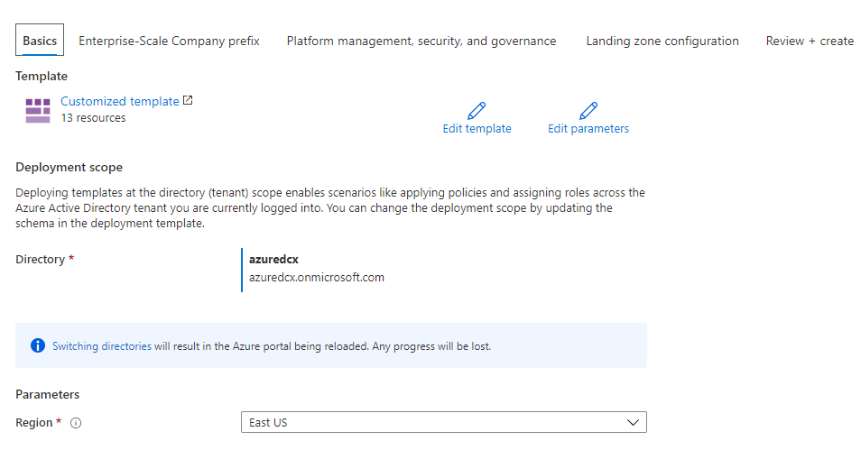
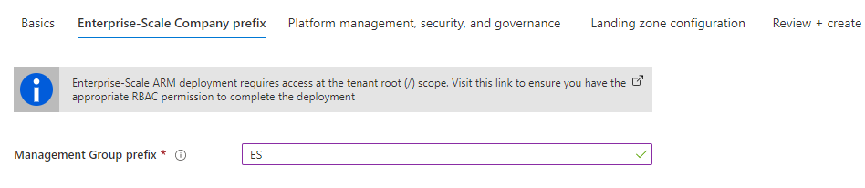
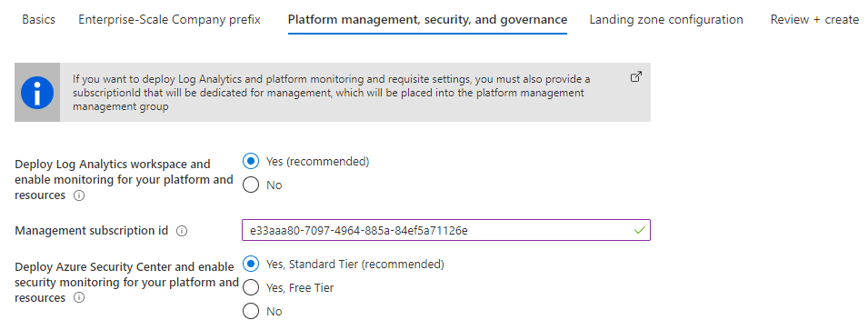
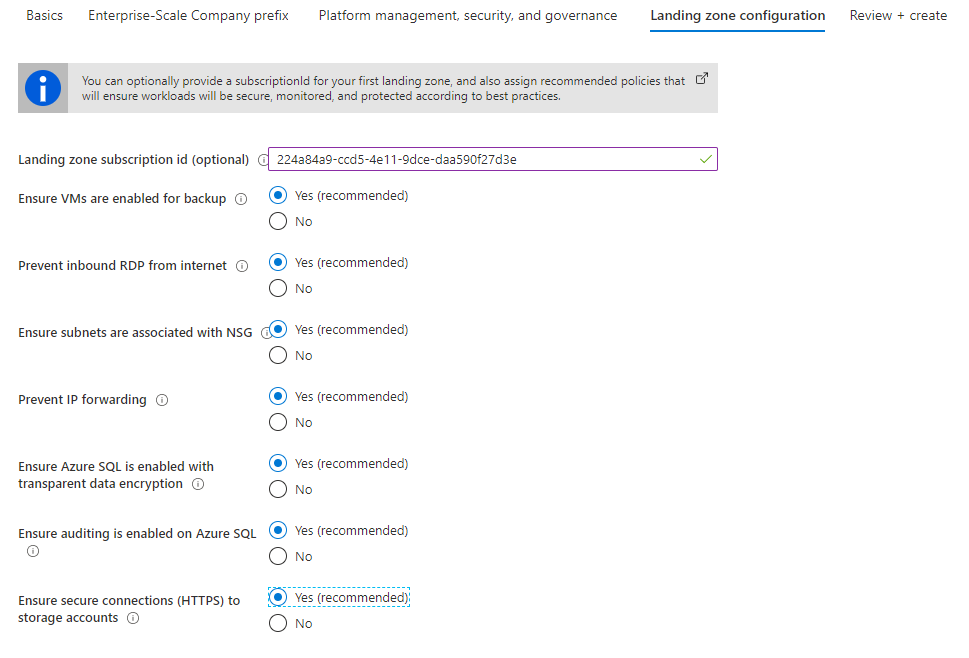
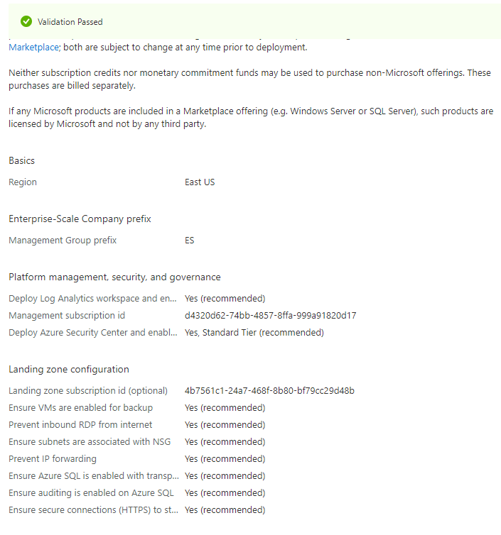

| Enterprise-Scale Design Principles | ARM Template | Scale without refactoring |
|:-------------|:--------------|:--------------|
||[](https://ms.portal.azure.com/?feature.customportal=false#create/Microsoft.Template/uri/https%3A%2F%2Fraw.githubusercontent.com%2FAzure%2FEnterprise-Scale%2Fmain%2Fdocs%2Freference%2Fwingtip%2FarmTemplates%2Fes-foundation.json/createUIDefinitionUri/https%3A%2F%2Fraw.githubusercontent.com%2FAzure%2FEnterprise-Scale%2Fmain%2Fdocs%2Freference%2Fwingtip%2FarmTemplates%2Fportal-es-foundation.json)  | Yes |

# Deploy Enterprise-Scale foundation

The Enterprise-Scale architecture is modular by design and allow organizations to start with foundational landing zones that support their application portfolios, regardless of whether the applications are being migrated or are newly developed and deployed to Azure. The architecture enables organizations to start as small as needed and scale alongside their business requirements regardless of scale point.

## Customer profile

This reference implementation is ideal for customers who want to start with Landing Zones for their workload in Azure, where hybrid connectivity to their on-premise datacenter is not required from the start.

## How to evolve and add support for hybrid connectivity later

If the business requirements changes over time, such as migration of on-prem applications to Azure that requires hybrid connectivity, the architecture allows you to expand and implement networking without refactoring Azure Design with no disruption to what is already in Azure. The Enterprise-Scale architecture allows to create the Connectivity Subscription and place it into the platform Management Group and assign Azure Policies or/and deploy the target networking topology using either Virtual WAN or Hub and Spoke networking topology.
For more details, see the *next steps* section at the end of this document.

## Pre-requisites

To deploy this ARM template, your user/service principal must have Owner permission at the Tenant root.
See the following [instructions](../../EnterpriseScale-Setup-azure.md) on how to grant access before you proceed.

### Optional pre-requsites

The deployment experience in Azure portal allows you to bring in an existing (preferably empty) subscription dedicated for platform management, and an existing subscription that can be used as the initial landing zone for your applications. In order to provide the information, we require the subscription id to be provided to the parameters.

To learn how to create new subscriptions programatically, please visit this [link](https://docs.microsoft.com/en-us/azure/azure-resource-manager/management/programmatically-create-subscription?tabs=rest).

To learn how to create new subscriptions using Azure porta, please visit this [link](https://azure.microsoft.com/en-us/blog/create-enterprise-subscription-experience-in-azure-portal-public-preview/).

To find the subscriptionId's you want to provide, you can either navigate to Azure portal and retrive them from there, or use PowerShell/CLI:

Azure CLI

````bash
az account list --query "[].[name, id]" --output table
````

Azure PowerShell

````powershell
Get-AzSubscription | Select Name, SubscriptionId
````

## What will be deployed?

- A scalable Management Group hierarchy aligned to core platform capabilities, allowing you to operationalize at scale using centrally managed Azure RBAC and Azure Policy.
- Azure Policies that will enable autonomy for the platform and the Landing Zones.
- [Optional] An Azure subscription dedicated for management, which enables core platform capabilities at scale such as:
  - A Log Analytics workspace and an Automation account
  - Azure Security Center monitoring
  - Azure Security Center (Standard or Free tier)
  - Diagnostics settings for Activity Logs, VMs, and PaaS resources sent to Log Analytics
- [Optional] A landing zone subscription for Azure native, internet-facing applications and Resources, and specific workload policies such as:
  - Enforce VM backup
  - Enforce secure access (HTTPS) to storage accounts
  - Enforce auditing for Azure SQL
  - Enforce encryption for Azure SQL
  - Prevent IP forwarding
  - Prevent inbound RDP from internet
  - Ensure subnets are associated with NSG


## Deployment experience

When you click on [Deploy to Azure](https://ms.portal.azure.com/?feature.customportal=false#create/Microsoft.Template/uri/https%3A%2F%2Fraw.githubusercontent.com%2FAzure%2FEnterprise-Scale%2Fmain%2Fdocs%2Freference%2Fwingtip%2FarmTemplates%2Fes-foundation.json/createUIDefinitionUri/https%3A%2F%2Fraw.githubusercontent.com%2FAzure%2FEnterprise-Scale%2Fmain%2Fdocs%2Freference%2Fwingtip%2FarmTemplates%2Fportal-es-foundation.json), the portal will open the deployment experience for Enterprise-Scale.

On the 'Basics' page, ensure you are signed into the correct directory (tenant), and select the region that will be used for template deployments (we recommend you to select the region where you ideally want to deploy your first resources).

### Basics



When you click next, you must provide the company prefix for the management group hiearchy that will be created under the default "Tenant Root Group". The prefix can be between 1-5 characters.

### Enterprise-Scale Company prefix



For "Platform management, security, and governance", you can optionally deploy Log Analytics workspace and enable all-up monitoring for your platform and resources.
If "Yes" is selected, you must provide a subscriptionId for the subscription that will be dedicated for platform management.
Optionally, you can also enable Azure Security Center and security monitoring for the platform as part of this process.

### Platform management, security, and governance



The last step is to optionally enable recommended Azure policies for your initial landing zone, and you can also provide a subscriptionId of an existing subscription that will be moved into the designated child management group in your landing zone management group.

### Landing zone configuration



When you have completed the steps, a final validation is done to ensure you have the appropriate RBAC permissions on the involved scopes to do a successful deployments. Once validated, you can review your input and make any changes as needed, and click "Create" to start your Enterprise-Scale deployment.



## Next steps

### From a platform perspective:

If you later want to add connectivity to your Enterprise-Scale architecture to support workloads requiring hybrid connectivity, you can:

1. Create a new child management group called 'Connectivity' in the Platform management group
2. Move/create new subscription into the Connectivity management group
3. Deploy your desired networking topology, being VWAN (Microsoft managed) or hub & spoke (customer managed)
4. Create new management group (Corp) in the landing zone management group, to separate connected workloads from online workloads.

Optionally, you can enable the above using the following ARM templates:

| Connectivity setup | Description | ARM Template |
|:-------------------------|:-------------|:-------------|
| Virtual WAN | Deploys requisite infrastructure for on-premises connectivity with Virtual WAN  |[](https://ms.portal.azure.com/?feature.customportal=false#create/Microsoft.Template/uri/https%3A%2F%2Fraw.githubusercontent.com%2FAzure%2FEnterprise-Scale%2Fmain%2Fdocs%2Freference%2Fwingtip%2FarmTemplates%2Fes-add-vwan.json/createUIDefinitionUri/https%3A%2F%2Fraw.githubusercontent.com%2FAzure%2FEnterprise-Scale%2Fmain%2Fdocs%2Freference%2Fwingtip%2FarmTemplates%2Fportal-es-add-vwan.json) |
| Hub & Spoke | Deploys requisite infrastructure for on-premises connectivity with Hub & Spoke  |<!-- [](https://ms.portal.azure.com/?feature.customportal=false#create/Microsoft.Template/uri/https%3A%2F%2Fraw.githubusercontent.com%2FAzure%2FAzOps%2Fmain%2Ftemplate%2Fux-hub-spoke.json) --> ETA (8/15) |

### From an application perspective:

Once you have deployed the reference implementation, you can create new subscriptions, or move an existing subscriptions to the Landing Zone management group (Online), and start deploying your workload.

#### Create new subscriptions into the landing zone (Online) management group

1. In Azure portal, navigate to Subscriptions
2. Click 'Add', and complete the required steps in order to create a new subscription.
3. When the subscription has been created, go to Management Groups and move the subscription into the Landing Zone (Online) management group
4. Assign RBAC permissions for the application team/user(s) who will be deploying resources to the newly created subscription

#### Move existing subscriptions into the landing zone (Online) management group

1. In Azure portal, navigate to Management Groups
2. Locate the subscription you want to move, and move it to the landing zone (Online) management group
3. Assign RBAC permissions for the application team/user(s) who will be deploying resources to the subscription