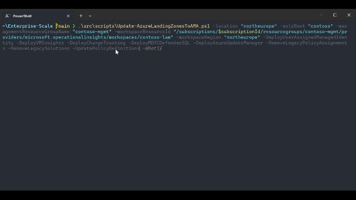

# Introduction

The ALZ Portal Accelerator has recently been enhanced, and starting with the 2024-01-31 release, has removed the legacy MMA agent and now deploys Azure Monitor Agent (AMA) to new environments. With the 2024-06-03 release, there are also updates for User Assigned Managed Identities. Azure Landing Zones has transitioned to using one centralized User Assigned Managed Identity. This consolidation of User Assigned Managed Identity for AMA represents an important improvement in managing deployments at scale more effectively. Please refer to [What’s new](https://github.com/Azure/Enterprise-Scale/wiki/Whats-new) for more information.

This guide explains the topics and configurations that Azure Landing Zones use, and we discuss many of the common scenarios in the section on assessing the current state. However, this guide does not provide detailed instructions for custom implementations or extra features that are not part of Azure Landing Zones. For those scenarios, we refer to the documentation from the Product teams.

If you are looking for Terraform guidance please refer to [\[User Guide\] Upgrade from v5.2.1 to v6.0.0](https://github.com/Azure/terraform-azurerm-caf-enterprise-scale/wiki/%5BUser-Guide%5D-Upgrade-from-v5.2.1-to-v6.0.0)

And for Bicep guidance refer to: [v0.18.0 Release Notes](https://github.com/Azure/ALZ-Bicep/releases/tag/v0.18.0)

## Parity gaps

Please check the most recent information on parity gaps before you begin:

- [Known parity gaps for solutions that may impact your migration](https://learn.microsoft.com/en-us/azure/azure-monitor/agents/azure-monitor-agent-migration#known-parity-gaps-for-solutions-that-may-impact-your-migration)
- [Microsoft Sentinel Gap analysis between agents](https://learn.microsoft.com/en-us/azure/sentinel/ama-migrate#gap-analysis-between-agents)
- [Change Tracking and Inventory using Azure Monitoring Agent doesn't support or has the following limitations](https://learn.microsoft.com/en-us/azure/automation/change-tracking/overview-monitoring-agent?tabs=win-az-vm#current-limitations)

## MDfC Defender for Servers

All Defender for Servers features and capabilities will be provided through a single agent Microsoft Defender for Endpoint (MDE) integration, complemented by agentless capabilities, without dependency on either Log Analytics Agent (MMA) or Azure Monitoring Agent (AMA). Please refer to the following blog post containing the latest information [Microsoft Defender for Cloud - strategy and plan towards Log Analytics Agent (MMA) deprecation - Microsoft Community Hub](https://techcommunity.microsoft.com/t5/microsoft-defender-for-cloud/microsoft-defender-for-cloud-strategy-and-plan-towards-log/ba-p/3883341)

## This guide covers the following topics

- **Assess current state:** Identify and determine the steps required to migrate to AMA.
- **Update Azure Landing Zones:** Guidance and automation to update your Azure Landing Zones components. Automation helps configure the following tasks:
  - Deploy User Assigned Managed Identity
  - Deploy Data Collection Rules
  - Update Policy and Initiative definitions
  - Remove Legacy Policy Assignments
  - Remove Legacy Solutions
  - Assigning new Policies and Initiatives
  - Assign permissions to Landing Zones managed identity
  - Policy remediation
- **Removing MMA and additional steps:** Depending on the discoveries during the initial assessment you may need to run additional steps before you can remove MMA. Please refer to the tooling and guidance provided by the product team:
  - Configure additional Data collection Rules (DCR Config Generator)
  - AMA Migration for Microsoft Sentinel. Configuring connectors to send events via AMA
  - Installing AMA on Non-Azure VMs with Azure Arc
  - Update your Hybrid Workers (V1) to Extension based Hybrid Workers (V2)
  - Custom settings for Change Tracking data types
  - Migrating schedules to Azure Update Manager
  - Removing MMA Agent

## Migration paths

1. [Migrate from MMA to AMA](#migrate-from-mma-to-ama). Applies to releases:
   a. 2024-01-07 and earlier
1. [Update to latest AMA release](#update-to-latest-ama-release). Applies to releases:
   a. 2024-04-24
   a. 2024-03-08
   a. 2024-03-04
   a. 2024-02-14
   a. 2024-02-12
   a. 2024-02-07
   a. 2024-02-05
   a. 2024-01-31

# Migrate from MMA to AMA

## Assess current state

Although this guidance is concentrated on managing resources within Azure Landing Zones, it is crucial to be aware of other settings in your environment that may necessitate further considerations and steps when planning to migrate.

It's advisable to evaluate and record the information listed below, each of these points will be covered in more detail:

- Identify which computers are linked to the Log Analytics Workspace.
- Identify which Agents have VM Insights enabled.
- Identify what Windows event logs the legacy agent’s collects.
- Identify what Windows performance counters are collected via legacy agents.
- Identify what Linux performance counters are collected via legacy agents.
- Identify which Linux Syslog are collected by legacy agents.
- Review if Windows IIS Logs are being collected through legacy agents.
- Review whether any custom logs are collected using legacy agents.
- Document Legacy Workspace Solutions that are implemented within the Workspace.
- Document which legacy agents are set up as Hybrid Workers within Automation Accounts.

### AMA Migration Helper

AMA Migration Helper is a workbook-based Azure Monitor solution that helps you discover what to migrate and track progress as you move from Log Analytics Agent to Azure Monitor Agent. [AMA Migration Helper](https://learn.microsoft.com/en-us/azure/azure-monitor/agents/azure-monitor-agent-migration-tools#using-ama-migration-helper)

### Non-Azure VMs

Should you encounter Non-Azure Virtual Machines utilizing the MMA agent, it is required to on-board them to Azure Arc prior to setting up AMA. Follow the Azure Arc documentation for guidance [Plan and deploy Azure Arc-enabled servers - Azure Arc](https://learn.microsoft.com/en-us/azure/azure-arc/servers/plan-at-scale-deployment)

### Microsoft Sentinel

If Microsoft Sentinel is used in your environment, please refer to the recommended migration plan for additional steps and guidance. [AMA migration for Microsoft Sentinel](https://learn.microsoft.com/en-us/azure/sentinel/ama-migrate)

### Change Tracking

This guide assumes the default configuration, if you have changed the settings for Change Tracking data types, see migration options here: [Migration guidance from Change Tracking and inventory using Log Analytics to Change Tracking and inventory using Azure Monitoring Agent version](https://learn.microsoft.com/en-us/azure/automation/change-tracking/guidance-migration-log-analytics-monitoring-agent?tabs=ct-single-vm%2Climit-single-vm)

### Azure Update Manager

Azure Landing Zones assigns policies that enable periodic assessments in Azure Update Manager. If you require to migrate additional configurated like schedules please consult [Move from Automation Update Management to Azure Update Manager](https://learn.microsoft.com/en-us/azure/update-manager/guidance-migration-automation-update-management-azure-update-manager?tabs=update-mgmt#step-1-migration-of-machines-and-schedules)

### Migrate additional services and features

Azure Monitor Agent is GA for data collection. Most services that used Log Analytics agent for data collection have migrated to Azure Monitor Agent. Refer to the table provided here [Migrate additional services and features](https://learn.microsoft.com/en-us/azure/azure-monitor/agents/azure-monitor-agent-migration#migrate-additional-services-and-features) for more information.

### Identify which computers are linked to the Log Analytics Workspace

Use the following KQL query on the Log Analytics Workspace to identify computers that are linked to the Log Analytics Workspace:

```kusto
Heartbeat
| where TimeGenerated >= ago(7d)
| summarize make_set(Category) by Computer
| extend Legacy = iif(set_Category contains "Direct" or set_Category contains "SCOM", true, false)
| extend AMA = iif(set_Category contains "Monitor", true, false)
| extend Status = case(
  Legacy == true and AMA == false, "Not started",
  Legacy == true and AMA == true, "In progress",
  "Completed"
  )
| project-away set_Category
| order by Computer asc
| project
  Computer,
  ["Migration Status"] = Status,
  ["Legacy Installed"] = Legacy,
  ["AMA Installed"] = AMA
```

### Identify which Agents have VM Insights enabled

Use the following KQL query on the Log Analytics Workspace to identify agents that VM Insights enabled:

```kusto
Heartbeat
| where Category == 'Direct Agent' or Category contains 'SCOM'
| distinct Computer
| join kind=fullouter (
InsightsMetrics
| distinct Computer
| join kind = fullouter (VMConnection | distinct Computer) on Computer
| extend ['Guest performance'] = iif(Computer != '', true, false)
| extend ['Processes and dependencies (Map)'] = iif(Computer1 != '', true, false)
| extend Computer = iif(Computer == '',Computer1, Computer)
| project-away Computer1
) on Computer
| where Computer != ''
| project-away Computer1
| order by Computer desc
```

### Identify what event logs and performance counters the legacy agent’s collects

To identify which Event logs, Syslog, Performance counters and IIS are being collected review the corresponding tabs in **Log Analytics Workspace > Classic > Legacy agents management**.

To find out more about the computers from which the IIS logs are gathered, run the following KQL query.

```kusto
W3CIISLog
| distinct Computer
```

To identify whether custom logs are collected go to **Log Analytics Workspace > Settings > Tables** and document any entries of type **Custom table (classic)**. To Identify from which computers custom logs are collected run the following KQL query for each Custom Table:

```kusto
TableName_CL
| distinct Computer
```

To find out which computers have Change Tracking enabled, execute the following KQL query:

```kusto
ConfigurationData
| distinct Computer
```

### Document which legacy agents are set up as Hybrid Workers within Automation Accounts

Agent-based (V1) Hybrid Runbook Workers rely on the Log Analytics agent reporting to an Azure Monitor Log Analytics workspace. To discover the Hybrid Workers running the V1 configuration review the automation account information **Automation Accounts > Process Automation > Hybrid worker groups**.

## Update Azure Landing Zones

> [!CAUTION]
> This script intended for Azure Landing Zone Portal Accelerator deployments only. It is not for Terraform and Bicep deployments of ALZ.
>
> IMPORTANT: THIS SCRIPT WILL DEPLOY, UNASSIGN AND REMOVE RESOURCES! We recommend that you have carefully assessed your current state and followed the guidance from both the Azure Landing Zones documentation and the public documentation that it references. Use the -WhatIf parameter to see what the changes will do before you apply them.

1. Start PowerShell
1. Clone the Enterprise-Scale repository <br><br>
   `git clone https://github.com/Azure/Enterprise-Scale.git` <br><br>
1. Change directory <br><br>
   `cd .\Enterprise-Scale\` <br><br>
1. Login to Azure: <br><br>
   `Login-AzAccount` <br><br>
1. Select your management subscription <br><br>
   `Select-AzSubscription -Subscription {subscriptionId}` <br><br>

> [!TIP]
> We highly recommend running the script with -WhatIf to see what the changes will do before you apply them.

### To run the script with -WhatIf

Set the correct values for:

- -location
- -eslzRoot
- -managementResourceGroupName
- -workspaceResourceId
- -workspaceRegion

```powershell
.\src\scripts\Update-AzureLandingZonesToAMA.ps1 -location "northeurope" -eslzRoot "contoso" -managementResourceGroupName "contoso-mgmt" -workspaceResourceId "/subscriptions/{subscriptionId}/resourceGroups/{resourceGroupName}/providers/Microsoft.OperationalInsights/workspaces/{workspaceName}" -workspaceRegion "northeurope" -migrationPath MMAToAMA -DeployUserAssignedManagedIdentity -DeployVMInsights -DeployChangeTracking -DeployMDfCDefenderSQL -DeployAzureUpdateManager -RemoveLegacyPolicyAssignments -RemoveLegacySolutions -UpdatePolicyDefinitions -WhatIf
```

#### Example result of running the ALZ MMA to AMA migration with `-WhatIf`


### Migrate to AMA

Set the correct values for:

- -location
- -eslzRoot
- -managementResourceGroupName
- -workspaceResourceId
- -workspaceRegion

> [!TIP]
> You don't have to update everything at once. Use the switches like `-DeployVMInsights` to update specific features.

```powershell
.\src\scripts\Update-AzureLandingZonesToAMA.ps1 -location "northeurope" -eslzRoot "contoso" -managementResourceGroupName "contoso-mgmt" -workspaceResourceId "/subscriptions/{subscriptionId}/resourceGroups/{resourceGroupName}/providers/Microsoft.OperationalInsights/workspaces/{workspaceName}" -workspaceRegion "northeurope" -migrationPath MMAToAMA -DeployUserAssignedManagedIdentity -DeployVMInsights -DeployChangeTracking -DeployMDfCDefenderSQL -DeployAzureUpdateManager -RemoveLegacyPolicyAssignments -RemoveLegacySolutions -UpdatePolicyDefinitions
```

#### Example result of running the ALZ MMA to AMA migration



### Remediate Policies

The script can be used to remediate the newly assigned policies. Before running the remediations please wait for the Policy Engine to process the compliance state for the new assignments (alternatively you can use Start-AzPolicyComplianceScan)

Set the correct values for:

- -location
- -eslzRoot
- -managementResourceGroupName
- -workspaceResourceId
- -workspaceRegion

```powershell
.\src\scripts\Update-AzureLandingZonesToAMA.ps1 -location "northeurope" -eslzRoot "contoso" -managementResourceGroupName "contoso-mgmt" -workspaceResourceId "/subscriptions/{subscriptionId}/resourceGroups/{resourceGroupName}/providers/Microsoft.OperationalInsights/workspaces/{workspaceName}" -workspaceRegion "northeurope" -migrationPath MMAToAMA -RemediatePolicies
```

## Removing MMA and additional steps

Depending on your situation and the outcome of your evaluation of the current state, you may require additional steps.

### 1. Configure additional Data collection Rules

To collect performance counters, IIS logs, syslog or custom logs, you can use DCR Config Generator. It creates data collection rules for different platforms by analyzing your workspace's Log Analytics agent configuration. [Installing and using DCR Config Generator](https://learn.microsoft.com/en-us/azure/azure-monitor/agents/azure-monitor-agent-migration-tools#installing-and-using-dcr-config-generator)

### 2. Microsoft Sentinel

For additional steps to configure connectors to send events via AMA, please see:
[Migrate to the Azure Monitor agent (AMA) from the Log Analytics agent (MMA/OMS) for Microsoft Sentinel](https://learn.microsoft.com/en-gb/azure/sentinel/ama-migrate)

### 3. Non-Azure VMs

To install AMA on Hybrid VMs, you need to add these VMs to Azure Arc first. Please follow this guide: [Plan and deploy Azure Arc-enabled servers - Azure Arc](https://learn.microsoft.com/en-us/azure/azure-arc/servers/plan-at-scale-deployment)

### 4. Hybrid Workers

Follow the link below to update your Hybrid Workers (V1) to Extension based Hybrid Workers (V2): [Deploy an extension-based Windows or Linux User Hybrid Runbook Worker in Azure Automation](https://learn.microsoft.com/en-us/azure/automation/extension-based-hybrid-runbook-worker-install?tabs=windows%2Cbicep-template#migrate-an-existing-agent-based-to-extension-based-hybrid-workers)

### 5. Change Tracking

If you have changed the settings for Change Tracking data types, review the following guide for migration options: [Migration guidance from Change Tracking and inventory using Log Analytics to Change Tracking and inventory using Azure Monitoring Agent version](https://learn.microsoft.com/en-us/azure/automation/change-tracking/guidance-migration-log-analytics-monitoring-agent?tabs=ct-single-vm%2Climit-single-vm)

### 6. Azure Update Manager

If you require to migrate additional configurations like schedules, please review: [Move from Automation Update Management to Azure Update Manager](https://learn.microsoft.com/en-us/azure/update-manager/guidance-migration-automation-update-management-azure-update-manager?tabs=update-mgmt#step-1-migration-of-machines-and-schedules)

### 7. Removing MMA Agent

After you migrate your machines to the Azure Monitor Agent (AMA), you need to remove the Log Analytics Agent (also called the Microsoft Management Agent or MMA) to avoid duplication of logs.

> [!IMPORTANT]
> For more information on running both agents on the same Machine please review the considerations provided here: [Before you begin](https://learn.microsoft.com/en-us/azure/azure-monitor/agents/azure-monitor-agent-migration#before-you-begin)

The Azure Tenant Security Solution (AzTS) MMA Discovery and Removal Utility provided by the Azure Monitor team can centrally remove the MMA extension from Azure virtual machines (VMs), Azure virtual machine scale sets, and Azure Arc servers from a tenant. [MMA Discovery and Removal Utility - Azure Monitor](https://learn.microsoft.com/en-us/azure/azure-monitor/agents/azure-monitor-agent-mma-removal-tool?tabs=single-tenant%2Cdiscovery)

# Update to latest AMA release

> [!CAUTION]
> This script intended for Azure Landing Zone Portal Accelerator deployments only. It is not for Terraform and Bicep deployments of ALZ.
>
> IMPORTANT: THIS SCRIPT WILL DEPLOY, UNASSIGN AND REMOVE RESOURCES! We recommend that you have carefully assessed your current state and followed the guidance from both the Azure Landing Zones documentation and the public documentation that it references. Use the -WhatIf parameter to see what the changes will do before you apply them.

1. Start PowerShell
1. Clone the Enterprise-Scale repository <br><br>
   `git clone https://github.com/Azure/Enterprise-Scale.git` <br><br>
1. Change directory <br><br>
   `cd .\Enterprise-Scale\` <br><br>
1. Login to Azure: <br><br>
   `Login-AzAccount` <br><br>
1. Select your management subscription <br><br>
   `Select-AzSubscription -Subscription {subscriptionId}` <br><br>

> [!TIP]
> We highly recommend running the script with -WhatIf to see what the changes will do before you apply them.

## To run the update with -WhatIf

Set the correct values for:

- -location
- -eslzRoot
- -managementResourceGroupName
- -workspaceResourceId
- -workspaceRegion

```powershell
.\src\scripts\Update-AzureLandingZonesToAMA.ps1 -location "northeurope" -eslzRoot "contoso" -managementResourceGroupName "contoso-mgmt" -workspaceResourceId "/subscriptions/{subscriptionId}/resourceGroups/{resourceGroupName}/providers/Microsoft.OperationalInsights/workspaces/{workspaceName}" -workspaceRegion "northeurope" -migrationPath UpdateAMA -UpdatePolicyDefinitions -removeLegacyPolicyAssignments -deployUserAssignedManagedIdentity -deployVMInsights -deployChangeTracking -deployMDfCDefenderSQL -WhatIf
```

### Example result of running the ALZ AMA update with `-WhatIf`


## Update AMA

Set the correct values for:

- -location
- -eslzRoot
- -managementResourceGroupName
- -workspaceResourceId
- -workspaceRegion

> [!TIP]
> You don't have to update everything at once. Use the switches like `-DeployVMInsights` to update specific features.

```powershell
.\src\scripts\Update-AzureLandingZonesToAMA.ps1 -location "northeurope" -eslzRoot "contoso" -managementResourceGroupName "contoso-mgmt" -workspaceResourceId "/subscriptions/{subscriptionId}/resourceGroups/{resourceGroupName}/providers/Microsoft.OperationalInsights/workspaces/{workspaceName}" -workspaceRegion "northeurope" -migrationPath UpdateAMA -UpdatePolicyDefinitions -removeLegacyPolicyAssignments -deployUserAssignedManagedIdentity -deployVMInsights -deployChangeTracking -deployMDfCDefenderSQL
```

### Example result of running the ALZ AMA update


## Remediate modified policy assignments

The script can be used to remediate the newly/updated assigned policies. Before running the remediations please wait for the Policy Engine to process the compliance state for the new assignments (alternatively you can use Start-AzPolicyComplianceScan)

Set the correct values for:

- -location
- -eslzRoot
- -managementResourceGroupName
- -workspaceResourceId
- -workspaceRegion

```powershell
.\src\scripts\Update-AzureLandingZonesToAMA.ps1 -location "northeurope" -eslzRoot "contoso" -managementResourceGroupName "contoso-mgmt" -workspaceResourceId "/subscriptions/{subscriptionId}/resourceGroups/{resourceGroupName}/providers/Microsoft.OperationalInsights/workspaces/{workspaceName}" -workspaceRegion "northeurope" -migrationPath UpdateAMA -RemediatePolicies
```

## Remove obsolete User Assigned Managed Identities

The User Assigned Managed Identity has been centralized within the management resource group. It's no longer necessary to have a User Assigned Managed Identity deployed across individual subscriptions, and these should be removed. Executing the following command will remove the User Assigned Managed Identity from every subscription and, if the resource group is doesn’t contain other resources, it will be removed as well.

Set the correct values for:

- -location
- -eslzRoot
- -managementResourceGroupName
- -workspaceResourceId
- -workspaceRegion

```powershell
.\src\scripts\Update-AzureLandingZonesToAMA.ps1 -location "northeurope" -eslzRoot "contoso" -managementResourceGroupName "contoso-mgmt" -workspaceResourceId "/subscriptions/{subscriptionId}/resourceGroups/{resourceGroupName}/providers/Microsoft.OperationalInsights/workspaces/{workspaceName}" -workspaceRegion "northeurope" -migrationPath UpdateAMA -removeObsoleteUAMI
```
