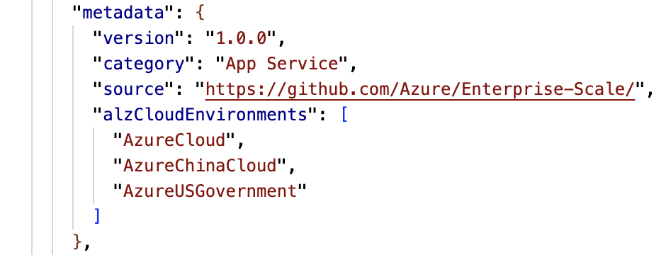

# Contributing to Azure landing zones (Enterprise-Scale)

Firstly, thank you for taking the time to contribute!

The Azure landing zone reference implementations are designed to help customers accelerate their cloud adoption journey.
By contributing, you can help our community get the best out of these reference implementations.

We actively encourage community contributions as we realize the unique and diverse requirements of our customers can help drive a better outcome for everyone.

## What are the reference implementations

To meet the diverse needs of our community, we offer the following reference implementation options:

- [ALZ ARM portal experience (this repository)](https://github.com/Azure/Enterprise-Scale)
- [ALZ Bicep modules](https://github.com/Azure/ALZ-Bicep)
- [ALZ Terraform module](https://github.com/Azure/terraform-azurerm-caf-enterprise-scale)

Whilst each reference implementation is uniquely characterized by its target community, they all aim to deliver against the Azure landing zone [conceptual architecture](https://docs.microsoft.com/azure/cloud-adoption-framework/ready/landing-zone/#azure-landing-zone-conceptual-architecture), [design principles](https://docs.microsoft.com/azure/cloud-adoption-framework/ready/landing-zone/design-principles) and [design areas](https://docs.microsoft.com/azure/cloud-adoption-framework/ready/landing-zone/design-areas).

The following is a set of general guidelines for contributing to any of these reference implementations.

## How do we manage contributions

Contributions to each Azure landing zone reference implementation option is moderated by a common committee of maintainers.
The committee is responsible for reviewing and approving all contributions, whether via [**GitHub Issues**](https://github.com/Azure/Enterprise-Scale/issues), [**Pull Requests**](https://github.com/Azure/Enterprise-Scale/pulls), or internally driven development.

The committee is also responsible for reviewing and sponsoring new features or design changes to ensure they meet the needs of our broad community of consumers.

The intent of this approach is to ensures that each reference implementation continues to deliver against the Azure landing zone [conceptual architecture](https://docs.microsoft.com/azure/cloud-adoption-framework/ready/landing-zone/#azure-landing-zone-conceptual-architecture), [design principles](https://docs.microsoft.com/azure/cloud-adoption-framework/ready/landing-zone/design-principles) and [design areas](https://docs.microsoft.com/azure/cloud-adoption-framework/ready/landing-zone/design-areas).
This also helps us to drive towards consistency across the reference implementation options, where possible.

The committee currently consists of Microsoft employees only.
It is expected that over time, community contributions will grow and new community members will join as committee members.
Membership is heavily dependent on the level of contribution and expertise: individuals who contribute in meaningful ways to the project will be recognized accordingly.

At any point in time, a committee member can nominate a strong community member to join the committee.
Nominations should be submitted in the form of RFCs detailing why that individual is qualified and how they will contribute.
After the RFC has been discussed, a unanimous vote will be required for the new committee member to be confirmed.

## How can I contribute?

As an open source project, the reference implementation works best when it reflects the needs of our community of consumers.
As such, we welcome contributions however big or small.
All we ask is that you follow some simple guidelines, including participating according to our [**code of conduct**](https://github.com/Azure/Enterprise-Scale/blob/main/CODE_OF_CONDUCT.md).

### Reporting bugs

Like all software solutions, the Azure landing zone reference implementation isn't free from bugs.
Moreover, as the Azure platform evolves or our guidance changes there will likely be a need to make updates.

If you believe you have found a bug, please use the following process:

1. Check the [**FAQ**](./FAQ) and [**Known Issues**](./ALZ-Known-Issues) for a list of common questions and issues.
1. Check existing [**GitHub Issues**](https://github.com/Azure/Enterprise-Scale/issues) to see whether the issue has already been reported.
    1. If the issue is **open**, add a comment rather than create a new one.
    1. If the issue is **closed**, check whether the proposed fix resolves your issue.
1. Report it via our [**GitHub Issues**](https://github.com/Azure/Enterprise-Scale/issues).
1. Select `New issue` and use the `Bug report 🐛` template
1. Ensure you fill out the template with as much information as possible, being sure to cover off what's needed for maintainers and the community to:
    1. Understand your issue :memo:
    1. Reproduce the behavior :computer:
    1. Provide evidence :mag_right:
    1. Optionally, let us know if you would like to contribute a fix via a [**Pull Request**](https://github.com/Azure/Enterprise-Scale/pulls) :wrench:

### Feature requests

We understand that our solutions are going to always be a work in progress, and that customers will need and want to request new features.
This is where you can really make a difference to how the solution is shaped for our community.

If you have an idea you would like to be considered for inclusion, please use the following process:

1. Familiarize yourself with our [conceptual architecture](https://docs.microsoft.com/azure/cloud-adoption-framework/ready/landing-zone/#azure-landing-zone-conceptual-architecture), [design principles](https://docs.microsoft.com/azure/cloud-adoption-framework/ready/landing-zone/design-principles) and [design areas](https://docs.microsoft.com/azure/cloud-adoption-framework/ready/landing-zone/design-areas) to ensure the feature aligns with the Azure landing zone guidance.
1. Check existing [**GitHub Issues**](https://github.com/Azure/Enterprise-Scale/issues) to see whether the issue has already been reported.
    1. If the issue is **open**, add a comment rather than create a new one.
    1. If the issue is **closed**, check whether the proposed fix resolves your issue.
1. Report it via our [**GitHub Issues**](https://github.com/Azure/Enterprise-Scale/issues)
1. Select `New issue` and use the `Feature request 🚀` template
1. Ensure you fill out the template with as much information as possible, being sure to cover off what's needed for maintainers and the community to:
    1. Understand your feature and how it aligns to our [conceptual architecture](https://docs.microsoft.com/azure/cloud-adoption-framework/ready/landing-zone/#azure-landing-zone-conceptual-architecture), [design principles](https://docs.microsoft.com/azure/cloud-adoption-framework/ready/landing-zone/design-principles) and [design areas](https://docs.microsoft.com/azure/cloud-adoption-framework/ready/landing-zone/design-areas) :memo:
    1. Optionally, let us know if you would like to contribute by adding your requested feature via a [**Pull Request**](https://github.com/Azure/Enterprise-Scale/pulls) :wrench:

> **IMPORTANT:** If you are proposing a change to any of the Azure landing zone guidance, please include a business case explaining why you feel this will benefit our community.

### Report a security vulnerability

Please see our [**security policy**](https://github.com/Azure/Enterprise-Scale/security/policy) for more information.

### Working with ALZ Custom policies

Policies in the Azure Landing Zone reference implementations and repository are custom to Azure environments. They are definitions which are recommended when working with ALZ landing zones. The policies used in the reference implementations are mastered from the Enterprise-Scale repository.

To work with policies, they are location in [src/resources/Microsoft.Authorization/*](https://github.com/Azure/Enterprise-Scale/src/resources/Microsoft.Authorization).

To create a new policy, it is worth taking the framework from an already existing policy.

Inside of the JSON is a `metadata` section which is required for policy creation.

| Metadata Value       | Description                                                |
|----------------------|------------------------------------------------------------|
| Version              | Version of the policy definition                           |
| Category             | The category which the policy definition will reside in    |
| Source               | The source repository for the policy definition            |
| alzCloudEnvironments | The cloud environment for which the policy is designed for |

The definition created then needs to be included in the [policies.bicep](../../src/templates/policies.bicep) file inside of [src/templates/](../../src/templates/) under the correct context. An additional line needs to be created under the respective variable in the file, depending on it being a policy definition or a policy set definition:

For a policy definition, additional code should be added inside of the `loadPolicyDefinitions` variable under the correct environment:

`loadTextContent('../resources/Microsoft.Authorization/policyDefinitions/Name-Of-The-Policy.json')`

For a policy set definition, additional code should be added inside of the `loadPolicySetDefinitions` variable under the correct environment:

`loadTextContent('../resources/Microsoft.Authorization/policySetDefinitions/Deploy-Sql-Security.json')`

The policy definition files will be compiled into a `policies.json` file from the `policy.bicep` file which was amended.

Once the policy work has been completed, a pull request has been submitted to the repository:

Policy versioning follows the same protocol as built-in policies. More information on that can be found in the [ALZ Policies document in the wiki](./ALZ-Policies.md#versioning).

For policy deprecation, the process is documented in the [Azure Landing Zones - Deprecating Policies](./ALZ-Deprecated-Services.md) page.

If a policy is part of an initiative, references to policies that are being deprecated should be removed. Policy initiatives are located in the [policySetDefinitions](../../src/resources/Microsoft.Authorization/policySetDefinitions/) folder. To find out if a policy is part of an initiative it is recommended to look up the policy definition in [AzAdvertiser](http://azadvertizer.com/) and check for association with initiatives. When identified, go into the necessary initiative and remove references to the definition. Locate the policy definition in the parameters of the initiative and remove reference:

Also find it in the policyDefinitions and remove reference as well:

When working within the policy files, to read parameters which are set at the top level of the policy definition a double escape is needed for ARM. So instead of using `[parameters('someParameter')]` within the policy, you should use `[[parameters('someParameter')]` instead.

> **Note:** When testing the policy manually in the portal or another deployment outside of the ALZ Accelerator (Portal), you will need to remove the double escaping, `[[`, and revert to normal ,`[`'

When working with policies that are assigned by default, these are located under the [eslzArm/managementGroupTemplates/policyAssignments](../../eslzArm/managementGroupTemplates/policyAssignments) folder. References to policy definitions are done through the assignments, so if any amendments are done to default assigned policies, they should be amended here too. A wiki to default assignments can be found [in the wiki](./ALZ-Policies.md).

Policies in `eslzArm.json` file will also need updating if wanting to assign a new policy that is located. The file for this amendment [in eslzArm/eslzArm.json](../../eslzArm/eslzArm.json).

### Forking the repository and submitting a Pull Request

To start contributing to this guide is it worth reviewing the developer workflow for contribution [which is documented in GitHub](https://docs.github.com/pull-requests/collaborating-with-pull-requests/proposing-changes-to-your-work-with-pull-requests/creating-a-pull-request-from-a-fork).

## Code of Conduct

We are working hard to build strong and productive collaboration with our passionate community. We heard you loud and clear. Follow the [Code of Conduct](https://github.com/Azure/Enterprise-Scale/blob/main/CODE_OF_CONDUCT.md).
