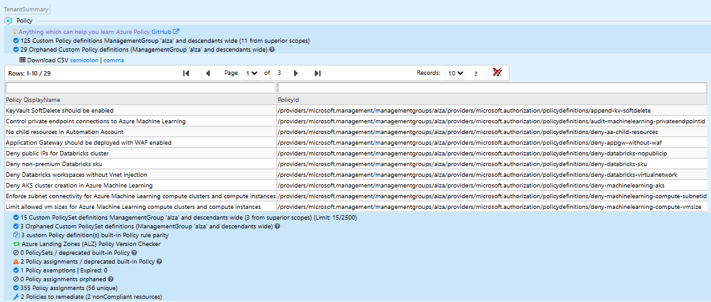

# ALZ Policy FAQ and Tips

## Frequently asked questions about ALZ policies

There is a lot of change happening for policies in Azure, and by extension ALZ, and we have a number of common issues being raised by our customers and partners. This page is intended to address those issues.

### ALZ Policies and Initiatives and the escape character

We've had a number of issues and pull requests submitted specifically around the extra bracket `[` that is present in all policies and initiatives in this repo.

> NOTE: The policies and initiatives in this repo are NOT intended to be deployed directly in Azure. You cannot copy the definition and deploy the policy directly without editing first. If you want to deploy a specific policy you must first remove the additional leading `[` character from the policy or initiative definition. Alternatively, to deploy a specific policy directly in Azure Policy, please use AzAdvertizer to lookup the policy and use the `copy definition` button to copy a clean version of the policy ready for use (this will remove all the extra `[`).

The reason for this is that the policies and initiatives in this repo are intended to be used as part of the ALZ deployment process, and are used to generate the ARM templates that are deployed to Azure. The leading `[` character is required to support the generation of the ARM templates.

### Diagnostic Settings v2 (December 2023)

There are several issues raised around Diagnostic Settings, and we acknowledge that this is a complex area that is causing a lot of pain.

At this time, the owners of Azure features/services are reworking their policies to comply with the new diagnostic settings v2 schema (which includes logging categories which is a popular ask). New diagnostics settings policies are landing for Azure services, with dedicated policies depending on the logging target required (Log Analytics, Event Hub or storage accounts). We are working with the product groups to ensure that the policies are updated as soon as possible.

Check back here for updates, and be sure to bookmark [What's New](https://aka.ms/alz/whatsnew) to see the latest updates to ALZ.

To view the current list of GitHub issues related to diagnostic settings, please see [this link](https://github.com/Azure/Enterprise-Scale/labels/Area:%20Diagnostic%20Settings).

> **UPDATE** New built-in Diagnostic Settings policies and initiatives will be landing in early CY2024. As a heads-up we will begin deprecating all our custom diagnostic settings policies, and changing our default assignment to leverage the associated built-in initiative for Log Analytics (as the target) - additional options will include targeting Event Hubs or Storage accounts.

### Microsoft Monitoring Agent (MMA) Deprecation and Azure Monitor Agent (AMA) (January 2024)

Similarly, as Microsoft Monitoring Agent (MMA) is on a deprecation path (August 2024), Azure Monitor Agent (AMA) is the recommended replacement and there are a number of requests to support AMA specific policies (**NOTE**: Some features are going agentless thus not requiring an agent, see [Table: AMA parity status](./ALZ-AMA-Update#table-ama-parity-status) following link for more detail).

**Update January 2024** We have been working on the removal of MMA from ALZ and the first step in the overall removal process is to update the ALZ Portal reference implementation (greenfield deployments) which has now been updated. Our next step is to work on the deployment to Terraform and Bicep reference implementations which requires significant investment to minimise impact to existing customers and providing clear guidance for the transition. For more details please see [Azure Monitor Agent Update](./ALZ-AMA-Update.md).

### Azure Database for MariaDB (Jan 2024)

Azure Database for MariaDB is being deprecated, with the retirement process beginning on January 19, 2024. Due to retirement Azure is phasing out MariaDB policies, aligning with a strategic shift to Azure Database for MySQL - Flexible Server. This includes deprecating Azure Landing Zone (ALZ) custom policies 'Diagnostic Settings (Deploy)' and 'Public Endpoint (Deny)' for MariaDB. These policies are becoming redundant with MariaDB's phase-out:

1. Diagnostic Settings (Deploy) for MariaDB
2. Public Endpoint (Deny) for MariaDB

**Action for Users:** Users are encouraged to migrate to Azure Database for MySQL - Flexible Server. This migration will involve updating or replacing existing MariaDB-related policies with ones suitable for the MySQL Flexible Server environment.

For more information on Azure Database for MariaDB, its retirement, and the migration process, visit [What's happening to Azure Database for MariaDB?](https://learn.microsoft.com/en-us/azure/mariadb/whats-happening-to-mariadb).

### Sovereign Clouds (US Gov and China)

Numerous GitHub issues related to sovereign clouds are currently within our scope, and our team is actively endeavoring to resolve these concerns.

Regrettably, due to stringent security requirements inherent in sovereign cloud environments, our team lacks the necessary access privileges to validate policies or authenticate the successful deployment of ALZ. Presently, our access permissions are confined exclusively to the public cloud.

Given our constraints in conducting direct tests, we are dependent on the invaluable support of the broader community to assist us in identifying potential issues and offering constructive feedback. We intend to respond to issues pertaining to sovereign clouds on an "as soon as possible" basis, deploying our best efforts. However, due to the aforementioned limitations, we are unable to offer precise timelines for issue resolution.

To view the current list of GitHub issues related to sovereign clouds, please see [this link](https://github.com/Azure/Enterprise-Scale/labels/Area%3A%20Sovereign).

### Private DNS Zone Issues

There are a number of issues raised related to private DNS zones not functioning correctly, and in some cases this is due to specific services requiring additional configuration to function correctly.

Known services causing issues include:

- VM Guest Configuration ([additional configuration required](https://learn.microsoft.com/en-us/azure/governance/machine-configuration/overview#communicate-over-private-link-in-azure)) - [GitHub Issue](https://github.com/Azure/Enterprise-Scale/issues/1466)
- Power BI ([more info](https://learn.microsoft.com/en-us/power-bi/enterprise/service-security-private-links)) - [GitHub Issue](https://github.com/Azure/Enterprise-Scale/issues/1441)

If you encounter problems with DNS resolution for PaaS services that have Private DNS Zones deployed by ALZ, first verify their necessity. If the services do not require Private Link, or you do not intend to use Private Link for the service, we recommend either disconnecting/unlinking or deleting the private DNS zone from the hub or virtual network for those services. Alternatively, you can follow the specific guidance provided for correctly configuring the resource.

## Tips & Recommendations

### Enforcement mode instead of the audit effect

It is strongly suggested that the enforcement mode be utilized over the audit effect for policies such as deny or deployIfNotExists (DINE). The function of the audit effect primarily serves as a brief, introductory measure to gauge the impending impacts of the policy prior to activating the enforcement mode. This mechanism is not designed to act as a perpetual solution for these categories of policies.

By modifying the enforcement mode to a "do not enforce" state on a policy or initiative assignment, the enforcement of the effect (deny or DINE) is effectively suspended, while still maintaining the auditing of policy compliance. This strategy is particularly beneficial when seeking to deactivate deny or DINE on a policy or initiative assignment and comes highly recommended for such circumstances.

For a detailed explanation of this topic, please review [Adopt policy-driven guardrails](https://learn.microsoft.com/en-gb/azure/cloud-adoption-framework/ready/enterprise-scale/dine-guidance).

### Deny policies also audit

Numerous deny policies, constituting a part of the ALZ deployment, inherently carry out an action (i.e., denying the action). Nonetheless, it is critical to recognize that these policies additionally incorporate an auditing capability, particularly for pre-existing resources that remain unremediated or are inherently unremediable in instances of deny policies.

For instance, consider the policy assignment Deny the deployment of classic resources. While this policy predominantly prevents the deployment of classic resources, it also performs an audit of classic resources that have been previously deployed. This functionality is instrumental in comprehending the extent of the issue at hand and thereby facilitates effective remediation efforts.

### Unassigned custom policies deployed by ALZ

ALZ deploys a number of custom policies that are not assigned to any scope by default. There are some very useful policies included that would not necessarily benefit all customers, as there may be dependencies or other decisions needed that would drive the decision to implement them.

As an example, we provide the [Deploy a default budget on all subscriptions under the assigned scope](https://www.azadvertizer.net/azpolicyadvertizer/Deploy-Budget.html) policy that may be useful for managing costs for your subscriptions, e.g., subscriptions under the Sandboxes management group.

As a starting point reviewing ALZ provided custom policies, we recommend that you review the [ALZ custom policies](https://www.azadvertizer.net/azpolicyadvertizer_all.html#%7B%22col_11%22%3A%7B%22flt%22%3A%22ALZ%22%7D%2C%22col_3%22%3A%7B%22flt%22%3A%22!diag%22%7D%2C%22page_length%22%3A100%7D). This link will show you all the ALZ custom policies that are not diagnostic settings policies. Some of these are assigned to specific scopes or included in initiatives that are assigned, but many are not ([AzAdvertizer](https://www.azadvertizer.net/) is not aware of ALZ policy assignments).

Alternatively, we highly recommend you run [AzGovViz](https://github.com/JulianHayward/Azure-MG-Sub-Governance-Reporting) against your Azure estate to understand the policies that are assigned to your subscriptions and management groups, and get a tailored report that includes unassigned policies. An example, based on a vanilla ALZ deployment, is shown below:

To get the full list of unassigned ALZ policies, check "# Orphaned Custom Policy definitions" in the report.
