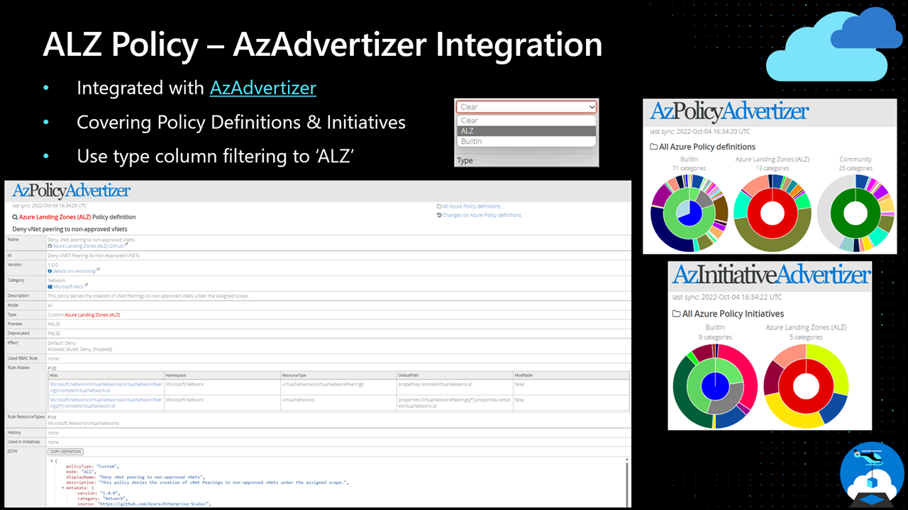
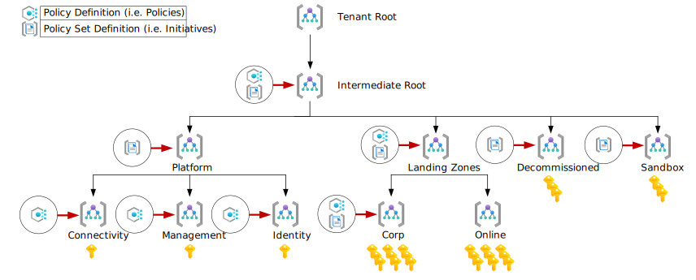
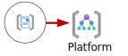
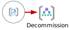
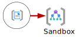

# Policies included in Azure landing zones reference implementations

Azure Policy and deployIfNotExist enables autonomy in the platform, and reduces operational burden as you scale your deployments and subscriptions in the Azure landing zone architecture. The primary purpose is to ensure that subscriptions and resources are compliant, while empowering application teams to use their own preferred tools/clients to deploy.

> Please refer to [Policy Driven Governance](https://learn.microsoft.com/en-gb/azure/cloud-adoption-framework/ready/landing-zone/design-principles#policy-driven-governance) for further information.

> **IMPORTANT NOTE:** ALZ priority is to provide a secure by default, Zero Trust aligned, configuration, and occasionally we will rely on `-preview` policies in our default assignments to meet our core objective. These preview policies are maintained by the Azure product owners and versioning is not in our control, however, we feel they are sufficiently important to be included in our releases. If the inclusion of preview policies is of concern, please review all ALZ default initiative assignments and remove any `-preview` policies that you are not comfortable with.

## FAQ and Tips

   We have added a dedicated [ALZ Policy FAQ and Tips](./ALZ-Policies-FAQ) based on common issues raised or questions asked by customers and partners.

## Why are there custom policy definitions as part of Azure landing zones?

We work with - and learn from our customers and partners to ensure that we evolve and enhance the reference implementations to meet customer requirements. The primary approach of the policies as part of Azure landing zones is to be proactive (deployIfNotExist, and modify), and preventive (deny). We are continuously moving these policies to built-ins.

## What Azure Policies does Azure landing zone provide additionally to those already built-in?

There are around 114 custom Azure Policy Definitions included and around 12 Custom Azure Policy Initiatives included as part of the Azure Landing Zones implementation that add on to those already built-in within each Azure customers tenant.

For Azure landing zones, the custom Azure Policy Definitions and Initiatives are consistent across the three implementation options, unless otherwise noted; [Terraform Module](https://aka.ms/alz/tf), [Bicep Modules](https://aka.ms/alz/bicep), [Azure landing zone portal accelerator](https://aka.ms/alz#azure-landing-zone-accelerator).

This is because the single source of truth is the [`Enterprise-Scale` repo](https://github.com/Azure/Enterprise-Scale) that both the Terraform and Bicep implementation options pull from to build their `lib` folders respectively.

For a complete list of all custom and built-in policies deployed within an Azure landing zone deployment, please refer to the following [section](https://github.com/Azure/Enterprise-Scale/wiki/ALZ-Policies#what-policy-definitions-are-assigned-within-the-azure-landing-zones-custom--built-in).

> Our goal is always to try and use built-in policies where available and also work with product teams to adopt our custom policies and make them built-in, which takes time. This means there will always be a requirement for custom policies.

## Why are managed identities deployed as part of the ALZ policies?

Managed Identities provide an alternative way to access Azure resources without having to manage credentials. They are created as a part of the ALZ policies mainly for policies that have the deployIfNotExists (DINE) effect in this initiative. The managed identities are used in order to remediate resources that are not compliant with the policy. For further information on how remediation works with access control, please refer to the following documentation: [Remediate non-compliant resources - Azure Policy | Microsoft](https://learn.microsoft.com/en-us/azure/governance/policy/how-to/remediate-resources?tabs=azure-portal#how-remediation-access-control-works)

## AzAdvertizer Integration

We have worked with the creator of [AzAdvertizer](https://www.azadvertizer.net) to integrate all of the custom Azure Policy Definitions and Initiatives as part of Azure landing zones into it to help customers use the tool to look at the policies further in an easy to use tool that is popular in the community.

On either the [Policy](https://www.azadvertizer.net/azpolicyadvertizer_all.html#%7B%22col_10%22%3A%7B%22flt%22%3A%22ESLZ%22%7D%7D) or [Initiative](https://www.azadvertizer.net/azpolicyinitiativesadvertizer_all.html) section of the site, set the 'Type' column drop down (last one on the right hand side) to 'ALZ' and you will see all the policies as mentioned above in the tool for you to investigate further.

AzAdvertizer also updates once per day!



## What policy definitions are assigned within the Azure landing zones (Custom & Built-in)?

As part of a default deployment configuration, policy and policy set definitions are deployed at multiple levels within the Azure landing zone Management Group hierarchy as depicted within the below diagram.



The subsequent sections will provide a summary of policy sets and policy set definitions applied at each level of the Management Group hierarchy.

> **NOTE**: Although the below sections will define which policy definitions/sets are applied at specific scopes, please remember that policy will inherit within your management group hierarchy.

> <a href=./media/ALZ%20Policy%20Assignments%20v2.xlsx></a> For convenience, an Excel version of the below information is available [here](./media/ALZ%20Policy%20Assignments%20v2.xlsx) or click the icon.

### Intermediate Root

This management group is a parent to all the other management groups created within the default Azure landing zone configuration. Policy assignment is predominantly focused on assignment of security and monitoring best practices to ensure compliance and reduced operational overhead.

<table>
<tr><th>Management Group </th><th>Policy Configuration</th></tr>
<tr></tr>
<tr><td>
  

  
</td><td>
  
| **Policy Type**           | **Count** |
| :---                      |   :---:   |
| `Policy Definition Sets`  | **13**     |
| `Policy Definitions`      | **3**     |
</td></tr> </table>

The table below provides the specific **Custom** and **Built-in** **policy definitions** and **policy definitions sets** assigned at the **Intermediate Root Management Group**.

| Assignment Name                                                            | Definition Name                                                                  | Policy Type                           | Description                                                                                                                                                                                                                                                                                                                                                                          | Effect(s)                           |
| -------------------------------------------------------------------------- | -------------------------------------------------------------------------------- | ------------------------------------- | ------------------------------------------------------------------------------------------------------------------------------------------------------------------------------------------------------------------------------------------------------------------------------------------------------------------------------------------------------------------------------------ | ----------------------------------- |
| **Deploy Microsoft Defender for Cloud configuration**                      | **Deploy Microsoft Defender for Cloud configuration**                            | `Policy Definition Set`, **Custom**   | Configures all the MDFC settings, such as Microsoft Defender for Cloud per individual service, security contacts, and export from MDFC to Log Analytics workspace                                                                                                                                                                                                                    | DeployIfNotExists                   |
| **[Preview]: Deploy Microsoft Defender for Endpoint agent**                      | **[Preview]: Deploy Microsoft Defender for Endpoint agent**                            | `Policy Definition Set`, **Built-in**   | Deploy Microsoft Defender for Endpoint agent on applicable images.                                                                                                                                                                                                            | DeployIfNotExists                   |
| **Configure multiple Microsoft Defender for Endpoint integration settings with Microsoft Defender for Cloud**                      | **Configure multiple Microsoft Defender for Endpoint integration settings with Microsoft Defender for Cloud**                            | `Policy Definition Set`, **Built-in**   | Configure multiple Microsoft Defender for Endpoint integration settings with Microsoft Defender for Cloud images.                                                                                                                                                                                                            | DeployIfNotExists                   |
| **Deploy-Diag-Logs**                                                   | **Deploy Diagnostic Settings to Azure Services**                                 | `Policy Definition Set`, **Custom**   | This policy set deploys the configurations of application Azure resources to forward diagnostic logs and metrics to an Azure Log Analytics workspace.                                                                                                                                                                                                                                | DeployIfNotExists                   |
| **Enable Monitoring in Azure Security Center**                             | **Azure Security Benchmark**                                                     | `Policy Definition Set`, **Built-in** | The Microsoft Cloud Security Benchmark initiative represents the policies and controls implementing security recommendations defined in Microsoft Cloud Security Benchmark v1, see https://aka.ms/azsecbm. This also serves as the Azure Security Center default policy initiative. You can directly assign this initiative, or manage its policies and compliance results within Azure Security Center. | Audit, AuditIfNotExists, Disabled   |
| **Configure Azure Defender to be enabled on SQL Servers and SQL Managed Instances**                    | **Configure Azure Defender to be enabled on SQL Servers and SQL Managed Instances**                          | `Policy Definition Set`, **Built-in** | Enable Azure Defender on your SQL Servers and SQL Managed Instances to detect anomalous activities indicating unusual and potentially harmful attempts to access or exploit databases.          | DeployIfNotExists |
| **Configure Advanced Threat Protection to be enabled on open-source relational databases**                    | **Configure Advanced Threat Protection to be enabled on open-source relational databases**                          | `Policy Definition Set`, **Built-in** | Enable Advanced Threat Protection on your non-Basic tier open-source relational databases to detect anomalous activities indicating unusual and potentially harmful attempts to access or exploit databases. See https://aka.ms/AzDforOpenSourceDBsDocu.         | DeployIfNotExists |
| **Deploy Diagnostic Settings for Activity Log to Log Analytics workspace** | **Configure Azure Activity logs to stream to specified Log Analytics workspace** | `Policy Definition`, **Built-in**     | Deploys the diagnostic settings for Azure Activity to stream subscriptions audit logs to a Log Analytics workspace to monitor subscription-level events                                                                                                                                                                                                                              | DeployIfNotExists                   |
| **Deny the Deployment of Classic Resources** | **Not allowed resource types** | `Policy Definition`, **Built-in**     | Denies deployment of classic resource types under the assigned scope                                                                                                                                                                                                                              | Deny                   |
| **Audit-UnusedResourcesCostOptimization** | **Audit-UnusedResourcesCostOptimization** | `Policy Definition Set`, **Custom**     | Optimize cost by detecting unused but chargeable resources. Leverage this Azure Policy Initiative as a cost control tool to reveal orphaned resources that are contributing cost.                                                                                                                                                                                                                              | Audit                   |
| **Audit-TrustedLaunch** | **Audit-TrustedLaunch** | `Policy Definition Set`, **Custom**     | Trusted Launch improves security of a Virtual Machine which requires VM SKU, OS Disk & OS Image to support it (Gen 2). To learn more about Trusted Launch, visit https://aka.ms/trustedlaunch.  | Audit                   |
| **Deny Virtual Machines and Virtual Machine Scale Sets from not using OS Managed Disks** | **Deny Virtual Machines and Virtual Machine Scale Sets from not using OS Managed Disks** | `Policy Definition`, **Built-In**     | Deny virtual machines not using managed disk. It checks the managedDisk property on virtual machine OS Disk fields.                                                                                                                                                                                                                         | Deny                   |
| **Deploy Azure Monitor Baseline Alerts for Service Health** | **Deploy Azure Monitor Baseline Alerts for Service Health** | `Policy Definition Set`, **Custom**     | Deploys service health alerts, action group and alert processing rule. For more detail on policies included please refer to https://aka.ms/amba/alz/wiki under Policy Initiatives/Service Health initiative. | DeployIfNotExists                   |
| **Resources should be Zone Resilient** | **Resources should be Zone Resilient** | `Policy Definition Set`, **Built-in**     | Some resource types can be deployed Zone Redundant (e.g. SQL Databases); some can be deploy Zone Aligned (e.g. Virtual Machines); and some can be deployed either Zone Aligned or Zone Redundant (e.g. Virtual Machine Scale Sets). Being zone aligned does not guarantee resilience, but it is the foundation on which a resilient solution can be built (e.g. three Virtual Machine Scale Sets zone aligned to three different zones in the same region with a load balancer). See https://aka.ms/AZResilience for more info. | Audit                   |
| **Resource Group and Resource locations should match** | **Resource Group and Resource locations should match** | `Policy Definition`, **Built-in**     | In order to improve resilience and reliability, you need to be aware of where resources are deployed. To aid this awareness, ensure that the location of the resource group matches the location of the resources it contains. | Audit                   |

### Platform

This management group contains all the platform child management groups, like management, connectivity, and identity.

<table>
<tr><th>Management Group </th><th>Policy Configuration</th></tr>
<tr></tr>
<tr><td>
  

  
</td><td>
  
| **Policy Type**           | **Count** |
| :---                      |   :---:   |
| `Policy Definition Sets`  | **10**     |
| `Policy Definitions`      | **0**     |
</td></tr> </table>

| Assignment Name                                                            | Definition Name                                                            | Policy Type                       | Description                                                                                                                                                               | Effect(s) |
| -------------------------------------------------------------------------- | -------------------------------------------------------------------------- | --------------------------------- | ------------------------------------------------------------------------------------------------------------------------------------------------------------------------- | --------- |
| **Enforce recommended guardrails for Azure Key Vault**                     | **Enforce recommended guardrails for Azure Key Vault**                     | `Policy Definition Set`, **Custom** | This policy initiative enforces minimum guardrails for Azure Key Vault: <ul><li>Key vaults should have soft delete enabled (Deny)<li>Key vaults should have purge protection enabled (Deny)<li>Key Vault secrets should have an expiration date (Audit)<li>Key Vault keys should have an expiration date (Audit)<li>Azure Key Vault should have firewall enabled (Audit)<li>Certificates should have the specified lifetime action triggers (Audit)<li>Keys should have more than the specified number of days before expiration (Audit < 90 days)<li>Secrets should have more than the specified number of days before expiration (Audit < 90 days)</ul>| Audit, Deny |
| **Enforce enhanced recovery and backup policies**                     | **Enforce enhanced recovery and backup policies**                     | `Policy Definition Set`, **Custom** | This policy initiative enforces minimum guardrails for Azure Key Vault: <ul><li>Immutability must be enabled for backup vaults<li>Immutability must be enabled for Recovery Services vaults<li>Soft delete should be enabled for Backup Vaults<li>Multi-User Authorization (MUA) must be enabled for Backup Vaults<li>Multi-User Authorization (MUA) must be enabled for Recovery Services Vaults</ul>| Audit |
| **Enable Azure Monitor for VMs**\*                                           | **Enable Azure Monitor for VMs with Azure Monitoring Agent(AMA)**        | `Policy Definition Set`, **Built-in** | This policy initiative installs the Azure Monitoring Agent (AMA) on the virtual machines (VMs) and enables Azure Monitor for them. Azure Monitor collects and analyzes data from the VMs, such as performance metrics, logs, and dependencies.                                                                            | DeployIfNotExists, Disabled |
| **Enable Azure Monitor for Virtual Machine Scale Sets**\*                    | **Enable Azure Monitor for VMSS with Azure Monitoring Agent(AMA)**       | `Policy Definition Set`, **Built-in** | This policy initiative installs the Azure Monitoring Agent (AMA) on the virtual machines scale sets (VMSS) and enables Azure Monitor for them. Azure Monitor collects and analyzes data from the VMs, such as performance metrics, logs, and dependencies.                                                                | DeployIfNotExists, Disabled |
| **Enable Azure Monitor for Hybrid Virtual Machines**\*                       | **Enable Azure Monitor for Hybrid VMs with AMA**                         | `Policy Definition Set`, **Built-in** | This policy initiative installs the Azure Monitoring Agent (AMA) on Arc-enabled servers (Hybrid) and enables Azure Monitor for them. Azure Monitor collects and analyzes data from the VMs, such as performance metrics, logs, and dependencies.                                                                          | DeployIfNotExists, Disabled |
| **Configure periodic checking for missing system updates on azure virtual machines and Arc-enabled virtual machines.*** | **Configure periodic checking for missing system updates on azure virtual machines and Arc-enabled virtual machines** | `Policy Definition Set`, **Custom** | With this policy initiative, you can enable automatic OS updates assessment every 24 hours. This is a custom initiative of built-in policies.                                                                                      | Modify |
| **Enable ChangeTracking and Inventory for virtual machines**\*               | **[Preview]: Enable ChangeTracking and Inventory for virtual machines**  | `Policy Definition Set`, **Built-in** | This policy initiative enables ChangeTracking and Inventory for virtual machines. It uses a Data Collection Rule to define what data to collect and where to send it, and a user-assigned identity to authenticate the Azure Monitor Agent.                                                                               | DeployIfNotExists, Disabled |
| **Enable ChangeTracking and Inventory for virtual machine scale sets**\*     | **[Preview]: Enable ChangeTracking and Inventory for virtual machine scale sets** | `Policy Definition Set`, **Built-in** | This policy initiative enables ChangeTracking and Inventory for virtual machines scale sets. It uses a Data Collection Rule to define what data to collect and where to send it, and a user-assigned identity to authenticate the Azure Monitor Agent.                                                           | DeployIfNotExists, Disabled |
| **Enable ChangeTracking and Inventory for Arc-enabled virtual machines**\*   | **[Preview]: Enable ChangeTracking and Inventory for Arc-enabled virtual machines** | `Policy Definition Set`, **Built-in** | This policy initiative enables ChangeTracking and Inventory for Arc-enabled servers. It uses a Data Collection Rule to define what data to collect and where to send it, and a user-assigned identity to authenticate the Azure Monitor Agent.                                                                 | DeployIfNotExists, Disabled |
| **Enable Defender for SQL on SQL VMs and Arc-enabled SQL Servers**\*         | **Configure SQL VMs and Arc-enabled SQL Servers to install Microsoft Defender for SQL and AMA with a user-defined LA workspace** | `Policy Definition Set`, **Built-in** | This policy initiative enables Microsoft Defender for SQL and AMA on SQL VMs and Arc-enabled SQL Servers.                                                                                                                                                          | DeployIfNotExists, Disabled |
| **Do not allow deletion of the User Assigned Managed Identity used by AMA**\*| **Do not allow deletion of specified resource and resource type**                              | `Policy Definition`, **Custom** | This policy provides a safeguard against accidental removal of the User Assigned Managed Identity used by AMA by blocking delete calls using deny action effect.                                                                                                                                                                 | DenyAction |

> \* The AMA policies and initiatives are in effect for the portal implementation only. Terraform and Bicep will adopt these policies in the near future.

### Connectivity

This management group contains a dedicated subscription for connectivity. This subscription will host the Azure networking resources required for the platform, like Azure Virtual WAN, Azure Firewall, and Azure DNS private zones. Policy assignment is predominantly focused on Azure DDoS Protection.

<table>
<tr><th>Management Group </th><th>Policy Configuration</th></tr>
<tr></tr>
<tr><td>
  

  
</td><td>
  
| **Policy Type**           | **Count** |
| :---                      |   :---:   |
| `Policy Definition Sets`  | **1**     |
| `Policy Definitions`      | **1**     |
</td></tr> </table>

The table below provides the specific **Custom** and **Built-in** **policy definitions** and **policy definitions sets** assigned at the **Connectivity Management Group**.

| Assignment Name                                                            | Definition Name                                                            | Policy Type                       | Description                                                                                                                                                               | Effect(s) |
| -------------------------------------------------------------------------- | -------------------------------------------------------------------------- | --------------------------------- | ------------------------------------------------------------------------------------------------------------------------------------------------------------------------- | --------- |
| **Virtual networks should be protected by Azure DDoS Network Protection** | **Virtual networks should be protected by Azure DDoS Network Protection** | `Policy Definition`, **Built-in** | Protect your virtual networks against volumetric and protocol attacks with Azure DDoS Network Protection. For more information, visit https://aka.ms/ddosprotectiondocs. | Modify    |
| **Deploy Azure Monitor Baseline Alerts for Connectivity** | **Deploy Azure Monitor Baseline Alerts for Connectivity** | `Policy Definition Set`, **Custom**     | Deploys alerting for connectivity related resources. For more detail on policies included please refer to https://aka.ms/amba/alz/wiki under Policy Initiatives/Connectivity initiative. | DeployIfNotExists                   |

### Management

This management group contains a dedicated subscription for management, monitoring, and security. This subscription will host an Azure Log Analytics workspace, including associated solutions, and an Azure Automation account. Policy assignment is predominantly focused on the deployment and configuration of the Log Analytics Workspace.

<table>
<tr><th>Management Group </th><th>Policy Configuration</th></tr>
<tr></tr>
<tr><td>
  

  
</td><td>
  
| **Policy Type**           | **Count** |
| :---                      |   :---:   |
| `Policy Definition Sets`  | **1**     |
| `Policy Definitions`      | **1**     |
</td></tr> </table>

The table below provides the specific **Custom** and **Built-in** **policy definitions** and **policy definitions sets** assigned at the **Management Management Group**.

| Assignment Name          | Definition Name                                                                                | Policy Type                       | Description                                                                                                               | Effect(s)         |
| ------------------------ | ---------------------------------------------------------------------------------------------- | --------------------------------- | ------------------------------------------------------------------------------------------------------------------------- | ----------------- |
| **Deploy-Log-Analytics** | **Configure Log Analytics workspace and automation account to centralize logs and monitoring** | `Policy Definition`, **Built-in** | Deploy resource group containing Log Analytics workspace and linked automation account to centralize logs and monitoring. | DeployIfNotExists |
| **Deploy Azure Monitor Baseline Alerts for Management** | **Deploy Azure Monitor Baseline Alerts for Management** | `Policy Definition Set`, **Custom**     | Deploys alerting for management related resources. For more detail on policies included please refer to https://aka.ms/amba/alz/wiki under Policy Initiatives/Management initiative. | DeployIfNotExists                   |


### Identity

This management group contains a dedicated subscription for identity. This subscription is a placeholder for Windows Server Active Directory Domain Services (AD DS) virtual machines (VMs) or Azure Active Directory Domain Services. Policy assignment is predominantly focused on hardening and management of resources in the identity subscription.

<table>
<tr><th>Management Group </th><th>Policy Configuration</th></tr>
<tr></tr>
<tr><td>
  

  
</td><td>
  
| **Policy Type**           | **Count** |
| :---                      |   :---:   |
| `Policy Definition Sets`  | **1**     |
| `Policy Definitions`      | **4**     |
</td></tr> </table>

The table below provides the specific **Custom** and **Built-in** **policy definitions** and **policy definitions sets** assigned at the **Identity Management Group**.

| Assignment Name                                                                                                     | Definition Name                                                                                                     | Policy Type                       | Description                                                                                                                                    | Effect(s)         |
| ------------------------------------------------------------------------------------------------------------------- | ------------------------------------------------------------------------------------------------------------------- | --------------------------------- | ---------------------------------------------------------------------------------------------------------------------------------------------- | ----------------- |
| **Deny the creation of public IP**                                                                                  | **Not allowed resource types**                                                                                  | `Policy Definition`, **Built-in**   | This policy denies creation of Public IPs under the assigned scope. Single parameter value for `listOfResourceTypesNotAllowed` which is `Microsoft.Network/publicIPAddresses`                                                                         | Deny              | 1.0.0   |
| **Management port access from the Internet should be blocked**                                                                  | **Management port access from the Internet should be blocked**                                                                  | `Policy Definition`, **Custom**   | This policy denies any network security rule that allows management port access from Internet (Default port 22, 3389).                                                             | Deny              |
| **Subnets should have a Network Security Group**                                                                    | **Subnets should have a Network Security Group**                                                                    | `Policy Definition`, **Custom**   | This policy denies the creation of a subnet without a Network Security Group. NSG help to protect traffic across subnet-level.                 | Deny              |
| **Configure backup on virtual machines without a given tag to a new recovery services vault with a default policy** | **Configure backup on virtual machines without a given tag to a new recovery services vault with a default policy** | `Policy Definition`, **Built-in** | Enforce backup for all virtual machines by deploying a recovery services vault in the same location and resource group as the virtual machine. | DeployIfNotExists |
| **Deploy Azure Monitor Baseline Alerts for Identity** | **Deploy Azure Monitor Baseline Alerts for Identity** | `Policy Definition Set`, **Custom**     | Deploys alerting for identity related resources. For more detail on policies included please refer to https://aka.ms/amba/alz/wiki under Policy Initiatives/Identity initiative. | DeployIfNotExists                   |

### Landing Zones

This is the parent management group for all the landing zone child management groups. Policy assignment is predominantly focused on ensuring workloads residing under this hierarchy are secure and compliant.

<table>
<tr><th>Management Group </th><th>Policy Configuration</th></tr>
<tr></tr>
<tr><td>


</td><td>
  
| **Policy Type**           | **Count** |
| :---                      |   :---:   |
| `Policy Definition Sets`  | **13**     |
| `Policy Definitions`      | **15**    |
</td></tr> </table>

The table below provides the specific **Custom** and **Built-in** **policy definitions** and **policy definitions sets** assigned at the **Landing Zones Management Group**.

| Assignment Name                                                                                                     | Definition Name                                                                                                     | Policy Type                         | Description                                                                                                                                                                                                                                                                                                                                                                         | Effect(s)                                        |
| ------------------------------------------------------------------------------------------------------------------- | ------------------------------------------------------------------------------------------------------------------- | ----------------------------------- | ----------------------------------------------------------------------------------------------------------------------------------------------------------------------------------------------------------------------------------------------------------------------------------------------------------------------------------------------------------------------------------- | ------------------------------------------------ |
| **Deny or Deploy and append TLS requirements and SSL enforcement on resources without Encryption in transit**       | **Deny or Deploy and append TLS requirements and SSL enforcement on resources without Encryption in transit**       | `Policy Definition Set`, **Custom** | Description TBC                                                                                                                                                                                                                                                                                                                                                                     | Audit, AuditIfNotExists, DeployIfNotExists, Deny |
| **Enforce recommended guardrails for Azure Key Vault**       | **Enforce recommended guardrails for Azure Key Vault**       | `Policy Definition Set`, **Custom** | This policy initiative enforces minimum guardrails for Azure Key Vault: <ul><li>Key vaults should have soft delete enabled (Deny)<li>Key vaults should have purge protection enabled (Deny)<li>Key Vault secrets should have an expiration date (Audit)<li>Key Vault keys should have an expiration date (Audit)<li>Azure Key Vault should have firewall enabled (Audit)<li>Certificates should have the specified lifetime action triggers (Audit)<li>Keys should have more than the specified number of days before expiration (Audit < 90 days)<li>Secrets should have more than the specified number of days before expiration (Audit < 90 days)</ul>| Audit, Deny |
| **Enforce enhanced recovery and backup policies**                     | **Enforce enhanced recovery and backup policies**                     | `Policy Definition Set`, **Custom** | This policy initiative enforces minimum guardrails for Azure Key Vault: <ul><li>Immutability must be enabled for backup vaults<li>Immutability must be enabled for Recovery Services vaults<li>Soft delete should be enabled for Backup Vaults<li>Multi-User Authorization (MUA) must be enabled for Backup Vaults<li>Multi-User Authorization (MUA) must be enabled for Recovery Services Vaults</ul>| Audit |
| **Enforce Azure Compute Security Benchmark compliance auditing**       | **Enforce Azure Compute Security Benchmark compliance auditing**       | `Policy Definition Set`, **Custom** | This policy initiative enables Azure Compute Security Basline compliance auditing for Windows and Linux virtual machines. | AuditIfNotExists |
| **Management port access from the Internet should be blocked**                                                                  | **Management port access from the Internet should be blocked**                                                                  | `Policy Definition`, **Custom**   | This policy denies any network security rule that allows management port access from Internet (Default port 22, 3389).                                                             | Deny              |
| **Subnets should have a Network Security Group**                                                                    | **Subnets should have a Network Security Group**                                                                    | `Policy Definition`, **Custom**     | This policy denies the creation of a subnet without a Network Security Group. NSG help to protect traffic across subnet-level.                                                                                                                                                                                                                                                      | Deny                                             |
| **Network interfaces should disable IP forwarding**                                                                 | **Network interfaces should disable IP forwarding**                                                                 | `Policy Definition`, **Built-in**   | This policy denies the network interfaces which enabled IP forwarding. The setting of IP forwarding disables Azure's check of the source and destination for a network interface.                                                                                                                                                                                                   | Deny                                             |
| **Secure transfer to storage accounts should be enabled**                                                           | **Secure transfer to storage accounts should be enabled**                                                           | `Policy Definition`, **Built-in**   | Audit requirement of Secure transfer in your storage account. Secure transfer is an option that forces your storage account to accept requests only from secure connections (HTTPS). Use of HTTPS ensures authentication between the server and the service and protects data in transit from network layer attacks such as man-in-the-middle, eavesdropping, and session-hijacking | Audit                                            |
| **Deploy Azure Policy Add-on to Azure Kubernetes Service clusters**                                                 | **Deploy Azure Policy Add-on to Azure Kubernetes Service clusters**                                                 | `Policy Definition`, **Built-in**   | Use Azure Policy Add-on to manage and report on the compliance state of your Azure Kubernetes Service (AKS) clusters.                                                                                                                                                                                                                                                               | DeployIfNotExists                                |
| **Configure SQL servers to have auditing enabled to Log Analytics workspace**                                                                        | **Configure SQL servers to have auditing enabled to Log Analytics workspace**                                                                        | `Policy Definition`, **Built-in**   | To ensure the operations performed against your SQL assets are captured, SQL servers should have auditing enabled. If auditing is not enabled, this policy will configure auditing events to flow to the specified Log Analytics workspace.                                                                                                                                                                                                                                        | DeployIfNotExists                                 |
| **Deploy Threat Detection on SQL servers**                                                                          | **Configure Azure Defender to be enabled on SQL servers**                                                           | `Policy Definition`, **Built-in**   | Enable Azure Defender on your Azure SQL Servers to detect anomalous activities indicating unusual and potentially harmful attempts to access or exploit databases.                                                                                                                                                                                                                  | DeployIfNotExists                                |
| **Deploy TDE on SQL servers**                                                                          | **Deploy TDE on SQL servers**                                                           | `Policy Definition`, **Built-in**   | This policy ensures that Transparent Data Encryption is enabled on SQL Servers | DeployIfNotExists                                |
| **Configure backup on virtual machines without a given tag to a new recovery services vault with a default policy** | **Configure backup on virtual machines without a given tag to a new recovery services vault with a default policy** | `Policy Definition`, **Built-in**   | Enforce backup for all virtual machines by deploying a recovery services vault in the same location and resource group as the virtual machine. Doing this is useful when different application teams in your organization are allocated separate resource groups and need to manage their own backups and restores.                                                                 | DeployIfNotExists                                |
| **Virtual networks should be protected by Azure DDoS Network Protection**                                          | **Virtual networks should be protected by Azure DDoS Network Protection**                                          | `Policy Definition`, **Built-in**   | Protect your virtual networks against volumetric and protocol attacks with Azure DDoS Network Protection .                                                                                                                                                                                                                                                                          | Modify                                           |
| **Kubernetes cluster should not allow privileged containers**                                                       | **Kubernetes cluster should not allow privileged containers**                                                       | `Policy Definition`, **Built-in**   | Do not allow privileged containers creation in a Kubernetes cluster. This recommendation is part of CIS 5.2.1 which is intended to improve the security of your Kubernetes environments. This policy is generally available for Kubernetes Service (AKS), and preview for AKS Engine and Azure Arc enabled Kubernetes.                                                              | Deny                                             |
| **Kubernetes clusters should not allow container privilege escalation**                                             | **Kubernetes clusters should not allow container privilege escalation**                                             | `Policy Definition`, **Built-in**   | Do not allow containers to run with privilege escalation to root in a Kubernetes cluster. This recommendation is part of CIS 5.2.5 which is intended to improve the security of your Kubernetes environments. This policy is generally available for Kubernetes Service (AKS), and preview for AKS Engine and Azure Arc enabled Kubernetes.                                         | Audit                                            |
| **Kubernetes clusters should be accessible only over HTTPS**                                                        | **Kubernetes clusters should be accessible only over HTTPS**                                                        | `Policy Definition`, **Built-in**   | Use of HTTPS ensures authentication and protects data in transit from network layer eavesdropping attacks. This capability is currently generally available for Kubernetes Service (AKS), and in preview for AKS Engine and Azure Arc enabled Kubernetes.                                                                                                                           | Deny                                             |
| **Web Application Firewall (WAF) should be enabled for Application Gateway**                                                        | **Web Application Firewall (WAF) should be enabled for Application Gateway**                                                        | `Policy Definition`, **Built-in**   | Deploy Azure Web Application Firewall (WAF) in front of public facing web applications for additional inspection of incoming traffic. Web Application Firewall (WAF) provides centralized protection of your web applications from common exploits and vulnerabilities such as SQL injections, Cross-Site Scripting, local and remote file executions. You can also restrict access to your web applications by countries, IP address ranges, and other http(s) parameters via custom rules.                                                                                                                           | Audit                                             |
| **Deploy Azure Monitor Baseline Alerts for Landing Zone**\* | **Deploy Azure Monitor Baseline Alerts for Landing Zone** | `Policy Definition Set`, **Custom**     | Deploys alerting for landing zone related resources. For more detail on policies included please refer to https://aka.ms/amba/alz/wiki under Policy Initiatives. | DeployIfNotExists                   |
| **Enable Azure Monitor for VMs**\*                                           | **Enable Azure Monitor for VMs with Azure Monitoring Agent(AMA)**        | `Policy Definition Set`, **Built-in** | This policy initiative installs the Azure Monitoring Agent (AMA) on the virtual machines (VMs) and enables Azure Monitor for them. Azure Monitor collects and analyzes data from the VMs, such as performance metrics, logs, and dependencies.                                                                            | DeployIfNotExists, Disabled |
| **Enable Azure Monitor for Virtual Machine Scale Sets**\*                    | **Enable Azure Monitor for VMSS with Azure Monitoring Agent(AMA)**       | `Policy Definition Set`, **Built-in** | This policy initiative installs the Azure Monitoring Agent (AMA) on the virtual machines scale sets (VMSS) and enables Azure Monitor for them. Azure Monitor collects and analyzes data from the VMs, such as performance metrics, logs, and dependencies.                                                                | DeployIfNotExists, Disabled |
| **Enable Azure Monitor for Hybrid Virtual Machines**\*                       | **Enable Azure Monitor for Hybrid VMs with AMA**                         | `Policy Definition Set`, **Built-in** | This policy initiative installs the Azure Monitoring Agent (AMA) on Arc-enabled servers (Hybrid) and enables Azure Monitor for them. Azure Monitor collects and analyzes data from the VMs, such as performance metrics, logs, and dependencies.                                                                          | DeployIfNotExists, Disabled |
| **Configure periodic checking for missing system updates on azure virtual machines and Arc-enabled virtual machines.**\* | **Configure periodic checking for missing system updates on azure virtual machines and Arc-enabled virtual machines** | `Policy Definition Set`, **Custom** | With this policy initiative, you can enable automatic OS updates assessment every 24 hours. This is a custom initiative of built-in policies.                                                                                      | Modify |
| **Enable ChangeTracking and Inventory for virtual machines**\*               | **[Preview]: Enable ChangeTracking and Inventory for virtual machines**  | `Policy Definition Set`, **Built-in** | This policy initiative enables ChangeTracking and Inventory for virtual machines. It uses a Data Collection Rule to define what data to collect and where to send it, and a user-assigned identity to authenticate the Azure Monitor Agent.                                                                               | DeployIfNotExists, Disabled |
| **Enable ChangeTracking and Inventory for virtual machine scale sets**\*     | **[Preview]: Enable ChangeTracking and Inventory for virtual machine scale sets** | `Policy Definition Set`, **Built-in** | This policy initiative enables ChangeTracking and Inventory for virtual machines scale sets. It uses a Data Collection Rule to define what data to collect and where to send it, and a user-assigned identity to authenticate the Azure Monitor Agent.                                                           | DeployIfNotExists, Disabled |
| **Enable ChangeTracking and Inventory for Arc-enabled virtual machines**\*   | **[Preview]: Enable ChangeTracking and Inventory for Arc-enabled virtual machines** | `Policy Definition Set`, **Built-in** | This policy initiative enables ChangeTracking and Inventory for Arc-enabled servers. It uses a Data Collection Rule to define what data to collect and where to send it, and a user-assigned identity to authenticate the Azure Monitor Agent.                                                                 | DeployIfNotExists, Disabled |
| **Enable Defender for SQL on SQL VMs and Arc-enabled SQL Servers**\*         | **Configure SQL VMs and Arc-enabled SQL Servers to install Microsoft Defender for SQL and AMA with a user-defined LA workspace** | `Policy Definition Set`, **Built-in** | This policy initiative enables Microsoft Defender for SQL and AMA on SQL VMs and Arc-enabled SQL Servers.                                                                                                                                                         | DeployIfNotExists, Disabled |

> \* The AMA policies and initiatives are in effect for the portal implementation only. Terraform and Bicep will adopt these policies in the near future.

### Corp

This management group is for corporate landing zones. This group is for workloads that require connectivity or hybrid connectivity with the corporate network via the hub in the connectivity subscription. Policy assignment is predominantly focused on ensuring workloads residing under this hierarchy are secure and compliant.

<table>
<tr><th>Management Group </th><th>Policy Configuration</th></tr>
<tr></tr>
<tr><td>


</td><td>
  
| **Policy Type**           | **Count** |
| :---                      |   :---:   |
| `Policy Definition Sets`  | **2**     |
| `Policy Definitions`      | **3**     |
</td></tr> </table>

The table below provides the specific **Custom** and **Built-in** **policy definitions** and **policy definitions sets** assigned at the **Corp Management Group**.

| Assignment Name                                                | Definition Name                                                | Policy Type                         | Description                                                                                                                                                                                            | Effect(s)         |
| -------------------------------------------------------------- | -------------------------------------------------------------- | ----------------------------------- | ------------------------------------------------------------------------------------------------------------------------------------------------------------------------------------------------------ | ----------------- |
| **Public network access should be disabled for PaaS services** | **Public network access should be disabled for PaaS services** | `Policy Definition Set`, **Custom** | This policy initiative is a group of policies that prevents creation of Azure PaaS services with exposed public endpoints                                                                              | Deny              |
| **Configure Azure PaaS services to use private DNS zones**     | **Configure Azure PaaS services to use private DNS zones**     | `Policy Definition Set`, **Custom** | This policy initiative is a group of policies that ensures private endpoints to Azure PaaS services are integrated with Azure Private DNS zones                                                        | DeployIfNotExists |
| **Deny network interfaces having a public IP associated**          | **Network interfaces should not have public IPs**          | `Policy Definition`, **Built-in**     | This policy denies network interfaces from having a public IP associated to it under the assigned scope.                                                                                                                                          | Deny              |
| **Deny the deployment of vWAN/ER/VPN gateway resources**          | **Not allowed resource types**          | `Policy Definition`, **Built-in**     | Denies deployment of vWAN/ER/VPN gateway resources in the Corp landing zone.                                                                                                                                          | Deny              |
| **Audit Private Link Private DNS Zone resources**          | **Audit the creation of Private Link Private DNS Zones**          | `Policy Definition`, **Custom**     | Audits the deployment of Private Link Private DNS Zone resources in the Corp landing zone.                                                                                                                                         | Audit              |

### Online

This management group is for online landing zones. This group is for workloads that might require direct internet inbound/outbound connectivity or for workloads that might not require a virtual network. There are currently no policies assigned at this management group.

<table>
<tr><th>Management Group </th><th>Policy Configuration</th></tr>
<tr></tr>
<tr><td>


</td><td>
  
| **Policy Type**           | **Count** |
| :---                      |   :---:   |
| `Policy Definition Sets`  | **0**     |
| `Policy Definitions`      | **0**     |
</td></tr> </table>

### Decommissioned

This management group is for landing zones that are being cancelled. Cancelled landing zones will be moved to this management group before deletion by Azure after 30-60 days.

<table>
<tr><th>Management Group </th><th>Policy Configuration</th></tr>
<tr></tr>
<tr><td>



</td><td>
  
| **Policy Type**           | **Count** |
| :---                      |   :---:   |
| `Policy Definition Sets`  | **1**     |
| `Policy Definitions`      | **0**     |
</td></tr> </table>

| Assignment Name                                                | Definition Name                                                | Policy Type                         | Description                                                                                                                                                                                            | Effect(s)         |
| -------------------------------------------------------------- | -------------------------------------------------------------- | ----------------------------------- | ------------------------------------------------------------------------------------------------------------------------------------------------------------------------------------------------------ | ----------------- |
| **Enforce ALZ Decommissioned Guardrails** | **Enforce policies in the Decommissioned Landing Zone** | `Policy Definition Set`, **Custom** | This initiative will help enforce and govern subscriptions that are placed within the decommissioned Management Group as part of your Subscription decommissioning process.  Policies included: <ul><li>Deny the deployment of new resources<li>Deploy an auto VM shutdown policy at UTC 00:00</ul>                                                                           | Enforce              |

### Sandbox

This management group is for subscriptions that will only be used for testing and exploration by an organization. These subscriptions will be securely disconnected from the corporate and online landing zones. Sandboxes also have a less restrictive set of policies assigned to enable testing, exploration, and configuration of Azure services.

<table>
<tr><th>Management Group </th><th>Policy Configuration</th></tr>
<tr></tr>
<tr><td>



</td><td>
  
| **Policy Type**           | **Count** |
| :---                      |   :---:   |
| `Policy Definition Sets`  | **1**     |
| `Policy Definitions`      | **0**     |
</td></tr> </table>

| Assignment Name                                                | Definition Name                                                | Policy Type                         | Description                                                                                                                                                                                            | Effect(s)         |
| -------------------------------------------------------------- | -------------------------------------------------------------- | ----------------------------------- | ------------------------------------------------------------------------------------------------------------------------------------------------------------------------------------------------------ | ----------------- |
| **Enforce ALZ Sandbox Guardrails** | **Enforce policies in the Sandbox Landing Zone** | `Policy Definition Set`, **Custom** | This initiative will help enforce and govern subscriptions that are placed within the Sandobx Management Group. Policies included: <ul><li>Deny vNET peering across subscriptions<li>Deny the deployment of vWAN/ER/VPN gateways.</ul>                                                                              | Enforce              |

### Versioning

Each policy definition and initiative contains a version in its metadata section:
```json
"metadata": {
   "version": "1.0.0",
   "category": "{categoryName}",
   "source": "https://github.com/Azure/Enterprise-Scale/",
   "alzCloudEnvironments": [
      "AzureCloud",
      "AzureChinaCloud",
      "AzureUSGovernment"
   ]
}
```
To track and review policy and initiative versions, please refer to [AzAdvertizer](https://www.azadvertizer.net/index.html).

This version is incremented according to the following rules (subject to change):
   - **Major Version** (**1**.0.0)
      - Policy Definitions
         - Rule logic changes
         - ifNotExists existence condition changes
         - Major changes to the effect of the policy (i.e. adding a new resource to a deployment)
      - Policy Set Definitions
         - Addition or removal of a policy definition from the policy set
   - **Minor Version** (1.**0**.0)
      - Policy Definitions
         - Changes to effect details that don't meet the major version criteria
         - Adding new parameter allowed values
         - Adding new parameters (with default values)
         - Other minor changes to existing parameters
      - Policy Set Definitions
         - Adding new parameter allowed values
         - Adding new parameters (with default values)
         - Other minor changes to existing parameters
   - **Patch Version** (1.0.**0**)
      - Policy Definitions
         - String changes (displayName, description, etc)
         - Other metadata changes
      - Policy Set Definitions
         - String changes (displayName, description, etc)
         - Other metadata changes
   - **Suffix**
      - Append "-preview" to the version if the policy is in a preview state  
         - Example:  1.3.2-preview
      - Append "-deprecated" to the version if the policy is in a deprecated state
         - Example:  1.3.2-deprecated
 
## Preview and deprecated policies

This section aims to explain what it means when a built-in policy has a state of preview or deprecated.  

Policies can be in preview because a property (alias) referenced in the policy definition is in preview, or the policy is newly introduced and would like additional customer feedback. A policy may get deprecated when the property (alias) becomes deprecated & not supported in the resource type's latest API version, or when there is manual migration needed by customers due to a breaking change in a resource type's latest API version.

When a policy gets deprecated or gets out of preview, there is no impact on existing assignments. Existing assignments continue to work as-is. The policy is still evaluated & enforced like normal and continues to produce compliance results.  

Here are the changes that occur when a policy gets deprecated:

- Display name is appended with [Deprecated]:  prefix, so that customers have awareness to migrate or delete the policy.
- Description gets updated to provide additional information regarding the deprecation with a link to the superseding policy.
- Add `supersededBy` metadata property to the policy definition with the name of the superseding policy.
- Add `deprecated` metadata property to the policy definition with value set to `true`.
- The version number is updated with -deprecated suffix. (see [Policy Versioning](#versioning) above).

Example (policy snippet of deprecated policy):

```json
   "policyType": "Custom",
   "mode": "Indexed",
   "displayName": "[Deprecated]: Deploy SQL Database vulnerability Assessments",
   "description": "Deploy SQL Database vulnerability Assessments when it not exist in the deployment. Superseded by https://www.azadvertizer.net/azpolicyadvertizer/Deploy-Sql-vulnerabilityAssessments_20230706.html",
   "metadata": {
      "version": "1.0.1-deprecated",
      "category": "SQL",
      "source": "https://github.com/Azure/Enterprise-Scale/",
      "deprecated": true,
      "supersededBy": "Deploy-Sql-vulnerabilityAssessments_20230706",
      "alzCloudEnvironments": [
         "AzureCloud",
         "AzureChinaCloud",
         "AzureUSGovernment"
      ]
   }
```

> **NOTE:** The `name` value must not change in the file through deprecation or preview.
