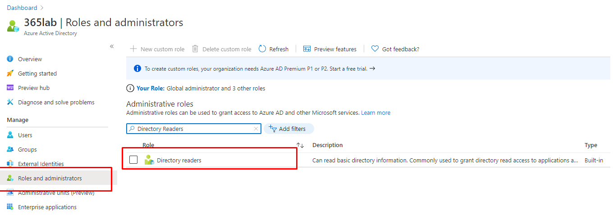
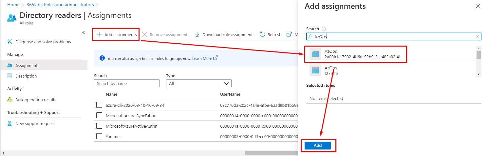

# Configure Microsoft Entra ID permissions for Service Principal

This article will guide you through the process to add your AzOps service principal to the  Microsoft Entra ID [Directory Readers](https://learn.microsoft.com/azure/active-directory/users-groups-roles/directory-assign-admin-roles) role.

> Note: The steps below requires you to use an identity that is local to the Microsoft Entra ID, and **_not_** a Guest user account due to known restrictions.

The service principal used by the Enterprise-Scale reference implementation requires Microsoft Entra directory reader permissions to be able to discover Azure role assignments. These permissions are used to enrich data around the role assignments with additional Microsoft Entra context such as ObjectType and Microsoft Entra Object DisplayName.

## Add service principal to directory role via Azure Portal (Option 1)

1.1 Sign in to the Azure portal or the Microsoft Entra admin center as a Global Administrator. If you are using Microsoft Entra Privileged Identity Management, activate your Global Administrator role assignment.

1.2 Open Microsoft Entra ID.

1.3 Under _Manage_ > _Roles and administrators_, select _Directory readers_.


1.4 Under _Manage_ > _Assignments_ > _Add assignments_, find and select your AzOps service principal and finally add it to the directory role.



> Note: In case you are using Microsoft Entra Privileged Identity management, ensure you add the service principal to the role with a permanent assignment.

## Add service principal to directory role with Azure AD PowerShell (Option 2)

Ensure that you have the [AzureAD PowerShell module installed on your machine](https://learn.microsoft.com/powershell/module/azuread/?view=azureadps-2.0) and that you have connected to Microsoft Entra ID with the [Connect-AzureAD](https://learn.microsoft.com/powershell/module/azuread/connect-azuread?view=azureadps-2.0) cmdlet.


````powershell
#Param -- Default is AZOps
$ADServicePrincipal = "AZOps"

#verify if AzureAD module is installed and running a minimum version, if not install with the latest version.
if (-not (Get-InstalledModule -Name "AzureAD" -MinimumVersion 2.0.2.130 ` -ErrorAction 'SilentlyContinue')) {

    Write-Host "AzureAD Module does not exist" -ForegroundColor 'Yellow'
    Install-Module -Name 'AzureAD' -Force
}
else {
    Write-Host "AzureAD Module exists with minimum version" -ForegroundColor 'Yellow'
}
Connect-AzureAD #sign in to Azure from Powershell, this will redirect you to a webbrowser for authentication, if required

#Verify Service Principal and if not pick a new one.
if (-not (Get-AzureADServicePrincipal -Filter "DisplayName eq '$ADServicePrincipal'")) { 
    Write-Host "ServicePrincipal doesn't exist or is not AZOps" -ForegroundColor 'Red'
    break
}
else { 
    Write-Host "$ADServicePrincipal exist" -ForegroundColor 'Green'
    $ServicePrincipal = Get-AzureADServicePrincipal -Filter "DisplayName eq '$ADServicePrincipal'"
    #Get Microsoft Entra Directory Role
    $DirectoryRole = Get-AzureADDirectoryRole -Filter "DisplayName eq 'Directory Readers'"
    #Add service principal to Directory Role
    Add-AzureADDirectoryRoleMember -ObjectId $DirectoryRole.ObjectId -RefObjectId $ServicePrincipal.ObjectId
}
````

Please note, it may take up to 15-30 minutes for permission to propagate in Microsoft Entra ID.

## Next steps

Please proceed with [deploying reference implementation](./ALZ-Deploy-reference-implementations).
