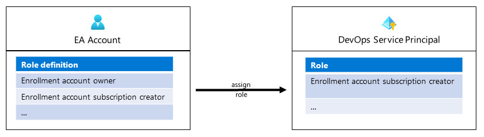

## In this Section

- [In this Section](#in-this-section)
- [Create landing zones (subscription) using AzOps](#create-landing-zones-subscription-using-azops)
- [Pre-requisites](#pre-requisites)
- [Enable Service Principal to create landing zones](#enable-service-principal-to-create-landing-zones)
- [ARM template repository](#arm-template-repository)
- [Create a new landing zone (subscriptions)](#create-a-new-landing-zone-subscriptions)

---

## Create landing zones (subscription) using AzOps

Managing all the platform resources in a a single repository is one of the guiding principle for PlatformOps to manage the platform. Subscriptions representing landing zones are resource types manage by the PlatformOps team. As every other platform resource type subscriptions are created using the ARM API. For Subscriptions the API and versions vary and depend on the commercial contract.

- [Enterprise Enrollment (EA)](https://docs.microsoft.com/azure/cost-management-billing/manage/programmatically-create-subscription-enterprise-agreement)
- [Microsoft Customer Agreement (MCA)](https://docs.microsoft.com/azure/cost-management-billing/manage/programmatically-create-subscription-microsoft-customer-agreement)
- [Microsoft Partner Agreement (MPA)](https://docs.microsoft.com/azure/cost-management-billing/manage/programmatically-create-subscription-microsoft-partner-agreement)

This article describes the flow to create subscriptions/landing zones in an Enterprise Enrollment (EA). Natively in Azure, *enrollment owner* have the permission to create and own subscriptions. *Enrollment owners* are user identities in Azure AD and in order to create subscriptions in an fully automated process the permission to create subscription need to be delegate to a Service Principal (SPN) or Managed Service Identity (MSI).

One of the benefits using this approach is the management of platform security and governance in a single place and built into the platform repository and pipeline(s).

## Pre-requisites

Before getting started with this first steps ensure that AzOps has been [setup and configured for the target environment](Deploying-Enterprise-Scale.md#validation-post-deployment-github). In this documentation the same Service Principal will be used to to assign the permission to create landing zones (subscription).

For the Service Principal permissions to create subscriptions, access to an *enrollment account* that has a billing id associated is required.

>Note: When using this Service Principal the subscription will be created under specified billing scope of *enrollment account*. Multiple enrollment account permissions can be granted to a Service Principal. The billing scope will be specified in the ARM template during the subscription creation process.

Creating Azure subscriptions programmatically is allowed on specific types of Azure agreement types (EA, MCA, MPA). Refer to guidance on [Creating Azure subscriptions programmatically](https://docs.microsoft.com/azure/cost-management-billing/manage/programmatically-create-subscription) to know supported agreement types.

## Enable Service Principal to create landing zones

This section describes how AzOps is used to create subscriptions (landing zones) under management groups using ARM templates. In the following steps the *Enrollment account subscription creator* role will be assigned to a SPN as illustrated in the following article:



**Login and fetch access token**
Login with the *enrollment account* (e.g. with `Login-AzAccount`) and execute the following commands to fetch a valid access token for the account:

```powershell
# Provide the objectId of the AzOps service principal to grant access to enrolment account. 
$spnObjectId = (Get-AzADServicePrincipal -DisplayName "MyAzOpsSPN").Id

# Fetching new token
$token = Get-AzAccessToken
```

**List all the billing accounts and enrollment accounts**
As a next step, list and identify the "billing account" and *enrollment account* the user has access to. These two information are required to request the roles available and to assign the permissions to the Service Principal.

The following scripts lists the *billing account* and "enrollment account" and assigns it to a variables which will be used later in this guide.

```powershell
# Request billing accounts that the identity has access to
$listOperations = @{
    Uri     = "https://management.azure.com/providers/Microsoft.Billing/billingaccounts?api-version=2020-05-01"
    Headers = @{
        Authorization  = "Bearer $($token.Token)"
        'Content-Type' = 'application/json'
    }
    Method  = 'GET'
}
$listBillingAccount = Invoke-RestMethod @listOperations

# List billing accounts
$listBillingAccount | ConvertTo-Json -Depth 100

# Select first billing account and the corresponding enrollment account
$billingAccount = $listBillingAccount.value[0].id
$enrollmentAccountId = $listBillingAccount.value[0].properties.enrollmentAccounts[0].id
```

**Read existing role definitions for the enrolment account**
Multiple role definitions exists on an *enrollment account*. When this article was written the following role definitions exist:

| Role name                               | ID                                   |
| :-------------------------------------- | :----------------------------------- |
| Enrollment account owner                | c15c22c0-9faf-424c-9b7e-bd91c06a240b |
| Enrollment account subscription creator | a0bcee42-bf30-4d1b-926a-48d21664ef71 |

Both role definitions have the `Microsoft.Subscription/subscriptions/write` permission required to create subscriptions. *Enrollment account subscription creator* can be assigned to a Service Principal.

```powershell
# Get billing roleDefinitions available at scope
$listRbacObj = @{
    Uri = "https://management.azure.com/$($enrollmentAccountId)/billingRoleDefinitions?api-version=2019-10-01-preview"
    Headers = @{
        Authorization  = "Bearer $($token.Token)"
        'Content-Type' = 'application/json'
    }
    Method = "GET"
}
$listRbac = Invoke-WebRequest @listRbacObj
$listRbac.Content | ConvertFrom-Json | ConvertTo-Json -Depth 100
```

**Assign permission (role assignment)**
As a last step the Service Principal will be granted access to the *enrolment account* by assigning a role with the `Microsoft.Subscription/subscriptions/write` permission. Built-in role *Enrollment account subscription creator (GUID: a0bcee42-bf30-4d1b-926a-48d21664ef71)* is required.

```powershell
# roledefinitonId (billingRoleDefinitions) has be equal to the role id of the "enrollment account subscription creator" role listed in the rbacContent object
$roleAssignmentBody = @"
{
    "properties": {
        "principalId": "$($spnObjectId)",
        "roleDefinitionId": "$($enrollmentAccountId)/billingRoleDefinitions/a0bcee42-bf30-4d1b-926a-48d21664ef71"
      }
}
"@

# Generate new GUID for the role assignment
$rbacGuid = New-Guid

# Assign 'Enrollment account subscription creator' role to the SPN
$assignRbac = @{
    Uri = "https://management.azure.com/$($enrollmentAccountId)/billingRoleAssignments/$($rbacGuid)?api-version=2019-10-01-preview"
    Headers = @{
        Authorization  = "Bearer $($token.Token)"
        'Content-Type' = 'application/json'
    }
    Method = "PUT"
    Body = $roleAssignmentBody
    UseBasicParsing = $true
}
$assignedRbac = Invoke-RestMethod @assignRbac
```

After the role is successfully assigned Service Principal can be used to create subscriptions (landing zones).

>Note: The Service Principal can be granted access to multiple *enrolment accounts*. To enable this, execute this sequence multiple times (once per *enrollment account*).

## ARM template repository

PlatformOps will use AzOps CI/CD pipelines to create subscriptions (landing zones) before handing it out to application teams. [Steps below](#create-a-subscription-landing-zone-using-azops) will use this approach to create a subscription.

>Hint: Different examples are published in the Enterprise-Scale repository to automate landing zone creation [here](https://github.com/Azure/Enterprise-Scale/tree/main/examples/landing-zones).

## Create a new landing zone (subscriptions)

Creating a landing zone (subscription) is as simple as creating any other resource in Azure. The same sequence of steps will be needed as used for other platform resource deployments (e.g. [deploy a policyAssignments](./Deploying-Enterprise-Scale.md#create-new-policy-assignment-for-validation)).

To successfully deploy a subscription using AzOps the following steps will be required:

- 'Connect' AzOps to the Azure Environment, ensure that ['Pull' workflow runs successfully](./Deploying-Enterprise-Scale.md#validation-post-deployment-github)
- Enable the AzOps SPN for subscription creation as documented [here](#enable-service-principal-to-create-landing-zones)
- Ensure that SPN has Owner permissions at the target management group the subscription will be deployed under

The following steps will deploy an empty subscription under the '*company-prefix*-online' management group

1. Create a new branch 'new-landing-zone' in your AzOps Git repository and make it current

> Git command: `git checkout -b new-landing-zone`)

2. Copy the file [emptySubscription.json](https://raw.githubusercontent.com/Azure/Enterprise-Scale/main/examples/landing-zones/empty-subscription/emptySubscription.json) or the example below and save it to the '*company-prefix*-online' folder in the folder structure.

ARM template to create an empty subscription:
```json
{
    "$schema": "https://schema.management.azure.com/schemas/2019-08-01/managementGroupDeploymentTemplate.json#",
    "contentVersion": "1.0.0.0",
    "parameters": {
        "subscriptionAliasName": {
            "type": "string",
            "metadata": {
                "description": "Provide a name for the alias. This name will also be the display name of the subscription."
            }
        },
        "billingAccountId": {
            "type": "string",
            "metadata": {
                "description": "Provide the full resourceId of the MCA or the enrollment account id used for subscription creation."
            }
        },
        "targetManagementGroup": {
            "type": "string",
            "metadata": {
                "description": "Provide the resourceId of the target management group to place the subscription."
            }
        }
    },
    "resources": [
        {
            "scope": "/", // routing the request to tenant root
            "name": "[parameters('subscriptionAliasName')]",
            "type": "Microsoft.Subscription/aliases",
            "apiVersion": "2020-09-01",
            "properties": {
                "workLoad": "Production",
                "displayName": "[parameters('subscriptionAliasName')]",
                "billingScope": "[parameters('billingAccountId')]",
                "managementGroupId": "[tenantResourceId('Microsoft.Management/managementGroups/', parameters('targetManagementGroup'))]"
            }
        }
    ],
    "outputs": {}
}
```

3. Create a `emptySubscription.parameters.json` file in the same folder with the parameters below and update the values appropriate.

- `subscriptionAliasName` - Tenant wide unique alias for the subscription. Will also become the display name for the subscription.
- `billingAccountId` - Provide the full resourceId of the MCA or the enrollment account id used for subscription creation (e.g. `/providers/Microsoft.Billing/billingAccounts/<billingAccountId>/enrollmentAccounts/<enrollmentAccountId`)
- `targetManagementGroup` - Provide the resourceId of the target management group to place the subscription.

``` json
{
    "$schema": "https://schema.management.azure.com/schemas/2019-04-01/deploymentParameters.json#",
    "contentVersion": "1.0.0.0",
    "parameters": {
        "subscriptionAliasName": {
            "value": "" 
        },
        "billingAccountId": {
            "value": "" 
        },
        "targetManagementGroup": {
            "value": "" 
        }
    }
}
```

4. Commit the new content to the branch and create a PR (`new-landing-zone` branch -> `main`)

> Hint: As part of the PR validation AzOps deploys the new subscriptions and merges the changes to the `main` branch.

5. Validate in subscription creation was successful using the Azure Portal
