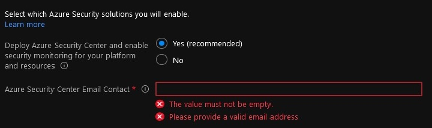
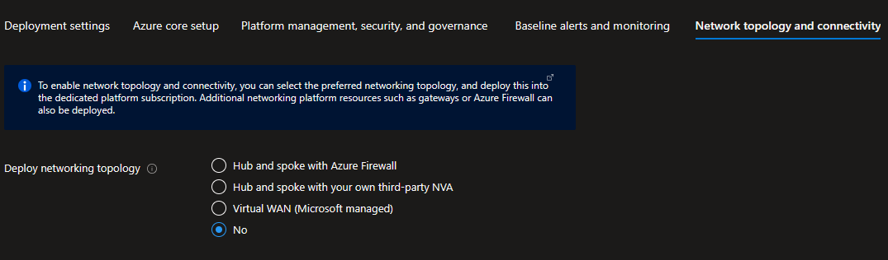
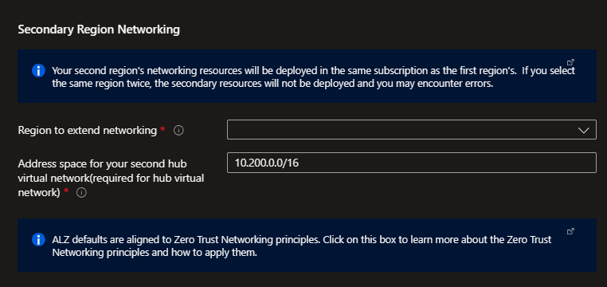
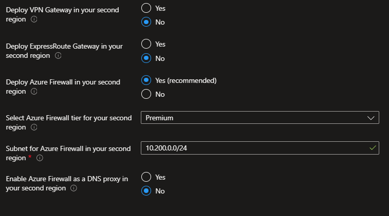
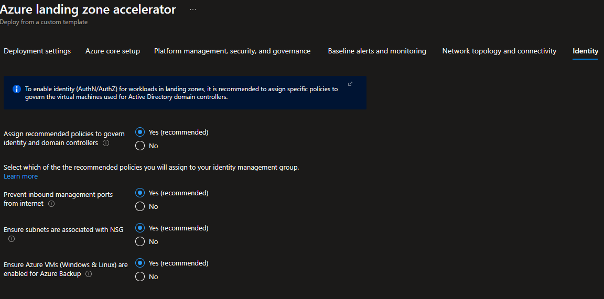
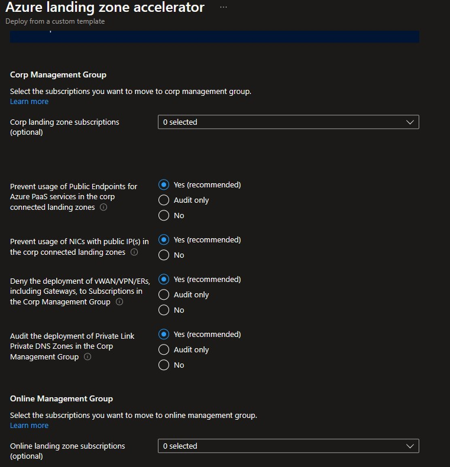
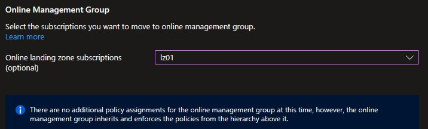
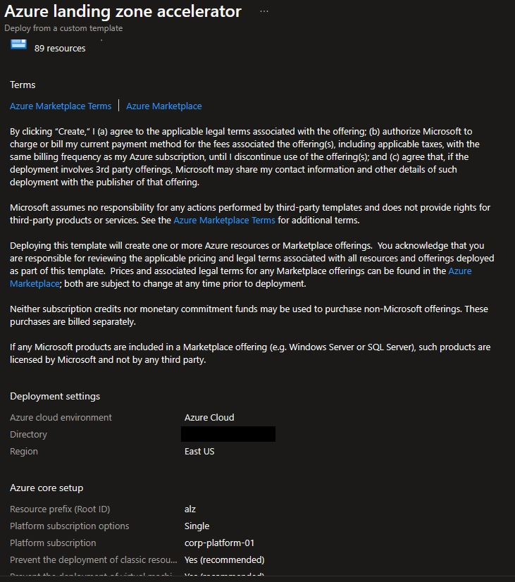

## Azure landing zone portal accelerator deployment for Small Enterprises

In this tutorial, you will deploy an Azure landing zone portal accelerator with connectivity to on-premises datacenters and branch offices based on a [hub and spoke network topology](https://learn.microsoft.com/en-us/azure/cloud-adoption-framework/ready/azure-best-practices/traditional-azure-networking-topology), and where Management, Connectivity and Identity resources are consolidated in a single Platform Subscription.

This setup is meant for Small and Medium Enterprises and organizations that do not have a large IT team and do not require fine grained administration delegation models, and that are willing to leverage Azure native capabilities for simplicity and cost efficiency.

Please refer to [Trey Research reference implementation](https://github.com/Azure/Enterprise-Scale/blob/main/docs/reference/treyresearch/README.md) for further details on the Azure foundation enabled in this tutorial.

## 1. Pre-requisites

There are a number of prerequisites which need to be met before you can provision an Azure landing zones environment via the deployment experience in the Azure portal. See the following [instructions](./Deploying-ALZ-Pre-requisites.md) on how to grant access before you proceed.

### Subscriptions

The deployment experience in Azure portal allows you to bring in an existing (preferably empty) subscriptions dedicated to host your Platform (Management, Connectivity and Identity) resources. It also allows you to bring existing subscriptions that can be used as the initial Landing Zones for your applications.

To learn how to create new subscriptions using Azure portal, please visit this [link](https://azure.microsoft.com/en-us/blog/create-enterprise-subscription-experience-in-azure-portal-public-preview/).

To learn how to create new subscriptions programmatically, please visit this [link](https://learn.microsoft.com/en-us/azure/cost-management-billing/manage/programmatically-create-subscription).

**For this tutorial, three empty subscriptions are required: one subscription dedicated to host your Platform resources and two subscriptions to host your applications .**

## 2. Launch the Azure landing zone portal accelerator deployment experience

You can **initiate the deployment** by clicking the "Deploy to Azure" button below:

Alternatively you can start your Azure landing zone portal accelerator deployment via [GitHub](https://github.com/Azure/Enterprise-Scale#deploying-enterprise-scale-architecture-in-your-own-environment)

## 3. Deployment location

On the first page, select the *cloud environment*. This should default to the correct Azure Cloud, *only* change this if you believe the value to be incorrect. Next, select the Region. This region will primarily be used to place the deployment resources in an Azure region, but also used as the initial region for some of the resources that are deployed, such as Azure Log Analytics and Azure automation. Now proceed to *Azure core setup*.

Click **Next: Azure Core Setup>** once you had chosen your deployment Region.

## 4. Azure core setup

On the *Azure Core setup* blade you will:

- **Provide a prefix** that will be used to name your management group hierarchy **and** platform resources.
- Choose between using dedicated subscriptions or a single subscription to host platform resources.
- Choose between deploying in a single region, or in two regions.

**Please Note:** A dedicated platform subscriptions is in general recommended. However, some Customers have the requirement to host their platform and applications within a single subscription. This tutorial is aimed at Customers with this requirement.

  Select **Single** and **provide a dedicated (empty) subscription** that will be used to host your Platform resources.

  

Next, select if you wish to **Deploy in a secondary region**.  If this is left as *Yes*, then you will receive additional inputs later in the process to deploy resources in a secondary region.

Click **Next: Platform management, security, and governance>**.

## 5. Platform management, security, and governance

On the *Platform management, security, and governance* blade, you will:

- configure the core components to enable monitoring,
- configure the core components to enable security posture management,
- configure the core components to thread protection for your platform and application resources.

**Note:** The options you enable will be enforced using Azure Policy to ensure your landing zones and  Azure resources are continuously compliant as your deployments scale and grow.

- Enable **Deploy Log Analytics workspace and enable monitoring for your platform and resources** to get a central [Log Analytics Workspace](https://learn.microsoft.com/en-us/azure/azure-monitor/logs/data-platform-logs#log-analytics-and-workspaces) and an [Automation Account deployed](https://learn.microsoft.com/en-us/azure/automation/automation-intro) deployed, and a set of [Azure Policies](https://github.com/Azure/Enterprise-Scale/blob/main/docs/ESLZ-Policies.md) applied at the root of the Azure landing zone Management Group hierarchy to make sure Activity Logs from all your Subscriptions, and Diagnostic Logs from all your VMs and PaaS resources are sent to Log Analytics.

  - If required you can customize the retention time of your monitoring data from it's default of 30 days by using the **Log Analytics Data Retention (days)** slider.
**Please note:** Increasing the retention time to more than 30 days will increase your costs.
See [Manage usage and costs with Azure Monitor Logs](https://learn.microsoft.com/en-us/azure/azure-monitor/logs/manage-cost-storage) for further details on Azure Monitor pricing. The data retention time [can be changed at any time](https://learn.microsoft.com/en-us/azure/azure-monitor/logs/manage-cost-storage#change-the-data-retention-period).

  

  - You can customize what [Azure Monitor solutions](https://learn.microsoft.com/en-us/azure/azure-monitor/insights/solutions?tabs=portal) are enabled in your Log Analytics Workspace:
  
    

    - [Agent Health](https://learn.microsoft.com/en-us/azure/azure-monitor/insights/solution-agenthealth) helps you understand which monitoring agents are unresponsive and submitting operational data.
    - [Change Tracking](https://learn.microsoft.com/en-us/azure/automation/change-tracking/overview) tracks changes in virtual machines hosted in Azure, on-premises, and other cloud environments to help you pinpoint operational and environmental issues.
    - [Update Management](https://learn.microsoft.com/en-us/azure/automation/update-management/overview) assesses the status of available updates and allows you manage the process of installing required updates for your machines leveraging Azure Automation.
    - [VM Insights](https://learn.microsoft.com/en-us/azure/azure-monitor/vm/vminsights-overview) monitors the performance and health of your virtual machines and virtual machine scale sets, including their running processes and dependencies on other resources.
    - [Service Map](https://learn.microsoft.com/en-us/azure/azure-monitor/vm/service-map) automatically discovers application components on Windows and Linux systems and maps the communication between services.
    - [SQL Assessment](https://learn.microsoft.com/en-us/azure/azure-monitor/insights/sql-assessment) provides a prioritized list of recommendations specific to your deployed server infrastructure. The recommendations are categorized across six focus areas which help you quickly understand the risk and take corrective action.

- **Enable** **Deploy Azure Security Center and enable security monitoring for your platform and resources** option to allow Azure Security Center assess your subscriptions and detect security misconfigurations in your Azure resources, and leverage [Azure Defender](https://learn.microsoft.com/en-us/azure/security-center/azure-defender) to protect your workloads. An Azure Policy will be applied to the root of the Azure landing zone Management Group hierarchy to enforce your settings across all your subscriptions.

  You will need to **provide an email address** to get email notifications from Azure Security Center. It is best practices to provide a distribution list instead of an email address tied to a single person.

  

  - All Azure Defender features are enabled by default (recommended) but are fully customizable. See [Azure Defender pricing](https://azure.microsoft.com/en-us/pricing/details/azure-defender/) for further details on the costs associated with each of the Azure Defender features.

  

- Depending on your requirements, you may want to select **Deploy Azure Sentinel** to enable [Azure Sentinel](https://learn.microsoft.com/en-us/azure/sentinel/overview) in your Log Analytics Workspace. Please note, enabling Azure Sentinel will introduce additional costs. See [Azure Sentinel Pricing](https://azure.microsoft.com/en-us/pricing/details/azure-sentinel/) for additional information.

  **In this tutorial, Azure Sentinel is not enabled**. [Azure Sentinel](https://learn.microsoft.com/en-us/azure/sentinel/quickstart-onboard) can be deployed at any stage after the the Landing Zone has been deployed.

  

Click **Next: Platform Devops and Automation>** to configure how your Azure environment will be deployed and managed.

## 6. Baseline alerts and monitoring

On the *Baseline alerts and monitoring* blade, you can configure automated alert configuration for the different scopes in your Azure landing zone implementation. Enabling the different baseline alerts will assign the relevant initiative to the corresponding management group. If you enable the "Deploy one or more Azure Monitor Baseline Alerts" option, you **must**  provide an email address to get email notifications from Azure Monitor for the deployment to proceed.

## 7. Network topology and connectivity

On the *Network topology and connectivity* blade you will configure your core networking platform resources.

- **Deploy networking topology**:
  - For this scenario, select **Hub and spoke with Azure Firewall**.
  - **Address Space**: Provide the private IP Address Space to be assigned to the hub virtual network. Please make sure the address space provided does not overlap with neither the ones being used on-premises or those that you will be assigning to the virtual networks where your are deploying your workloads. See [Plan for IP Addressing](https://learn.microsoft.com/en-us/azure/cloud-adoption-framework/ready/azure-best-practices/plan-for-ip-addressing) for further recommendations.
  - **Region for the first networking hub**: **Select an Azure region where the hub virtual network will be created**. That is most usually the same Region you chose in the *Deployment location* tab but can be a different one if needed.

  

- Depending on your requirements, you may choose to deploy additional network infrastructure for your Azure architecture. The optional resources include:

  - **Enable DDoS Network Protection**: Usage of [Azure DDoS Network Protection](https://learn.microsoft.com/en-us/azure/ddos-protection/ddos-protection-overview) is recommended to help protect all public endpoints hosted within your virtual networks. When this option is selected an Azure DDoS Protection Plan is provisioned in your Platform Subscription and which can be used to protect public endpoints across your Platform and Landing Zone subscriptions. DDoS Protection Plan's costs cover up to 100 public endpoints. Protection of additional endpoints requires additional fees. See [Azure DDoS Protection pricing](https://azure.microsoft.com/en-us/pricing/details/ddos-protection/) for further details.
  
    **In this tutorial, DDoS Network Protection it is enabled**. Set **Enable DDoS Network Protection** to **Yes**.

    

  - **Create Private DNS Zones for Azure PaaS services** allows you to provision and connect to your Hub virtual network a number of Azure Private DNS Zones which are required to leverage Private Endpoints to access Azure PaaS services as [recommended for Azure Landing Zones](https://learn.microsoft.com/en-us/azure/cloud-adoption-framework/ready/azure-best-practices/connectivity-to-azure-paas-services). See [Azure Private Endpoint DNS configuration](https://learn.microsoft.com/en-us/azure/private-link/private-endpoint-dns) for further details.

    Enabling **Create Private DNS Zones for Azure PaaS services** is recommended if the workloads you are deploying to your Landing Zones are expected to be use Azure PaaS services.

    **In this tutorial, deployment of Private DNS Zones required by Azure PaaS Service's Private Endpoints will not be enabled**. Please note you can [deploy those Private DNS Zones](https://learn.microsoft.com/en-us/azure/cloud-adoption-framework/ready/azure-best-practices/private-link-and-dns-integration-at-scale) at any time if later on needed.

  

- Choose to deploy either or both VPN (**Deploy VPN Gateway**) and ExpressRoute Gateways (**Deploy ExpressRoute Gateway**) and provide additional configuration settings. In this tutorial, we will be deploying a VPN Gateway to enable hybrid connectivity using a Site to Site VPN connection but you can opt of using ExpressRoute instead or [both](https://learn.microsoft.com/en-us/azure/expressroute/use-s2s-vpn-as-backup-for-expressroute-privatepeering).

  Set **Deploy VPN Gateway** to **Yes**:
  
  

  - **Deploy zone redundant or regional VPN Gateway** and **Deploy zone redundant or regional ExpressRoute Gateway**: Zone-redundant gateways are recommended and enabled by default (as per the capabilities of the Region you are deploying your hub virtual network) as they provide higher resiliency and availability. You might opt for a regional deployment depending on your availability requirements and budget. In this tutorial you will deploy a zone-redundant VPN Gateway:
  
    Select **Zone redundant (recommended)**.
  
    

  - **Deploy VPN Gateway in Active/Active mode**:  You can create an Azure VPN gateway in an active-active configuration, where both instances of the gateway VMs establish S2S VPN tunnels to your on-premises VPN device.  In this configuration, each Azure gateway instance has a unique public IP address, and each will establish an IPsec/IKE S2S VPN tunnel to your on-premises VPN device specified in your local network gateway and connection. See [Active-active VPN gateways](https://learn.microsoft.com/en-us/azure/vpn-gateway/vpn-gateway-highlyavailable#active-active-vpn-gateways).

  - **Select the VPN Gateway SKU** and **Select the ExpressRoute Gateway VPN**: choose the right SKU based on your requirements (capabilities, throughput and availability). See [VPN Gateway SKUs](https://learn.microsoft.com/en-us/azure/vpn-gateway/vpn-gateway-about-vpn-gateway-settings#gwsku) and [ExpressRoute Gateway SKUs](https://learn.microsoft.com/en-us/azure/expressroute/expressroute-about-virtual-network-gateways#gwsku) for further details on the virtual gateway's SKUs you have available in Azure. In this tutorial you will deploy a VpnGw2AZ which provides an aggregated throughput of up to 1 Gbps:
  
    

  - **Subnet for VPN/ExpressRoute Gateways**: provide an address space to be assigned to the subnet dedicated to host your virtual network gateways. We recommend that you create a gateway subnet of /27 or larger (/27, /26 etc.) if you have the available address space to do so. This will accommodate most configurations. In this tutorial you will assign a /26:

      

- Select **Deploy Azure Firewall** to get an Azure Firewall deployed (recommended) to your hub virtual network for spoke-to-spoke, on-premises-to-Azure, and internet-outbound traffic protection and filtering.

  Set **Deploy Azure Firewall** to **Yes**.

  

  Continue with configuring the rest of your Azure Firewall deployment settings:

  - **Enable Azure Firewall as a DNS proxy**: select this option if you are planning to use [FQDNs in Network rules](https://learn.microsoft.com/en-us/azure/firewall/fqdn-filtering-network-rules).

    In this tutorial, you will not enable this feature. Please note you can [enable DNS Proxy feature](https://learn.microsoft.com/en-us/azure/firewall/dns-settings) at any moment.
  
    Set **Enable Azure Firewall as a DNS proxy** to **No**.

    

  - **Select Azure Firewall tier**: choose the right SKU based on your requirements. See [Azure Firewall features](https://learn.microsoft.com/en-us/azure/firewall/features) and [Azure Firewall Premium features](https://learn.microsoft.com/en-us/azure/firewall/premium-features) for further details.

    **Note:** In this tutorial, you will deploy an Azure Firewall Standard. You can [upgrade to Azure Firewall Premium](https://learn.microsoft.com/en-us/azure/firewall/premium-migrate) if needed. However the upgrade process will cause downtime.
  
    Set **Select Azure Firewall tier** to **Standard**:

    

  - **Select Availability Zones for the Azure Firewall**:

    In this tutorial you will deploy a zone-redundant Azure Firewall.

    **Select two or more zones** to configure your Azure Firewall deployment to span multiple [Availability Zones](https://learn.microsoft.com/en-us/azure/firewall/features#availability-zones) (recommended for increased availability).

    

    There's no additional cost for a firewall deployed in an Availability Zone. However, there are added costs for inbound and outbound data transfers associated with Availability Zones. For more information, see [Bandwidth pricing](https://azure.microsoft.com/pricing/details/bandwidth/).

    Depending on your requirements you may opt for a different setup, but please note Azure Firewall zone-redundancy cannot be changed after deployment.
    - Select one zone if you want to pin your Azure Firewall deployment to a specific zone.
    - Do not select any zone if you want your Azure Firewall deployment to be regional.
  
  - **Subnet for Azure Firewall**: **provide an address space (/26 or larger)** to be assigned to the subnet dedicated to host your Azure Firewall instances.

  

### Deploying networking resources in a second region

If you selected **Deploy in a secondary region** in the Core steps, you will also configure a secondary region for networking platform resource in this blade.  This secondary platform network deployment prepares you you to take advantage of capacity in multiple regions, and for recovery or multi-region high availability.

The deployment will use the same deployment type as the primary region - either two hub and spokes with Azure firewall, two hub and spokes with your own-third party NVA, or an additional virtual WAN hub.

You will need to specify the additional region to deploy to, and then you will be given the option to deploy and configure your gateways and (if applicable) your Azure firewall.

For best results, use similar inputs to make sure that your regional deployments can both support the same architecture.  However, if you want to forgo deploying a gateway or firewall in the second region, you can select the appropriate options.

Once deployed, your regional hubs will be peered together and have routing tables assigned to the firewall subnets to handle routing to each other.  You can add routes to this route table later, as you add spoke networks.  If you have deployed DDoS protection in the primary region, it will be applied to the secondary region as well.

Your Private DNS zones will be deployed in a resource group linked to your primary region, and will be assigned to both regions.  See [Private Link and DNS integration at scale](https://learn.microsoft.com/azure/cloud-adoption-framework/ready/azure-best-practices/private-link-and-dns-integration-at-scale) for more information.

Click **Next: Identity>** once you had configured your network setup.

## 8. Identity

On the *Identity* blade you can specify if you want to assign recommended Azure Policies to govern Domain Controllers deployed to your Platform Subscription. If you decide to enable this feature, you can then select which Azure Policies you want to get assigned. Please note, those Azure Policies will apply to all Virtual Machines deployed to the Platform Subscription regardless of their role. See [Azure landing zone Policies](https://github.com/Azure/Enterprise-Scale/blob/main/docs/ESLZ-Policies.md) for further details on the recommended set of Azure Policies.

In this tutorial, no additional Azure Policies are assigned to the Platform Subscription.

Set **Assign recommended policies to govern identity and domain controllers** to **No**.

Click **Next: Landing Zone configuration>** to continue with your deployment.

## 9. Landing zones configuration

In the top section you can **select** from a set of **recommended Azure policies** which ones you want to apply to secure and govern your Landing Zones. All landing zone Azure Policies are enabled by default (recommended) but are fully customizable.

- **Please note:** Landing zone Azure Policies can be assigned at any time.

  Any Azure Policies you selected will be assigned to the [Landing Zones Management Group](./How-Enterprise-Scale-Works#enterprise-scale-management-group-structure) under the root of your Enterprise Scale Management Group hierarchy. See [landing zone Azure's Policies](https://github.com/Azure/Enterprise-Scale/blob/main/docs/ESLZ-Policies.md) for further details on the configurable set of Azure Policies.

  As part of the policies that you can assign to your landing zones, the Azure landing zone portal accelerator experience will allow you to protect your landing zones with a DDoS Network Protection. For connected Landing Zones (*Corp* Landing Zones), you will have the option to prevent usage of public endpoints for Azure PaaS services as well as ensure that private endpoints to Azure PaaS services are integrated with Azure Private DNS Zones.

  **In this tutorial, all recommended Azure Policies are enabled.**

  

In the bottom two sections you can choose to bring in N number of existing subscriptions that will be bootstrapped as landing zones, governed by Azure Policy:

- **Select the subscriptions you want to move to corp management group:**
  Corp Landing Zones are meant to host workloads that require connectivity to other resources within the corporate network via the Hub in the Platform Subscription.

For Corp Landing Zones its virtual network can be connected (recommended) to the hub virtual network using virtual network peering, enabling access to your corporate network. Please note you will need to provide a non-overlapping private IP address space to be assigned to each Landing Zone. See [Plan for IP Addressing](https://learn.microsoft.com/en-us/azure/cloud-adoption-framework/ready/azure-best-practices/plan-for-ip-addressing) for further recommendations. Also, if you deployed and enabled Azure Firewall as DNS proxy, [DNS settings on these VNets will be configured](https://learn.microsoft.com/en-us/azure/firewall/dns-settings#configure-virtual-network-dns-servers) with the Azure Firewall private IP address. In this section you can also select which Azure Policies you would like to enable for the corp management group specifically.

  In this tutorial, a "Corp" Landing Zone is provisioned using an existing (empty) subscription and connected to the Hub virtual network previously configured. Please note, additional subscriptions can be added.

  
- **Select the subscriptions you want to move to online management group**:
  Online Landing Zones are meant to host workloads that do not require connectivity/hybrid connectivity with the corporate network or that not even require a virtual network.

  In this tutorial, an "Online" Landing Zone is provisioned using an existing (empty) subscription.

  Select an empty subscription (*online-subscription*) from the ones available in the **Online landing zone subscription** drop down list. Please note, additional subscriptions can be added.

  

Click **Next: Decommissioned/Sandbox>** to continue with your deployment.

## 10. Decommissioned/Sandbox

You can optionally choose to change whether default policy assignments for Decommissioned and Sandbox management groups are enabled, set to audit only or disabled.

Click **Next: Review + Create>** to complete your deployment.

## 11. Review + create

*Review + Create* page will validate your permission and configuration before you can click deploy. Once it has been validated successfully, you can click *Create*

## 12. Post deployment activities

Once Azure landing zone portal accelerator deployment finishes, you can grant your application teams/business units access to their respective landing zones. Whenever there’s a need for a new landing zone, you can place them into their respective management groups (Online or Corp) given the characteristics of assumed workloads and their requirements.
