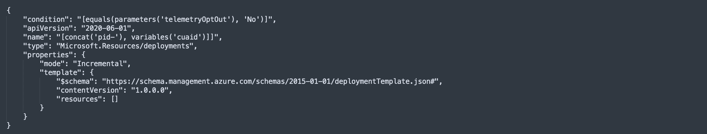

# Telemetry Tracking Using Customer Usage Attribution (PID)

Microsoft can identify the deployments of the Azure Resource Manager templates with the deployed Azure resources. Microsoft can correlate these resources used to support the deployments. Microsoft collects this information to provide the best experiences with their products and to operate their business. The telemetry is collected through [customer usage attribution](https://docs.microsoft.com/azure/marketplace/azure-partner-customer-usage-attribution). The data is collected and governed by Microsoft's privacy policies, located at the [trust center](https://www.microsoft.com/trustcenter).

To enable or disable the telemetry via the portal experience (recommended), use the radio toggle to specify your preference.

Customer Usage Attribution Disabled:

Customer Usage Attribution Enabled:

Alternatively, to enable or disable this tracking via the ARM template experience, we have included a parameter called `telemetryOptOut` in order to opt out of telemetry tracking to the ESLZ/ALZ ARM Template in this repo with a simple Boolean flag. The default value `false` which **enables** the telemetry. If you would like to disable this tracking, then simply set this value to `true` and this module will not be included in deployments and **therefore disables** the telemetry tracking.

In the `eslzARM.json` file, you will see the following:

If you are happy with leaving telemetry tracking enabled, no changes are required. Please do not edit the module name or value of the variable `cuaID` in any module.

## Module PID Value Mapping

The following are the unique ID's (also known as PIDs) used in each of the modules.

| Telemetry                                                                 | PID                                  |
| ------------------------------------------------------------------------- | ------------------------------------ |
| ALZ Accelerator/ESLZ ARM Deployment                                       | 35c42e79-00b3-42eb-a9ac-e542953efb3c |
| ALZ Accelerator/ESLZ ARM Deployment - Single Platform Subscription        | b35a8452-8a67-49f9-b1a9-1aee3c1a13c2 |
| ALZ Accelerator/ESLZ ARM Deployment - Multiple Platform Subscriptions     | 725aea60-cfaa-4a0c-9fe7-71b07f53803d |
| ALZ Accelerator/ESLZ ARM Deployment - No Networking                       | 35c1ce02-165f-43b2-8d3a-fc68a04b802a |
| ALZ Accelerator/ESLZ ARM Deployment - Hub & Spoke Networking              | f7fcc714-0c0d-4011-87bf-319810bbb03d |
| ALZ Accelerator/ESLZ ARM Deployment - Virtual WAN Networking              | 0263335d-f570-470c-8389-aa6c916e5008 |
| ALZ Accelerator/ESLZ ARM Deployment - Zero Trust Networking - Phase 1     | f09f64b8-5cb3-4b16-900d-6ba1df8a597e |
| ALZ Accelerator/ESLZ ARM Deployment - Azure Monitor baseline alerts       | 5f0e5693-3998-4ae2-8115-ee96e38dac62 |

## External modules telemetry tracking

In addition to the above, there are a number of modules in external repos that are used in the ALZ ARM Template. Telemetry tracking for these modules is enabled or disabled via the same radio button toggle as described above, i.e. if telemetry tracking is enabled all the different PIDs will be deployed, conversely if it's disabled no PIDs will be deployed. The table below lists the different modules and link to PID documentation for same.

| Module Name                                                                 | PID documentation                                |
| ------------------------------------------------------------------------- | ------------------------------------ |
| [Azure Monitor Baseline Alerts for ALZ](https://aka.ms/amba)              | [Telemetry](https://azure.github.io/azure-monitor-baseline-alerts/patterns/alz/Telemetry)|

### What is Zero Trust Network Telemetry

In an aligned effort with the Azure Networking Product Group, we have created an additional telemetry collection point to help us see customer choosing to adopt Zero Trust Networking best practices from ALZ.

> There will be multiple phases for Zero Trust Networking in ALZ that will mean additional telemetry collection points being added over time. This will only be captured when you run a portal deployment and select to leave telemetry collection enabled.

#### ALZ Accelerator/ESLZ ARM Deployment - Zero Trust Networking - Phase 1 | Definition

The following conditions and their values must be met for the telemetry point to be triggered for collection:

- Enable DDOS Protection is `true` in Hub and Spoke or Virtual WAN topologies
- Deploy Azure Firewall is `True` in Hub and Spoke or Virtual WAN topologies
- Azure Firewall Tier is `Premium` in Hub and Spoke or Virtual WAN topologies
- Ensure subnets are associated with NSG is `true` in both Landing Zones & Identity Management Groups
- Ensure secure connections to storage accounts (https) is `true` in the Landing Zones Management Group
