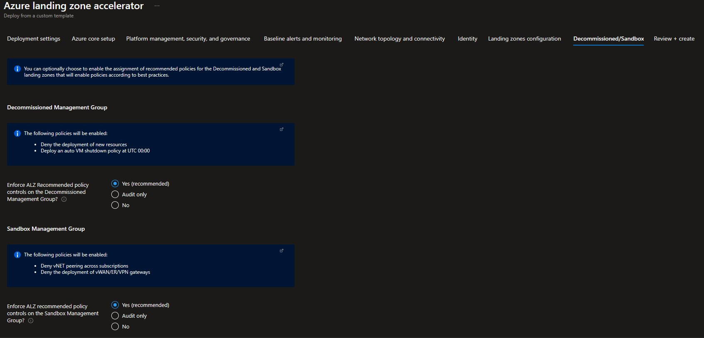

## Azure landing zone portal accelerator deployment without hybrid connectivity

This section will describe how to deploy an the Azure landing zone portal accelerator without connectivity to on-premises datacenters and branch offices. Please refer to [WingTip reference implementation](https://github.com/Azure/Enterprise-Scale/blob/main/docs/reference/wingtip/README.md) for further details on this reference architecture.

## 1. Pre-requisites

There are a number of prerequisites which need to be met before you can provision an Azure landing zones environment via the deployment experience in the Azure portal. See the following [instructions](./Deploying-ALZ-Pre-requisites.md) on how to grant access before you proceed.

### Optional pre-requisites

The deployment experience in Azure portal allows you to bring in existing (preferably empty) subscriptions dedicated for platform management. It also allows you to bring existing subscriptions that can be used as the initial landing zones for your applications.

To learn how to create new subscriptions using Azure portal, please visit this [link](https://azure.microsoft.com/en-us/blog/create-enterprise-subscription-experience-in-azure-portal-public-preview/).

To learn how to create new subscriptions programmatically, please visit this [link](https://docs.microsoft.com/en-us/azure/cost-management-billing/manage/programmatically-create-subscription).

## 2. Launch the Azure landing zone portal accelerator deployment experience

In the *Deploying Azure landing zone Architecture in your own environment* [article](https://github.com/Azure/Enterprise-Scale#deploying-enterprise-scale-architecture-in-your-own-environment), when you click on *Deploy to Azure* for the selected Azure landing zone reference implementation, it will start the deployment experience in the Azure portal into your default Azure tenant. In case you have access to multiple tenants, ensure you are selecting the right one.

Azure landing zone portal accelerator can be deployed both from the Azure portal directly, or from [GitHub](https://github.com/Azure/Enterprise-Scale#deploying-enterprise-scale-architecture-in-your-own-environment)

## 3. Deployment settings

On the first page, select the *cloud environment*. This should default to the correct Azure Cloud, *only* change this if you believe the value to be incorrect. Next, select the Region. This region will primarily be used to place the deployment resources in an Azure region, but also used as the initial region for some of the resources that are deployed, such as Azure Log Analytics and Azure automation. Now proceed to *Azure core setup*.

## 4. Azure core setup

Provide a prefix that will be used to create the management group hierarchy and platform resources, and or this scenario select **Dedicated** subscriptions for platform resources (please note that dedicates subscriptions are recommended).

## 5. Platform management, security, and governance

On the *Platform management, security, and governance* blade, you will configure the core components to enable platform monitoring and security. The options you enable will also be enforced using Azure Policy to ensure resources, landing zones, and configuration are continuously compliant as your deployments scales with business demand. To enable this, you must provide a dedicated (empty) subscription that will be used to host the requisite infrastructure.

Please note that if you enable the "Deploy Azure Security Center and enable security monitoring for your platform and resources" option, you **must** to provide an email address to get email notifications from Azure Security Center.

## 6. Baseline alerts and monitoring

On the *Baseline alerts and monitoring* blade, you can configure automated alert configuration for the different scopes in your Azure landing zone implementation. Enabling the different baseline alerts will assign the relevant initiative to the corresponding management group. If you enable the "Deploy one or more Azure Monitor Baseline Alerts" option, you **must** provide an email address to get email notifications from Azure Monitor for the deployment to proceed.

## 7. Network topology and connectivity

On the *Network topology and connectivity* blade, you can configure the core networking platform resources, such as hub virtual network, gateways (VPN and/or ExpressRoute), Azure Firewall, DDoS Network Protection and Azure Private DNS Zones for Azure PaaS services. To deploy and configure these network resources, you must select a network topology.

*For this [scenario](https://github.com/Azure/Enterprise-Scale/blob/main/docs/reference/wingtip/README.md) since we don't require network connectivity to on-premises or other networking services such as virtual network gateways or Azure Firewall, select "No" on the Deploy network topology option*

## 8. Identity

On the *Identity* blade you can specify if you want to assign recommended policies to govern identity and domain controllers. If you decide to enable this feature, you do need to provide an empty subscription for this. You can then select which policies you want to get assigned.

*For this [scenario](https://github.com/Azure/Enterprise-Scale/blob/main/docs/reference/wingtip/README.md) since we don't require an identity subscription, we will select the "No" option.*

## 9. Landing zone configuration

In the top section you can select which policies you want to assign broadly to all of your application landing zones. You also have the ability to set policies to *Audit only* which will assign the policies for Audit. In the bottom two sections you can optionally bring in N number of subscriptions that will be bootstrapped as landing zones, governed by Azure Policy. You can indicate which subscriptions you would like to be bootstrapped as landing zones for corp connectivity and which ones for online connectivity only. Please note that for this [scenario](https://github.com/Azure/Enterprise-Scale/blob/main/docs/reference/wingtip/README.md) we only require *online* landing zones.

## 10. Decommissioned/Sandbox

You can optionally choose to change whether default policy assignments for Decommissioned and Sandbox management groups are enabled, set to audit only or disabled.

## 11. Review + create

*Review + Create* page will validate your permission and configuration before you can click deploy. Once it has been validated successfully, you can click *Create*

## 12. Post deployment activities

Once Azure landing zone portal accelerator has been deployed, you can grant your application teams/business units access to their respective landing zones. Whenever there is a need for a new landing zone, you can place them into the Online management group.