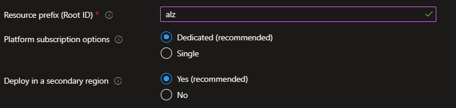
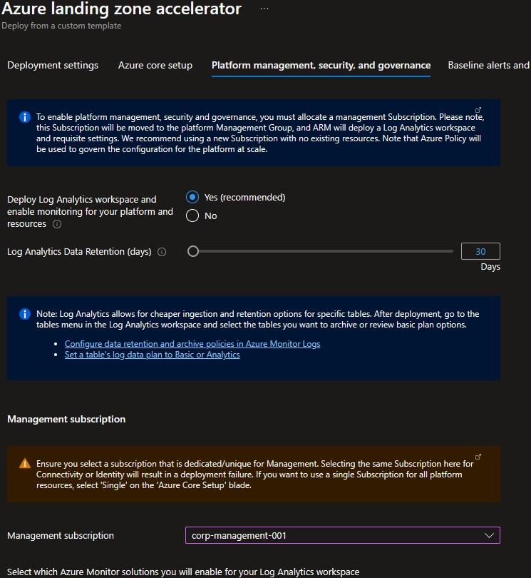
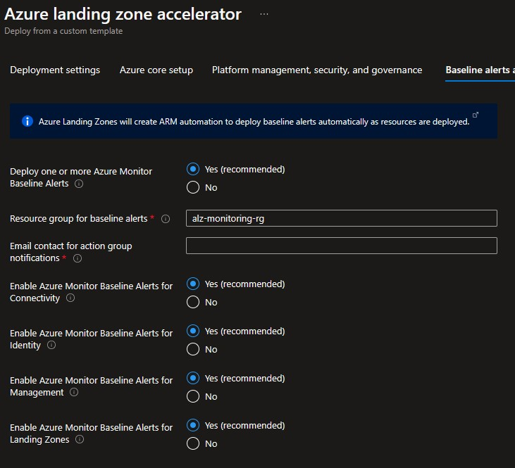
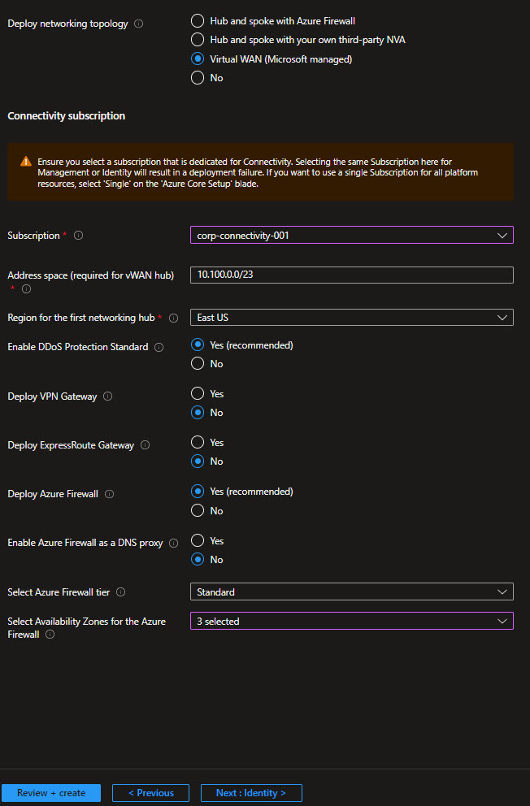
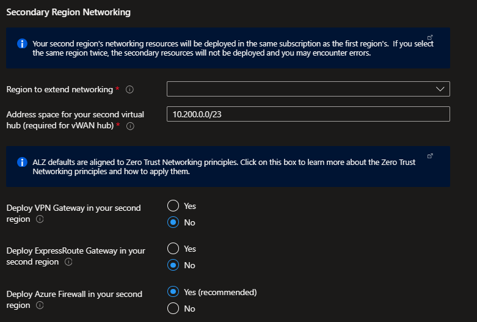
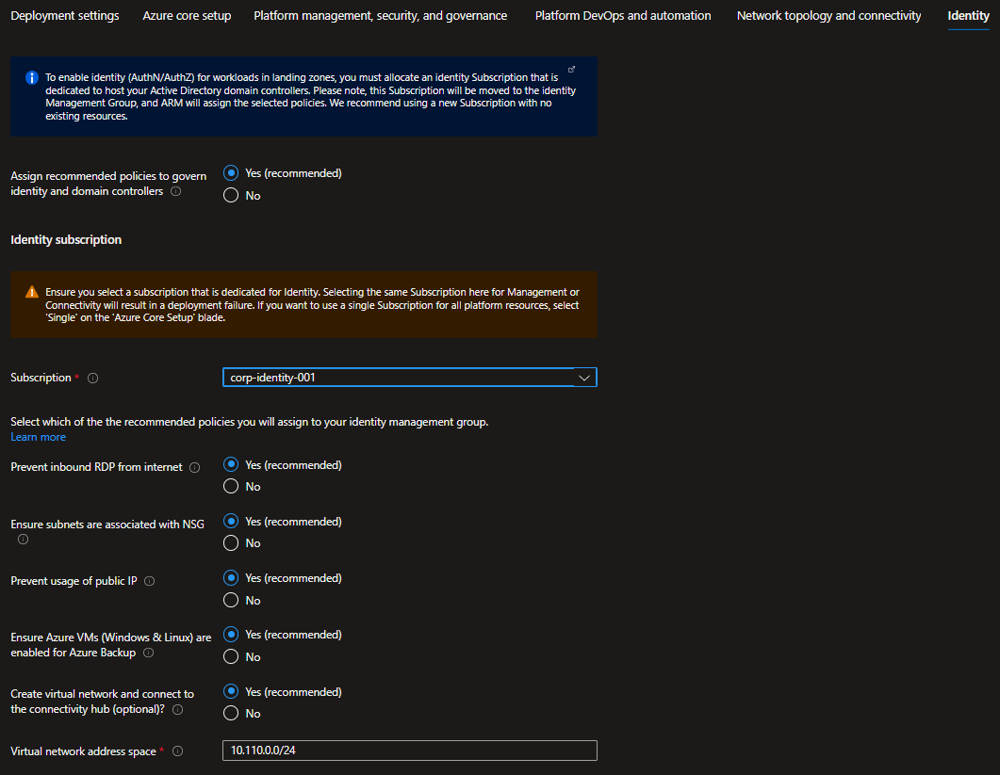
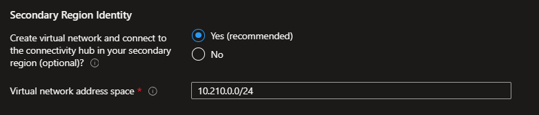

## Azure landing zone portal accelerator deployment with Azure VWAN network topology

This section will describe how to deploy Azure landing zone portal accelerator with connectivity to on-premises datacenters and branch offices based on an Azure Virtual WAN (VWAN) network topology. Please refer to [Contoso reference implementation](https://github.com/Azure/Enterprise-Scale/tree/main/docs/reference/contoso/Readme.md) for further details on this reference architecture.

## 1. Pre-requisites

There are a number of prerequisites which need to be met before you can provision an Azure landing zones environment via the deployment experience in the Azure portal. See the following [instructions](./Deploying-ALZ-Pre-requisites.md) on how to grant access before you proceed.

### Optional pre-requisites

The deployment experience in Azure portal allows you to bring in existing (preferably empty) subscriptions dedicated for platform management, connectivity and identity. It also allows you to bring existing subscriptions that can be used as the initial landing zones for your applications.

To learn how to create new subscriptions using Azure portal, please visit this [link](https://azure.microsoft.com/en-us/blog/create-enterprise-subscription-experience-in-azure-portal-public-preview/).

To learn how to create new subscriptions programmatically, please visit this [link](https://learn.microsoft.com/en-us/azure/cost-management-billing/manage/programmatically-create-subscription).

## 2. Launch the Azure landing zone portal accelerator deployment experience

In the *Deploying Azure landing zone Architecture in your own environment* [article](https://github.com/Azure/Enterprise-Scale#deploying-enterprise-scale-architecture-in-your-own-environment), when you click on *Deploy to Azure* for the selected Azure landing zone reference implementation, it will start the deployment experience in the Azure portal into your default Azure tenant. In case you have access to multiple tenants, ensure you are selecting the right one.

Azure landing zone portal accelerator can be deployed both from the Azure portal directly, or from [GitHub](https://github.com/Azure/Enterprise-Scale#deploying-enterprise-scale-architecture-in-your-own-environment)

## 3. Deployment settings

On the first page, select the *cloud environment*. This should default to the correct Azure Cloud, *only* change this if you believe the value to be incorrect. Next, select the Region. This region will primarily be used to place the deployment resources in an Azure region, but also used as the initial region for some of the resources that are deployed, such as Azure Log Analytics and Azure automation. Now proceed to *Azure core setup*.

## 4. Azure core setup

Provide a prefix that will be used to create the management group hierarchy and platform resources, and or this scenario select **Dedicated** subscriptions for platform resources (please note that dedicates subscriptions are recommended).

Next, select if you wish to **Deploy in a secondary region**.  If this is left as *Yes*, then you will receive additional inputs later in the process to deploy resources in a secondary region.

## 5. Platform management, security, and governance

On the *Platform management, security, and governance* blade, you will configure the core components to enable platform monitoring and security. The options you enable will also be enforced using Azure Policy to ensure resources, landing zones, and more are continuously compliant as your deployments scales and grows. To enable this, you must provide a dedicated (empty) subscription that will be used to host the requisite infrastructure.

Please note that if you enable the "Deploy Azure Security Center and enable security monitoring for your platform and resources" option, you will need to provide an email address to get email notifications from Azure Security Center.

## 6. Baseline alerts and monitoring

On the *Baseline alerts and monitoring* blade, you can configure automated alert configuration for the different scopes in your Azure landing zone implementation. Enabling the different baseline alerts will assign the relevant initiative to the corresponding management group. If you enable the "Deploy one or more Azure Monitor Baseline Alerts" option, you **must** provide an email address to get email notifications from Azure Monitor for the deployment to proceed.

## 7. Network topology and connectivity

On the *Network topology and connectivity* blade, you will configure the core networking platform resources, such as hub virtual network, gateways (VPN and/or ExpressRoute), Azure Firewall, DDoS Network Protection and Azure Private DNS Zones for Azure PaaS services. To deploy and configure these network resources, you must select a network topology. For this scenario:

* Select "Virtual WAN (Microsoft managed)" as the network topology
* Provide a dedicated (empty) subscription that will be used to host the requisite networking infrastructure.
* Provide the address space to be assigned to the vWAN hub
* Select an Azure region where the first vWAN hub will be created

Depending on your requirements, you may choose to deploy additional network infrastructure for your Azure landing zone architecture. The optional resources include:

* DDoS Network Protection
* VPN and ExpressRoute Gateways
  * If you choose to deploy either or both of these gateways, you will have the option to select the scale unit based on your requirements
* Azure Firewall
  * If you choose to deploy Azure Firewall, you will have the option to select the Firewall SKU (Standard or Premium) as well as indicate if you want to enable DNS Proxy in Azure Firewall. It is recommended to choose the Azure Firewall [Premium](https://learn.microsoft.com/azure/firewall/premium-features) SKU if your organization requires next generation firewall capabilities such as TLS inspection or network intrusion detection and prevention system (IDPS).

### Deploying networking resources in a second region

If you selected **Deploy in a secondary region** in the Core steps, you will also configure a secondary region for networking platform resource in this blade.  This secondary platform network deployment prepares you you to take advantage of capacity in multiple regions, and for recovery or multi-region high availability.

The deployment will deploy an additional virtual hub in the secondary region that you specify.

You will need to provide the configuration for the virtual hub, same as the primary region.

## 8. Identity

On the *Identity* blade you can specify if you want to assign recommended policies to govern identity and domain controllers. If you decide to enable this feature, you do need to provide an empty subscription for this. You can then select which policies you want to get assigned, and you will need to provide the address space for the virtual network that will be deployed on this subscription. Please note that this virtual network will be connected to the hub virtual network via VNet peering.

 

In addition, you selected **Deploy in a secondary region** and deployed a network topology,  you also have the option to deploy an additional Identity virtual network in that region.  It will be connected to the hub in your secondary region.

## 9. Landing zone configuration

In the top section you can select which policies you want to assign broadly to all of your application landing zones. You also have the ability to set policies to *Audit only* which will assign the policies for Audit.

In the bottom two sections you can optionally bring in N number of subscriptions that will be bootstrapped as landing zones, governed by Azure Policy. You indicate which subscriptions will be bootstrapped as landing zones with a virtual network deployed and connected to the hub virtual network for corp connectivity. Virtual networks on these subscriptions will be connected to the hub virtual network using VNet peering, and if you deployed and enabled Azure Firewall as DNS proxy, DNS settings on these VNets will be configured with the Azure Firewall private IP address.

You can also indicate which subscriptions you would like to be bootstrapped as landing zones but without corp connectivity.

As part of the policies that you can assign to your landing zones, the Azure landing zone portal accelerator experience will allow you to protect your landing zones with a DDoS Network Protection, and for corp connected landing zones, you will have the option to prevent usage of public endpoints for Azure PaaS services as well as ensure that private endpoints to Azure PaaS services are integrated with Azure Private DNS Zones.

## 10. Decommissioned/Sandbox

You can optionally choose to change whether default policy assignments for Decommissioned and Sandbox management groups are enabled, set to audit only or disabled.

## 11. Review + create

*Review + Create* page will validate your permission and configuration before you can click deploy. Once it has been validated successfully, you can click *Create*

## 12. Post deployment activities

Once Azure landing zone portal accelerator is deployed, you can grant your application teams/business units access to their respective landing zones. Whenever there’s a need for a new landing zone, you can place them into their respective management groups (Online or Corp) given the characteristics of assumed workloads and their requirements.
