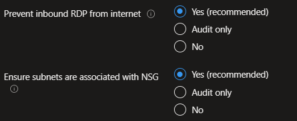

## Azure landing zone portal accelerator deployment with Zero Trust network principles

This section describes how to deploy the Azure landing zone portal accelerator with a jump start on Zero Trust Networking Principles for Azure landing zones. For more information on Zero Trust security model and principles visit [Embrace proactive security with Zero Trust](/security/business/zero-trust). Let's review the [Zero Trust aligned networking](/security/zero-trust/deploy/networks) configurations in the [Azure landing zone portal accelerator](/azure/cloud-adoption-framework/ready/landing-zone/#azure-landing-zone-portal-accelerator).

## Deploy networking topology and Connectivity

On the "Network Topology and Connectivity" section of the Azure landing zone portal accelerator select "Hub and spoke with Azure Firewall" radio button. Next, Select the platform connectivity subscription from the drop down. Confirm or update the address space and first networking hub region, in this case East US.

Hub and spoke is the primary topology option for Zero Trust Organizations.  These deployments should have traffic coming in to Azure, going between spokes, or leaving Azure be inspected and only permitted when explicitly allowed. Spoke networks should be segmented into smaller islands with their own ingress and egress controls in minimize "blast radius". 

## Enable Threat protection

In the next section you will want to leave the defaults to "Enable DDoS Network Protection" and "Deploy Azure Firewall" as these are pivotal requirements for threat protection. It's also recommended to select at least two availability zones for Azure Firewall, but ideally all 3, if the region has availability zone support.  

These selections help to segment and enforce external and internal boundaries. 

## Protect the Identity subscription

On the "Identity" section, ensure the default (Yes) is selected on "Prevent inbound RDP from internet" and "Ensure subnets are associated with NSG".

Here we are enforcing network protection on resources in the identity subscription (like domain controllers) and what protocols can reach them with Network Security Groups. The current deployment enforces NSGs, but does not have specific rules as these would be managed post-deployment.

## Secure Application landing zones

On the "landing zones configuration" section ensure the default (Yes) is selected on:

"Enable DDoS Network Protection"

"Prevent usage of Public Endpoints for Azure PaaS services in the corp connected landing zones"

"Ensure subnets are associated with NSG"

"Prevent inbound RDP from internet"

"Ensure secure connections (HTTPS) to storage accounts"

These configurations ensure that the spokes of our network hosting applications create service boundaries and protect them.
