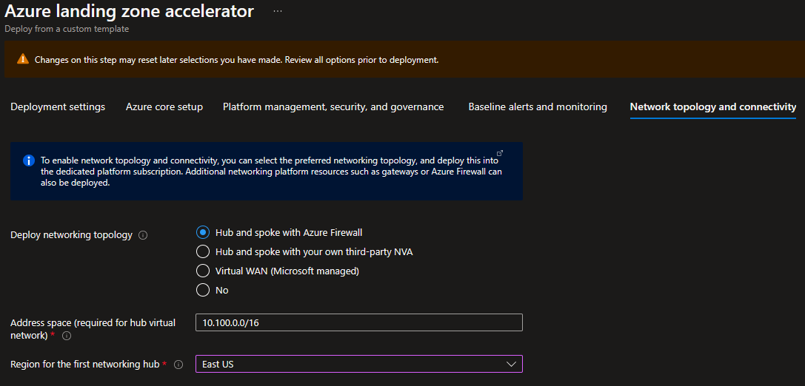

## Azure landing zone portal accelerator deployment with Zero Trust network principles

This guide will review how to deploy the Azure landing zone portal accelerator with a jump start on Zero Trust Networking Principles for Azure landing zones. If you are looking for a complete walkthrough of the Azure landing zones portal accelerator select one of the deployment guides in the wiki navigation on the right of this page under "Deploying Enterprise-Scale". For more information on Zero Trust security model and principles visit [What is Zero Trust?](https://learn.microsoft.com/security/zero-trust/zero-trust-overview) in the [Zero Trust Guidance Center](https://learn.microsoft.com/security/zero-trust/).

Let's review the [Zero Trust aligned networking](https://learn.microsoft.com/security/zero-trust/deploy/networks) configurations in the [Azure landing zone portal accelerator](https://learn.microsoft.com/azure/cloud-adoption-framework/ready/landing-zone/#azure-landing-zone-portal-accelerator).

## Platform management, security, and governance

On the "Platform management, security, and governance" section of the Azure landing zone portal accelerator keep the following defaults:

- Enable Defender for Cloud for DNS

## Deploy networking topology and Connectivity

On the "Network Topology and Connectivity" section of the Azure landing zone portal accelerator select "Hub and spoke with Azure Firewall" radio button. Next, Select the platform connectivity subscription from the drop down. Confirm or update the address space and first networking hub region, in this case East US.

Hub and spoke is the primary topology option for Zero Trust Organizations.  These deployments should have traffic coming in to Azure, going between spokes, or leaving Azure be inspected and only permitted when explicitly allowed. Spoke networks should be segmented into smaller islands with their own ingress and egress controls in minimize "blast radius".

## Enable Threat protection

In the next section you will want to leave the defaults to "Enable DDoS Network Protection" and "Deploy Azure Firewall" as these are pivotal requirements for threat protection. It's also recommended to select at least two availability zones for Azure Firewall, but ideally all 3, if the region has availability zone support.  

These selections help to segment and enforce external and internal boundaries.

## Protect the Identity subscription

On the "Identity" section, ensure the default (Yes) is selected on the following:

- Prevent inbound management ports from internet
- Ensure subnets are associated with NSG
- Prevent usage of public IP
- Create virtual network and connect to the connectivity hub

Here we are enforcing network protection on resources in the identity subscription (like domain controllers) and what protocols can reach them with Network Security Groups. The current deployment enforces NSGs, but does not have specific rules as these would be managed post-deployment.

In addition, we are preventing the deployment of public IPs to the identity subscription.  Outbound traffic should be routed through the Azure Firewall deployed in the previous activities, and inbound traffic should be filtered in from the same device.  To support this, the virtual network needs to peered to the hub.

When you later go to subnet the vnet to plan for deployment, you will also deploy the necessary route tables.

## Secure Application landing zones

On the "landing zones configuration" section ensure the default (Yes) is selected on:

"Enable DDoS Network Protection"

"Prevent usage of Public Endpoints for Azure PaaS services in the corp connected landing zones"

"Ensure encryption in transit is enabled for PaaS services"

"Ensure HTTPS Ingress is enforced in Kubernetes clusters"

"PRevent inbound management ports from the internet"

"Ensure subnets are associated with NSG"

"Prevent IP forwarding"

"Ensure secure connections (HTTPS) to storage accounts"

These configurations ensure that the spokes in your topology that are hosting applications start following zero trust networking principles and practices to enhance and improve their security posture.
