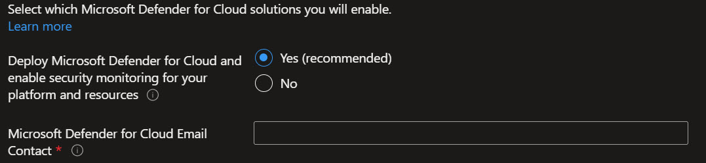
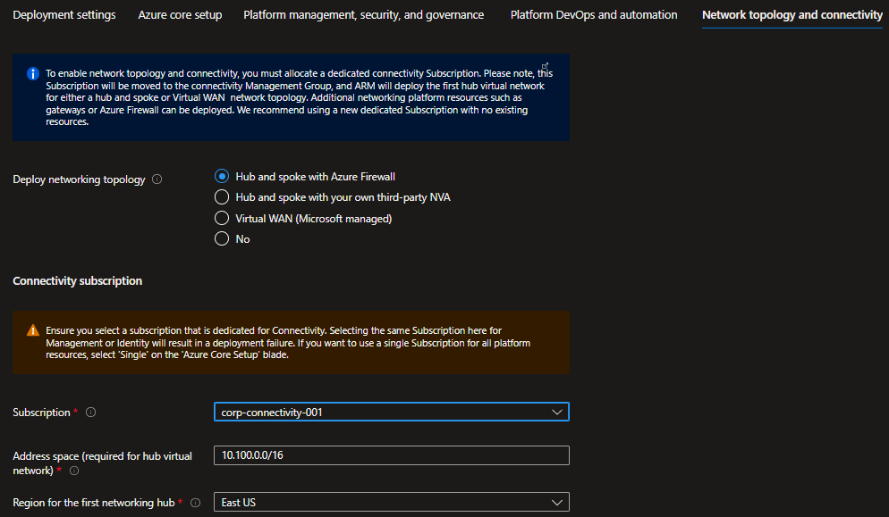
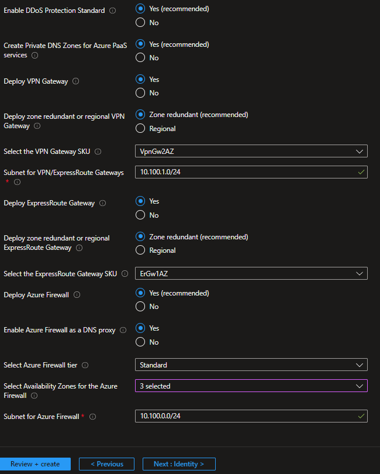

## In this Section

- [Pre-requisites](#pre-requisites)
- [Reference implementation deployment](#reference-implementation-deployment)
- [Post deployment activities](#post-deployment-activities)

---
Azure landing zone portal accelerator can be deployed both from the Azure portal directly, or from [GitHub](https://github.com/Azure/Enterprise-Scale#deploying-enterprise-scale-architecture-in-your-own-environment)


## Pre-requisites

Azure landing zone portal accelerator can bootstrap an entire Azure tenant without any infrastructure dependencies, and the user must first have Owner permission on the tenant *root* before deploying.

*Note: Once you have completed the deployment, you can remove the Owner permission from the tenant root, as it will no longer be needed for any subsequent operations.*

This requires the following:

*    A user that is Global Admin in the Microsoft Entra ID

*   Elevation of privileges of this user which grants him/her the “User Access Administrator” permission at the tenant root scope

*    An explicit roleAssignment (RBAC) made at the tenant root scope via CLI or PowerShell (Note: There’s no portal UX to make this roleAssignment)

### Elevate Access to manage Azure resources in the directory

1.1  Sign into the Azure portal as a user being Global Administrator

1.2  Open Microsoft Entra ID

1.3  Under *Manage*, select *Properties


1.4  Under *Access management for Azure resources,* set the toggle to *Yes


### Grant Access to the User at *tenant root scope “/”* to deploy Azure landing zone accelerator

You can use either Bash (CLI) or PowerShell to create the roleAssignment for the current user – or a dedicated user – that will do the deployment.

Bash:

```bash
#sign  into AZ CLI, this will redirect you to a web browser for authentication, if required
az login

#assign Owner role to Tenant root scope  ("/") as a Owner (gets object Id of the current user (az login))
az role assignment create --scope '/'  --role 'Owner' --assignee-object-id $(az ad signed-in-user show --query id --output tsv)
```

PowerShell:

```powershell
#sign in to Azure  from Powershell, this will redirect you to a web browser for authentication, if required
Connect-AzAccount

#get object Id of  the current user (that is used above)
$user = Get-AzADUser -UserPrincipalName (Get-AzContext).Account

#assign Owner  role to Tenant root scope ("/") as a User Access Administrator
New-AzRoleAssignment -Scope '/' -RoleDefinitionName 'Owner' -ObjectId $user.Id
```

> Please note: sometimes it can take up to 15 minutes for permission to propagate at tenant root scope. It is highly recommended that you log out and log back in to refresh the token before you proceed with the deployment.*

## Reference Implementation Deployment

In the *Deploying Enterprise-Scale Architecture in your own environment* [article](https://github.com/Azure/Enterprise-Scale#deploying-enterprise-scale-architecture-in-your-own-environment), when you click on *Deploy to Azure* for the selected Azure landing zone reference implementation, it will load the Azure landing zone portal accelerator into your default Azure tenant. In case you have access to multiple tenants, ensure you are selecting the right one.

Please note that the steps below are for the AdventureWorks reference implementation, but a similar experience would be for the WingTip or Contoso reference implementations, with a slightly different experience for the network resources configuration.

### Deployment settings

On the first page, select the *cloud environment*. This should default to the correct Azure Cloud, *only* change this if you believe the value to be incorrect. Next, select the Region. This region will primarily be used to place the deployment resources in an Azure region, but also used as the initial region for some of the resources that are deployed, such as Azure Log Analytics and Azure automation. Now proceed to *Azure core setup*.


### Azure core setup

Provide a prefix that will be used to create the management group hierarchy and platform resources, and select if you would use dedicated subscriptions or a single subscription for platform resources (please note that dedicates subscriptions are recommended). For this scenario, select Dedicated.


## Baseline alerts and monitoring

On the *Baseline alerts and monitoring* blade, you can configure automated alert configuration for the different scopes in your Azure landing zone implementation. Enabling the different baseline alerts will assign the relevant initiative to the corresponding management group. If you enable the "Deploy one or more Azure Monitor Baseline Alerts" option, you **must** provide an email address to get email notifications from Azure Monitor for the deployment to proceed.


### Platform management, security, and governance

On the *Platform management, security, and governance* blade, you will configure the core components to enable platform monitoring and security. The options you enable will also be enforced using Azure Policy to ensure resources, landing zones, and more are continuously compliant as your deployments scales and grows. To enable this, you must provide a dedicated (empty) subscription that will be used to host the requisite infrastructure.


Please note that if you enable the "Deploy Azure Security Center and enable security monitoring for your platform and resources" option, you will need to provide an email address to get email notifications from Azure Security Center.



### Network topology and connectivity
On the *Network topology and connectivity* blade, you will configure the core networking platform resources, such as hub virtual network, gateways (VPN and/or ExpressRoute), Azure Firewall, DDoS Network Protection and Azure Private DNS Zones for Azure PaaS services. To deploy and configure these network resources, you must select a network topology (for this scenario, select either "Hub and spoke with Azure Firewall" or "Hub and spoke with your own third-party NVA"), provide the address space to be assigned to the hub virtual network, select an Azure region where the hub virtual network will be created and provide a dedicated (empty) subscription that will be used to host the requisite infrastructure. For this example, we will select the "Hub and spoke with Azure Firewall" network topology.

 

Depending on your requirements, you may choose to deploy additional network infrastructure for your Azure landing zones deployment. The optional resources include:

* DDoS Network Protection
* Azure Private DNS Zones for Azure PaaS services
* VPN and ExpressRoute Gateways
  * If you choose to deploy either or both of these gateways, you will have the option to select the subnet to be dedicated for these resources, if you decide to deploy them as regional or zone-redundant gateways, as well as choose the right SKU based on your requirements
* Azure Firewall
  * If you choose to deploy Azure Firewall, you will have the option to select the subnet, select to deploy the Firewall as regional or zone redundant as well as indicate if you want to enable DNS Proxy in Azure Firewall

 

### Identity
On the *Identity* blade you can specify if you want to assign recommended policies to govern identity and domain controllers. If you decide to enable this feature, you do need to provide an empty subscription for this. You can then select which policies you want to get assigned, and you will need to provide the address space for the virtual network that will be deployed on this subscription. Please note that this virtual network will be connected to the hub virtual network via VNet peering. 

 

### Landing zone configuration

You can optionally bring in N number of subscriptions that will be bootstrapped as landing zones, governed by Azure Policy. You indicate which subscriptions will be bootstrapped as landing zones with a virtual network deployed and connected to the hub virtual network for corp connectivity. Virtual networks on these subscriptions will be connected to the hub virtual network using VNet peering, and if you deployed and enabled Azure Firewall as DNS proxy, DNS settings on these VNets will be configured with the Azure Firewall private IP address.

You can also indicate which subscriptions you would like to be bootstrapped as landing zones but without corp connectivity. Finally, you can select which policy you want to assign broadly to all of your landing zones.

As part of the policies that you can assign to your landing zones, the Azure landing zone portal accelerator will allow you to protect your landing zones with a DDoS Network Protection, and for corp connected landing zones, you will have the option to prevent usage of public endpoints for Azure PaaS services as well as ensure that private endpoints to Azure PaaS services are integrated with Azure Private DNS Zones. 


### Review + create

*Review + Create* page will validate your permission and configuration before you can click deploy. Once it has been validated successfully, you can click *Create*


## Post deployment activities

Once Azure landing zones has deployed, you can grant your application teams/business units access to their respective landing zones. Whenever there’s a need for a new landing zone, you can place them into their respective management groups (Online or Corp) given the characteristics of assumed workloads and their requirements.
