## Deploy Enterprise-Scale for Small Enterprises

In this tutorial, you will deploy an Enterprise-Scale Landing Zones platform with connectivity to on-premises datacenters and branch offices based on a [hub and spoke network topology](https://docs.microsoft.com/en-us/azure/cloud-adoption-framework/ready/azure-best-practices/traditional-azure-networking-topology), and where Management, Connectivity and Identity resources are consolidated in a single Platform Subscription.

This setup is meant for Small and Medium Enterprises and organizations that do not have a large IT team and do not require fine grained administration delegation models, and that are willing to leverage Azure native capabilities for simplicity and cost efficiency.

Please refer to [Trey Research reference implementation](https://github.com/Azure/Enterprise-Scale/blob/main/docs/reference/treyresearch/README.md) for further details on the Azure foundation enabled in this tutorial.

### Pre-requisites

To provision your Enterprise-Scale Landing Zones environment, your user/service principal must have Owner permission at the Azure Active Directory Tenant root. See the following [instructions](./Deploying-Enterprise-Scale-Pre-requisites) on how to grant access before you proceed.

### Optional pre-requsites

The deployment experience in Azure portal allows you to bring in an existing (preferably empty) subscription dedicated to host your Platform (Management, Connectivity and Identity) resources. It also allows you to bring existing subscriptions that can be used as the initial landing zones for your applications.

To learn how to create new subscriptions using Azure portal, please visit this [link](https://azure.microsoft.com/en-us/blog/create-enterprise-subscription-experience-in-azure-portal-public-preview/).

To learn how to create new subscriptions programmatically, please visit this [link](https://docs.microsoft.com/en-us/azure/cost-management-billing/manage/programmatically-create-subscription).

### Launch Enterprise-Scale Landing Zones deployment experience

You can **initiate the deployment of Enterprise-Scale** by clicking in here:

Other sources from where you can start your Enterprise Scale deployment include the Azure portal directly and [GitHub](https://github.com/Azure/Enterprise-Scale#deploying-enterprise-scale-architecture-in-your-own-environment)

### Deployment location

On the first page, select the **Region**. This region will host Enterprise Scale deployment jobs. It will also be used as the target region for some of the resources that are deployed, such as Azure Log Analytics and Azure automation.

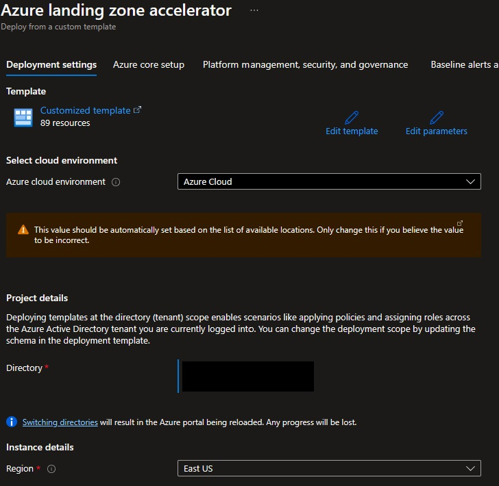

Click **Next: Azure Core Setup>** once you had chosen your deployment Region.

### Enterprise-Scale core setup

On the *Azure Core setup* blade you will:

- **Provide a prefix** that will be used to name your management group hierarchy and platform resources.
- Choose between using dedicated subscriptions or a single subscription to host platform resources. Please note that dedicated subscriptions are recommended.

  For this scenario select **Single** and **provide a dedicated (empty) subscription** that will be used to host your Platform resources.

  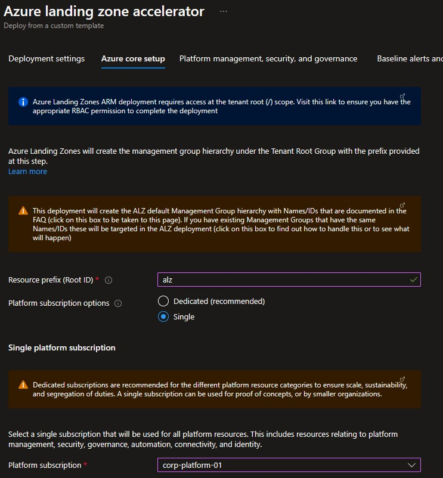

Click **Next: Platform management, security, and governance>**.

### Platform management, security, and governance

On the *Platform management, security, and governance* blade, you will configure the core components to enable monitoring, and security posture management and thread protection for your platform and application resources. The options you enable will also be enforced using Azure Policy to ensure resources, landing zones, and more are continuously compliant as your deployments scale and grow.

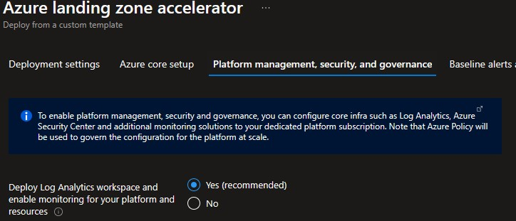

- Enable **Deploy Log Analytics workspace and enable monitoring for your platform and resources** to get a central [Log Analytics Workspace](https://docs.microsoft.com/en-us/azure/azure-monitor/logs/data-platform-logs#log-analytics-and-workspaces) and an [Automation Account deployed](https://docs.microsoft.com/en-us/azure/automation/automation-intro) deployed, and a set of [Azure Policies](https://github.com/Azure/Enterprise-Scale/blob/main/docs/ESLZ-Policies.md) applied at the root of the Enterprise Scale Management Group hierarchy to make sure Activity Logs from all your Subscriptions, and Diagnostic Logs from all your VMs and PaaS resources are sent to Log Analytics.

  

  - If required you can customize the retention time (default is 30 days) of your monitoring data by using the **Log Analytics Data Retention (days)** slider. Please note increasing the retention time to more than 30 days will increase your costs. See [Manage usage and costs with Azure Monitor Logs](https://docs.microsoft.com/en-us/azure/azure-monitor/logs/manage-cost-storage) for further details on Azure Monitor pricing. Also, you can [change the data retention period](https://docs.microsoft.com/en-us/azure/azure-monitor/logs/manage-cost-storage#change-the-data-retention-period) later on at any time.

  

  - You can customize what [Azure Monitor solutions](https://docs.microsoft.com/en-us/azure/azure-monitor/insights/solutions?tabs=portal) are enabled in your Log Analytics Workspace:
  
    

    - [Agent Health](https://docs.microsoft.com/en-us/azure/azure-monitor/insights/solution-agenthealth) helps you understand which monitoring agents are unresponsive and submitting operational data.
    - [Change Tracking](https://docs.microsoft.com/en-us/azure/automation/change-tracking/overview) tracks changes in virtual machines hosted in Azure, on-premises, and other cloud environments to help you pinpoint operational and environmental issues.
    - [Update Management](https://docs.microsoft.com/en-us/azure/automation/update-management/overview) assesses the status of available updates and allows you manage the process of installing required updates for your machines leveraging Azure Automation.
    - [Activity Log](https://docs.microsoft.com/en-us/azure/azure-monitor/essentials/activity-log#activity-log-analytics-monitoring-solution) helps to assess administration and operational events related to your subscriptions.
    - [VM Insights](https://docs.microsoft.com/en-us/azure/azure-monitor/vm/vminsights-overview) monitors the performance and health of your virtual machines and virtual machine scale sets, including their running processes and dependencies on other resources.
    - [Service Map](https://docs.microsoft.com/en-us/azure/azure-monitor/vm/service-map) automatically discovers application components on Windows and Linux systems and maps the communication between services.
    - [SQL Assessment](https://docs.microsoft.com/en-us/azure/azure-monitor/insights/sql-assessment) provides a prioritized list of recommendations specific to your deployed server infrastructure. The recommendations are categorized across six focus areas which help you quickly understand the risk and take corrective action.

- **Enable** **Deploy Azure Security Center and enable security monitoring for your platform and resources** option to allow Azure Security Center assess your subscriptions and detect security misconfigurations in your Azure resources, and leverage [Azure Defender](https://docs.microsoft.com/en-us/azure/security-center/azure-defender) to protect your workloads. An Azure Policy will be applied to the root of the Enterprise Scale Management Group hierarchy to enforce your settings across all your subscriptions.
 
  You will need to **provide an email address** to get email notifications from Azure Security Center.

  

  - All Azure Defender features are enabled by default (recommended) but are fully customizable. See [Azure Defender pricing](https://azure.microsoft.com/en-us/pricing/details/azure-defender/) for further details on the costs associated with each of the Azure Defender features.

  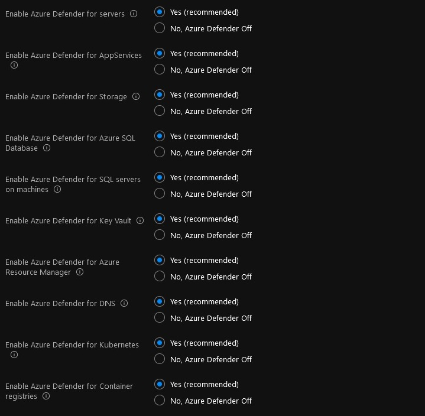

- Depending on your requirements, you may want to select **Deploy Azure Sentinel** to enable [Azure Sentinel](https://docs.microsoft.com/en-us/azure/sentinel/overview) in your Log Analytics Workspace. Please note, enabling Azure Sentinel will introduce additional costs. See [Azure Sentinel Pricing](https://azure.microsoft.com/en-us/pricing/details/azure-sentinel/) for additional information.

  In this tutorial, Azure Sentinel is not enabled. Please note you can [enable Azure Sentinel](https://docs.microsoft.com/en-us/azure/sentinel/quickstart-onboard) later on at any moment.

  

Click **Next: Network topology and connectivity>** to proceed with configuring your network setup.

### Network topology and connectivity

On the *Network topology and connectivity* blade you will configure your core networking platform resources.

- **Deploy networking topology**:
  - For this scenario, select **Hub and spoke with Azure Firewall**.
  - **Address Space**: Provide the private IP Address Space to be assigned to the hub virtual network. Please make sure the address space provided does not overlap with neither the ones being used on-premises or those that you will be assigning to the virtual networks where your are deploying your workloads. See [Plan for IP Addressing](https://docs.microsoft.com/en-us/azure/cloud-adoption-framework/ready/azure-best-practices/plan-for-ip-addressing) for further recommendations.
  - **Region for the first networking hub**: Select an Azure region where the hub virtual network will be created. That is most usually the same Region you chose in the *Deployment location* tab but can be a different one if needed.

  

- Depending on your requirements, you may choose to deploy additional network infrastructure for your Enterprise-Scale landing zones platform. The optional resources include:

  - **Enable DDoS Protection Standard**: Usage of [Azure DDoS Protection Standard protection](https://docs.microsoft.com/en-us/azure/ddos-protection/ddos-protection-overview) is recommended to help protect all public endpoints hosted within your virtual networks. When this option is selected an Azure DDoS Protection Plan is provisioned in your Platform Subscription and which can be used to protect public endpoints across your Platform and Landing Zone subscriptions. DDoS Protection Plan's costs cover up to 100 public endpoints. Protection of additional endpoints requires additional fees. See [Azure DDoS Protection pricing](https://azure.microsoft.com/en-us/pricing/details/ddos-protection/) for further details.
  
    In this tutorial, DDoS Standard protection it is enabled. Set **Enable DDoS Protection Standard** to **Yes**.

    

  - **Create Private DNS Zones for Azure PaaS services**: TBD

  

- Choose to deploy either or both VPN (**Deploy VPN Gateway**) and ExpressRoute Gateways (**Deploy ExpressRoute Gateway**) and provide additional configuration settings. In this tutorial, we will be deploying a VPN Gateway to enable hybrid connectivity using a Site to Site VPN connection but you can opt of using ExpressRoute instead or [both](https://docs.microsoft.com/en-us/azure/expressroute/use-s2s-vpn-as-backup-for-expressroute-privatepeering).

  Set **Deploy VPN Gateway** to **Yes**:
  
  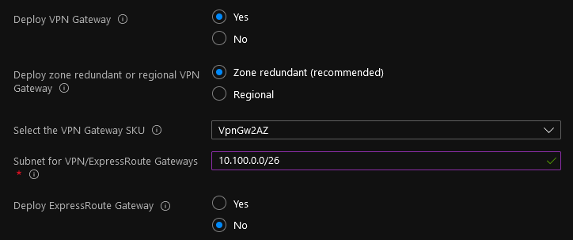

  - **Deploy zone redundant or regional VPN Gateway** and **Deploy zone redundant or regional ExpressRoute Gateway**: Zone-redundant gateways are recommended and enabled by default (as per the capabilities of the Region you are deploying your hub virtual network) as they provide higher resiliency and availability. You might opt for a regional deployment depending on your availability requirements and budget. In this tutorial you will deploy a zone-redudant VPN Gateway:
  
    Select **Zone redundant (recommended)**.
  
    

  - **Select the VPN Gateway SKU** and **Select the ExpressRoute Gateway VPN**: choose the right SKU based on your requirements (capabilities, throughput and availability). See [VPN Gateway SKUs](https://docs.microsoft.com/en-us/azure/vpn-gateway/vpn-gateway-about-vpn-gateway-settings#gwsku) and [ExpressRoute Gateway SKUs](https://docs.microsoft.com/en-us/azure/expressroute/expressroute-about-virtual-network-gateways#gwsku) for further details on the virtual gateway's SKUs you have available in Azure. In this tutorial you will deploy a VpnGw2AZ which provides an aggregated throughput of up to 1 Gbps:
  
    

  - **Subnet for VPN/ExpressRoute Gateways**: provide an address space to be assigned to the subnet dedicated to host your virtual network gateways. We recommend that you create a gateway subnet of /27 or larger (/27, /26 etc.) if you have the available address space to do so. This will accommodate most configurations. In this tutorial you will assign a /26:
    
    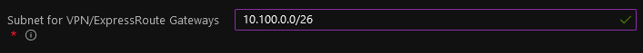  

- Select **Deploy Azure Firewall** to get an Azure Firewall deployed (recommended) to your hub virtual network for spoke-to-spoke, on-premises-to-Azure, and internet-outbound traffic protection and filtering.

  Set **Deploy Azure Firewall** to **Yes**.

  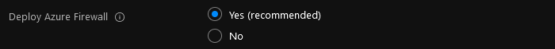

  Continue with configuring the rest of your Azure Firewall deployment settings:

  - **Enable Azure Firewall as a DNS proxy**: select this option if you are planning to use [FQDNs in Network rules](https://docs.microsoft.com/en-us/azure/firewall/fqdn-filtering-network-rules).
    
    In this tutorial, you will not enable this feature. Please note you can [enable DNS Proxy feature](https://docs.microsoft.com/en-us/azure/firewall/dns-settings) at any moment.
  
    Set **Enable Azure Firewall as a DNS proxy** to **No**.

    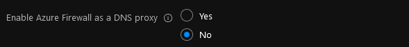

  - **Select Azure Firewall tier**: choose the right SKU based on your requirements. See [Azure Firewall features](https://docs.microsoft.com/en-us/azure/firewall/features) and [Azure Firewall Premium features](https://docs.microsoft.com/en-us/azure/firewall/premium-features) for further details.

    In this tutorial, you will deploy an Azure Firewall Standard. Please note you can [upgrade to Azure Firewall Premium](https://docs.microsoft.com/en-us/azure/firewall/premium-migrate) later on if needed provided you can afford some downtime.
  
    Set **Select Azure Firewall tier** to **Standard**:

    
   
  - **Select Availability Zones for the Azure Firewall**:
    
    In this tutorial you will deploy a zone-redudant Azure Firewall.
    
    **Select two or more zones** to configure your Azure Firewall deployment to span multiple [Availability Zones](https://docs.microsoft.com/en-us/azure/firewall/features#availability-zones) (recommended for increased availability).

    

    There's no additional cost for a firewall deployed in an Availability Zone. However, there are added costs for inbound and outbound data transfers associated with Availability Zones. For more information, see [Bandwidth pricing](https://azure.microsoft.com/pricing/details/bandwidth/).

    Depending on your requirements you may opt for a different setup, but please note Azure Firewall zone-redundancy cannot be changed after deployment.
    - Select one zone if you want to pin your Azure Firewall deployment to a specific zone.
    - Do not select any zone if you want your Azure Firewall deployment to be regional.
  
  - **Subnet for Azure Firewall**: **provide an address space (/26 or larger)** to be assigned to the subnet dedicated to host your Azure Firewall instances.

  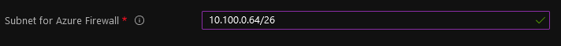

Click **Next: Identity>** once you had configured your network setup.

### Identity

On the *Identity* blade you can specify if you want to assign recommended Azure Policies to govern Domain Controllers deployed to your Platform Subscription. If you decide to enable this feature, you can then select which Azure Policies you want to get assigned. Please note, those Azure Policies will apply to all Virtual Machines deployed to the Platform Subscription regardless of their role. See [Enteprise Scale Azure Policies](https://github.com/Azure/Enterprise-Scale/blob/main/docs/ESLZ-Policies.md) for further details on the recommended set of Azure Policies.

In this tutorial, no additional Azure Policies are assigned to the Platform Subscription.

Set **Assign recommended policies to govern identity and domain controllers** to **No**.

Click **Next: Landing Zone configuration>** to continue with your deployment.

### Landing zones configuration

You can optionally bring in N number of subscriptions that will be bootstrapped as landing zones, governed by Azure Policy:

- **Select the subscriptions you want to move to corp management group**: You can indicate which subscriptions will be bootstrapped as Corp Landing Zones. Corp Landing Zones are meant to host workloads that require connectivity/hybrid connectivity with the corporate network thru the Hub in the Platform Subscription.

For Corp Landing Zones a virtual network can (recommended) be deployed and connected to the hub virtual network using virtual network peering to be able to access to your corporate network. Please note you will need to provide a non-overlapping private IP address space to be assigned to each Landing Zone. See [Plan for IP Addressing](https://docs.microsoft.com/en-us/azure/cloud-adoption-framework/ready/azure-best-practices/plan-for-ip-addressing) for further recommendations. Also, if you deployed and enabled Azure Firewall as DNS proxy, [DNS settings on these VNets will be configured](https://docs.microsoft.com/en-us/azure/firewall/dns-settings#configure-virtual-network-dns-servers) with the Azure Firewall private IP address.

  In this tutorial, a "Corp" Landing Zone is provisioned using an existing (empty) subscription.

  

You can also indicate which subscriptions you would like to be bootstrapped as landing zones but without corp connectivity. Finally, you can select which policy you want to assign broadly to all of your landing zones.

As part of the policies that you can assign to your landing zones, the Enterprise-Scale Landing Zones deployment experience will allow you to protect your landing zones with a DDoS Standard plan, and for corp connected landing zones, you will have the option to prevent usage of public endpoints for Azure PaaS services as well as ensure that private endpoints to Azure PaaS services are integrated with Azure Private DNS Zones. 

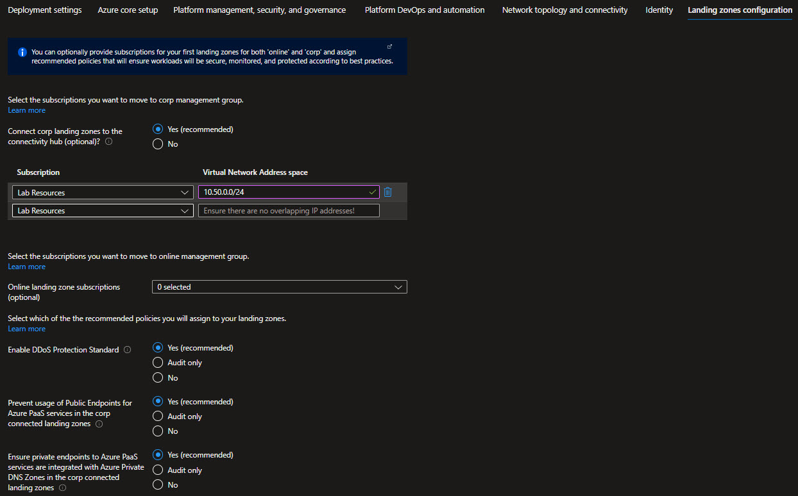

### Platform DevOps and Automation

You can choose to bootstrap your CI/CD pipeline (GitHub with GitHub actions or Azure Devops). 

TBD: Bla, bla.

### Review + create

*Review + Create* page will validate your permission and configuration before you can click deploy. Once it has been validated successfully, you can click *Create*

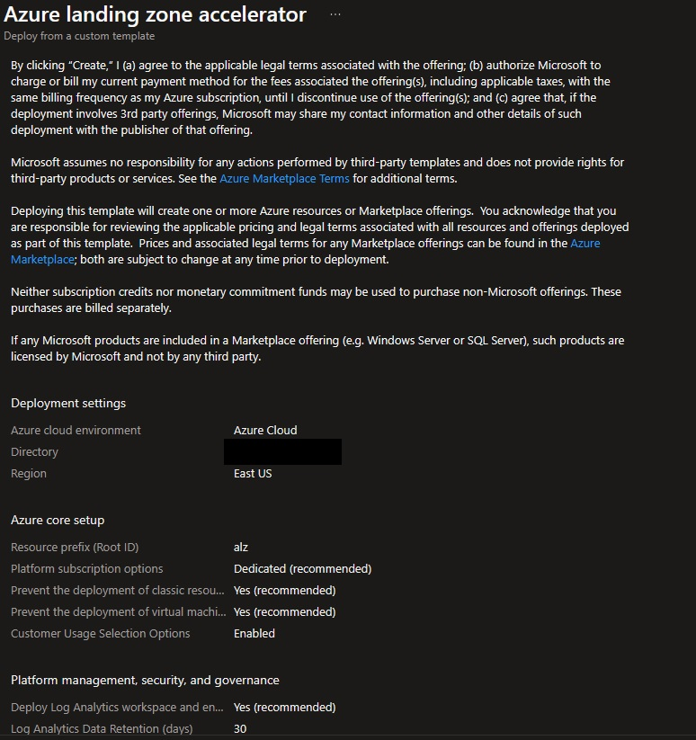

### Post deployment activities

Once Enterprise-Scale has deployed, you can grant your application teams/business units access to their respective landing zones. Whenever there’s a need for a new landing zone, you can place them into their respective management groups (Online or Corp) given the characteristics of assumed workloads and their requirements.
