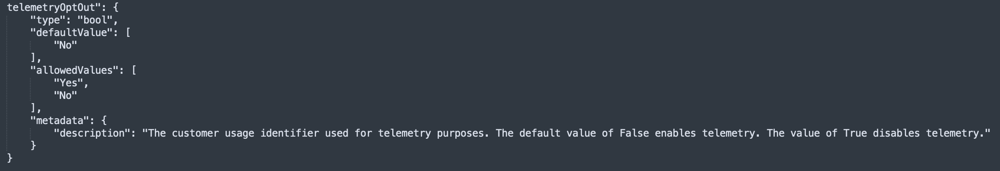

## Telemetry Tracking Using Customer Usage Attribution (PID)

Microsoft can identify the deployments of the Azure Resource Manager templates with the deployed Azure resources. Microsoft can correlate these resources used to support the deployments. Microsoft collects this information to provide the best experiences with their products and to operate their business. The telemetry is collected through [customer usage attribution](https://docs.microsoft.com/azure/marketplace/azure-partner-customer-usage-attribution). The data is collected and governed by Microsoft's privacy policies, located at the [trust center](https://www.microsoft.com/trustcenter).

To disable this tracking, we have included a parameter called `telemetryOptOut` to the ESLZ ARM Template in this repo with a simple boolean flag. The default value `false` which **does not** disable the telemetry. If you would like to disable this tracking, then simply set this value to `true` and this module will not be included in deployments and **therefore disables** the telemetry tracking. The portal experience ALZ Accelerator/ESLZ ARM Deployment Template has a radio button to toggle this option on/off.

Customer Usage Attribution Disabled:

Customer Usage Attribution Enabled:

In the `eslzARM.json` file, you will see the following:

The default value is `No`, but by changing the parameter value `Yes` and saving this file, when you deploy this module either via PowerShell, Azure CLI, or as part of a pipeline the module deployment below will be ignored and therefore telemetry will not be tracked.

If you are happy with leaving telemetry tracking enabled, no changes are required. Please do not edit the module name or value of the variable `cuaID` in any module.

## Module PID Value Mapping
The following are the unique ID's (also known as PIDs) used in each of the modules.

| Module Name                 | PID                                  |
| --------------------------- | ------------------------------------ |
| ALZ Accelerator/ESLZ ARM Deployment         | 35c42e79-00b3-42eb-a9ac-e542953efb3c |
