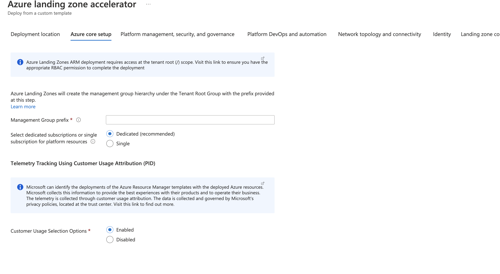

## Telemetry Tracking Using Customer Usage Attribution (PID)

Microsoft can identify the deployments of the Azure Resource Manager templates with the deployed Azure resources. Microsoft can correlate these resources used to support the deployments. Microsoft collects this information to provide the best experiences with their products and to operate their business. The telemetry is collected through [customer usage attribution](https://docs.microsoft.com/azure/marketplace/azure-partner-customer-usage-attribution). The data is collected and governed by Microsoft's privacy policies, located at the [trust center](https://www.microsoft.com/trustcenter).

To enable or disable the telemetry via the portal experience (recommended), use the radio toggle to specify your preference.

Customer Usage Attribution Disabled:

Customer Usage Attribution Enabled:

Alternatively, to enable or disable this tracking via the ARM template experience, we have included a parameter called `telemetryOptOut` in order to opt out of telemetry tracking to the ESLZ ARM Template in this repo with a simple boolean flag. The default value `false` which **enables** the telemetry. If you would like to disable this tracking, then simply set this value to `true` and this module will not be included in deployments and **therefore disables** the telemetry tracking.

In the `eslzARM.json` file, you will see the following:

If you are happy with leaving telemetry tracking enabled, no changes are required. Please do not edit the module name or value of the variable `cuaID` in any module.

## Module PID Value Mapping
The following are the unique ID's (also known as PIDs) used in each of the modules.

| Module Name                 | PID                                  |
| --------------------------- | ------------------------------------ |
| ALZ Accelerator/ESLZ ARM Deployment         | 35c42e79-00b3-42eb-a9ac-e542953efb3c |
