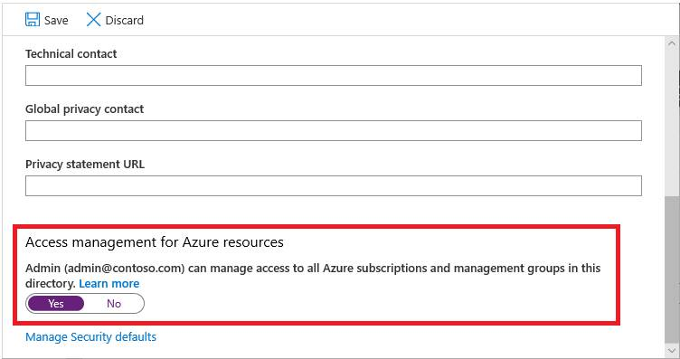
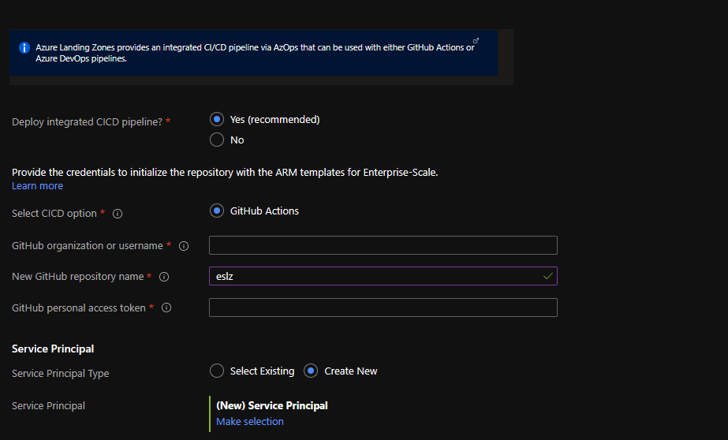
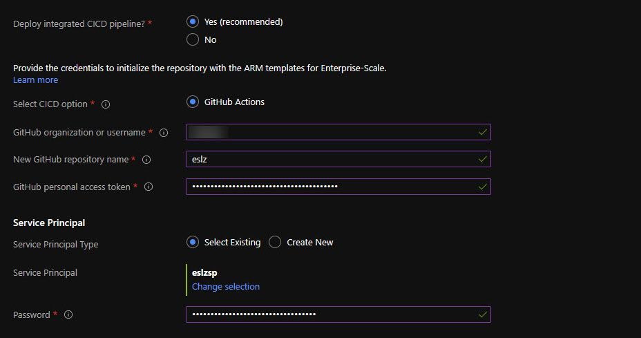
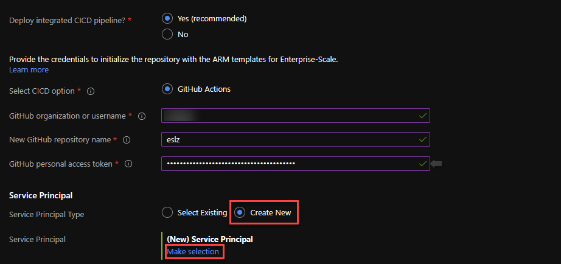
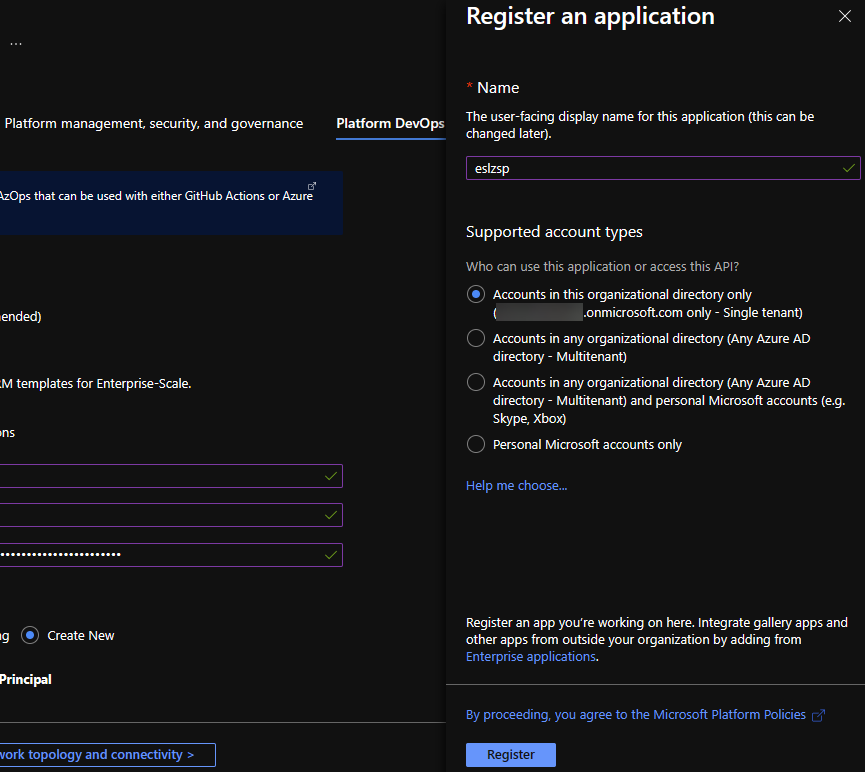
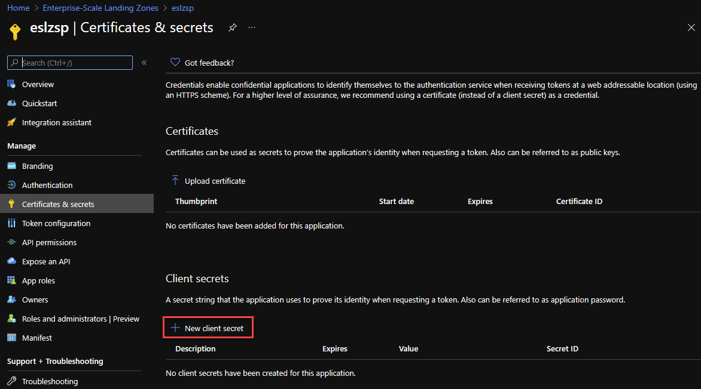
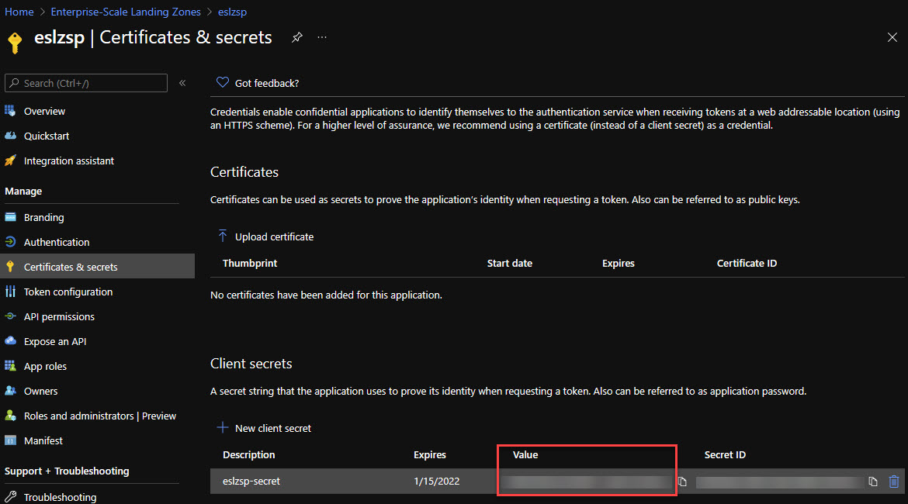
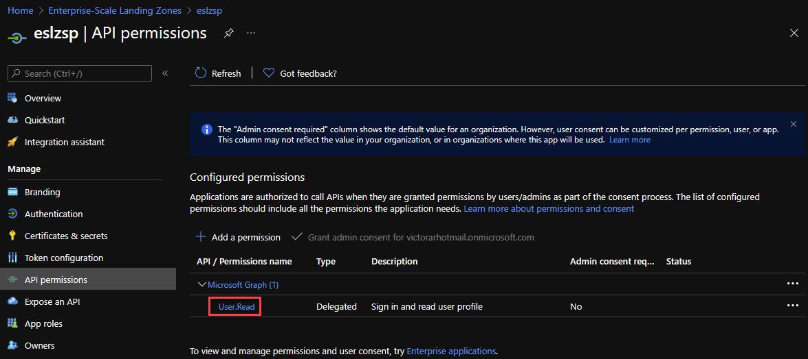
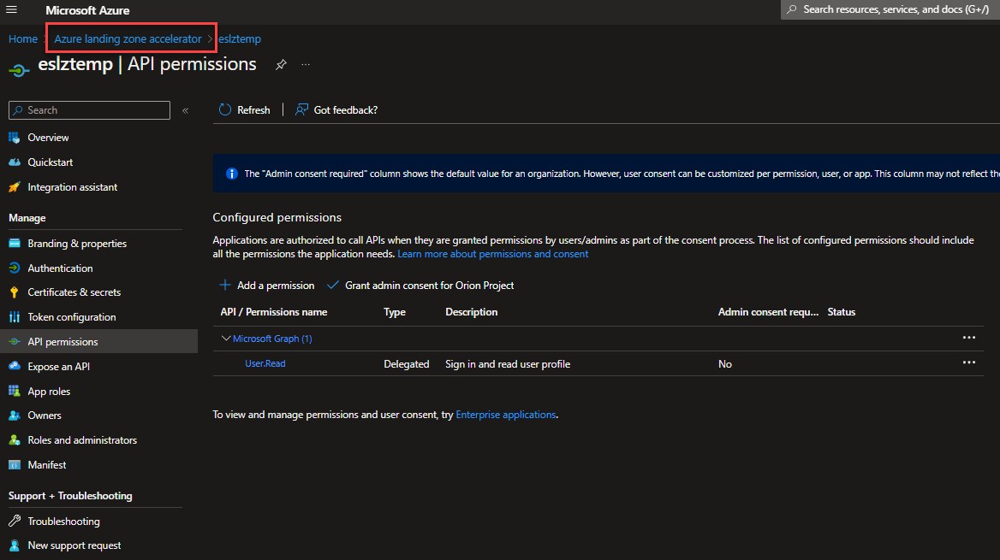
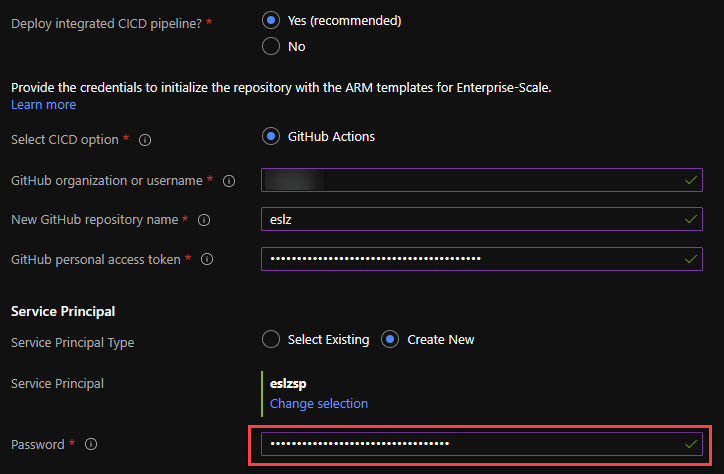

## In this Section

- [Pre-requisites](#pre-requisites)
- [Reference implementation deployment](#reference-implementation-deployment)
- [Validation post deployment (GitHub)](#validation-post-deployment-github)
- [Post deployment activities](#post-deployment-activities)
- [Operating the Azure platform using AzOps (Infrastructure as Code with GitHub Actions)](#operating-the-azure-platform-using-azops-infrastructure-as-code-with-github-actions)

---
Enterprise-Scale can be deployed both from the Azure portal directly, or from [GitHub](https://github.com/Azure/Enterprise-Scale#deploying-enterprise-scale-architecture-in-your-own-environment)


## Pre-requisites

Enterprise-Scale can bootstrap an entire Azure tenant without any infrastructure dependencies, and the user must first have Owner permission on the tenant *root* before deploying.

*Note: Once you have completed the deployment, you can remove the Owner permission from the tenant root, as it will no longer be needed for any subsequent operations.*

This requires the following:

*    A user that is Global Admin in the Azure Active Directory

*   Elevation of privileges of this user which grants him/her the “User Access Administrator” permission at the tenant root scope

*    An explicit roleAssignment (RBAC) made at the tenant root scope via CLI or PowerShell (Note: There’s no portal UX to make this roleAssignment)

### Elevate Access to manage Azure resources in the directory

1.1  Sign into the Azure portal as a user being Global Administrator

1.2  Open Azure Active Directory

1.3  Under *Manage*, select *Properties


1.4  Under *Access management for Azure resources,* set the toggle to *Yes



### Grant Access to the User at *tenant root scope “/”* to deploy Enterprise-Scale

You can use either Bash (CLI) or PowerShell to create the roleAssignment for the current user – or a dedicated user – that will do the deployment.

Bash:

```bash
#sign  into AZ CLI, this will redirect you to a web browser for authentication, if required
az login

#assign Owner role to Tenant root scope  ("/") as a Owner (gets object Id of the current user (az login))
az role assignment create --scope '/'  --role 'Owner' --assignee-object-id $(az ad signed-in-user show --query "objectId" --output tsv)
```

PowerShell:

```powershell
#sign in to Azure  from Powershell, this will redirect you to a web browser for authentication, if required
Connect-AzAccount

#get object Id of  the current user (that is used above)
$user = Get-AzADUser -UserPrincipalName (Get-AzContext).Account

#assign Owner  role to Tenant root scope ("/") as a User Access Administrator
New-AzRoleAssignment -Scope '/' -RoleDefinitionName 'Owner' -ObjectId $user.Id
```

> Please note: sometimes it can take up to 15 minutes for permission to propagate at tenant root scope. It is highly recommended that you log out and log back in to refresh the token before you proceed with the deployment.*

## Reference Implementation Deployment

In the *Deploying Enterprise-Scale Architecture in your own environment* [article](https://github.com/Azure/Enterprise-Scale#deploying-enterprise-scale-architecture-in-your-own-environment), when you click on *Deploy to Azure* for the selected Enterprise-Scale reference implementation, it will load the deployment experience in the Azure portal into your default Azure tenant. In case you have access to multiple tenants, ensure you are selecting the right one.

Please note that the steps below are for the AdventureWorks reference implementation, but a similar experience would be for the WingTip or Contoso reference implementations, with a slightly different experience for the network resources configuration.

### Deployment location

On the first page, select the *Region*. This region will primarily be used to place the deployment resources in an Azure region, but also used as the initial region for some of the resources that are deployed, such as Azure Log Analytics and Azure automation.


### Enterprise-Scale core setup

Provide a prefix that will be used to create the management group hierarchy and platform resources, and select if you would use dedicated subscriptions or a single subscription for platform resources (please note that dedicates subscriptions are recommended). For this scenario, select Dedicated.


### Platform management, security, and governance

On the *Platform management, security, and governance* blade, you will configure the core components to enable platform monitoring and security. The options you enable will also be enforced using Azure Policy to ensure resources, landing zones, and more are continuously compliant as your deployments scales and grows. To enable this, you must provide a dedicated (empty) subscription that will be used to host the requisite infrastructure.


Please note that if you enable the "Deploy Azure Security Center and enable security monitoring for your platform and resources" option, you will need to provide an email address to get email notifications from Azure Security Center.


### Platform DevOps and Automation

You can choose to bootstrap your CI/CD pipeline (GitHub with GitHub actions). Provide your GitHub user/org name, the preferred name of the GitHub repository that is to be created, as well as the PA token that the deployment will use to create a new repository and discover the Enterprise-Scale deployment ARM templates and merge them into your main branch.



1.1.1    To create a PA token, follow the instructions here: https://docs.github.com/en/github/authenticating-to-github/creating-a-personal-access-token

1.1.2    Ensure the PA token has the following permissions:


> For Microsoft employees who are enrolled into the Azure GitHub organization, you must also authorize the PA token to this Org!


1.2  Lastly, a Service Principal is required for Git to authenticate to – and be authorized to your Azure tenant. You can either use an existing Service Principal or create a new one. The Service Principal will be granted *Owner* permission on the top level Management Group that gets created.

1.2.1    If using an existing Service Principal, ensure you have the *client secret* as this must be provided as the *Password* for the service principal and confirm it has the right level of permission.



1.2.2    If creating a new Service Principal, select "Create New" and click on Make selection” and the portal will open a new blade for app registration



 

Once the App has been registered, you must explicitly create a new secret.

 

 

Make sure to note down the “Value” of the new client secret.
 

The default API Permissions for this App are “User.Read”, as depicted below:



 After copying the secret, go to “Enterprise-Scale Landing Zones” (in the upper left) to return to the deployment.

 

 At this point, paste the client secret value of the newly created client secret from a few step above into the Password field.

 


### Network topology and connectivity
On the *Network topology and connectivity* blade, you will configure the core networking platform resources, such as hub virtual network, gateways (VPN and/or ExpressRoute), Azure Firewall, DDoS Protection Standard and Azure Private DNS Zones for Azure PaaS services. To deploy and configure these network resources, you must select a network topology (for this scenario, select either "Hub and spoke with Azure Firewall" or "Hub and spoke with your own third-party NVA"), provide the address space to be assigned to the hub virtual network, select an Azure region where the hub virtual network will be created and provide a dedicated (empty) subscription that will be used to host the requisite infrastructure. For this example, we will select the "Hub and spoke with Azure Firewall" network topology.

 

Depending on your requirements, you may choose to deploy additional network infrastructure for your Enterprise-Scale landing zones platform. The optional resources include:

* DDoS Protection Standard
* Azure Private DNS Zones for Azure PaaS services
* VPN and ExpressRoute Gateways
  * If you choose to deploy either or both of these gateways, you will have the option to select the subnet to be dedicated for these resources, if you decide to deploy them as regional or zone-redundant gateways, as well as choose the right SKU based on your requirements
* Azure Firewall
  * If you choose to deploy Azure Firewall, you will have the option to select the subnet, select to deploy the Firewall as regional or zone redundant as well as indicate if you want to enable DNS Proxy in Azure Firewall

 


### Identity
On the *Identity* blade you can specify if you want to assign recommended policies to govern identity and domain controllers. If you decide to enable this feature, you do need to provide an empty subscription for this. You can then select which policies you want to get assigned, and you will need to provide the address space for the virtual network that will be deployed on this subscription. Please note that this virtual network will be connected to the hub virtual network via VNet peering. 

 

### Landing zone configuration

You can optionally bring in N number of subscriptions that will be bootstrapped as landing zones, governed by Azure Policy. You indicate which subscriptions will be bootstrapped as landing zones with a virtual network deployed and connected to the hub virtual network for corp connectivity. Virtual networks on these subscriptions will be connected to the hub virtual network using VNet peering, and if you deployed and enabled Azure Firewall as DNS proxy, DNS settings on these VNets will be configured with the Azure Firewall private IP address.

You can also indicate which subscriptions you would like to be bootstrapped as landing zones but without corp connectivity. Finally, you can select which policy you want to assign broadly to all of your landing zones.

As part of the policies that you can assign to your landing zones, the Enterprise-Scale Landing Zones deployment experience will allow you to protect your landing zones with a DDoS Standard plan, and for corp connected landing zones, you will have the option to prevent usage of public endpoints for Azure PaaS services as well as ensure that private endpoints to Azure PaaS services are integrated with Azure Private DNS Zones. 


### Review + create

*Review + Create* page will validate your permission and configuration before you can click deploy. Once it has been validated successfully, you can click *Create*


### Validation post deployment (GitHub)

Once Enterprise-Scale has deployed and you enabled the CI/CD bootstrap, you should validate in your GitHub account that:

*    A new repository has been created, with the name provided during setup.


*    4 Secrets are created into this GitHub repository.
     - ARM_CLIENT_ID = Service Principal
     - ARM_CLIENT_SECRET = Service Principal Client Secret created in the Tenant
     - ARM_SUBSCRIPTION_ID = The management subscription ID created in the Tenant
     - ARM_TENANT_ID = Tenant ID of the Azure Tenant that was used to create ESLZ


*    A Pull Request is either in progress or has completed and automatically merged into the main branch. Using the "AzOps - Pull" workflow.


*    The Azure hierarchy that is created using ARM templates as part of the Enterprise-Scale setup, such as management groups, subscription organization as well as policy definitions, policy assignments and role assignments are pulled and organized into the GitHub repository:


*    In each folder, you will find the ARM templates that were deployed at the scopes during the Enterprise-Scale setup. E.g., on the intermediate root group, you will find all policy definitions, and depending on the selection you made during the deployment, you will find resource templates in the platform subscriptions. Users can – whenever they are ready, start using these templates and bring their own templates to manage the platform using ARM templates and infrastructure as code.


## Post deployment activities

Once Enterprise-Scale has deployed, you can grant your application teams/business units access to their respective landing zones. Whenever there’s a need for a new landing zone, you can place them into their respective management groups (Online or Corp) given the characteristics of assumed workloads and their requirements.

## Operating the Azure platform using AzOps (Infrastructure as Code with GitHub Actions)

When you have deployed Enterprise-Scale with GitHub integration, you will have a ready-to-go repository with integrated GitHub Actions containing all the ARM templates that were used during deployment, organized in the following way:

*    Management group tree structure represented as folders in Git

*    Subscriptions represented as folders in their respective management group folder in Git

*    Resource Groups represented as folders in their respective subscription folder in Git

*    Policy Definitions, Policy Set Definitions, Role Definitions, and Role Assignments as composite ARM resource templates partitioned at the folder representing the respective scope in Azure (management group, subscription)

*    Resources (e.g., virtual networks, Log Analytics workspace, Automation account etc.) represented as composite ARM resource templates into their respective resource group (folder)

You can edit/update the existing ARM templates in your repository and GitHub actions will push (deploy) to the respective Azure scope. You can also author and bring your own ARM templates and deploy them to the respective Azure scope.

The following section will demonstrate how one can operationalize the Enterprise-Scale platform using ARM templates, via the GitHub repository that got created using AzOps (GitHub Actions).

### What is AzOps?

AzOps is an opinionated CI/CD pipeline to operationalize the Azure *platform* and *landing zones* that enables organizations to focus on the ARM template development, and not having to deal with multiple deployment scripts targeting different Azure scopes. The organization and folder structure in Git is dynamically representing the Azure graph (management groups (parent, child relationships), and subscription organization), so the platform operators can easily determine at which *scope* they want to invoke the ARM template deployment by simply making a PR with the ARM template(s) and parameter files (optionally), and AzOps will invoke the deployment accordingly.

Also, when there’s a new *scope* (management groups, subscriptions, and resource groups) being created, either explicitly via the pipeline – and also out of band (via Portal, CLI, PS etc.), AzOps will discover these and represent them correctly back into Git.

### Create new Policy Assignment for validation

Enterprise-Scale with its Policy Driven Governance principle relies heavily on Azure Policy to determine the goal state of the overall platform. As an example, this exercise will demonstrate how a developer can make a new policy assignment at the “Online” landing zone management group scope.

1.   In GitHub, navigate to your repository and click on the `root` folder. From here, navigate to your <prefix>-online folder which represents the management group for all your online landing zones.


2. Click on ‘Add file’, and ‘Create new file’.

3. Name the file `locationAssignment.json`

4. Copy and paste the following ARM template json

``` json
{
    "$schema": "https://schema.management.azure.com/schemas/2019-08-01/managementGroupDeploymentTemplate.json#",
    "contentVersion": "1.0.0.0",
    "parameters": {
        "policyAssignmentEnforcementMode": {
            "type": "string",
            "allowedValues": [
                "Default",
                "DoNotEnforce"
            ],
            "defaultValue": "DoNotEnforce",
            "metadata": {
                "description": "Input will determine if the policyAssignment should be enforced or not."
            }
        },
        "policyDefinitionId": {
            "type": "string",
            "defaultValue": "/providers/Microsoft.Authorization/policyDefinitions/e56962a6-4747-49cd-b67b-bf8b01975c4c",
            "metadata": {
                "description": "Provide the policyDefinition resourceId"
            }
        },
        "policyAssignmentName": {
            "type": "string",
            "defaultValue": "AllowedLocations"
        },
        "policyDescription": {
            "type": "string",
            "defaultValue": "Policy to ringfence Azure regions."
        },
        "listOfAllowedLocations": {
            "type": "array",
            "defaultValue": [
                "westeurope",
                "northeurope"
            ]
        }
    },
    "variables": {},
    "resources": [
        {
            "type": "Microsoft.Authorization/policyAssignments",
            "apiVersion": "2019-09-01",
            "name": "[parameters('policyAssignmentName')]",
            "identity": {
                "type": "SystemAssigned"
            },
            "location": "[deployment().location]",
            "properties": {
                "description": "[parameters('policyDescription')]",
                "displayName": "[parameters('policyDescription')]",
                "policyDefinitionId": "[parameters('policyDefinitionId')]",
                "enforcementMode": "[parameters('policyAssignmentEnforcementMode')]",
                "parameters": {
                    "listOfAllowedLocations": {
                        "value": "[parameters('listOfAllowedLocations')]"
                    }
                }
            }
        }
    ]
}
```

5. Examine the file and note that we are using default values for the parameters. You could modify these, or you could also provide a `locationAssignment.parameters.json` file to provide the parameters.

6. On the ‘Commit new file’ option, select ‘Create a new branch for this commit and start a pull request’, and give it a name.


7. Click ‘Propose new file' and on the next page, click 'Create Pull Request." A new Pull Request is being created which will trigger the "AzOps - Validate" workflow. Go to Actions to monitor the process.


8. Once completed, the pull request will show WhatIf results as a comment.


9. You should review the comment and then approve the pull request by completing the pull request by clicking "Squash and merge". You can also delete the branch once the merge has completed.

10. This will then kick-off the "AzOps - Push" workflow, that can be monitored under actions.


11. In Azure portal, you can navigate to the <prefix>-online management group and verify that the deployment resource got created and deployed successfully. Each deployment invoked via AzOps will have an ‘AzOps’ prefix.


12. Navigate to ‘Policies’ on the <prefix>-online management group and verify that there’s a new assignment called ‘Policy to ring-fence Azure regions’.


13. Click on ‘Edit assignment’ to verify that the Policy is not being enforced but will only scan for compliance and validate resources per the policy rule defined in the policy definition.


Once the policy compliance scan has completed, you will get a compliance result for the policy you assigned to validate the effect is working as intended, before going to the next step to update the enforcement mode. I.e., this policy will prevent resources being created outside of the allowed locations specified.

### Update a Policy Assignment to enforce

In this exercise, we will modify the existing policy assignment to ensure the policy effect will be enforced.

1.   Navigate the locationAssignment.json file you placed into the <prefix>-online folder, representing the online landing zone.

2.   Click on ‘Edit this file’ 

3.   Change the parameter “policyAssignmentEnforcementMode” default value to be ‘Default’.


1.   On the ‘Commit changes’ dialogue box, select ‘Create a new branch for this commit and start a pull request’, and provide a branch name. Click ‘Propose changes’ and create the pull request


This will now start the same process as above by validating and showing a WhatIf output as a comment on the pull request. Once reviewed, approved and merged the AzOps push workflow will trigger and deploy the template with the updated property so that the policy effect will be enforced (in this case, deny resource creation outside of the ringfenced Azure regions).

Once the job has completed, you can revisit the policy in Azure portal and see that the policy enforcement is set to ‘Enabled’.


### Create new Role Assignment on a landing zone

To grant a user, a group, or a service principal access to a landing zone (subscription), you can use the following ARM template where you provide the principalId (object id of the user, group, or service principal) as input to the parameter, and place the template into the subscription folder into your landing zone management group(s).

Replace Provide-Principal-Id with ID of the principal.

```json
{
    "$schema": "https://schema.management.azure.com/schemas/2018-05-01/subscriptionDeploymentTemplate.json#",
    "contentVersion": "1.0.0.0",
    "parameters": {
        "principalId": {
            "type": "string",
            "defaultValue": "<Provide-Principal-Id>",
            "metadata": {
                "description": "Provide the objectId of the principal (user, group, SPN, managed identity etc.) that will be granted RBAC at scope."
            }
        },
        "roleDefinitionId": {
            "type": "string",
            "defaultValue": "b24988ac-6180-42a0-ab88-20f7382dd24c",
            "metadata": {
                "description": "Provide the id of the built-in roleDefinition. Default is 'Contributor'."
            }
        }
    },
    "resources": [
        {
            "type": "Microsoft.Authorization/roleAssignments",
            "apiVersion": "2017-09-01",
            "name": "[guid(parameters('principalId'))]",
            "properties": {
                "principalId": "[parameters('principalId')]",
                "roleDefinitionId": "[concat('/providers/Microsoft.Authorization/roleDefinitions/', parameters('roleDefinitionId'))]"
            }
        }
    ]
} 
```
