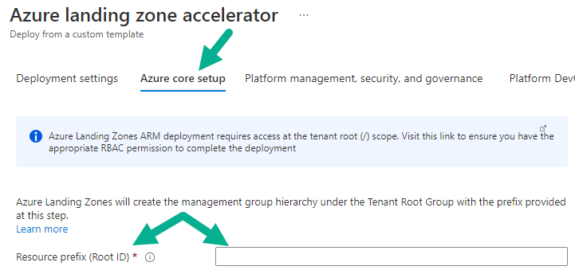
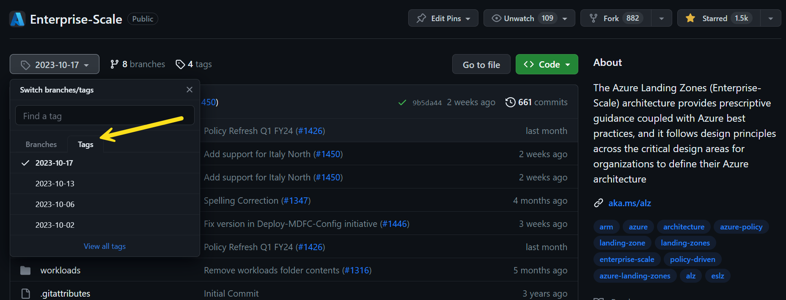

## In this Section

- [How long does enterprise-scale architecture take to deploy?](#how-long-does-enterprise-scale-architecture-take-to-deploy)
- [Why are there custom policy definitions as part of enterprise-scale architecture?](#why-are-there-custom-policy-definitions-as-part-of-enterprise-scale-reference-implementation)
- [Where can I see the policy definitions used by enterprise-scale landing zones reference implementation?](#where-can-i-see-the-policy-definitions-used-by-the-enterprise-scale-landing-zones-reference-implementation)
- [Why does enterprise-scale architecture require permission at tenant root '/' scope?](#why-does-the-enterprise-scale-reference-implementation-require-permission-at-tenant-root--scope)
- [The Azure landing zone accelerator portal-based deployment doesn't display all subscriptions in the drop-down lists?](#the-enterprise-scale-also-known-as-the-azure-landing-zone-accelerator-portal-based-deployment-doesnt-display-all-subscriptions-in-the-drop-down-lists)
- [Can we use and customize the ARM templates for enterprise-scale architecture and check them into our repository and deploy it from there?](#can-we-use-and-customize-the-arm-templates-for-enterprise-scale-architecture-and-check-them-into-our-repository-and-deploy-it-from-there)
- [What if we can't deploy by using the Azure landing zone accelerator portal-based experience, but can deploy via infrastructure-as-code?](#what-if-we-cant-deploy-by-using-the-azure-landing-zone-accelerator-portal-based-experience-but-can-deploy-via-infrastructure-as-code)
- [If we already deployed enterprise-scale architecture without using infrastructure-as-code, do we have to delete everything and start again to use infrastructure-as-code?](#if-we-already-deployed-enterprise-scale-architecture-without-using-infrastructure-as-code-do-we-have-to-delete-everything-and-start-again-to-use-infrastructure-as-code)
- [The `AzureDiagnostics` table in my Log Analytics Workspace has hit the 500 column limit, what should I do?](#the-azurediagnostics-table-in-my-log-analytics-workspace-has-hit-the-500-column-limit-what-should-i-do)
- [What happens if I have existing Management Groups that have the same Name/IDs as ones that will be deployed in the ALZ Portal Accelerator?](#what-happens-if-i-have-existing-management-groups-that-have-the-same-nameids-as-ones-that-will-be-deployed-in-the-alz-portal-accelerator)
- [What are the ALZ Portal Accelerator Management Group Name/IDs that are created?](#what-are-the-alz-portal-accelerator-management-group-nameids-that-are-created)
- [Why hasn't Azure landing zones migrated to the Azure Monitor Agent yet?](#why-hasnt-azure-landing-zones-migrated-to-the-azure-monitor-agent-yet)
- [What is the impact of GitHub Releases and ALZ?](#what-is-the-impact-of-github-releases-and-alz)

---

## Enterprise-scale FAQ

This article answers frequently asked questions relating to Enterprise-scale.

Some FAQ questions that relate more to the architecture are based over in the CAF docs here: [Enterprise-scale architecture FAQ](https://learn.microsoft.com/azure/cloud-adoption-framework/ready/enterprise-scale/faq)

## How long does enterprise-scale architecture take to deploy?

Deployment time depends on the options you select during the implementation experience. It varies from around five minutes to 40 minutes, depending on the options selected.

For example:

- Reference implementation without any networking or connectivity options can take around five minutes to deploy.
- Reference implementation with the hub and spoke networking options, including VPN and ExpressRoute gateways, can take around 40 minutes to deploy.

## Why are there custom policy definitions as part of enterprise-scale reference implementation?

We work with and learn from our customers and partners. This collaboration helps us evolve and enhance the reference implementations to meet customer and partner requirements. As part of this interaction with customers and partners, we might notice policy definition gaps. In those cases, we create and test a definition to fill the gap and include it in enterprise-scale architecture for everyone to use.

We then work with the Azure Policy and associated engineering teams to continuously transition the new custom policy definitions into built-in policy definitions.

## Where can I see the policy definitions used by the enterprise-scale landing zones reference implementation?

You can find a list of policy definitions here: [Policies included in enterprise-scale landing zones reference implementations](./ALZ-Policies)

We also add changes to our [What's New? wiki page](https://github.com/Azure/Enterprise-Scale/wiki/Whats-new).

<!-- IMPLEMENTATION -->

## Why does the enterprise-scale reference implementation require permission at tenant root '/' scope?

Management group creation, subscription creation, and placing subscriptions into management groups are APIs that operate at the tenant root "`/`" scope.

To establish the management group hierarchy and create subscriptions and place them into the defined management groups, the initial deployment must be invoked at the tenant root "`/`" scope. Once you deploy enterprise-scale architecture, you can remove the owner permission from the tenant root "`/`" scope. The user deploying the enterprise-scale reference implementation is made an owner at the intermediate root management group (for example "Contoso").

For more information about tenant-level deployments in Azure, see [Deploy resources to tenant](https://learn.microsoft.com/azure/azure-resource-manager/templates/deploy-to-tenant).

## The enterprise-scale (also known as the Azure landing zone accelerator) portal-based deployment doesn't display all subscriptions in the drop-down lists?

When you deploy enterprise-scale via the portal-based deployment (also known as the Azure landing zone accelerator), the portal lists subscriptions to be selected for deployment from the platform subscriptions (management, connectivity, identity) and the landing zones (corp and online).

We updated our Subscription selection method in [October 2022](./Whats-new.md#october-2022) to increase the limit from 50 to 1,000. If you have more than 1,000 subscriptions, the API may still not be able to display all of them in the drop-down list. If this causes you a problem, please let us know via the [issues](https://github.com/Azure/Enterprise-Scale/issues).

## Can we use and customize the ARM templates for enterprise-scale architecture and check them into our repository and deploy it from there?

All of the ARM templates for enterprise-scale architecture are developed and optimized for the Azure landing zone accelerator portal-based experience. We don't recommend or support customization of these templates because they're complex. To handle all of the options and variations we provide for the Azure landing zone accelerator portal-based experience, ARM template expressions would need numerous logical operators and conditions. ARM deployments (nested templates) need to deploy in a specific order to be successful.

Finally, taking the same templates for future operations requires you to redeploy to the entire tenant for any change, and also requires permanent owner role-based access control assignment on the tenant root "`/`" scope.

However, if you want to deploy and manage enterprise-scale architecture via infrastructure-as-code, see [What if we can't deploy using the Azure landing zone accelerator portal-based experience, but want to deploy via infrastructure-as-code?](#what-if-we-cant-deploy-by-using-the-azure-landing-zone-accelerator-portal-based-experience-but-can-deploy-via-infrastructure-as-code).

## What if we can't deploy by using the Azure landing zone accelerator portal-based experience, but can deploy via infrastructure-as-code?

The following implementation options are available when you use infrastructure-as-code:

- The [Azure landing zone accelerator](https://learn.microsoft.com/azure/cloud-adoption-framework/ready/landing-zone/#azure-landing-zone-accelerator) portal-based experience can integrate and bootstrap a CI/CD pipeline using GitHub with [AzOps](https://github.com/Azure/AzOps) as documented at [Deploying Enterprise Scale](https://github.com/Azure/Enterprise-Scale/wiki/Deploying-Enterprise-Scale).
- The [Enterprise-scale Do-It-Yourself (DIY) ARM templates](https://github.com/Azure/Enterprise-Scale/tree/main/eslzArm#enterprise-scale-landing-zones-arm-templates) method
- The [ALZ Terraform module](https://github.com/Azure/terraform-azurerm-caf-enterprise-scale#terraform-module-for-cloud-adoption-framework-enterprise-scale)
- The [ALZ Bicep modules](https://github.com/Azure/ALZ-Bicep)

## If we already deployed enterprise-scale architecture without using infrastructure-as-code, do we have to delete everything and start again to use infrastructure-as-code?

If you used the Azure landing zone accelerator portal-based experience to deploy enterprise-scale architecture into your Azure tenant, see the guidance for the infrastructure-as-code tooling you want to use.

### ARM Templates

To use ARM templates to deploy, manage, and operate your enterprise-scale deployment, you don't have to delete everything and start again. You can configure and connect [AzOps](https://github.com/Azure/AzOps) tooling by using the [AzOps Accelerator](https://github.com/Azure/AzOps-Accelerator) and associated instructions, regardless of the stage of your Azure tenant.

Once configured, AzOps connects to your Azure tenant, scans it, and then pulls individual ARM templates into your repository in a structure that represents the [four Azure scopes](https://learn.microsoft.com/azure/azure-resource-manager/management/overview#understand-scope).

To see a demo of AzOps being used, check out this YouTube video on the Microsoft DevRadio channel: [Enterprise-scale landing zones DevOps and automation step by step](https://www.youtube.com/watch?v=wWLxxj-uMsY)

### Bicep

The [AzOps](https://github.com/Azure/AzOps) tooling supports deploying Bicep files at the [four Azure scopes](https://learn.microsoft.com/azure/azure-resource-manager/management/overview#understand-scope). Its pull process only stores the scan of your Azure tenants resources in ARM templates that use JSON.

Leave us feedback via [GitHub issues on the AzOps repository](https://github.com/Azure/AzOps/issues) if you want to see something added to AzOps.

### Terraform

Terraform builds its own [state](https://www.terraform.io/docs/language/state/index.html) file to track and configure resources. If you already deployed enterprise-scale architecture to your Azure tenant, [import](https://www.terraform.io/docs/cli/import/index.html) each resource into the state file to learn what it manages as part of your Terraform code. Then you can deploy, manage, and operate your enterprise-scale deployment via Terraform.

Terraform import is currently done on a per resource basis and can be time consuming and complex to do at scale. It's often easier to delete and redeploy via Terraform than to import everything that's been deployed by the Azure landing zone accelerator portal-based experience. Most customers know from the start that they want to use Terraform to manage their Azure tenant, so this scenario is uncommon.

To deploy enterprise-scale architecture by using Terraform, you might want to use the Terraform module we provide. It deploys everything that the Azure landing zone accelerator portal-based experience does. The module, [Terraform Module for Cloud Adoption Framework Enterprise-scale](https://registry.terraform.io/modules/Azure/caf-enterprise-scale/azurerm/0.0.4-preview), is available from the Terraform Registry page.

To see a demo of Terraform being used, check out this YouTube video on the Microsoft DevRadio channel: [Terraform Module for Cloud Adoption Framework Enterprise-scale Walkthrough](https://www.youtube.com/watch?v=5pJxM1O4bys)

## The `AzureDiagnostics` table in my Log Analytics Workspace has hit the 500 column limit, what should I do?

In larger environments that uses a range of different Azure services and associated features it can be common for you to hit the [500 maximum columns in a table limit](https://learn.microsoft.com/azure/azure-monitor/service-limits#log-analytics-workspaces). When this occurs data is not lost however, it is instead stored in a column called `AdditionalFields` as a dynamic property.

However, some customers may not want this as it can make it more difficult and complex to query the data when the 500 column limit is breached and data is stored in the `AdditionalFields` column.

> More details on this can be found here: [AzureDiagnostics Table Docs](https://learn.microsoft.com/azure/azure-monitor/reference/tables/azurediagnostics)

To overcome this issue the Azure Monitor team has created a new collection type for diagnostic settings for resources called [**Resource-specific** collection mode](https://learn.microsoft.com/azure/azure-monitor/essentials/resource-logs#resource-specific). In this mode a separate table per Azure service is created in the Log Analytics Workspace which will mean the 500 column limit will not be hit and therefore querying and managing the data in the Log Analytics Workspace is simplified and more performant.

> An explanation of the 2 modes can be found here: [Azure resource logs](https://learn.microsoft.com/azure/azure-monitor/essentials/resource-logs)

### Next steps

As of today only a limited number of services support the [**Resource-specific** collection mode](https://learn.microsoft.com/azure/azure-monitor/essentials/resource-logs#resource-specific) which are listed [here.](https://learn.microsoft.com/azure/azure-monitor/reference/tables/azurediagnostics#azure-diagnostics-mode-or-resource-specific-mode)

We are working closely with the relevant Azure engineering teams to ensure the services add support for the [**Resource-specific** collection mode](https://learn.microsoft.com/azure/azure-monitor/essentials/resource-logs#resource-specific) and also create/update the [built-in Azure Policies](https://learn.microsoft.com/azure/azure-monitor/essentials/diagnostic-settings?tabs=CMD#built-in-policy-definitions-for-azure-monitor) so we can then utilise them as part of our solution.

Stay tuned to our [What's New page](https://github.com/Azure/Enterprise-Scale/wiki/Whats-new) where we will be announcing when we migrate services to the new collection type. Also watch [Azure Updates](https://azure.microsoft.com/updates/) for announcements from service teams for adding support to their services for this collection type.

## What happens if I have existing Management Groups that have the same Name/IDs as ones that will be deployed in the ALZ Portal Accelerator?

As raised in issue [#1080](https://github.com/Azure/Enterprise-Scale/issues/1080) it is possible for you to deploy the ALZ Portal Accelerator in a Microsoft Entra Tenant with existing Management Groups. If these existing Management Groups have the same Name/ID (not Display Name) as the ones deployed as part of the ALZ Portal Accelerator these existing Management Groups will be targeted in the deployment and brought into the ALZ hierarchy and deployment. This means that the Management Groups will be:

- Display Name will be changed to ALZ default for that Management Group
- Moved into the ALZ Management Group hierarchy
- Have Subscriptions placed beneath them based on selections during ALZ portal accelerator deployment
- Have Azure Policy Definitions and Assignments created upon them
- Have Azure RBAC Custom Role Definitions & Assignments created upon them

You should be aware of this and decide if this is something you want to happen, if not you need to ensure the naming prefix entered is unique for the Management Group Name/IDs that the ALZ Portal Accelerator will create to ensure the existing Management Groups are not targeted in the deployment. These are listed in the following FAQ Q&A: [What are the ALZ Portal Accelerator Management Group Name/IDs that are created?](#what-are-the-alz-portal-accelerator-management-group-nameids-that-are-created)

## What are the ALZ Portal Accelerator Management Group Name/IDs that are created?

The Management Group Names/IDs created via the ALZ Portal Accelerator deployment are all based on the Resource Prefix (Root ID) that you enter in the ALZ Portal Experience on the "Azure core setup" blade that is shown below:



The Management Group Names/IDs created via the ALZ Portal Accelerator Deployment are listed below:

- `<Resource Prefix (Root ID)>` - Intermediate Root Management Group - e.g. `Contoso`
  - `<Resource Prefix (Root ID)>-platform`
    - `<Resource Prefix (Root ID)>-management`
    - `<Resource Prefix (Root ID)>-connectivity`
    - `<Resource Prefix (Root ID)>-identity`
  - `<Resource Prefix (Root ID)>-landingzones`
    - `<Resource Prefix (Root ID)>-online`
    - `<Resource Prefix (Root ID)>-corp`
  - `<Resource Prefix (Root ID)>-decommissioned`
  - `<Resource Prefix (Root ID)>-sandbox`

## Why hasn't Azure landing zones migrated to the Azure Monitor Agent yet?

**Update January 2024** We have been working on the removal of MMA from ALZ and the first step in the overall removal process is to update the ALZ Portal reference implementation (greenfield deployments) which has now been updated. Our next step is to work on the deployment to Terraform and Bicep reference implementations which requires significant investment to minimise impact to existing customers and providing clear guidance for the transition. For more details please see [Azure Monitor Agent Update](./ALZ-AMA-Update.md).

### What if we are not ready to make the switch and migrate, right now?

Another good question. You will need to plan, and complete, the migration to the Azure Monitor Agent before the Log Analytics Agent is retired as [documented here.](https://azure.microsoft.com/updates/were-retiring-the-log-analytics-agent-in-azure-monitor-on-31-august-2024/)

### Where do I find more information about the Azure Monitor Baseline Alerts initiative included in the Azure landing zones Portal Accelerator?

Great question! As this is maintained in a repository outside of the Azure landing zones repository please refer to [Azure Monitor Baseline Alerts wiki](https://azure.github.io/azure-monitor-baseline-alerts/patterns/alz) for more details.

## What is the impact of GitHub Releases and ALZ?

As you may have noticed, as of end September 2023, Azure Landing Zone has started publishing GitHub Releases after significant changes are merged into the `main` branch. The ALZ team uses the GitHub Releases to publish the latest version of the Azure Landing Zone and Portal Accelerator, enabling the tracking and pinning of release versions to a specific date. This is a common practice for many open source projects and we are excited to be able to provide this capability to our customers and partners.

There are two significant benefits to enabling GitHub Releases:

- **Versioning** - The ALZ team will publish a new release for each significant change that is merged into the `main` branch. This will enable customers and partners to pin their deployments to a specific version of ALZ and the Portal Accelerator, enabling them to control when they upgrade to the latest version. Downstream services (e.g. Bicep, Terraform, deliveries, etc) that rely on ALZ can also pin to a specific version of ALZ, enabling them to control the version they work with and when they upgrade to the next/latest version. This also enables the powerful release compare capability that allows customers and partners to compare the differences between releases.
- **Release notes** - The ALZ team will publish release notes for each release, providing a summary of the changes that have been made since the previous release. This will enable customers and partners to understand what has changed and what they need to do to upgrade to the latest version.

### What if I always want the latest release of ALZ?

If you always want to deploy the latest release of ALZ, you can use the `main` branch. The `main` branch will always contain the latest release of ALZ and the Portal Accelerator. However, we recommend that you pin to a specific release version, as this will enable you to control when you upgrade to the latest version.

### How does this impact me if I am using the ALZ Portal Accelerator?

If you are using the ALZ Portal Accelerator, you will not notice any changes. The ALZ Portal Accelerator will continue to work as it does today. However, should you wish to deploy a previous release of ALZ using the Portal Accelerator, you can do so using the GitHub Release.

Instead of deploying from the `main` branch:

```URI
https://portal.azure.com/#view/Microsoft_Azure_CreateUIDef/CustomDeploymentBlade/uri/https%3A%2F%2Fraw.githubusercontent.com%2FAzure%2FEnterprise-Scale%2Fmain%2FeslzArm%2FeslzArm.json/uiFormDefinitionUri/https%3A%2F%2Fraw.githubusercontent.com%2FAzure%2FEnterprise-Scale%2Fmain%2FeslzArm%2Feslz-portal.json
```

You may choose to deploy the 2023-10-17 release (note the change from `main` to `2023-10-17` in the URI):

```URI
https://portal.azure.com/#view/Microsoft_Azure_CreateUIDef/CustomDeploymentBlade/uri/https%3A%2F%2Fraw.githubusercontent.com%2FAzure%2FEnterprise-Scale%2F2023-10-17%2FeslzArm%2FeslzArm.json/uiFormDefinitionUri/https%3A%2F%2Fraw.githubusercontent.com%2FAzure%2FEnterprise-Scale%2F2023-10-17%2FeslzArm%2Feslz-portal.json
```

### How do I browse a specific release of ALZ in GitHub?

You can browse a specific release of ALZ in GitHub by using the `tags` feature. For example, to browse the 2023-10-17 release of ALZ, you can use the Switch branches/tags dropdown and select the 2023-10-17 tag.



### Why some managed services will potentially fail to deploy to ALZ and how to work around this issue?

There may be circumstances in which deploying services into ALZ are blocked by policy, as an example, managed services that can potentially fail to deploy to ALZ due to being blocked by enforced policies, such as public network access should be disabled for PaaS services or deny network interfaces having a public IP associated.
When a service is deployed to ALZ, be mindful of default ALZ Policies and understand which policy is being violated. If the service such a Service Fabric Managed Cluster fails due to security reasons, you can follow several workarounds:

- create an exclusion where you can exclude a specific scope of resources to be excluded from the policy assignment
- create a temporary policy exemption where you can exclude a specific scope of resources to be excluded from the policy assignment for the duration of deployment (recommended)

Azure Policy exemptions are used to exempt a resource hierarchy or an individual resource from evaluation of a definition. Resources that are exempt count toward overall compliance but can't be evaluated or have a temporary waiver.
If you want to monitor a resource that is non-compliant by design, you may use an exemption. If you do not want to monitor a resource by a default policy, you may use an exception.

### When can I deploy ALZ to new Azure Regions?

As new Azure regions come online, they are rolled out in a phased approach and whilst the region may be available for use, not all features may be available during the early period. For Azure landing zones this means that you may experience unexpected deployment failures where certain components may not be available. As ALZ provides different options and selections no 2 deployments may be the same and therefore deployment outcomes can differ. Should you experience an issue deploying ALZ to a new region please raise a support ticket for review.