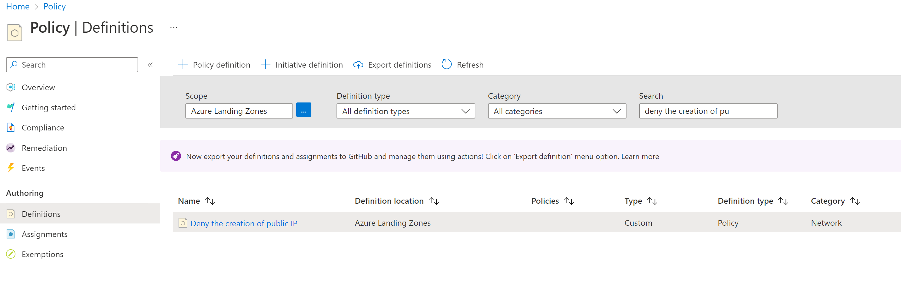
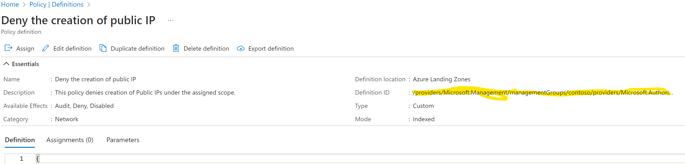
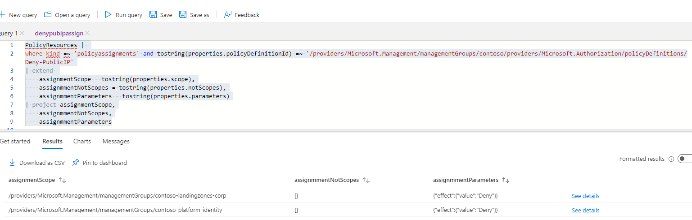
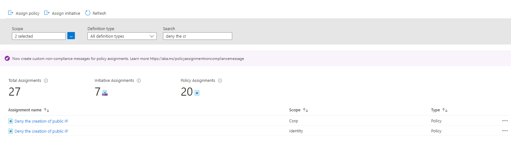
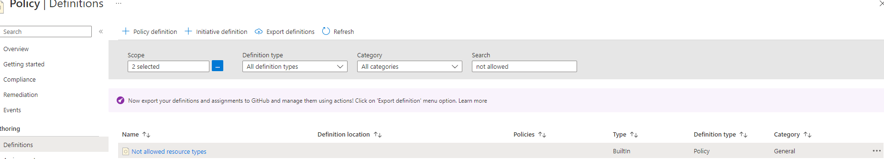
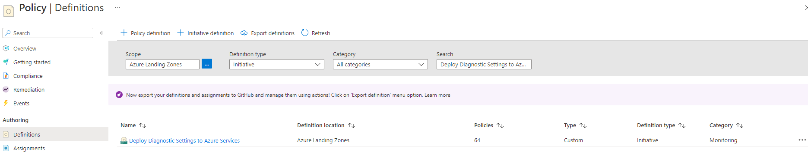
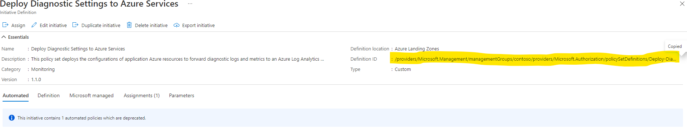
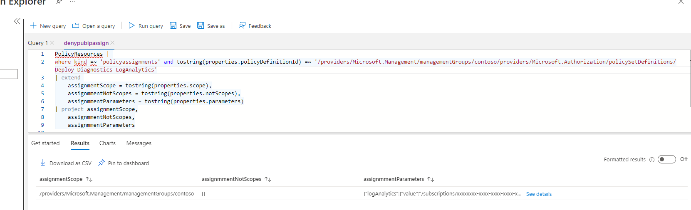
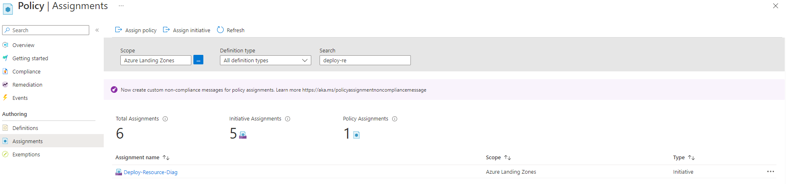

# Introduction
This article describes how to migrate ALZ custom policies and policy initiatives to Azure built-in policies. The guidance provided in this document describes manual steps for performing the migration, based on a set of specific policies and initiatives. 

## Detect updates to policy
1. To determine if there has been updates to ALZ your first reference should be [What's New](https://github.com/Azure/Enterprise-Scale/wiki/Whats-new). Any updates to policies or other ALZ related artifacts will be reflected here upon release. An example of what that will look like can be seen [here](https://github.com/Azure/Enterprise-Scale/wiki/Whats-new#policy). Also note that a cumulative list of deprecated services for ALZ, including policies, is maintained [here](https://github.com/Azure/Enterprise-Scale/wiki/ALZ-Deprecated-Services)

2. Alternatively or supplementary to the information available in [What's New](https://github.com/Azure/Enterprise-Scale/wiki/Whats-new), the AzPolicyAdvertizer with the ALZ and deprecated flags enabled (see [here](https://www.azadvertizer.net/azpolicyadvertizer_all.html#%7B%22col_10%22%3A%7B%22flt%22%3A%22Deprecated%22%7D%2C%22col_9%22%3A%7B%7D%2C%22col_11%22%3A%7B%22flt%22%3A%22ALZ%22%7D%7D)) can be leveraged to determine deprecated ALZ policies

3. A third alternative or supplementary tool is [Azure Governance Visualizer](https://github.com/JulianHayward/Azure-MG-Sub-Governance-Reporting) which can be run in your environment and reveal information about the current state of policies and policy assignments. Note that Azure Governance Visualizer requires permissions in your tenant as described [here](https://github.com/JulianHayward/Azure-MG-Sub-Governance-Reporting#permissions-overview)

## Update scenarios
There are the following scenarios for ALZ custom policies being superseded by Azure built-in policies, listed in increasing order of complexity:
1. A single ALZ custom policy, which is not assigned anywhere in your Azure estate, is superseded by an Azure built-in policy. This is the simplest scenario, and is not covered in more detail.
2. A single ALZ custom policy, which is assigned at one or more scopes in your Azure estate, is superseded by an Azure built-in policy. The process for managing this is described in [Migrate single ALZ custom policy to built-in policy](#migrate-single-pol).
3. One or more ALZ custom policies, assigned via ALZ custom policy initiative, which are superseded by Azure built-in policies. The process for managing this is described in [Migrate ALZ custom policies in initiatives to built-in policies](#migrate-multiple-pol).

### Migrate single ALZ custom policy to built-in policy
For this scenario we will use the ALZ custom policy _Deny the creation of public IP_ which will be migrated to the built-in policy _Not allowed resource types_

To carry out the instructions in the scenario the operator will require Resource Policy Permissions at the root of the ALZ management group hierarchy

- Go to https://portal.azure.com
- Open Policy
- Go to Definitions and in Search find the ALZ custom policy. 

  

- Click on the hyperlink for the policy definition
- To determine if the policy is assigned at any scope in the ALZ management group structure start by getting the policy definition ID

  

- Since there is no easy way to get the various scopes a policy is assigned to, go to Azure Resource Graph Explorer
- Ensure that scope for the query is Directory and then execute the following kusto query:

  ```kusto
    PolicyResources | 
    where kind =~ 'policyassignments' and tostring(properties.policyDefinitionId) =~ '/providers/Microsoft.Management/managementGroups/contoso/providers/Microsoft.Authorization/policyDefinitions/Deny-PublicIP'
    | extend 
        assignmentScope = tostring(properties.scope),
        assignmmentNotScopes = tostring(properties.notScopes),
        assignmmentParameters = tostring(properties.parameters)
    | project assignmentScope,
        assignmmentNotScopes,
        assignmmentParameters
  ```

- The above command will give a result similar to what is shown below

  

- As can be seen this particular policy is assigned with only a simple Deny effect parameter at the following levels in the management group structure
  - Contoso/contoso-landingzones/contoso-landingzones-corp
  - Contoso/contoso-platform/contoso-platform-identity

> Note
that the provided example has a simple parameter set. If more complex parameters are assigned to a policy which is to be migrated those should be noted down. In that respect the possibility to download the query results as CSV could be leveraged.

- Switch from Azure Resource Graph Explorer back to the Policy view 
- Change the scope to include the scopes determined in the previous step. and search for the relevant policy

  

- For each assignment, click the ellipsis and select Delete Assignment.
- Once all policy assignments are deleted, go to the Definitions pane, search for the definition. Once found click the ellipsis and choose Delete Policy Definition

  

- To assign the _Not allowed Resource types_ policy search for that policy definition. Once found click the ellipsis and choose Assign

  

- Set relevant parameters, for this particular policy this would be the resource type to disallow, i.e. Microsoft.Network/publicIpAddresses, then assign the policy to the scopes previously determined.

### How to update child definitions in ALZ custom initiatives

For this scenario we will use the ALZ custom initiative _Deploy Diagnostic Settings to Azure Services_ which is leveraging quite a large number of ALZ custom policies to apply diagnostics settings for various resources. As the initiative is updated at [source](https://github.com/Azure/Enterprise-Scale/tree/main/src/resources/Microsoft.Authorization/policySetDefinitions), the easiest way to achieve the migration in a manual way is to pull the newest version of the initiative from there.

To carry out the instructions in the scenario the operator will require Resource Policy Permissions at the root of the ALZ management group hierarchy

- Go to https://portal.azure.com
- Open Policy
- Go to Definitions and in Search find the ALZ custom policy initiative. 

  

- Click on the hyperlink for the initiative definition
- To determine where the initiative is assigned at any scope in the ALZ management group structure start by getting the initiative name

  

- Since there is no easy way to get the various scopes an initiative is assigned to, got Azure Resource Graph Explorer
- Ensure that scope for the query is Directory and then execute the following kusto query:

  ```kusto
    PolicyResources | 
    where kind =~ 'policyassignments' and tostring(properties.policyDefinitionId) =~ '/providers/Microsoft.Management/managementGroups/contoso/providers/Microsoft.Authorization/policySetDefinitions/Deploy-Diagnostics-LogAnalytics'
    | extend 
        assignmentScope = tostring(properties.scope),
        assignmmentNotScopes = tostring(properties.notScopes),
        assignmmentParameters = tostring(properties.parameters)
    | project assignmentScope,
        assignmmentNotScopes,
        assignmmentParameters
  ```

- The above command will give a result similar to what is shown below

  

- As can be seen this particular initiative is assigned with only a single parameter at the following levels in the management group structure
  - Contoso/

> Note
that the provided example has a simple parameter set. If more complex parameters are assigned to a policy which is to be migrated those should be noted down. In that respect the possibility to download the query results as CSV could be leveraged.

- Switch from Azure Resource Graph Explorer back to the Policy view 
- Change the scope to include the scope described above, and search for the relevant initiative

  

- For each assignment, click the ellipsis and select Delete Assignment.
- Once all initiative assignments are deleted, go to the Definitions pane, search for the initiative definition. Once found click the ellipsis and choose Delete Policy Definition

    

- To create the new version of the initiative, while this is possible to do in the portal through the portal GUI, with the number of policies to be included it would be a huge task. Instead you are suggested to use the templates available in https://aka.ms/alz/repo/src/resources/Microsoft.Authorization/policySetDefinitions to create the new policy as described in the following.

- Go to https://portal.azure.com
- Start an Azure Cloud Shell with PowerShell engine
- Execute the following PowerShell script:

  ```posh
  $policySetDefinitionPath = "./Deploy-Diagnostics-LogAnalytics.json"
  Invoke-WebRequest -Uri https://raw.githubusercontent.com/Azure/Enterprise-Scale/main/src/resources/Microsoft.Authorization/policySetDefinitions/Deploy-Diagnostics-LogAnalytics.json -OutFile $policySetDefinitionPath
  $policySetDef = Get-Content $policySetDefinitionPath | ConvertFrom-Json -Depth 100
  $policyName = $policySetDef.name
  $displayName = $policySetDef.properties.displayName
  $description = $policySetDef.properties.description
  $metadata = $policySetDef.properties.metadata | ConvertTo-Json -Depth 100
  $parameters = $policySetDef.properties.parameters | ConvertTo-Json -Depth 100
  $policyDefinitions = ConvertTo-Json -InputObject @($policySetDef.properties.policyDefinitions) -Depth 100
  $policyDefinitions = $policyDefinitions.Replace('[[', '[')
  New-AzPolicySetDefinition -Name $policyName -DisplayName $displayname -Description $description -PolicyDefinition $policyDefinitions -Metadata $metadata -Parameter $parameters -ManagementGroupName Contoso
  ```
> Note that if you decide on another approach from the script above, there are a number of double brackets ('[[') in the file. These need to be replaced with single brackets before the policy set definition is valid syntax.

- After running the above script go to the Definitions pane, and search for the initiative definition. Note that the initiative may take a while to show in the portal

    

- When the initiative materializes, click the ellipsis and choose Assign.
- Set relevant parameters for the initiative, then assign the policy to the scopes previously determined.
