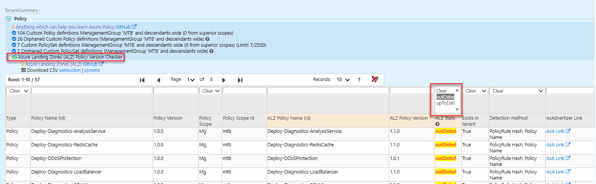
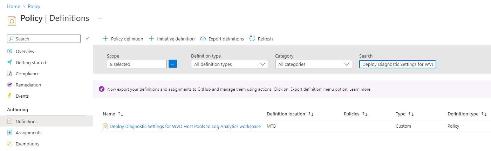
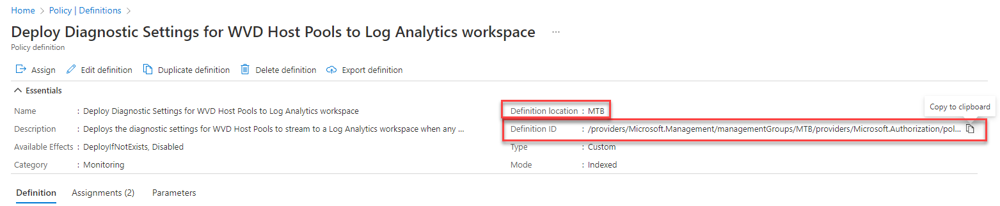
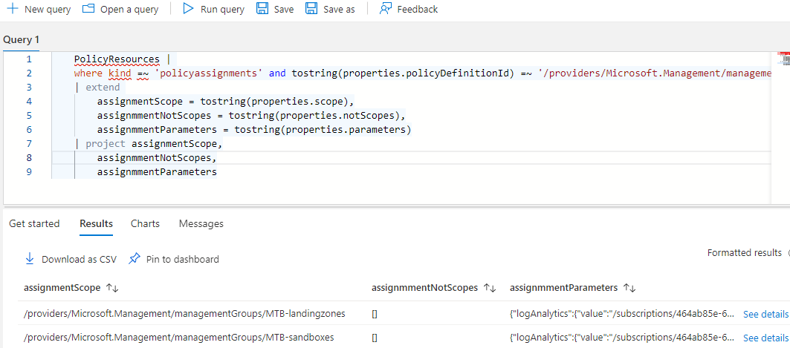
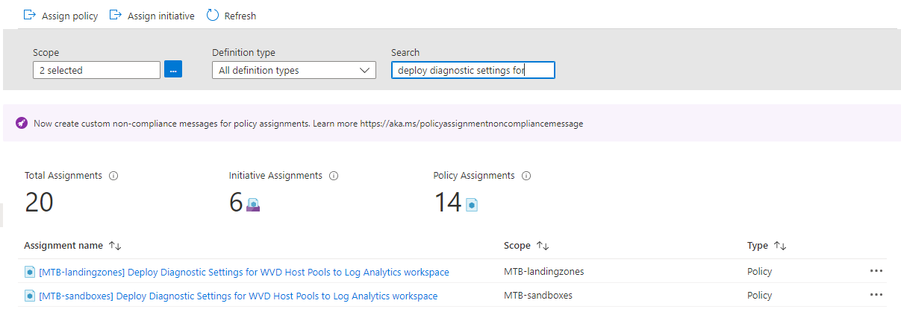
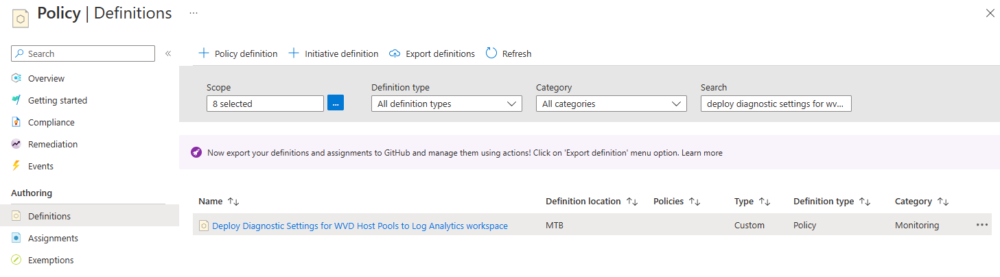
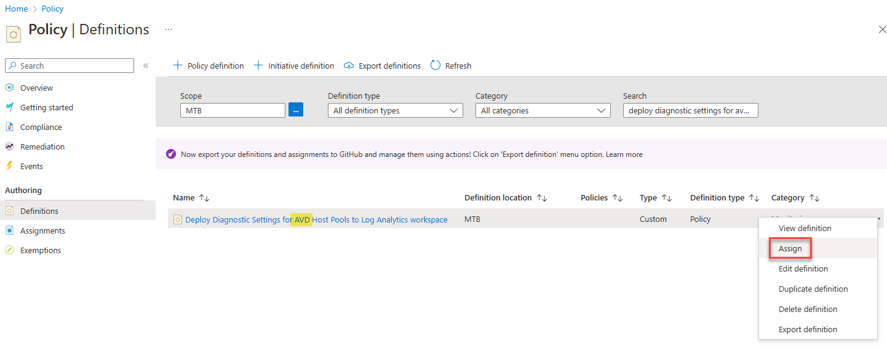

# Introduction

This article describes how to update ALZ custom policies and policy initiatives to latest versions of ALZ custom policies. The guidance provided in this document describes manual steps for performing the update, based on a set of specific policies and initiatives, with PowerShell.

> Note: If you are already managing Azure Policies through Infrastructure as Code (IaC), you may not want to be updating your Azure Policies outside of your pipeline. This article assumes a manual approach to updating Azure landing zone (ALZ) policies.

> Important: To carry out the instructions below, the operator will require Resource Policy Contributor permissions at the root of the ALZ management group hierarchy.

## Detect updates to policy

1. To determine if there has been updates to ALZ your first reference should be [What's New](https://github.com/Azure/Enterprise-Scale/wiki/Whats-new). Any updates to policies or other ALZ related artifacts will be reflected here upon release. An example of what that will look like can be seen [here](https://github.com/Azure/Enterprise-Scale/wiki/Whats-new#policy).

2. Alternatively, [Azure Governance Visualizer](https://github.com/JulianHayward/Azure-MG-Sub-Governance-Reporting) can be run in your environment and reveal information about the current state of policies and policy assignments. Part of the output of Azure Governance Visualizer is Azure Landing Zones (ALZ) Policy Version Checker which will allows you to see all **outDated** ALZ policies in your environment (see figure 1).

*Figure 1: Azure Governance Visualizer filtering on outDated ALZ policies*

> Note that Azure Governance Visualizer requires permissions in your tenant as described [here](https://github.com/JulianHayward/Azure-MG-Sub-Governance-Reporting#permissions-overview)

## Updating scenarios

These are the following scenarios for ALZ custom policies being updated to latest versions of the custom ALZ policies, listed in increasing order of complexity:

1. One or more ALZ custom policies, whether assigned or not at one or more scopes in your Azure estate, is superseded by a newer version of that same ALZ custom policy. The process for managing this is described in [Updating one or more ALZ custom policy to newer ALZ custom policies](#updating-one-or-more-alz-custom-policies-to-newer-alz-custom-policy).

2. One or more ALZ custom policies, assigned at one or more scopes in your Azure estate, is superseded by a newer version of the same ALZ custom policy with **updated parameters**. The process for managing this is described in [Updating one or more ALZ custom policies to a newer ALZ custom policy with updated parameters](#updating-one-or-more-alz-custom-policies-to-newer-alz-custom-policy-with-updated-parameters)

3. One or more ALZ custom policies, assigned via ALZ custom policy initiative, are superseded by a newer version of the same ALZ custom policy(s) with **updated parameters**. The process for managing this is described in [Updating ALZ custom policies in ALZ custom policy initiative to newer ALZ custom policies](#updating-alz-custom-policies-in-alz-custom-policy-initiative-to-newer-alz-custom-policies)

### Updating one or more ALZ custom policies to newer ALZ custom policy

For this scenario we will use the ALZ custom policy *Deploy Diagnostic Settings for AVD Host Pools to Log Analytics workspace*.

Considering no parameters have changed, this is a simple exercise that consists of replacing the policy definition content with the latest policy definition. While it is possible to update the policy definition via the portal GUI, there are some properties than can't be updated, like version. To minimize errors and include all updated policy definition properties, we will be updating this policy via a PowerShell script.

Before we begin, we need to identify the policy definition name and location to be used in our PowerShell script below.

- Go to [Azure Portal](https://portal.azure.com)
- Open Policy
- Go to Definitions and in Search, find the ALZ custom policy.

  

- Click on the hyperlink for the policy definition
- Capture the policy definition name and scope from `Definition ID` and `Definition location`. In this example, the `Definition ID` is `/providers/Microsoft.Management/managementGroups/MTB/providers/Microsoft.Authorization/policyDefinitions/Deploy-Diagnostics-WVDHostPools` with a policy definition name of **Deploy-Diagnostics-WVDHostPools** and a scope of **MTB**. The policy definition name is the set of characters following the last `/`. Both the policy definition name and scope will be used in the PowerShell script below.

  

- To update to the latest version of the definition, we will use the policy definition templates available in https://github.com/Azure/Enterprise-Scale/tree/main/src/resources/Microsoft.Authorization/policyDefinitions as described in the following.

- Go to https://portal.azure.com
- Start an Azure Cloud Shell with PowerShell engine
- Execute the following PowerShell script ([disclaimer](https://github.com/Azure/Enterprise-Scale/blob/main/SUPPORT.md)) for each ALZ custom policy definition:
  - Before executing the following PowerShell script, update the first two variables:
    - `$policyDefinitionName`
    - `$policyDefinitionLocation`

  ```posh
  $policyDefinitionName = "Deploy-Diagnostics-WVDHostPools" # <-- Replace with policy definition name found earlier
  $policyDefinitionLocation = "MTB" # <-- Replace with Definition location found earlier
  $policyDefinitionPath = "./$($policyDefinitionName).json"
  Invoke-WebRequest -Uri "https://raw.githubusercontent.com/Azure/Enterprise-Scale/main/src/resources/Microsoft.Authorization/policyDefinitions/$($policyDefinitionName).json" -OutFile $policyDefinitionPath
  $policyDef = Get-Content $policyDefinitionPath | ConvertFrom-Json -Depth 100
  $policyName = $policyDef.name
  $displayName = $policyDef.properties.displayName
  $description = $policyDef.properties.description
  $mode = $policyDef.properties.mode
  $metadata = $policyDef.properties.metadata | ConvertTo-Json -Depth 100
  $parameters = $policyDef.properties.parameters | ConvertTo-Json -Depth 100
  $policyRule = $policyDef.properties.policyRule | ConvertTo-Json -Depth 100
  $policyRule = $policyRule.Replace('[[', '[')
  Set-AzPolicyDefinition -Name $policyName -DisplayName $displayname -Description $description -Policy $policyRule -Mode $mode -Metadata $metadata -Parameter $parameters -ManagementGroupName $policyDefinitionLocation
  ```

> Note that if you decide on another approach from the script above, there are a number of double brackets ('[[') in the file. These need to be replaced with single brackets before the policy set definition is valid syntax.

### Updating one or more ALZ custom policies to newer ALZ custom policy with updated parameters

For this scenario, we will use the ALZ custom policy *Deploy Diagnostic Settings for AVD Host Pools to Log Analytics workspace*. Even though this policy doesn't have any updated parameters, we will walk through the steps as though it does.

- Go to [Azure Portal](https://portal.azure.com)
- Open Policy
- Go to Definitions and in Search, find the ALZ custom policy.

  

- Click on the hyperlink for the policy definition

- To determine if the policy is assigned at any scope in the ALZ management group structure start by getting the policy definition ID
  - Capture the policy definition name and scope from `Definition ID` and `Definition location`. In this example, the `Definition ID` is `/providers/Microsoft.Management/managementGroups/MTB/providers/Microsoft.Authorization/policyDefinitions/Deploy-Diagnostics-WVDHostPools` with a policy definition name of **Deploy-Diagnostics-WVDHostPools** and a scope of **MTB**. The policy definition name is the set of characters following the last `/`. Both the policy definition name and scope will be used in the PowerShell script below.

  

- Since there is no easy way to get the various scopes a policy is assigned to, go to Azure Resource Graph Explorer
- Ensure that scope for the query is Directory and then execute the following kusto query:

  ```kusto
    PolicyResources | 
    where kind =~ 'policyassignments' and tostring(properties.policyDefinitionId) =~ '/providers/Microsoft.Management/managementGroups/MTB/providers/Microsoft.Authorization/policyDefinitions/Deploy-Diagnostics-WVDHostPools'
    | extend 
        assignmentScope = tostring(properties.scope),
        assignmmentNotScopes = tostring(properties.notScopes),
        assignmmentParameters = tostring(properties.parameters)
    | project assignmentScope,
        assignmmentNotScopes,
        assignmmentParameters
  ```

- The above command will give a result similar to what is shown below

  

- Record the assignment scopes so you can recreate the assignments later
- As can be seen this particular policy is assigned with only a single DINE effect parameter at the following levels in the management group structure:
  - MTB/MTB-landingzones
  - MTB/MTB-sandboxes

> Note that if more complex parameters are assigned to a policy which is to be updated, those should be noted down. In that respect the possibility to download the query results as CSV could be leveraged.

- Switch from Azure Resource Graph Explorer back to the Policy Assignments view
- Change the scope to include the scopes determined in the previous step and search for the relevant policy

  

- For each assignment, click the ellipsis and select Delete Assignment.
- Once all policy assignments are deleted, go to the Definitions pane, search for the definition. Once found click the ellipsis and choose Delete Policy Definition

  

> Important: Record the **Definition location** of the Policy Definition as it will be used in (`$policyDefinitionLocation`) the script below.

- To update to the latest version of the definition, we will use the policy definition templates available in https://github.com/Azure/Enterprise-Scale/tree/main/src/resources/Microsoft.Authorization/policyDefinitions as described in the following.

- Go to https://portal.azure.com
- Start an Azure Cloud Shell with PowerShell engine
- Execute the following PowerShell script ([disclaimer](https://github.com/Azure/Enterprise-Scale/blob/main/SUPPORT.md)) for each ALZ custom policy definition:
  - Before executing the following PowerShell script, update the first two variables:
    - `$policyDefinitionName`
    - `$policyDefinitionLocation`

  ```posh
  $policyDefinitionName = "Deploy-Diagnostics-WVDHostPools" # <-- Replace with policy definition name found earlier
  $policyDefinitionLocation = "MTB" # <-- Replace with Definition location found earlier
  $policyDefinitionPath = "./$($policyDefinitionName).json"
  Invoke-WebRequest -Uri "https://raw.githubusercontent.com/Azure/Enterprise-Scale/main/src/resources/Microsoft.Authorization/policyDefinitions/$($policyDefinitionName).json" -OutFile $policyDefinitionPath
  $policyDef = Get-Content $policyDefinitionPath | ConvertFrom-Json -Depth 100
  $policyName = $policyDef.name
  $displayName = $policyDef.properties.displayName
  $description = $policyDef.properties.description
  $mode = $policyDef.properties.mode
  $metadata = $policyDef.properties.metadata | ConvertTo-Json -Depth 100
  $parameters = $policyDef.properties.parameters | ConvertTo-Json -Depth 100
  $policyRule = $policyDef.properties.policyRule | ConvertTo-Json -Depth 100
  $policyRule = $policyRule.Replace('[[', '[')
  New-AzPolicyDefinition -Name $policyName -DisplayName $displayname -Description $description -Policy $policyRule -Mode $mode -Metadata $metadata -Parameter $parameters -ManagementGroupName $policyDefinitionLocation
  ```

> Note that if you decide on another approach from the script above, there are a number of double brackets ('[[') in the file. These need to be replaced with single brackets before the policy set definition is valid syntax.

- To assign *Deploy Diagnostic Settings for AVD Host Pools to Log Analytics workspace* policy, search for that policy definition. Once found click the ellipsis and choose Assign

  

> Note how the display name changed from WVD to AVD.

- Set relevant parameters which were captured earlier.

### Updating ALZ custom policies in ALZ custom policy initiative to newer ALZ custom policies

For this scenario we will use the ALZ custom initiative _Deploy Diagnostic Settings to Azure Services_ which is leveraging quite a large number of ALZ custom policies to apply diagnostics settings for various resources. As the initiative is updated at [source](https://github.com/Azure/Enterprise-Scale/tree/main/src/resources/Microsoft.Authorization/policySetDefinitions), the easiest way to achieve the migration in a manual way is to pull the newest version of the initiative from there.

- Go to https://portal.azure.com
- Open Policy
- Go to Definitions and in Search find the ALZ custom policy initiative.

  

- Click on the hyperlink for the initiative definition
- To determine where the initiative is assigned at any scope in the ALZ management group structure start by getting the initiative **Definition ID**. Record the initiative name (/providers/Microsoft.Management/managementGroups/**Contoso**/providers/Microsoft.Authorization/policySetDefinitions/***Deploy-Diagnostics-LogAnalytics***) and location as it will be used in the PowerShell script below.

  

- Since there is no easy way to get the various scopes an initiative is assigned to, go to Azure Resource Graph Explorer
- Ensure that scope for the query is Directory and then execute the following kusto query:

  ```kusto
    PolicyResources | 
    where kind =~ 'policyassignments' and tostring(properties.policyDefinitionId) =~ '/providers/Microsoft.Management/managementGroups/contoso/providers/Microsoft.Authorization/policySetDefinitions/Deploy-Diagnostics-LogAnalytics'
    | extend 
        assignmentScope = tostring(properties.scope),
        assignmmentNotScopes = tostring(properties.notScopes),
        assignmmentParameters = tostring(properties.parameters)
    | project assignmentScope,
        assignmmentNotScopes,
        assignmmentParameters
  ```

- The above command will give a result similar to what is shown below

  

- Record the assignment scopes so you can recreate the assignments later
- As can be seen this particular initiative is assigned with only a single parameter at the following levels in the management group structure
  - Contoso/

> Note that the provided example has a simple parameter set. Even though this initiative has over 60 parameters, the other parameters are utilizing the **Default value**. If more complex parameters are assigned to a policy which is to be migrated those should be noted down. In that respect the possibility to download the query results as CSV could be leveraged.

- Switch from Azure Resource Graph Explorer back to the Policy view
- Change the scope to include the scope described above, and search for the relevant initiative

  

- For each assignment, click the ellipsis and select Delete Assignment
- Once all initiative assignments are deleted, go to the Definitions pane, search for the initiative definition

> Note: It is highly recommended you update all the ALZ custom policies to the latest version before continuing. The script below has a variable, `$updateCustomALZPolicies`, to update all of the ALZ custom policy definitions if set to `$true`.

- Once found click the ellipsis and choose Delete Policy Initiative Definition

    

> Important: Record the **Definition location** of the Policy Initiative Definition as it will be used in (`$policySetDefinitionLocation`) the script below.

- To create the new version of the initiative, while this is possible to do in the portal through the portal GUI, with the number of policies to be included it would be a huge task. Instead, we suggest the use of the templates available in https://github.com/Azure/Enterprise-Scale/tree/main/src/resources/Microsoft.Authorization/policySetDefinitions to create the new policy initiative definition and update the custom ALZ policy definitions as described in the following.

- Go to https://portal.azure.com
- Start an Azure Cloud Shell with PowerShell engine
- Before executing the following PowerShell script ([disclaimer](https://github.com/Azure/Enterprise-Scale/blob/main/SUPPORT.md)), update the first three variables:
  - `$updateCustomALZPolicies`
  - `$policySetDefinitionName`
  - `$policySetDefinitionLocation`

  ```posh
  $updateCustomALZPolicies = $true # <-- $false = don't update the policy definitions
  $policySetDefinitionName = "Deploy-Diagnostics-LogAnalytics" # <-- Replace with policy definition name found earlier
  $policySetDefinitionLocation = "Contoso" # <-- Replace with Definition location found earlier
  $policySetDefinitionPath = "./$($policySetDefinitionName).json"
  Invoke-WebRequest -Uri https://raw.githubusercontent.com/Azure/Enterprise-Scale/main/src/resources/Microsoft.Authorization/policySetDefinitions/$($policySetDefinitionName).json -OutFile $policySetDefinitionPath
  $policySetDef = Get-Content $policySetDefinitionPath | ConvertFrom-Json -Depth 100
  
  # Update all ALZ custom policy definitions first
    if ($updateCustomALZPolicies) {  
      foreach ($policyDefId in $policySetDef.properties.policyDefinitions.policyDefinitionId) {
        if ($policyDefId -match '(\/\w+\/\w+\.\w+\/\w+\/)(\w+)(\/.+)') {
          $policyDefinitionName = $policyDefId.substring($policyDefId.lastindexof('/') + 1)
          $policyDefinitionPath = "./$($policyDefinitionName).json"
          Invoke-WebRequest -Uri "https://raw.githubusercontent.com/Azure/Enterprise-Scale/main/src/resources/Microsoft.Authorization/policyDefinitions/$($policyDefinitionName).json" -OutFile $policyDefinitionPath
          $policyDef = Get-Content $policyDefinitionPath | ConvertFrom-Json -Depth 100
          $policyName = $policyDef.name
          $displayName = $policyDef.properties.displayName
          $description = $policyDef.properties.description
          $mode = $policyDef.properties.mode
          $metadata = $policyDef.properties.metadata | ConvertTo-Json -Depth 100
          $parameters = $policyDef.properties.parameters | ConvertTo-Json -Depth 100
          $policyRule = $policyDef.properties.policyRule | ConvertTo-Json -Depth 100
          $policyRule = $policyRule.Replace('[[', '[')
          New-AzPolicyDefinition -Name $policyName -DisplayName $displayname -Description $description -Policy $policyRule -Mode $mode -Metadata $metadata -Parameter $parameters -ManagementGroupName $policySetDefinitionLocation
        }
      }
    }
  # End of updating all ALZ custom policy definitions

  $policyName = $policySetDef.name
  $displayName = $policySetDef.properties.displayName
  $description = $policySetDef.properties.description
  $metadata = $policySetDef.properties.metadata | ConvertTo-Json -Depth 100
  $parameters = $policySetDef.properties.parameters | ConvertTo-Json -Depth 100
  $policyDefinitions = ConvertTo-Json -InputObject @($policySetDef.properties.policyDefinitions) -Depth 100
  $policyDefinitions = $policyDefinitions.Replace('[[', '[')
  $policyDefinitions = $policyDefinitions -replace '(\/\w+\/\w+\.\w+\/\w+\/)(\w+)(\/.+)', "`${1}$policySetDefinitionLocation`${3}"
  New-AzPolicySetDefinition -Name $policyName -DisplayName $displayname -Description $description -PolicyDefinition $policyDefinitions -Metadata $metadata -Parameter $parameters -ManagementGroupName $policySetDefinitionLocation
  ```

> Note that if you decide on another approach from the script above, there are a number of double square brackets ('[[') in the file. These need to be replaced with single square brackets before the policy set definition is valid syntax.

- After running the above script go to the Definitions pane, and search for the initiative definition. Note that the initiative may take a while to show in the portal

    

- When the initiative materializes, click the ellipsis and choose Assign
- Set relevant parameters for the initiative, then assign the policy to the scopes previously determined
