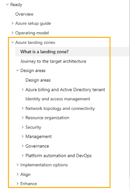

## In this Section

- [Updates](#updates)
  - [January 2024](#january-2024)
  - [December 2023](#december-2023)
  - [November 2023](#november-2023)
  - [October 2023](#october-2023)
  - [September 2023](#september-2023)
  - [August 2023](#august-2023)
  - [July 2023](#july-2023)
  - [June 2023](#june-2023)
  - [May 2023](#may-2023)
  - [April 2023](#april-2023)
  - [March 2023](#march-2023)
  - [February 2023](#february-2023)
  - [January 2023](#january-2023)
  - [Previous Updates](#november-2022)

---

Enterprise Scale/Azure Landing Zones is updated regularly. This page is where you'll find out about the latest updates to Enterprise Scale/Azure Landing Zones for:

- [CAF (Cloud Adoption Framework) Documentation](https://aka.ms/alz) Updates
  - Check out the CAF specific [What's new in the Microsoft Cloud Adoption Framework for Azure](https://learn.microsoft.com/azure/cloud-adoption-framework/get-started/whats-new) page
- Improvements to existing guidance and artifacts
- Azure Policy changes
- Bug fixes
- Tooling updates:
  - [ALZ-Bicep Modules](https://github.com/Azure/ALZ-Bicep)
    - [Releases](https://github.com/Azure/ALZ-Bicep/releases)
  - [Terraform Module for Cloud Adoption Framework Enterprise-scale](https://github.com/Azure/terraform-azurerm-caf-enterprise-scale)
    - [Releases](https://github.com/Azure/terraform-azurerm-caf-enterprise-scale/releases)

> **Note:** Please check the latest release notes for each of the tools, as these will contain more detailed notes relating to changes in each of the tools.

This article will be updated as and when changes are made to the above and anything else of relevance for Enterprise Scale/Azure Landing Zones. Make sure to check back here often to keep up with new updates and changes.

> **Important:** Previous changes to the above in relation to Enterprise Scale will not be listed here. However going forward, this page will be updated.

## Updates

Here's what's changed in Enterprise Scale/Azure Landing Zones:

### January 2024

#### Tooling

- Bug fix for Portal Accelerator, removing region restrictions for VPN Gateways when deploying regional (not AZ).
- Bug fix for Portal Accelerator deployment when deploying using a single platform subscription. Previously, a single tenant deployment would have three failed deployments for diagnostic settings which were looking for non-existent management groups (Management, Identity and Connectivity). This has been fixed and the deployment will now succeed.
- Added drop down selection option for Azure Private Link Private DNS Zones as part of portal based ALZ deployment experience where you can select to deploy or not to deploy a subset of Private Link Private DNS zones.

### December 2023

#### Tooling

- Added a new policy/initiative submission form template for GitHub Issues. This will help us to better understand the policy/initiative you are submitting and will help us to review and approve the submission faster. Please use this template when submitting new policies/initiatives to the ALZ GitHub Issues page.

#### Other

- December 6th External Community Call recording and slides published to [aka.ms/alz/community](https://aka.ms/alz/community)

### November 2023

#### Tooling

- Added virtual hub routing preference support to Portal Accelerator for scenarios where you need to influence routing decisions in virtual hub router towards on-premises. For existing ALZ customers please visit [Configure virtual hub routing preference](https://learn.microsoft.com/azure/virtual-wan/howto-virtual-hub-routing-preference) for details on how to configure virtual hub routing preference settings.
- Added virtual hub capacity option to Portal Accelerator which provides an option to select the number of routing infrastracture units. Please visit [Virtual hub capacity](https://learn.microsoft.com/azure/virtual-wan/hub-settings#capacity) for more details on Azure vWAN Virtual Hub Capacity configuration.
- Fixed a bug in the portal accelerator experience when deploying with single platform subscription and selecting virtual WAN networking topology - Invalid Template error.

#### Docs

- Fixed in ALZ Azure Setup the bash command to assign at root scope _Owner_ role to a Service Principal.
- Added a new section to describe ALZ Policy Testing Framework for ALZ custom policies [Policies Testing Framework](./ALZ-Policies-Testing).

### October 2023

#### Policy

- The portal accelerator experience has been updated to include deployment of Azure Monitor baseline alerts. Details on the policies deployed can be found [here](https://aka.ms/amba/alz).
- Fixed issue with couple of Policy file names to align with the actual name of the policies
- Bug fix for [Deploy-MDFC-Config](https://www.azadvertizer.net/azpolicyinitiativesadvertizer/Deploy-MDFC-Config.html) version
- Add support to deploy ALZ Portal Accelerator into new Italy North region

#### Tooling

- Fixed a bug in the portal accelerator experience when deploying a VPN Gateway and Azure Firewall (Basic SKU) - IP address overlap error.
- Added vWAN Hub Routing Intent support to Portal Accelerator for scenarios that include Azure Firewall deployment. For existing ALZ customers please visit [How to configure Virtual WAN Hub routing intent and routing policies](https://learn.microsoft.com/en-us/azure/virtual-wan/how-to-routing-policies) for details on how to add routing intent to your environment.
- Enhanced the ALZ Portal Accelerator to provide the ability to deploy the Azure VPN Gateway in Active/Active mode as per feedback from [#655](https://github.com/Azure/Enterprise-Scale/issues/655).

#### Docs

- Updated the ALZ Wiki FAQ to include a section on why we've enabled GitHub Releases - [read here](https://github.com/Azure/Enterprise-Scale/wiki/FAQ#what-is-the-impact-of-github-releases-and-alz).
- Updated the ALZ Wiki FAQ to include a section on why some solutions may not deploy in an ALZ governed environment and how to work around it.

### September 2023

#### Policy

- Updated to the new [Configure Microsoft Defender for Storage to be enabled](https://www.azadvertizer.com/azpolicyadvertizer/cfdc5972-75b3-4418-8ae1-7f5c36839390.html) built-in policy to the `Deploy-MDFC-Config` initiative and assignment.
  - Read more about the new Microsoft Defender for Storage here: [aka.ms//DefenderForStorage](https://aka.ms//DefenderForStorage).
  - NOTE: there are additional cost considerations associated with this feature - [more info](https://learn.microsoft.com/azure/defender-for-cloud/defender-for-storage-introduction#malware-scanning-powered-by-microsoft-defender-antivirus).
- Added two new definitions with Deny Action feature:
  - `DenyAction-ActivityLogSettings.json`
  - `DenyAction-DiagnosticSettings.json`
- Bug fix for missing diagnostic settings category for policy `Deploy-Diagnostics-CosmosDB`
- Added the [Configure Azure Databricks workspace to use private DNS zones](https://www.azadvertizer.com/azpolicyadvertizer/0eddd7f3-3d9b-4927-a07a-806e8ac9486c.html) built-in policy to the "Deploy-Private-DNS-Zones" initiative and assignment.

> **Important:** For existing ALZ deployments, you will need to redeploy the below assignments with least privilege RBAC roles, and review and remove existing service principals `Owner` role assignments. The below list includes the scope that needs to be reviewed. For new deployments, the below assignments will be deployed with least privilege RBAC roles.

- Remediating default policy/initiative assignments using `Owner` role to be least privilege where possible. Updated assignments:
  - Deploy-AzActivity-Log (Management Group: Intermediate Root)
  - Deploy-AKS-Policy (added additional required role)
  - Deploy-Resource-Diag (Management Group: Intermediate Root)
  - Deploy-SQL-TDE (Management Group: Landing Zone)
  - Deploy-VM-Backup (Management Group: Landing Zone)
  - Deploy-VM-Monitoring (Management Group: Intermediate Root)
  - Deploy-VMSS-Monitoring (Management Group: Intermediate Root)

#### Other

- [Azure Landing Zone External Community Call - September 2023 - Hosted & Published](https://github.com/Azure/Enterprise-Scale/wiki/Community-Calls#25th-september-2023-25092023)

### August 2023

#### Policy

- Updating custom policies using over permissive roles (Owner) to use resource scoped roles (e.g., Storage Account Contributor, Azure SQL Contributor, etc.):
  - Deploy-Storage-sslEnforcement
  - Deploy-SqlMi-minTLS
    - Added evaluationDelay as provisioning takes around 4 hours and policy remediation fails on create due to time outs (as it normally triggers after 10 minutes).
  - Deploy-SQL-minTLS
  - Deploy-MySQL-sslEnforcement (changed from Owner to Contributor role, no built in roles currently available)
  - Deploy-PostgreSQL-sslEnforcement (changed from Owner to Contributor role, no built in roles currently available)
- Updated to the new [Configure Microsoft Defender for Storage to be enabled](https://www.azadvertizer.com/azpolicyadvertizer/cfdc5972-75b3-4418-8ae1-7f5c36839390.html) built-in policy to the `Deploy-MDFC-Config` initiative and assignment.
  - Read more about the new Microsoft Defender for Storage here: [aka.ms//DefenderForStorage](https://aka.ms//DefenderForStorage).
  - NOTE: there are additional cost considerations associated with this feature - [more info](https://learn.microsoft.com/azure/defender-for-cloud/defender-for-storage-introduction#malware-scanning-powered-by-microsoft-defender-antivirus).

#### Other

- Renamed Azure Active Directory to Microsoft Entra ID

### July 2023

Major update in this release: introducing the Policy Testing Framework foundation, along with tests for all assigned infrastructure policies that use the DENY effect. This will allow us to test the policies in a more automated fashion, and will help us to ensure that we don't introduce any regressions in the future and maintain a higher level of quality for our policies. We will be adding additional tests for custom policies in the future.

#### Policy

- Added additional initiative assignment for [Enforce-Guardrails-KeyVault](https://www.azadvertizer.net/azpolicyinitiativesadvertizer/Enforce-Guardrails-KeyVault.html) to the Platform Management Group to improve security coverage. Initially this assignment was only applied to the Landing Zone Management Group.
  - Update Portal RI to include the new assignment option for the Key Vault initiative under Platform Management.
- Added new custom policy to audit Virtual Machines not using Azure Hybrid Benefit (Audit-AzureHybridBenefit)
- Fixing bug in [Deploy-Sql-vulnerabilityAssessments](https://www.azadvertizer.net/azpolicyadvertizer/Deploy-Sql-vulnerabilityAssessments.html) to achieve compliance if successfully remediated. NOTE: Due to the need to change parameters, this is a breaking change. The original policy will remain in place but will be deprecated and a new policy will be deployed for the fix [Deploy-Sql-vulnerabilityAssessments_20230706](https://www.azadvertizer.net/azpolicyadvertizer/Deploy-Sql-vulnerabilityAssessments_20230706.html) - please update assignments accordingly - many thanks @Matt-FFFFFF.
- Bug fix for [Management port access from the Internet should be blocked](https://www.azadvertizer.net/azpolicyadvertizer/Deny-MgmtPorts-From-Internet.html) not enforcing deny effect when a deployment includes rules defined in network security group properties (i.e., when specifying rules when creating the NSG) - many thanks to @DavidRobson.
- QoL updates: adding supersededBy metadata and adding links in the description to deprecated custom policies to point to the superseding policy - aligned with ALZ specific feature updates in [AzAdvertizer](https://www.azadvertizer.net/).
- Policy Testing Framework implemented for custom ALZ DENY policies (See Tooling section below).

#### Tooling

- Enhanced the Azure Firewall Basic experience in the ALZ Portal Accelerator based on feedback from [#1370](https://github.com/Azure/Enterprise-Scale/issues/1370) by removing the DNS proxy option when selecting the `Basic` SKU
- Updated Sentinel deployment to use new [simplified pricing tier](https://learn.microsoft.com/azure/sentinel/enroll-simplified-pricing-tier?tabs=azure-resource-manager)
- Established a Policy Testing Framework based on Pester, built on the work done by @fawohlsc in this repo [azure-policy-testing](https://github.com/fawohlsc/azure-policy-testing)

#### Docs

- Updated contribution guide to include a new section to describe how to implement tooltips when adding new policies with default assignments that require updates to the portal reference implementation.
- Adding text to the ALZ-Policies wiki page to clarify that we do use preview policies as part of initiatives in some default assignments.

### June 2023

#### Policy

- Fixed default assignment for SQLEncryption (DINE-SQLEncryptionPolicyAssignment) to use the correct policy definition.
- Added new default assignment for SQLThreatDetection (DINE-SQLThreatPolicyAssignment) to use the previous policy definition from DINE-SQLEncryptionPolicyAssignment.
- Updated the assignment DINE-LogAnalyticsPolicyAssignment (Deploy-Log-Analytics) to default enforcement mode to "DoNotEnforce". The Log Analytics workspace is deployed directly by the reference implementations, and as a result this policy is no longer required to deploy the Log Analytics workspace. Retaining the assignment for auditing purposes.
- Added new custom policies for (many thanks @jeetgarg):
  - Storage Accounts with custom domains assigned should be denied - [Deny-StorageAccount-CustomDomain](https://www.azadvertizer.net/azpolicyadvertizer/Deny-StorageAccount-CustomDomain.html)
  - File Services with insecure Kerberos ticket encryption should be denied - [Deny-FileServices-InsecureKerberos](https://www.azadvertizer.net/azpolicyadvertizer/Deny-FileServices-InsecureKerberos.html)
  - File Services with insecure SMB channel encryption should be denied - [Deny-FileServices-InsecureSMBChannel](https://www.azadvertizer.net/azpolicyadvertizer/Deny-FileServices-InsecureSMBChannel.html)
  - File Services with insecure SMB versions should be denied - [Deny-FileServices-InsecureSMBVersions](https://www.azadvertizer.net/azpolicyadvertizer/Deny-FileServices-InsecureSMBVersions.html)
  - File Services with insecure authentication methods should be denied - [Deny-FileServices-InsecureAuth](https://www.azadvertizer.net/azpolicyadvertizer/Deny-FileServices-InsecureAuth.html)
  - 'User Defined Routes with 'Next Hop Type' set to 'Internet' or 'VirtualNetworkGateway' should be denied'
  - 'Storage Accounts with SFTP enabled should be denied'
  - 'Subnets without Private Endpoint Network Policies enabled should be denied'

#### Tooling

- Updated Portal Accelerator tooltips to provide more relevance and links to associated policies or initiatives.

#### Other

- When the option to deploy Log Analytics workspace and enable monitoring is enabled (Yes) in the Platform management, security, and governance section, Diagnostic Settings for Management Groups are also deployed. 

### May 2023

#### Policy

- Updated `Deploy-Diagnostics-APIMgmt.json` to support resource-specific destination table in the diagnostic setting for API Management.
- Updated `Deploy-Diagnostics-LogAnalytics.json` policy initiative with new parameter to support resource-specific destination table in the diagnostic setting for API Management.
- Updated `Deploy-Diagnostics-Firewall.json` to support resource-specific destination table in the diagnostic setting for Firewall
- Updated `Deploy-Diagnostics-LogAnalytics.json` policy initiative with new parameter to support resource-specific destination table in the diagnostic setting for Firewall
- Updated `Deploy-Diagnostics-APIMgmt.json` to support resource-specific destination table in the diagnostic setting for API Management
- Updated `Deploy-Diagnostics-LogAnalytics.json` policy initiative with new parameter to support resource-specific destination table in the diagnostic setting for API Management
- Bug fix for `effect` for the Key Vault setting (incorrect case) in `Deploy-MDFC-Config.json` initiative.
- Bug fix for [Management port access from the Internet should be blocked](https://www.azadvertizer.net/azpolicyadvertizer/Deny-MgmtPorts-From-Internet.html) when a destination port array is submitted that contains port ranges that includes a denied port (22, 3389, and any others) when creating new NSG rules.
- Bug fix for [AppService append sites with minimum TLS version to enforce.](https://www.azadvertizer.net/azpolicyadvertizer/Append-AppService-latestTLS.html) where the policy was preventing the creation of connection strings via API. The fix revises the policy rule logic to address the blocking issue.
- Fixed minor grammatical errors in two policy assignments.
- Deprecated policy [`Deny-MachineLearning-PublicNetworkAccess`](https://www.azadvertizer.net/azpolicyadvertizer/Deny-MachineLearning-PublicNetworkAccess.html).
- Update initiative [`Deny-PublicPaaSEndpoints`](https://www.azadvertizer.net/azpolicyinitiativesadvertizer/Deny-PublicPaaSEndpoints.html) to replace deprecated policy `Deny-MachineLearning-PublicNetworkAccess` with builtin [`438c38d2-3772-465a-a9cc-7a6666a275ce`](https://www.azadvertizer.net/azpolicyadvertizer/438c38d2-3772-465a-a9cc-7a6666a275ce.html).
- Deprecated policy [`Deny-PublicEndpoint-MariaDB`](https://www.azadvertizer.net/azpolicyadvertizer/Deny-PublicEndpoint-MariaDB.html).
- Update initiative [`Deny-PublicPaaSEndpoints`](https://www.azadvertizer.net/azpolicyinitiativesadvertizer/Deny-PublicPaaSEndpoints.html) to replace deprecated policy `Deny-PublicEndpoint-MariaDB` with builtin [`fdccbe47-f3e3-4213-ad5d-ea459b2fa077`](https://www.azadvertizer.net/azpolicyadvertizer/fdccbe47-f3e3-4213-ad5d-ea459b2fa077.html) - special note: US Gov/Fairfax still uses the now deprecated policy as the builtin is not yet available.
- Standardized denied network resources in policy assignments for Corp and Sandbox management groups as per GH #1333.
- Added non-compliance message to `Enforce-ALZ-Sandbox` initiative assignment.

#### Docs

- Updated wiki deployment guides for the four main scenarios to include the new Decommissioned and Sandbox step in the portal accelerator.
- Updated ALZ Policies wiki to make the link to the Excel spreadsheet more prominent.
- Updated ALZ Policies wiki images to reflect policy initiative assignments now included for Decommissioned and Sandbox management groups.
- Updated the ALZ Policy Assignments Excel spreadsheet to include a release version column so users can track when those policies last changed and verified all assignments have a relevant AzAdvertizer link for policy details.
- [Azure Enablement Show: Updating your Azure landing zones](https://www.youtube.com/watch?v=VvZDftlF20w) published
- [Tech Community Blog: Azure Monitor Baseline Alerts (Preview)](https://techcommunity.microsoft.com/t5/azure-governance-and-management/azure-monitor-baseline-alerts-preview/ba-p/3810463) published
- Updated wiki documentation to so reflect the removal of the "Platform DevOps and automation" section from ALZ Portal Accelerator
- Added support for Azure Firewall Basic SKU to Hub & Spoke and Virtual WAN deployments in the ALZ Portal Accelerator
- Updated wiki documentation towards Subscription Vending approach for landing zone (subscription) creation
- A brand new [ALZ Policy FAQ and Tips](./ALZ-Policies-FAQ) page has been added to the wiki to help answer some of the most common questions and provide some useful tips for working with ALZ policies.
- Updated [ALZ Contribution Guide](./ALZ-Contribution-Guide) to include new section on how to contribute to ALZ policies resulting in breaking changes, and some minor refactoring to make it more readable.

#### Tooling

- ALZ Bicep [`v0.14.0`](https://github.com/Azure/ALZ-Bicep/releases/tag/v0.14.0) released
  - [ALZ Bicep Accelerator (MVP) launched](https://github.com/Azure/ALZ-Bicep/wiki/Accelerator)
- ALZ Terraform (`caf-enterprise-scale`) [`v4.0.0`](https://github.com/Azure/terraform-azurerm-caf-enterprise-scale/releases/tag/v4.0.0) released
- ALZ Portal Accelerator: "Platform DevOps and automation" section removed

#### Other

- Removed resources from `workloads` folder and redirected to Azure Architectures Center page of [Deploy Azure landing zones](https://aka.ms/alz/aac)

### April 2023

We are pleased to announce that we are starting regular Azure Policy reviews for Azure Landing Zone. This includes a review of new built-in policies released and their suitability for ALZ, built-in policies that can replace custom ALZ policies, built-in policies that have been deprecated and addition of new ALZ custom policies and initiatives as identified based on best practices, issues raised and customer feedback. Most importantly, we have also provided default assignments for all the new policies at the appropriate ALZ Management Group level. This will ensure that all new policies are automatically assigned to the appropriate scope and will be in compliance with the ALZ baseline. This will also ensure that the ALZ is always up to date with the latest Azure Policy definitions.

This update includes many ALZ Azure Policies and Initiatives that have been added or updated to enhance the security, governance, and management of ALZ. As part of our commitment to continuous improvement, we have also enhanced our policy review  process, with a focus on transitioning away from deprecated policies where possible, move from custom to built-in policies providing the same or enhanced functionality, and implementing new policies to keep ALZ as part of the current review cycle. We have also implemented non-compliance messages where supported to provide a better user experience when a policy is non-compliant.

This is the first major review and refresh of Azure Policy since ALZ was GA'd. Since GA many new built-in policies and initiatives have been released which has driven the need for this review. We believe that a regular review cycle will allow us to stay on top of emerging trends and new policies, ensuring that our Azure environment remains secure and compliant. Should you identify policies or initiatives that should be considered for ALZ, kindly submit an [GitHub issue](https://github.com/Azure/Enterprise-Scale/issues). For more information, please refer to the [ALZ Policies](ALZ-Policies.md) or the new [Excel spreadsheet](media/ALZ%20Policy%20Assignments%20v2.xlsx) version.

We strongly advise staying up-to-date to ensure the best possible security posture for your Azure environment, see [Keep your Azure landing zone up to date](https://aka.ms/alz/update). For those with existing deployments or policies, we have provided [Brownfield guidance](https://aka.ms/alz/brownfield) to help you navigate the process of updating to the latest policies. We recognize that there may be breaking changes when upgrading an existing deployment or policies and for details follow our recently released guidance to support you in this process:

- [Update Azure landing zone custom policies](https://aka.ms/alz/update/custom)
- [Migrate Azure landing zone policies to Azure built-in policies](https://aka.ms/alz/update/builtin)

> **Please note** that, in some cases, moving to the new Built-In Policy definitions, deploying changes to existing custom policies or removing deprecated policies will require a new Policy Assignment and removing the previous Policy Assignment, which will mean compliance history for the Policy Assignment will be lost. However, if you have configured your Activity Logs and Security Center to export to a Log Analytics Workspace, Policy Assignment historic data will be stored here as per the retention duration configured. Thank you for your cooperation, and we look forward to continuing to work with you to ensure the security and compliance of our Azure environment.

> While we've made every effort to test the stability of this release, should you have any issues and the guidance provided does not resolve your issue, please open a [GitHub issue](https://github.com/Azure/Enterprise-Scale/issues) so we can do our best to support you and document the fix for others.

#### Policy

##### Breaking Changes

Note that a number of initiatives have been updated that will fail to deploy if you have existing deployments. This is due to the fact that the number of parameters and default values have changed, as we've added or removed policies from the initiative. To resolve this, you will need to remove the existing initiative assignments and then redeploy the updated initiative.

| Initiative Name | Change | Recommended Action |
| --- | --- | --- |
| [Deny or Deploy and append TLS requirements and SSL enforcement on resources without Encryption in transit (azadvertizer.net)](https://www.azadvertizer.net/azpolicyinitiativesadvertizer/Enforce-EncryptTransit.html) | Removed a deprecated policy, superceding policy is already in the initiative | Remove existing initiative assignment, delete the custom initiative and remove the orphaned identity. Deploy the updated initiative. |

##### New

- New Initiative for the Decommissioned landingzones including policies:
  - Initiative name: `Enforce-ALZ-Decomm`
    - [Allowed resource types](https://www.azadvertizer.net/azpolicyadvertizer/a08ec900-254a-4555-9bf5-e42af04b5c5c.html) - resources are not allowed to be deployed, however, authorization, lock and tag management are permitted.
    - New policy to deploy an auto shutdown policy for virtual machines - Deploy-Vm-autoShutdown
    - Portal accelerator updated with additional tab and options to enable this initiative.
- New Initiative for the Sandboxes landingzones including policies:
  - Initiative name: `Enforce-ALZ-Sanbox`
    - [Not allowed resource types](https://www.azadvertizer.net/azpolicyadvertizer/6c112d4e-5bc7-47ae-a041-ea2d9dccd749.html) - blocking the deployment of ER/VPN/vWAN
    - [Deny vNet peering cross subscription.](https://www.azadvertizer.net/azpolicyadvertizer/Deny-VNET-Peer-Cross-Sub.html)
    - Portal accelerator updated with additional tab and options to enable this initiative.
- Added initiative assignment [[Preview]: Deploy Microsoft Defender for Endpoint agent](https://www.azadvertizer.net/azpolicyinitiativesadvertizer/e20d08c5-6d64-656d-6465-ce9e37fd0ebc.html) to 'Intermediate Root' Management Group.
- Added assignment of [Network interfaces should not have public IPs](https://www.azadvertizer.net/azpolicyadvertizer/83a86a26-fd1f-447c-b59d-e51f44264114.html) built-in Policy to the 'Corp' Management Group.
- Added new initiative and assignment to implement recommended guardrails for Azure Key Vault at the landing zones management group
  - Initiative name: `ENFORCE-Guardrails-KeyVault`
  - Policies included: [ALZ Polices](https://aka.ms/alz/policies)
  - Portal accelerator updated
- Added two new policy assignments to govern Corp Management Group networking:
  - `DENY-HybridNetworking` - blocks the provisioning of vWAN/ER/VPN, including gateways, in Corp
  - `AUDIT-PeDnsZones` - audits the provisioning of Private Link Private DNS Zones in Corp
    - **NOTE**: The policy default values include all the static Private DNS Zones only. When assigned via the ALZ portal experience the assignment includes all the Private DNS Zones that are deployed as part of the ALZ Portal experience, including the geo code/regional zones for Azure Backup, AKS etc.
- Added new policy assignment to audit WAF enabled on Application Gateways (`Audit-AppGW-WAF`)
- Added new initiative and assignment to enable Azure Compute Security Baseline compliance auditing for Windows and Linux virtual machines (`Enforce-ACSB`)
- Added new Diagnostic setting category for Host Pools Diagnostic Settings to `Deploy-Diagnostics-WVDHostPools`
  - `ConnectionGraphicsData`
- Added new Diagnostic setting category for EventGrid Topics Diagnostic Settings to `Deploy-Diagnostics-EventGridTopic`
  - `DataPlaneRequests`
- Added two new policy initiative assignments to enable Advanced Threat Detection for databases at intermediate root:
  - [Configure Advanced Threat Protection to be enabled on open-source relational databases](https://www.azadvertizer.net/azpolicyinitiativesadvertizer/e77fc0b3-f7e9-4c58-bc13-cb753ed8e46e.html)
  - [Configure Azure Defender to be enabled on SQL Servers and SQL Managed Instances](https://www.azadvertizer.net/azpolicyinitiativesadvertizer/9cb3cc7a-b39b-4b82-bc89-e5a5d9ff7b97.html)
- Add new Azure Policy Initiative and assignment [(Audit-UnusedResourcesCostOptimization)](https://www.azadvertizer.net/azpolicyinitiativesadvertizer/Audit-UnusedResourcesCostOptimization.html), at the intermediate root management group (e.g. `contoso`), to audit unused resources that are driving costs.
- Added new assignment to deny deployment of virtual machines and virtual machine scale sets using unmanaged OS disks.
- Added a policy assignment to deny Classic resources at the `Intermediate Root` management group

##### Update

- Removed deprecated policy [[Deprecated]: Latest TLS version should be used in your API App (azadvertizer.net)](https://www.azadvertizer.net/azpolicyadvertizer/8cb6aa8b-9e41-4f4e-aa25-089a7ac2581e.html) from initiative [Deny or Deploy and append TLS requirements and SSL enforcement on resources without Encryption in transit (azadvertizer.net)](https://www.azadvertizer.net/azpolicyinitiativesadvertizer/Enforce-EncryptTransit.html) as recommended policy is already included in the initiative.
  - **BREAKING CHANGE** (parameters changed): 
    - Delete assignment [Deny or Deploy and append TLS requirements and SSL enforcement on resources without Encryption in transit (azadvertizer.net)](https://www.azadvertizer.net/azpolicyinitiativesadvertizer/Enforce-EncryptTransit.html).
    - Delete custom initiative prior to applying updates as parameters have changed, then re-assign.
    - Delete orphaned indentity on Landing Zone scope.
    - Deploy new initiative on Landing Zone scope.
- Updated initiative [Deny or Audit resources without Encryption with a customer-managed key (CMK) (azadvertizer.net)](https://www.azadvertizer.net/azpolicyinitiativesadvertizer/Enforce-Encryption-CMK.html) deprecated policy [[Deprecated]: SQL servers should use customer-managed keys to encrypt data at rest](https://www.azadvertizer.net/azpolicyadvertizer/0d134df8-db83-46fb-ad72-fe0c9428c8dd.html) to new policy [Azure Policy definition SQL servers should use customer-managed keys to encrypt data at rest](https://www.azadvertizer.net/azpolicyadvertizer/0a370ff3-6cab-4e85-8995-295fd854c5b8.html)
- Updated initiative and assignment [Deploy Microsoft Defender for Cloud configuration](https://www.azadvertizer.net/azpolicyinitiativesadvertizer/Deploy-MDFC-Config.html) to include the new policies:
  - [[Preview]: Configure Microsoft Defender for APIs should be enabled](https://www.azadvertizer.net/azpolicyadvertizer/e54d2be9-5f2e-4d65-98e4-4f0e670b23d6.html)
  - [Configure Microsoft Defender CSPM to be enabled](https://www.azadvertizer.net/azpolicyadvertizer/689f7782-ef2c-4270-a6d0-7664869076bd.html)
  - [Configure machines to receive a vulnerability assessment provider](https://www.azadvertizer.net/azpolicyadvertizer/13ce0167-8ca6-4048-8e6b-f996402e3c1b.html)
  - [Deploy Azure Policy Add-on to Azure Kubernetes Service clusters](https://www.azadvertizer.net/azpolicyadvertizer/a8eff44f-8c92-45c3-a3fb-9880802d67a7.html)
  - [Configure Azure Kubernetes Service clusters to enable Defender profile](https://www.azadvertizer.net/azpolicyadvertizer/64def556-fbad-4622-930e-72d1d5589bf5.html)
- Replaced policy assignment "Auditing on SQL server should be enabled" with "Configure SQL servers to have auditing enabled to Log Analytics workspace" on `Landing Zones` Management Group, to suitably assign respective DINE policy definition, instead of AINE
- Deprecated `Deny-RDP-From-Internet` and added new policy `Deny-MgmtPorts-From-Internet` which is more flexible and blocks port 22 and 3389 by default
- Updated the initiative `Deny-PublicPaaSEndpoints` to include additional policies available to block public access for PaaS services
  - Updated [storage](https://www.azadvertizer.net/azpolicyadvertizer/b2982f36-99f2-4db5-8eff-283140c09693.html) and [Key Vault](https://www.azadvertizer.net/azpolicyadvertizer/405c5871-3e91-4644-8a63-58e19d68ff5b.html) to use new policies using the `/publicNetworkAccess` alias
- Added new policy to initiative that enables diagnostic settings for VWAN S2S and added as part of diagnostic settings policy initiative.
- Updated ALZ Policies wiki:
  - Removed the "Version" column to improve readability.
  - Added the option to download an Excel file with all the policy/initiative assignments.
- Update ALZ Policies wiki: Excel file with all the policy/initiative assignments.
- Renamed Policies from `WVD` to `AVD` - Display names and Descriptions only
- Update the `Deploy SQL Database built-in SQL security configuration` initiative to point to the built-in policy [Deploy SQL DB transparent data encryption](https://www.azadvertizer.net/azpolicyadvertizer/86a912f6-9a06-4e26-b447-11b16ba8659f.html) instead of the deprecated custom policy `Deploy SQL Database built-in SQL security configuration`.
- Update policy [Append-Redis-disableNonSslPort](https://www.azadvertizer.net/azpolicyadvertizer/Append-Redis-disableNonSslPort.html): remove not applicable 'modify' effect.
- Update ALZ Policies Wiki to include guidance around the use of managed identities with the ALZ Policy Initiative.

##### Retire

- Deprecated the custom ALZ policy `Deploy SQL Database Transparent Data Encryption` as there is now a built-in policy available in Azure Policy [Deploy SQL DB transparent data encryption](https://www.azadvertizer.net/azpolicyadvertizer/86a912f6-9a06-4e26-b447-11b16ba8659f.html).
- No longer assign Databricks custom policies at `Corp` management group scope. Policies:
  - Deny-Databricks-NoPublicIp
  - Deny-Databricks-Sku
  - Deny-Databricks-VirtualNetwork

> If you are not using these policies, we advise you remove the assignment at `Corp` management group level, if you are not utilizing them.

#### Portal Accelerator

- FIX: Updated the Fairfax (US Gov) portal accelerator experience so it now works as expected.
- Service Map solution has been removed as an option to be deployed, as this has been superseded by VM Insights, as documented [here.](https://learn.microsoft.com/azure/azure-monitor/essentials/activity-log-insights) Guidance on migrating and removing the Service Map solution can be found [here.](https://learn.microsoft.com/en-us/azure/azure-monitor/vm/vminsights-migrate-from-service-map)

#### Other

- [Azure Landing Zone External Community Call - April 2023 - Hosted & Published](https://github.com/Azure/Enterprise-Scale/wiki/Community-Calls#27th-april-2023-27042023)

### March 2023

#### Docs

- Added new question and answer to FAQ for ["Why hasn't Azure landing zones migrated to the Azure Monitor Agent yet?"](https://github.com/Azure/Enterprise-Scale/wiki/FAQ#why-hasnt-azure-landing-zones-migrated-to-the-azure-monitor-agent-yet)
- Published new CAF docs for Azure landing zones and multiple Microsoft Entra tenants - [aka.ms/ALZ/MultiTenant](https://aka.ms/ALZ/MultiTenant)

#### Tooling

- Added additional deployment telemetry collection data point for Zero Trust Networking intent as [documented here.](https://github.com/Azure/Enterprise-Scale/wiki/Deploying-ALZ-CustomerUsage#alz-acceleratoreslz-arm-deployment---zero-trust-networking---phase-1--definition)
- Defaulted Azure Firewall SKU/Tier to `Premium` from `Standard`. SKU/Tier can still be set back to `Standard` if desired

### February 2023

#### Policy

- Updated `Deploy-Diagnostics-Databricks.json` policy with missing log categories
- Updated `Deploy-Diagnostics-PostgreSQL.json` policy to include setting Diagnostic Settings on PostgreSQL flexible server
- Updated `Deploy-Diagnostics-Website.json` policy to set Diagnostic Settings based on the AppService plan, as the Premium Tier has more categories available.
- Removed duplicated category entry from `Deploy-Diagnostics-VNetGW.json` policy.

#### Tooling

- Added note to the portal experience on the "Platform DevOps and automation" blade warning that a management/platform subscription must be selected otherwise the blade will be blank

### January 2023

#### Policy

- Updated `Deploy-SQLVulnerabilityAssessments.json` policy to use Storage Account Contributor for storing the logs.
- Updated the same policy parameter description for email recipients explaining string type and how to format input.
- Fix typo in Deny-MachineLearning-PublicAccessWhenBehindVnet.json.

#### Other

- ALZ External Community Call held. Recording and slides can be found [here.](https://aka.ms/alz/community)

### December 2022

#### Docs

- Migrated the following pages to the [Enterprise-Scale Wiki](https://github.com/Azure/Enterprise-Scale/wiki/)
  
| Original URL                                                                                                                                                         | New URL                                                                                                                          |
| ---------------------------------------------------------------------------------------------------------------------------------------------------------------------- | ---------------------------------------------------------------------------------------------------------------------------------- |
| [docs/ESLZ-Policies.md](https://github.com/Azure/Enterprise-Scale/blob/main/docs/ESLZ-Policies.md)                                                                   | [wiki/ALZ-Policies](https://github.com/Azure/Enterprise-Scale/wiki/ALZ-Policies)                                                 |
| [docs/EnterpriseScale-Architecture.md](https://github.com/Azure/Enterprise-Scale/blob/main/docs/EnterpriseScale-Architecture.md)                                     | [wiki/ALZ-Architecture](https://github.com/Azure/Enterprise-Scale/wiki/ALZ-Architecture)                                         |
| [docs/EnterpriseScale-Contribution.md](https://github.com/Azure/Enterprise-Scale/blob/main/docs/EnterpriseScale-Contribution.md)                                     | [wiki/ALZ-Contribution](https://github.com/Azure/Enterprise-Scale/wiki/ALZ-Contribution)                                         |
| [docs/EnterpriseScale-Deploy-landing-zones.md](https://github.com/Azure/Enterprise-Scale/blob/main/docs/EnterpriseScale-Deploy-landing-zones.md)                     | [wiki/ALZ-Deploy-landing-zones](https://github.com/Azure/Enterprise-Scale/wiki/ALZ-Deploy-landing-zones)                         |
| [docs/EnterpriseScale-Deploy-reference-implentations.md](https://github.com/Azure/Enterprise-Scale/blob/main/docs/EnterpriseScale-Deploy-reference-implentations.md) | [wiki/ALZ-Deploy-reference-implementations](https://github.com/Azure/Enterprise-Scale/wiki/ALZ-Deploy-reference-implementations) |
| [docs/EnterpriseScale-Deploy-workloads.md](https://github.com/Azure/Enterprise-Scale/blob/main/docs/EnterpriseScale-Deploy-workloads.md)                             | [wiki/ALZ-Deploy-workloads](https://github.com/Azure/Enterprise-Scale/wiki/ALZ-Deploy-workloads)                                 |
| [docs/EnterpriseScale-Known-Issues.md](https://github.com/Azure/Enterprise-Scale/blob/main/docs/EnterpriseScale-Known-Issues.md)                                     | [wiki/ALZ-Known-Issues](https://github.com/Azure/Enterprise-Scale/wiki/ALZ-Known-Issues)                                         |
| [docs/EnterpriseScale-Roadmap.md](https://github.com/Azure/Enterprise-Scale/blob/main/docs/EnterpriseScale-Roadmap.md)                                               | [wiki/ALZ-Roadmap](https://github.com/Azure/Enterprise-Scale/wiki/ALZ-Roadmap)                                                   |
| [docs/EnterpriseScale-Setup-aad-permissions.md](https://github.com/Azure/Enterprise-Scale/blob/main/docs/EnterpriseScale-Setup-aad-permissions.md)                   | [wiki/ALZ-Setup-aad-permissions](https://github.com/Azure/Enterprise-Scale/wiki/ALZ-Setup-aad-permissions)                       |
| [docs/EnterpriseScale-Setup-azure.md](https://github.com/Azure/Enterprise-Scale/blob/main/docs/EnterpriseScale-Setup-azure.md)                                       | [wiki/ALZ-Setup-azure](https://github.com/Azure/Enterprise-Scale/wiki/ALZ-Setup-azure)                                           |
  
  
- Updated the guidance for contributing to the [Azure/Enterprise-Scale](https://github.com/Azure/Enterprise-Scale/) repository

#### Tooling

- Added ALZ Custom RBAC Role Definitions, as listed [here](https://learn.microsoft.com/azure/cloud-adoption-framework/ready/landing-zone/design-area/identity-access-landing-zones#rbac-recommendations) to ALZ Portal Experience. Fixing [#1079](https://github.com/Azure/Enterprise-Scale/issues/1079)

#### Policy

- Updated "**Deploy Diagnostic Settings to Azure Services**" initiative replacing deprecated policy for diagnostic settings on Storage Account
- Removed all exclusions (parameters) from the Microsoft Cloud Security Benchmark (currently Azure Security Benchmark) initiative assignment to standardize across reference architectures and align with best practice.
  Impacted assignment: Deploy-ASC-Monitoring
- Updated "**Deploy Diagnostic Settings for Data Factory to Log Analytics workspace" to include new categories of: `SandboxPipelineRuns` & `SandboxActivityRuns`
- Add missing `minimalSeverity` parameter to `Deploy-ASC-SecurityContacts` Policy Definition

#### Tooling

- Removed `ActivityLog` Solution as an option to be deployed into the Log Analytics Workspace. As this has been superseded by the Activity Log Insights Workbook, as documented [here.](https://learn.microsoft.com/azure/azure-monitor/essentials/activity-log-insights)

### November 2022

#### Docs

- Renamed Azure DDoS Standard Protection references to [Azure DDoS Network Protection](https://learn.microsoft.com/azure/ddos-protection/ddos-protection-sku-comparison#ddos-network-protection).
- Added ALZ deprecated [policies section](https://github.com/Azure/Enterprise-Scale/wiki/ALZ-Deprecated-Services#deprecated-policies) to the Wiki.
- Included documentation on how to [Migrate ALZ custom policies to Azure builtin policies](migrate-alz-policies-to-builtin.md) to the Wiki.
- Added links to the superseding policies on the [ALZ Deprecated Services](https://github.com/Azure/Enterprise-Scale/wiki/ALZ-Deprecated-Services#deprecated-policies) page.
- Renamed Azure Security Benchmark references to [Microsoft Cloud Security Benchmark](https://learn.microsoft.com/security/benchmark/azure/introduction).

#### Tooling

- Updated ALZ Portal Accelerator to support all available Availability Zones as listed [here](https://learn.microsoft.com/azure/reliability/availability-zones-service-support#azure-regions-with-availability-zone-support)
- Update ALZ Portal Accelerator Private DNS Zones for Private Link, fixing issue [#1073](https://github.com/Azure/Enterprise-Scale/issues/1073)

### Policy

- "**Deploy Diagnostic Settings for Log Analytics to Log Analytics workspace**" definition added and also added to `Deploy-Diagnostics-LogAnalytics` initiative
- "**Deploy Diagnostic Settings for Databricks to Log Analytics workspace**" definition update
  
  - Version 1.1.0 -> 1.2.0
  - Added missing log categories
- "**Deploy SQL Database security Alert Policies configuration with email admin accounts**" definition update
  
  - Version 1.0.0 -> 1.1.1
  - Changed email addresses from hardcoding to array parameter
- "**Deploy SQL Database Transparent Data Encryption**" definition update
  
  - Version 1.0.0 -> 1.1.0
  - Added system databases master, model, tempdb, msdb, resource to exclusion parameter as default values
  - Added as Policy Rule 'notIn' which will exclude the above databases from the policy
- Updated "**Deploy-Private-DNS-Zones**" Custom initiative for **Azure Public Cloud**, with latest built-in Policies. Policies were added for the following Services:
  
  - Azure Automation
  - Azure Cosmos DB (all APIs: SQL, MongoDB, Cassandra, Gremlin, Table)
  - Azure Data Factory
  - Azure HDInsight
  - Azure Migrate (missing Private DNS Zone also added)
  - Azure Storage (Blob, Queue, File, Static Web, DFS and all relative secondaries)
  - Azure Synapse Analytics
  - Azure Media Services
  - Azure Monitor
- Minor fixes related to "**Deploy-Private-DNS-Zones**" Custom Initiative and respective Assignment:
  
  - Added missing Zones for **"WebPubSub"** and **"azure-devices-provisioning"**, so Initiative Assignment works correctly
  - Minor correction related to **ASR Private DNS Zone variable**, so Initiative Assignment works correctly
  - Conversion of **"Azure Batch"** Private DNS Zone (from regional to global), to properly align with latest respective documentation and functionality
- Renamed Azure DDoS Standard Protection references to [Azure DDoS Network Protection](https://learn.microsoft.com/en-us/azure/ddos-protection/ddos-protection-sku-comparison#ddos-network-protection).
- Incremented version for policy Deploy-DDoSProtection from "version":"1.0.0" to "version": "1.0.1"
- Added `Configure Microsoft Defender for Azure Cosmos DB to be enabled` to the `Deploy Microsoft Defender for Cloud configuration` initiative and updated version to `3.1.0` - Fixing issue [issue #1081](https://github.com/Azure/Enterprise-Scale/issues/1081)
- Added `AZFWFlowTrace` category for Azure Firewall in associated Diagnostic Policy
- Deprecated the following ALZ policies
  
  - [Deploy-Nsg-FlowLogs](https://www.azadvertizer.net/azpolicyadvertizer/Deploy-Nsg-FlowLogs.html)
  - [Deploy-Nsg-FlowLogs-to-LA](https://www.azadvertizer.net/azpolicyadvertizer/Deploy-Nsg-FlowLogs-to-LA.html)
  - [Deny-PublicIp](https://www.azadvertizer.net/azpolicyadvertizer/Deny-PublicIP.html)
  
  in favour of Azure built-in policies with the same or enhanced functionality.
  
| ALZ Policy ID(s)          | Azure Builti-in Policy ID(s)         |
| --------------------------- | -------------------------------------- |
| Deploy-Nsg-FlowLogs-to-LA | e920df7f-9a64-4066-9b58-52684c02a091 |
| Deploy-Nsg-FlowLogs       | e920df7f-9a64-4066-9b58-52684c02a091 |
| Deny-PublicIp             | 6c112d4e-5bc7-47ae-a041-ea2d9dccd749 |
  
  
- "**"Deploy-ASC-SecurityContacts"**" definition update
  
  - displayName and description update to "Deploy Microsoft Defender for Cloud Security Contacts"
  - Added new parameter `minimalSeverity` with settings
    - Default value `High`
    - Allowed values: `High`, `Medium`, `Low`
- "**"Deploy-MDFC-Config"**" definition update
  
  - Updated policy definitions set Deploy-MDFC-Config, Deploy-MDFC-Config(US Gov), Deploy-MDFC-Config (China)
    - added new parameter `minimalSeverity`.
    - added default value for multiple  parameters.

### Other

- *No updates, yet.*

### October 2022

#### Docs

- Added 2 new FAQ Q&As based on issue [#1080](https://github.com/Azure/Enterprise-Scale/issues/1080)
  - [What happens if I have existing Management Groups that have the same Name/IDs as ones that will be deployed in the ALZ Portal Accelerator?](https://github.com/Azure/Enterprise-Scale/wiki/FAQ#what-happens-if-i-have-existing-management-groups-that-have-the-same-nameids-as-ones-that-will-be-deployed-in-the-alz-portal-accelerator)
  - [What are the ALZ Portal Accelerator Management Group Name/IDs that are created?](https://github.com/Azure/Enterprise-Scale/wiki/FAQ#what-are-the-alz-portal-accelerator-management-group-nameids-that-are-created)

#### Tooling

- Release [`v2.4.1`](https://github.com/Azure/terraform-azurerm-caf-enterprise-scale/releases/tag/v2.4.1) of the Azure landing zones Terraform module adds a new diagnostic category for Azure Firewall, as reported in issue [#1063](https://github.com/Azure/Enterprise-Scale/issues/1063)
- Update the Azure landing zone portal accelerator to use Resource Graph with a generic drop down UI element to improve user experience for subscription selection.
- Update the Azure landing zone portal accelerator to have more unique naming for deployment names in same tenant, using `utcNow()` function in `deploymentSuffix` variable - fixes [#1077](https://github.com/Azure/Enterprise-Scale/issues/1077)
- Update the Azure landing zone portal accelerator to have more unique naming for vNet names - fixes [#881](https://github.com/Azure/Enterprise-Scale/issues/881)
  - vNet naming pattern changed:
    - **From:**
      - Identity vNet: `<Subscription ID>-<Root ID Prefix>-vnet-<Region Short Name>`
      - Corp vNets: `<Subscription ID>-<Root ID Prefix>-vnet-<Region Short Name>`
    - **To:**
      - Identity vNet: `<Root ID Prefix>-vnet-<Region Short Name>-<Subscription ID>` (then trimmed to 64 characters, using `take()` function, starting at front - so Subscription ID will get trimmed)
      - Corp vNets: `<Root ID Prefix>-vnet-<Region Short Name>-<Subscription ID>` (then trimmed to 64 characters, using `take()` function, starting at front - so Subscription ID will get trimmed)
  - **⚠️This is a breaking change, only if you attempt to redeploy the Azure landing zone portal accelerator over the top of an existing Azure landing zone portal accelerator deployment that was deployed prior to 12/10/2022 (12th October 2022)⚠️**
    - The outcome if you do this will be that new vNets will be created based on what you input into the Azure landing zone portal accelerator form when you fill it out. Even if you input exactly the same inputs and details as the first time you deployed it.
      - However, this is a very uncommon action and if you are impacted [please raise an issue](https://github.com/Azure/Enterprise-Scale/issues) on the repo and we can assist further
- Release of various [ALZ-Bicep](https://aka.ms/alz/bicep) versions:
  - [`v0.10.6`](https://github.com/Azure/ALZ-Bicep/releases/tag/v0.10.6)
  - [`v0.10.5`](https://github.com/Azure/ALZ-Bicep/releases/tag/v0.10.5)
  - [`v0.10.4`](https://github.com/Azure/ALZ-Bicep/releases/tag/v0.10.4)
- Updated Azure landing zone portal accelerator with a note around existing Management Group Name/IDs on "Azure core setup" blade linking to FAQ Q&As

### Policy

- Added `Configure Microsoft Defender for Azure Cosmos DB to be enabled` to the `Deploy Microsoft Defender for Cloud configuration` initiative and updated version to `3.1.0` - Fixing issue [issue #1081](https://github.com/Azure/Enterprise-Scale/issues/1081)
- Updated the Diagnostic Settings Policies to leverage the profileName parameter properly, rather than hardcoded value (setByPolicy) - Fixing issue [issue #478](https://github.com/Azure/Enterprise-Scale/issues/478)

### Other

- *No updates, yet.*

### September 2022

#### Docs

- Updated the Enterprise-scale [Wiki](https://github.com/Azure/terraform-azurerm-caf-enterprise-scale/wiki/) to reflect the latest updates on Azure landing zone accelerator.
  
  - [Deploy Azure landing zone portal accelerator](./Deploying-ALZ)
  - [Deployment guidance for Small Enterprises](./Deploying-ALZ-BasicSetup)
  - [How to deploy without hybrid connectivity](./Deploying-ALZ-Foundation)
  - [Deployment with hub and spoke network topology](./Deploying-ALZ-HubAndSpoke)
  - [Deployment with Azure VWAN network topology](./Deploying-ALZ-VWAN)

#### Tooling

- Release [`v2.4.0`](https://github.com/Azure/terraform-azurerm-caf-enterprise-scale/releases/tag/v2.4.0) of the Azure landing zones Terraform module
- Updated [Automation Account region mapping](https://learn.microsoft.com/azure/automation/how-to/region-mappings) in the Terraform implementation option

### Policy

- *No updates, yet.*

### Other

- *No updates, yet.*

### August 2022

#### Docs

- *No updates, yet.*

#### Tooling

- Updated the `eslzArm` implementation (Portal accelerator) to use a new `policies.json` file. This file is now programmatically generated from a library of individual resource definitions using a Bicep template, and was introduced to:
  - Simplify maintenance of individual policies
  - Improve traceability and testability of policy changes
  - Provide universal support across multiple cloud environments, including AzureCloud (public), AzureChinaCloud and AzureUSGovernment
  - As a bonus, we have also improved consistency of metadata implemented across the policies
- Updated Azure Backup geo codes for new regions across ARM, Bicep and Terraform implementation options

### Policy

- *No updates, yet.*

### Other

- *No updates, yet.*

### July 2022

#### Docs

- Updated the ALZ Terraform module [Wiki](https://github.com/Azure/terraform-azurerm-caf-enterprise-scale/wiki/) to reflect the latest fixes.
- Various updates to [CAF ALZ Docs](https://aka.ms/alz)
  - Identity and Access Management
  - Network Topology and Connectivity
  - Management
  - Platform Automation and DevOps

#### Tooling

- ALZ Terraform module hotfix release [v2.1.2](https://github.com/Azure/terraform-azurerm-caf-enterprise-scale/releases/tag/v2.1.2), for regional private endpoint DNS zones
- ALZ Bicep modules release [v0.9.2](https://github.com/Azure/ALZ-Bicep/releases/tag/v0.9.1) released
  - Added Landing Zone Management Group Children Flexibility
  - Added Policy Assignments for Mooncake (Azure China)
  - Fixed Azure Backup Private DNS Zone Geo Codes bug, fixing [issue #279](https://github.com/Azure/ALZ-Bicep/issues/279)
- ALZ Accelerator (Portal Experience) updated to fix Azure Backup Private DNS Zone Geo Codes, fixing [issue #1004](https://github.com/Azure/Enterprise-Scale/issues/1004)

### Policy

- *No updates, yet.*

### Other

- *No updates, yet.*

### June 2022

#### Docs

- Updated the [Policies included in Enterprise-Scale Landing Zones](https://github.com/Azure/Enterprise-Scale/wiki/ALZ-Policies) page.
- Updated the ALZ Terraform module [Wiki](https://github.com/Azure/terraform-azurerm-caf-enterprise-scale/wiki/) with new examples and improved coverage of variable configuration.

#### Tooling

- Fixed [issue #979](https://github.com/Azure/Enterprise-Scale/issues/979) by adding support for the additional Log Analytics Solutions of `SQLVulnerabilityAssessment` and `SQLAdvancedThreatProtection` to the Azure Landing Zone Accelerator (portal experience)
- ALZ Terraform module minor release [v2.1.0](https://github.com/Azure/terraform-azurerm-caf-enterprise-scale/releases/tag/v2.1.0), to provide feature parity on the fix for [issue #979](https://github.com/Azure/Enterprise-Scale/issues/979)
- ALZ Terraform module hotfix release [v2.1.1](https://github.com/Azure/terraform-azurerm-caf-enterprise-scale/releases/tag/v2.1.1) (see release notes for more information).

### Policy

- Renamed Diagnostic Settings Policies from `WVD` to `AVD` - Fixing issue [issue #962](https://github.com/Azure/Enterprise-Scale/issues/962)
  - `displayName` and `description` updated only. `name` left as `WVD` to avoid in-place update issues for existing deployments
  - Add 2 new categories for Host Pools Diagnostic Settings
    - `NetworkData`
    - `SessionHostManagement`
- Added AVD Scaling Plans Diagnostic Settings called `Deploy-Diagnostics-AVDScalingPlans` for Azure Public only - as not supported in Fairfax or Mooncake as per [https://learn.microsoft.com/azure/virtual-desktop/autoscale-scaling-plan](https://docs.microsoft.com/azure/virtual-desktop/autoscale-scaling-plan) - Fixing issue [issue #962](https://github.com/Azure/Enterprise-Scale/issues/962)
  - Added to `Deploy-Diagnostics-LogAnalytics` Policy Initiative
- Added additional log categories to `Deploy-Diagnostics-Firewall` for Azure Firewall Diagnostic Settings Policy - Fixing issue [issue #985](https://github.com/Azure/Enterprise-Scale/issues/985)
- Added additional log categories to `Deploy-Diagnostics-APIMgmt` for Azure API Management Diagnostic Settings Policy - Fixing issue [issue #986](https://github.com/Azure/Enterprise-Scale/issues/986)
- Added new Policy for for Azure Bastion Diagnostic Settings Policy called `Deploy-Diagnostics-Bastion` - Fixing issue [issue #968](https://github.com/Azure/Enterprise-Scale/issues/968)
  - Added to `Deploy-Diagnostics-LogAnalytics` Policy Initiative
- Updated `Deny-MachineLearning-ComputeCluster-RemoteLoginPortPublicAccess` mode from `Indexed` to `All` - Fixing issue [issue #978](https://github.com/Azure/Enterprise-Scale/issues/978)
- Updated `Deploy-Storage-sslEnforcement` existence condition - Fixing issue [issue #971](https://github.com/Azure/Enterprise-Scale/issues/971)
- Updated `Deploy-Diagnostics-MlWorkspace` metrics and categories - Fixing issue [issue #893](https://github.com/Azure/Enterprise-Scale/issues/893)

### Other

- *No updates, yet.*

### May 2022

#### Docs

- Updated the [What is an Azure landing zone?](https://learn.microsoft.com/azure/cloud-adoption-framework/ready/landing-zone/) page
- Updated the [Azure landing zone - design principles](https://learn.microsoft.com/azure/cloud-adoption-framework/ready/landing-zone/design-principles) page
- Updated the [Azure landing zone design areas](https://learn.microsoft.com/azure/cloud-adoption-framework/ready/landing-zone/design-areas) overview page
- Updated the [Landing zone implementation options](https://learn.microsoft.com/azure/cloud-adoption-framework/ready/landing-zone/implementation-options) page

#### Tooling

- Updating Azure Firewall to use Availability Zones inside of Azure Virtual WAN Secure Hub: [Azure Firewall Updates](https://azure.microsoft.com/blog/boost-your-network-security-with-new-updates-to-azure-firewall/) and [Azure Firewall with Availability Zones](https://learn.microsoft.com/azure/virtual-wan/virtual-wan-faq#how-are-availability-zones-and-resiliency-handled-in-virtual-wan)
- ALZ Terraform module patch release [v2.0.2](https://github.com/Azure/terraform-azurerm-caf-enterprise-scale/releases/tag/v2.0.2) - three minor bugs squashed 🐛 🐛 🐛 🥳

### Policy

- *No updates, yet.*

### Other

- Published resources from the third Azure Landing Zones Community Call - held on the 2nd May 2022
  - Meeting recording and PowerPoint slides [published in Wiki](https://github.com/Azure/Enterprise-Scale/wiki/Community-Calls)
  - See [issue #949](https://github.com/Azure/Enterprise-Scale/issues/949) for meeting details

### April 2022

#### Docs

- New CAF document [Plan for virtual machine remote access](https://learn.microsoft.com/azure/cloud-adoption-framework/ready/azure-best-practices/plan-for-virtual-machine-remote-access)
- New CAF document [Use Terraform to deploy Azure landing zones](https://learn.microsoft.com/azure/cloud-adoption-framework/ready/landing-zone/deploy-landing-zones-with-terraform)
  - Helps you to understand what Terraform approach and module to use to deploy, manage and operate ALZ
- New CAF document [Tailor the Azure landing zone architecture to meet requirements](https://learn.microsoft.com/azure/cloud-adoption-framework/ready/landing-zone/tailoring-alz)
  - Guidance to help you understand how to tailor the ALZ architecture to meet your additional requirements
- New CAF document [Independent software vendor (ISV) considerations for Azure landing zones](https://learn.microsoft.com/azure/cloud-adoption-framework/ready/landing-zone/isv-landing-zone)

#### Tooling

- [Azure Landing Zones Terraform Module](https://aka.ms/alz/tf) v2.0.0 released 🥳
  - Adds support for Virtual WAN plus much more
  - Checkout [release notes](https://github.com/Azure/terraform-azurerm-caf-enterprise-scale/releases/tag/v2.0.0) for details on all the changes and fixes
  - Checkout [upgrade guide](https://github.com/Azure/terraform-azurerm-caf-enterprise-scale/wiki/%5BUser-Guide%5D-Upgrade-from-v1.1.4-to-v2.0.0) for details on how to upgrade to the latest release
- Updated Private DNS Zones that are created for Private Link/Endpoints in Portal Experience as per documentation here: [Azure Private Endpoint DNS configuration](https://learn.microsoft.com/azure/private-link/private-endpoint-dns)
  - Also fixes [issue 944](https://github.com/Azure/Enterprise-Scale/issues/944)
- Added Telemetry to Portal Experience. More info here [Telemetry Tracking Using Customer Usage Attribution (PID)](https://github.com/Azure/Enterprise-Scale/wiki/Deploying-Enterprise-Scale-CustomerUsage)
- Increase `preparingToLaunch` deployment delay in portal experience to improve scenario in [issue 902](https://github.com/Azure/Enterprise-Scale/issues/902)
- Added warnings to use dedicated Subscriptions for platform services when selecting the dedicated model to help avoid deployment failures seen when selecting the same Subscription in the dedicated platform Subscription model for Management, Identity and Connectivity
  - Improving experience as suggested in [issue 910](https://github.com/Azure/Enterprise-Scale/issues/910)
  - Customers wanting a single subscription for platform services should select the 'Single' option on the 'Azure Core Setup' blade

### Policy

- Added new custom policy definition called `Deny vNet peering to non-approved vNets`
  - This is useful in scenarios where you only want to allow vNet peering to say a central hub vNet and not allow other vNet peerings between landing zones to be enabled.

### Other

- *No updates, yet.*

### February 2022

#### Docs

- Added new FAQ question and answer for AzureDiagnostic table limits for Log Analytics Workspaces
  - [The `AzureDiagnostics` table in my Log Analytics Workspace has hit the 500 column limit, what should I do?](https://github.com/Azure/Enterprise-Scale/wiki/FAQ#the-azurediagnostics-table-in-my-log-analytics-workspace-has-hit-the-500-column-limit-what-should-i-do)

#### Tooling

- The Bicep version of Azure Landing Zone (formerly Enterprise-scale) is here! 🥳
  - Check out the [ALZ-Bicep repo](https://github.com/Azure/ALZ-Bicep) to get started!
- Updated accelerator (portal) experience to deploy an Azure Firewall Policy `Premium` SKU instead of `Standard` when `Premium` is selected for the Azure Firewall in a Hub & Spoke VNet Connectivity model.
  - [PR 890](https://github.com/Azure/Enterprise-Scale/pull/890) fixing [issue 889](https://github.com/Azure/Enterprise-Scale/issues/889)
- Updated accelerator (portal) experience to deploy an Azure Firewall Policy for customers using the Virtual WAN connectivity model.

### Policy

- Renamed `Deploy-ASCDF-Config` to `Deploy-MDFC-Config` and updated version to `3.0.0` - fixing [issue 923](https://github.com/Azure/Enterprise-Scale/issues/923)

### Other

- *No updates, yet.*

### January 2022

#### Docs

- *No updates, yet.*

#### Tooling

- New release [v1.1.0](https://github.com/Azure/terraform-azurerm-caf-enterprise-scale/releases/tag/v1.1.0) of the [caf-enterprise-scale](https://registry.terraform.io/modules/Azure/caf-enterprise-scale/azurerm/latest) Terraform module, providing updates to the published policies and a number of bug fixes.

### Policy

- Updated `Deny-Subnet-Without-Nsg` & `Deny-Subnet-Without-Udr` to version 2.0.0
  - Fixes scenario described in issue issue [#407](https://github.com/Azure/Enterprise-Scale/issues/407)
- Updated `Deploy-ASCDF-Config` policy initiative with changes relating to new [Microsoft Defender for Cloud Containers plan](https://learn.microsoft.com/azure/defender-for-cloud/release-notes#microsoft-defender-for-containers-plan-released-for-general-availability-ga) as documented in issue [#874](https://github.com/Azure/Enterprise-Scale/issues/874)
  - Updated in Public (Commercial), Fairfax (Gov) and Mooncake (China)
  - Updated portal experiences for Public and Fairfax

| Policy Definition Display Name                                                | Policy Definition ID                 | Note                                                   |
| ------------------------------------------------------------------------------- | -------------------------------------- | -------------------------------------------------------- |
| [Deprecated]: Configure Azure Defender for container registries to be enabled | d3d1e68e-49d4-4b56-acff-93cef644b432 | REMOVED - Old ACR policy                               |
| [Deprecated]: Configure Azure Defender for Kubernetes to be enabled           | 133047bf-1369-41e3-a3be-74a11ed1395a | REMOVED - Old AKS Policy                               |
| Configure Microsoft Defender for Containers to be enabled                     | c9ddb292-b203-4738-aead-18e2716e858f | ADDED - New grouped containers policy for the new plan |

### Other

- *No updates, yet.*

### December 2021

#### Docs

- CAF ready lots of doc updates relating to Azure Landing Zones/Enterprise Scale
  - Added doc on [Adopting policy driven guardrails](https://learn.microsoft.com/azure/cloud-adoption-framework/ready/enterprise-scale/dine-guidance)
  - Added doc called [Scenario: Transition existing Azure environments to the Azure landing zone conceptual architecture](https://learn.microsoft.com/azure/cloud-adoption-framework/ready/landing-zone/align-scenarios)
    - More of these to come, let us know via issues on other scenarios you'd like to see documented
  - [Design Areas](https://learn.microsoft.com/azure/cloud-adoption-framework/ready/landing-zone/design-areas) updated and reorganized in TOC (navigation pane)

- Updated [DIY instructions](https://github.com/Azure/Enterprise-Scale/blob/main/eslzArm/README-AzureChina.md) for deploying Enterprise-Scale in Azure China with:
  - Additional details of some deployment steps
  - Microsoft Defender for Cloud configuration policy set definition and policy assignment specific to Azure China
  - Differentiate between Az VM Backup policy assignment for identity management group, and landing zone management group in the DIY guidance

### Policy

- The following policy definitions for Microsoft Defender for Cloud configurations are not available as built-in in Azure China. The policy set definition will be updated as when these policy definitions are available:
  - defenderForOssDb, defenderForSqlServerVirtualMachines, defenderForAppServices, defenderForAppServices, defenderForStorageAccounts, defenderForKeyVaults, defenderForDns, defenderForArm

### November 2021

#### Docs

- *No updates, yet.*

#### Tooling

- New release [v1.1.0](https://github.com/Azure/terraform-azurerm-caf-enterprise-scale/releases/tag/v1.1.0) of the [caf-enterprise-scale](https://registry.terraform.io/modules/Azure/caf-enterprise-scale/azurerm/latest) Terraform module, providing updates to the published policies and a number of bug fixes.

### Policy

- Replaced `Deploy-Default-Udr` policy with `Deploy-Custom-Route-Table` that allows deploying custom route tables with an arbitrary set of UDRs (including a 0/0 default route if needed). See [here](https://github.com/Azure/Enterprise-Scale/blob/main/docs/Deploy/deploy-policy-driven-routing.md) for usage details.
- Updated `Deploy-Budget` policy, to v1.1.0, adding new parameter of `budgetName` that defaults to: `budget-set-by-policy` - closing issue [#842](https://github.com/Azure/Enterprise-Scale/issues/842)
  
  - Including Fairfax
  - Also Mooncake (Azure China) even though not in use yet
- Added `AuditEvent` to `Deploy-Diagnostics-AA` Policy Definition to ensure correct compliance reporting on Automation Account used for diagnostics - closing issue [#864](https://github.com/Azure/Enterprise-Scale/issues/864)

### Other

- Published resources from the second Enterprise Scale Community Call - held on the 17th November 2021
  - Meeting recording and PowerPoint slides [published in Wiki](https://github.com/Azure/Enterprise-Scale/wiki/Community-Calls)
  - See [issue #803](https://github.com/Azure/Enterprise-Scale/issues/803) for meeting details

### October 2021

#### Docs

- Updates to [User Guide](https://github.com/Azure/Enterprise-Scale/wiki) to include instructions for deploying each of the reference implementations.
- Updated Deploying Enterprise Scale wiki page with updated workflow steps. ([https://github.com/Azure/Enterprise-Scale/pull/827](https://github.com/Azure/Enterprise-Scale/pull/827))
- Updated [implementation FAQ](https://github.com/Azure/Enterprise-Scale/wiki/FAQ) and moved to the Wiki
- Added [architecture FAQ](https://learn.microsoft.com/azure/cloud-adoption-framework/ready/enterprise-scale/faq) to the CAF docs

#### Tooling

- Terraform Enterprise Scale Module reaches GA (V1.0.0) - [see release notes](https://github.com/Azure/terraform-azurerm-caf-enterprise-scale/releases/tag/v1.0.0)
- ESLZ reference implementation updated with [built-in (11) policies for Azure Security Center](https://github.com/Azure/Enterprise-Scale/pull/835), enforcing (DeployIfNotExists) Azure Security Center with Standard Tier for Azure Defender for the following services:
  - Kubernetes
  - App Services
  - VMs
  - Key Vault
  - Azure Resource Manager
  - DNS
  - Open-source relational databases
  - SQL on VMs
  - SQL databases
  - Storage
  - Container Registries

### Policy

- *No updates, yet.*

### Other

- *No updates, yet.*

### September 2021

#### Docs

- Added reference to Enterprise-Scale Analytics ([https://github.com/Azure/Enterprise-Scale/pull/809](https://github.com/Azure/Enterprise-Scale/pull/809))
- Added Do-It-Yourself instructions for deploying Enterprise-Scale in Azure China regions ([https://github.com/Azure/Enterprise-Scale/pull/802](https://github.com/Azure/Enterprise-Scale/pull/802))

#### Tooling

- Added Option to select Azure Firewall SKU ([https://github.com/Azure/Enterprise-Scale/pull/793](https://github.com/Azure/Enterprise-Scale/pull/793))
- [AzOps release v1.5.0](https://github.com/Azure/AzOps/releases/tag/1.5.0)
- Enabled support for Enterprise-Scale landing zones deployments to Azure gov ([https://github.com/Azure/Enterprise-Scale/pull/820](https://github.com/Azure/Enterprise-Scale/pull/820))

### Policy

|         Custom ESLZ Policy Name         |                  Custom ESLZ Policy Display Name                  | Custom Category | Built-In Policy Name/ID | Built-In Policy Display Name | Built-In Category |                                                                                                 Notes                                                                                                 |
| :----------------------------------------: | :-----------------------------------------------------------------: | :----------------: | :-----------------------: | :----------------------------: | :-----------------: | :------------------------------------------------------------------------------------------------------------------------------------------------------------------------------------------------------: |
|        Deny-Databricks-NoPublicIp        |              Deny public IPs for Databricks cluster              |    Databricks    |                        |                              |                  |                                       Denies the deployment of workspaces that do not use the noPublicIp feature to host Databricks clusters without public IPs.                                       |
|           Deny-Databricks-Sku           |                  Deny non-premium Databricks sku                  |    Databricks    |                        |                              |                  | Enforces the use of Premium Databricks workspaces to make sure appropriate security features are available including Databricks Access Controls, Credential Passthrough and SCIM provisioning for Microsoft Entra ID. |
|      Deny-Databricks-VirtualNetwork      |         Deny Databricks workspaces without Vnet injection         |    Databricks    |                        |                              |                  |                                                                     Enforces the use of vnet injection for Databricks workspaces.                                                                     |
| Deny-MachineLearning-PublicNetworkAccess | Azure Machine Learning should have disabled public network access | Machine Learning |                        |                              |                  |                                                                  Denies public network access for Azure Machine Learning workspaces.                                                                  |

### Other

- *No updates, yet.*

### August 2021

#### Docs

- Updated [Enterprise Agreement enrollment and Microsoft Entra tenants](https://learn.microsoft.com/azure/cloud-adoption-framework/ready/enterprise-scale/enterprise-enrollment-and-azure-ad-tenants) CAF doc
  - Added CSP, MCA & other billing offers
  - Added information on how an EA relates to Microsoft Entra ID and ties in with RBAC
- Lots of updates to the [Terraform Module for Cloud Adoption Framework Enterprise-scale wiki](https://github.com/Azure/terraform-azurerm-caf-enterprise-scale/wiki)

#### Tooling

- [Terraform Module for Cloud Adoption Framework Enterprise-scale release v0.4.0](https://github.com/Azure/terraform-azurerm-caf-enterprise-scale/releases/tag/v0.4.0)
  - Brings support for Hub Connectivity & Identity landing zone peering - read more in the release notes linked above
- [Do-It-Yourself deployment instructions for Enterprise-Scale using Azure PowerShell released](https://github.com/Azure/Enterprise-Scale/tree/main/eslzArm)
- Update subscription filter in reference implementation UI experience. Subscriptions with state != "Enabled" will be excluded from the list of available subscriptions.
- Removed old codebase for the different reference implementations, and converged to a single [ARM codebase](https://github.com/Azure/Enterprise-Scale/tree/main/eslzArm)
- Improved Network CIDR Range Validation within the Azure Portal experience ([https://github.com/Azure/Enterprise-Scale/pull/767](https://github.com/Azure/Enterprise-Scale/pull/767)).

#### Policy

- Some minor changes to parameters and variables, tidying up some code.
  - See [PR #727](https://github.com/Azure/Enterprise-Scale/pull/727)
- Updated policy Deploy-VNET-HubSpoke to address [#726](https://github.com/Azure/Enterprise-Scale/issues/726) and [#728](https://github.com/Azure/Enterprise-Scale/issues/728)
  - See [PR #772](https://github.com/Azure/Enterprise-Scale/pull/772)

#### Other

- Published resources from the first Enterprise Scale Community Call - held on the 25th August 2021
  - Meeting recording and PowerPoint slides [published in Wiki](https://github.com/Azure/Enterprise-Scale/wiki/Community-Calls)
  - See [issue #668](https://github.com/Azure/Enterprise-Scale/issues/668) for meeting details

### July 2021

#### Docs

- Added guidance for Resource Group usage for Azure Networking topologies in [Hub & Spoke](https://learn.microsoft.com/azure/cloud-adoption-framework/ready/azure-best-practices/traditional-azure-networking-topology) & [Virtual WAN](https://learn.microsoft.com/azure/cloud-adoption-framework/ready/azure-best-practices/virtual-wan-network-topology) CAF docs - closing issue [#632](https://github.com/Azure/Enterprise-Scale/issues/632)
- Updated [Connectivity to Azure PaaS services](https://learn.microsoft.com/azure/cloud-adoption-framework/ready/azure-best-practices/connectivity-to-azure-paas-services) CAF docs based on customer feedback around Private Link /Service Endpoints differences and guidance, including ExpressRoute peering options relating to this. Closing issue - [#519 on CAF repository](https://github.com/MicrosoftDocs/cloud-adoption-framework/issues/519)
- Updated [Contoso](https://github.com/Azure/Enterprise-Scale/blob/main/docs/reference/contoso/Readme.md), [Adventure Works](https://github.com/Azure/Enterprise-Scale/blob/main/docs/reference/adventureworks/README.md) & [Wingtip Toys](https://github.com/Azure/Enterprise-Scale/blob/main/docs/reference/wingtip/README.md) reference implementations with new Deploy To Azure buttons for new portal experience
  - Also updated guidance and option availability for each of them respectively
- [User Guide](https://github.com/Azure/Enterprise-Scale/wiki) updated to reflect latest release and new portal experience
- New Article to [Deploy Azure Red Hat OpenShift (ARO) in enterprise-scale landing zones](https://github.com/Azure/Enterprise-Scale/tree/main/workloads/ARO)

#### Tooling

- Portal Experience Updated
  - Merged Contoso, AdventureWorks, and Wingtip into one ESLZ deployment experience via first-party deployment in the portal ("Deploy To Azure" button) experience
    - Support "N" network topologies in same experience (Hub and Spoke, Virtual WAN, Hub and Spoke with NVA)
    - Added option for VNET Peering the Identity subscription's VNET to the Connectivity subscription's Hub VNET
    - Added option for VNET peering Landing Zones to Connectivity subscription when Hub & Spoke is the selected topology (Virtual WAN is excluded due to concurrency issues, at this time) - closing issue [#517](https://github.com/Azure/Enterprise-Scale/issues/517)
    - Navigate policy assignment for identity, when using single vs dedicated subscriptions for platform purposes
    - Optimized the execution graph
- Re-structured the ARM templates for all resource deployments
  - `eslzArm.json` is used to orchestrate the E2E composition of ESLZ, and subsequent resource deployments based on user input from the portal ("Deploy To Azure" button) experience
  - The composite ARM templates can be sequenced on their own, independently of each other (although strict sequencing is required to ensure the same outcome)
    - Guidance coming soon for this
  - Customers can deploy from private repository if they want to sequence at their own pace.
- ~~[AzOps release v1.3.0](https://github.com/Azure/AzOps/releases/tag/1.3.0)~~
- ~~[AzOps release v1.3.1](https://github.com/Azure/AzOps/releases/tag/1.3.1)~~
- [AzOps release v1.4.0](https://github.com/Azure/AzOps/releases/tag/1.4.0)

#### Policy

- Various custom ESLZ Azure Policies have moved to Built-In Azure Policies, see below table for more detail:

> You may continue to use the ESLZ custom Azure Policy as it will still function as it does today. However, we recommend you move to assigning the new Built-In version of the Azure Policy.
> 
> **Please note** that moving to the new Built-In Policy Definition will require a new Policy Assignment and removing the previous Policy Assignment, which will mean compliance history for the Policy Assignment will be lost. However, if you have configured your Activity Logs and Security Center to export to a Log Analytics Workspace; Policy Assignment historic data will be stored here as per the retention duration configured.

**Policy Definitions Updates**

|             Custom ESLZ Policy Name             |                            Custom ESLZ Policy Display Name                            | Custom Category |       Built-In Policy Name/ID       |                                            Built-In Policy Display Name                                            | Built-In Category |                                                                Notes                                                                |
| :------------------------------------------------: | :-------------------------------------------------------------------------------------: | :---------------: | :------------------------------------: | :------------------------------------------------------------------------------------------------------------------: | :-----------------: | :------------------------------------------------------------------------------------------------------------------------------------: |
|             Deny-PublicEndpoint-Aks             |                  Public network access on AKS API should be disabled                  |   Kubernetes   | 040732e8-d947-40b8-95d6-854c95024bf8 |                            Azure Kubernetes Service Private Clusters should be enabled                            |    Kubernetes    |                                                                                                                                      |
|           Deny-PublicEndpoint-CosmosDB           |                 Public network access should be disabled for CosmosDB                 |       SQL       | 797b37f7-06b8-444c-b1ad-fc62867f335a |                                Azure Cosmos DB should disable public network access                                |     Cosmos DB     |                                                                                                                                      |
|           Deny-PublicEndpoint-KeyVault           |                 Public network access should be disabled for KeyVault                 |    Key Vault    | 55615ac9-af46-4a59-874e-391cc3dfb490 |                          [Preview]: Azure Key Vault should disable public network access                          |     Key Vault     |                                                                                                                                      |
|            Deny-PublicEndpoint-MySQL            |                  Public network access should be disabled for MySQL                  |       SQL       | c9299215-ae47-4f50-9c54-8a392f68a052 |                        Public network access should be disabled for MySQL flexible servers                        |        SQL        |                                                                                                                                      |
|          Deny-PublicEndpoint-PostgreSql          |                Public network access should be disabled for PostgreSql                |       SQL       | 5e1de0e3-42cb-4ebc-a86d-61d0c619ca48 |                      Public network access should be disabled for PostgreSQL flexible servers                      |        SQL        |                                                                                                                                      |
|             Deny-PublicEndpoint-Sql             |            Public network access on Azure SQL Database should be disabled            |       SQL       | 1b8ca024-1d5c-4dec-8995-b1a932b41780 |                           Public network access on Azure SQL Database should be disabled                           |        SQL        |                                                                                                                                      |
|           Deny-PublicEndpoint-Storage           |              Public network access onStorage accounts should be disabled              |     Storage     | 34c877ad-507e-4c82-993e-3452a6e0ad3c |                                  Storage accounts should restrict network access                                  |      Storage      |                                                                                                                                      |
|              Deploy-Diagnostics-AKS              |     Deploy Diagnostic Settings for Kubernetes Service to Log Analytics workspace     |   Monitoring   | 6c66c325-74c8-42fd-a286-a74b0e2939d |           Deploy - Configure diagnostic settings for Azure Kubernetes Service to Log Analytics workspace           |    Kubernetes    |                                                                                                                                      |
|             Deploy-Diagnostics-Batch             |            Deploy Diagnostic Settings for Batch to Log Analytics workspace            |   Monitoring   | c84e5349-db6d-4769-805e-e14037dab9b5 |                      Deploy Diagnostic Settings for Batch Account to Log Analytics workspace                      |    Monitoring    |                                                                                                                                      |
|         Deploy-Diagnostics-DataLakeStore         |    Deploy Diagnostic Settings for Azure Data Lake Store to Log Analytics workspace    |   Monitoring   | d56a5a7c-72d7-42bc-8ceb-3baf4c0eae03 |                   Deploy Diagnostic Settings for Data Lake Analytics to Log Analytics workspace                   |    Monitoring    |                                                                                                                                      |
|           Deploy-Diagnostics-EventHub           |         Deploy Diagnostic Settings for Event Hubs to Log Analytics workspace         |   Monitoring   | 1f6e93e8-6b31-41b1-83f6-36e449a42579 |                        Deploy Diagnostic Settings for Event Hub to Log Analytics workspace                        |    Monitoring    |                                                                                                                                      |
|           Deploy-Diagnostics-KeyVault           |          Deploy Diagnostic Settings for Key Vault to Log Analytics workspace          |   Monitoring   | bef3f64c-5290-43b7-85b0-9b254eef4c47 |                        Deploy Diagnostic Settings for Key Vault to Log Analytics workspace                        |    Monitoring    |                                                                                                                                      |
|          Deploy-Diagnostics-LogicAppsWF          | Deploy Diagnostic Settings for Logic Apps Workflow runtime to Log Analytics workspace |   Monitoring   | b889a06c-ec72-4b03-910a-cb169ee18721 |                        Deploy Diagnostic Settings for Logic Apps to Log Analytics workspace                        |    Monitoring    |                ~~This is currently not assigned as per [#691](https://github.com/Azure/Enterprise-Scale/issues/691)~~                |
|         Deploy-Diagnostics-RecoveryVault         |  Deploy Diagnostic Settings for Recovery Services vaults to Log Analytics workspace  |   Monitoring   | c717fb0c-d118-4c43-ab3d-ece30ac81fb3 | Deploy Diagnostic Settings for Recovery Services Vault to Log Analytics workspace for resource specific categories |      Backup      |                                                                                                                                      |
|        Deploy-Diagnostics-SearchServices        |       Deploy Diagnostic Settings for Search Services to Log Analytics workspace       |   Monitoring   | 08ba64b8-738f-4918-9686-730d2ed79c7d |                     Deploy Diagnostic Settings for Search Services to Log Analytics workspace                     |    Monitoring    |                                                                                                                                      |
|          Deploy-Diagnostics-ServiceBus          |   Deploy Diagnostic Settings for Service Bus namespaces to Log Analytics workspace   |   Monitoring   | 04d53d87-841c-4f23-8a5b-21564380b55e |                       Deploy Diagnostic Settings for Service Bus to Log Analytics workspace                       |    Monitoring    |                                                                                                                                      |
|            Deploy-Diagnostics-SQLDBs            |       Deploy Diagnostic Settings for SQL Databases  to Log Analytics workspace       |   Monitoring   | b79fa14e-238a-4c2d-b376-442ce508fc84 |                Deploy - Configure diagnostic settings for SQL Databases to Log Analytics workspace                |        SQL        |                                                                                                                                      |
|        Deploy-Diagnostics-StreamAnalytics        |      Deploy Diagnostic Settings for Stream Analytics to Log Analytics workspace      |   Monitoring   | 237e0f7e-b0e8-4ec4-ad46-8c12cb66d673 |                     Deploy Diagnostic Settings for Stream Analytics to Log Analytics workspace                     |    Monitoring    |                                                                                                                                      |
|   Deploy-DNSZoneGroup-For-Blob-PrivateEndpoint   |                Deploy DNS Zone Group for Storage-Blob Private Endpoint                |     Network     |                 TBC                 |                                                        TBC                                                        |        TBC        |                 This policy is still rolling out to the Built-In Definitions at this time. We'll be here very soon!                 |
|   Deploy-DNSZoneGroup-For-File-PrivateEndpoint   |                Deploy DNS Zone Group for Storage-File Private Endpoint                |     Network     |                 TBC                 |                                                        TBC                                                        |        TBC        |                 This policy is still rolling out to the Built-In Definitions at this time. We'll be here very soon!                 |
| Deploy-DNSZoneGroup-For-KeyVault-PrivateEndpoint |                 Deploy DNS Zone Group for Key Vault Private Endpoint                 |     Network     | ac673a9a-f77d-4846-b2d8-a57f8e1c01d4 |                           [Preview]: Configure Azure Key Vaults to use private DNS zones                           |     Key Vault     |                                                                                                                                      |
|  Deploy-DNSZoneGroup-For-Queue-PrivateEndpoint  |               Deploy DNS Zone Group for Storage-Queue Private Endpoint               |     Network     |                 TBC                 |                                                        TBC                                                        |        TBC        |                 This policy is still rolling out to the Built-In Definitions at this time. We'll be here very soon!                 |
|   Deploy-DNSZoneGroup-For-Sql-PrivateEndpoint   |                    Deploy DNS  Zone Group for SQL Private Endpoint                    |     Network     |                 TBC                 |                                                        TBC                                                        |        TBC        |                 This policy is still rolling out to the Built-In Definitions at this time. We'll be here very soon!                 |
|  Deploy-DNSZoneGroup-For-Table-PrivateEndpoint  |               Deploy DNS  Zone Group for Storage-Table Private Endpoint               |     Network     |                 TBC                 |                                                        TBC                                                        |        TBC        |                 This policy is still rolling out to the Built-In Definitions at this time. We'll be here very soon!                 |
|                 Deploy-LA-Config                 |          Deploy the configurations to the Log Analytics in the subscription          |   Monitoring   |         ***Policy Removed***         |                                                ***Policy Removed***                                                |        TBC        | This policy has been removed as it is handled as a resource deployment in the ARM templates, portal experience and Terraform module. |
|               Deploy-Log-Analytics               |                     Deploy the Log Analytics in the subscription                     |   Monitoring   | 8e3e61b3-0b32-22d5-4edf-55f87fdb5955 |             Configure Log Analytics workspace and automation account to centralize logs and monitoring             |    Monitoring    |                                                                                                                                      |

**Policy Initiatives Updates**

| Custom ESLZ Policy Name |              Custom ESLZ Policy Display Name              | Custom Category |       New Policy Name/ID       |                  New Policy Display Name                  | New Category |                                   Notes                                   |
| :------------------------: | :----------------------------------------------------------: | :---------------: | :-------------------------------: | :----------------------------------------------------------: | :------------: | :-------------------------------------------------------------------------: |
| Deploy-Diag-LogAnalytics |        Deploy Diagnostic Settings to Azure Services        |       N/A       | Deploy-Diagnostics-LogAnalytics |        Deploy Diagnostic Settings to Azure Services        |  Monitoring  | Moved to using a mix of Built-In (as above) and custom policy definitions |
|   Deny-PublicEndpoints   | Public network access should be disabled for PAAS services |     Network     |    Deny-PublicPaaSEndpoints    | Public network access should be disabled for PaaS services |     N/A     |        Moved to using Built-In policy definitions only (as above)        |
|     ***New Policy***     |                      ***New Policy***                      |       N/A       |    Deploy-Private-DNS-Zones    |   Configure Azure PaaS services to use private DNS zones   |   Network   |                                                                          |

- Moved several of the diagnostics Policies to built-in, and updating the diagnostics Initiative
  - This means there's a new resource name as update of existing one is not be allowed due to removal of parameters
- Added Policy Initiative for enforcing Private DNS Zone Association with Private Link (using built-in)
- Added Policy Initiative for denying Public Endpoints (using built-in)
- Updated description and display name for all Policy Assignments

#### Other

*No updates, yet.*

### June 2021

#### Docs

- ["What's New?"](./Whats-new) page created
- Azure DDoS Network Protection design considerations and recommendations added to CAF docs ([Virtual WAN](https://learn.microsoft.com/azure/cloud-adoption-framework/ready/azure-best-practices/virtual-wan-network-topology) & [Hub & Spoke](https://learn.microsoft.com/azure/cloud-adoption-framework/ready/azure-best-practices/traditional-azure-networking-topology)) - closing issue [#603](https://github.com/Azure/Enterprise-Scale/issues/603)
- [Connectivity to other cloud providers](https://learn.microsoft.com/azure/cloud-adoption-framework/ready/azure-best-practices/connectivity-to-other-providers) CAF document released
- [Testing approach for enterprise-scale](https://learn.microsoft.com/azure/cloud-adoption-framework/ready/enterprise-scale/testing-approach) CAF document released
- Updated [pricing section](https://github.com/Azure/Enterprise-Scale/wiki/What-is-Enterprise-Scale#pricing) on "What is Enterprise Scale" wiki page to provide further clarity.
- Updated [DNS for on-premises and Azure resources](https://learn.microsoft.com/azure/cloud-adoption-framework/ready/azure-best-practices/dns-for-on-premises-and-azure-resources) - related to issue [#609](https://github.com/Azure/Enterprise-Scale/issues/609)
- Update [Hub & Spoke](https://learn.microsoft.com/azure/cloud-adoption-framework/ready/azure-best-practices/traditional-azure-networking-topology) guidance related to BGP propagation on UDRs for transit connectivity - to close issue [#618](https://github.com/Azure/Enterprise-Scale/issues/618)
- Added guidance to [Management group and subscription organization - CAF Docs](https://learn.microsoft.com/azure/cloud-adoption-framework/ready/enterprise-scale/management-group-and-subscription-organization#configure-subscription-tenant-transfer-restrictions) for [Azure Subscription Policies](https://learn.microsoft.com/azure/cost-management-billing/manage/manage-azure-subscription-policy), which allow you to control Azure Subscription Tenant transfers to/from your Microsoft Entra Tenant.

#### Tooling

- [AzOps release v1.2.0](https://github.com/Azure/AzOps/releases/tag/1.2.0)
- [Terraform Module for Cloud Adoption Framework Enterprise-scale release v0.3.3](https://github.com/Azure/terraform-azurerm-caf-enterprise-scale/releases/tag/v0.3.3)

#### Policy

- Updated `Deny-Subnet-Without-UDR` policy, to v1.1.0, to allow exclusion of subnets like the `AzureBastionSubnet` - closing issue [#604](https://github.com/Azure/Enterprise-Scale/issues/604)
  - Also updated [ESLZ-Policies.md](https://github.com/Azure/Enterprise-Scale/blob/main/docs/ESLZ-Policies.md) with changes
- Updated `Deny-Subnet-Without-Nsg` policy, to v1.1.0, to allow exclusion of subnets like the `GatewaySubnet`, `AzureFirewallSubnet` and `AzureFirewallManagementSubnet` - closing issue [#456](https://github.com/Azure/Enterprise-Scale/issues/456)
  - Also updated [ESLZ-Policies.md](https://github.com/Azure/Enterprise-Scale/blob/main/docs/ESLZ-Policies.md) with changes
- Updated `Deny-VNet-Peering` and `Deny-VNET-Peer-Cross-Sub` policies `mode` to `All` from `Indexed`. - closing issue [#583](https://github.com/Azure/Enterprise-Scale/issues/583)
  - Also updated [ESLZ-Policies.md](https://github.com/Azure/Enterprise-Scale/blob/main/docs/ESLZ-Policies.md) with changes

#### Other

- Contoso Reference Implementation Update - Virtual WAN Hub default CIDR changed from `/16` to `/23` - closing issue [#440](https://github.com/Azure/Enterprise-Scale/issues/440)
